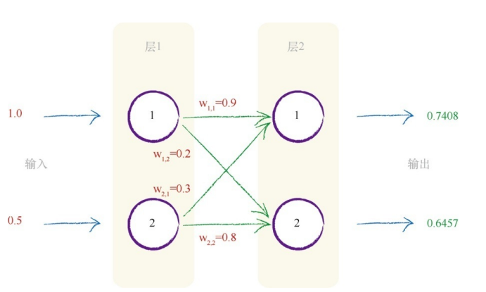
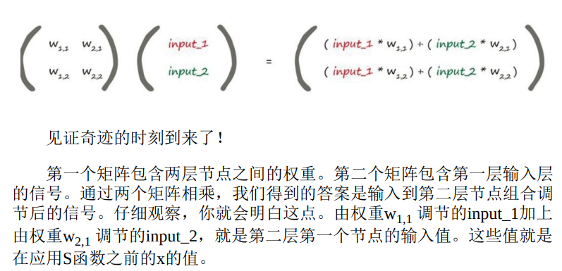
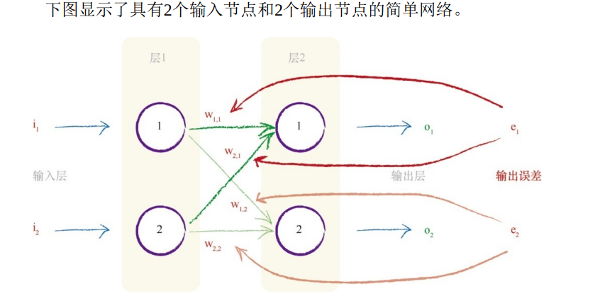

# 神经网络中的信号

权重是神经网络进行学习的内容，这些权重持续进行优化，得到越来越好的结果。
S函数中的x表示一个节点的组合输入。此处组合的是所连接的前一层中的原始输出

# 矩阵

X = W •I  此处，W 是权重矩阵，I 是输入矩阵，X 是组合调节后的信号，即输入到第二层的结果矩阵。对矩阵X 的每个单独元素应用S函数。第二层的最终输出是：O = sigmoid ( X )

下一步，将神经网络的输出值与训练样本中的输出值进行比较，计算出误差。我们需要使用这个误差值来调整神经网络本身，进而改进神经网络的输出值。

# 来自多个节点的误差：
不等分误差，使用权重，将误差从输出向后传播到网络中。我们称这种方法为反向传播

# 反向传播误差
