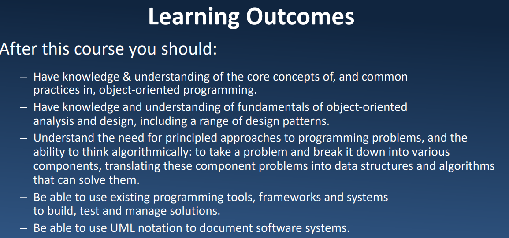

# Outline
• Class, object, method, etc. (week 1, 2, 3)

• Modules in python (week 3)

• Data structures (week 3, 4, 7, 8, 9)

• Recursion (week 4)

• Files (week 5)

• Exception Handling (week 5)

• OOA & OOD (week 6

• UML (week 6)

• Testing (week 7)

• Patterns (week 11, 12, 13)

• Version Control (week 14, 15)

# 总述：

1. **类的定义、实例化对象**
2. **属性（实例属性、类属性、私有属性）、方法**
3. **类的继承与多态**
4. OOA/D/P中CRC、UML几种图的概念
5. **几种设计模式（迭代器、装饰器等）**
6. 版本控制与Git的概念
7. **基于类的数据结构：堆栈与队列**

****