# OPP：

## 抽象abstraction
The concept of abstraction is fundamental in programming (and computer science).

An abstraction is a view or representation of an entity that includes only its most essential properties (its most significant attributes).抽象是实体的视图或表示形式，仅包含其最基本属性（其最重要的属性）。

##  Association, Composition & Aggregation关联，组合和聚合

关联：类之间不一定是父子类之间的关系，也可以是一个类使用另一个类的功能__ Association关联

组合：
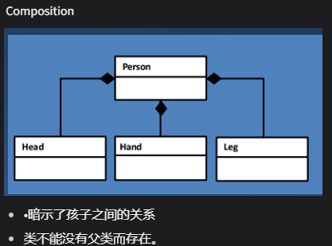

聚合：
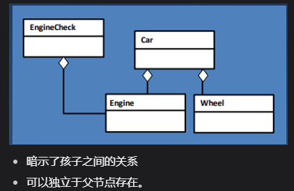

The attributes & operations provided by an object for others to interact with it is its **public interface**
• A class that inherits is a **derived class or a subclass**
• The class from which another class inherits is a **base class or superclass**

对象为其他对象提供的与之交互的属性和操作是它的公共接口
•继承的类是派生类或子类
•另一个类继承的类是基类或超类

# class:
## 基本组成和概念：

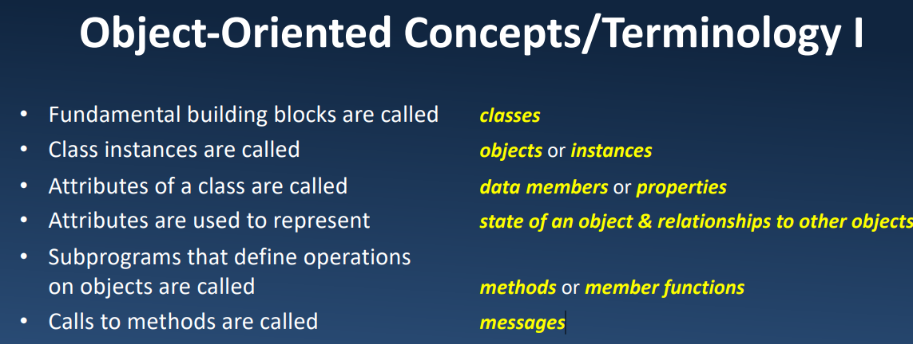
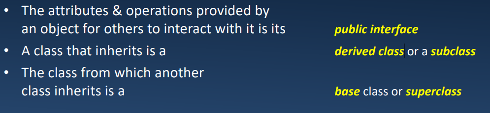
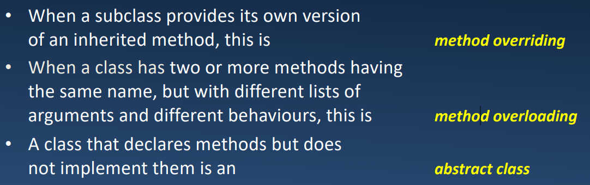


self:一个特殊的参数，它应用正在创建的对象

直接print一个类对象会print它的内存地址

__init__；初始化方法/构造函数Initializers初始化器,这个函数接受的第一个参数必须是self，并且这个函数是没有返回值的

__new__构造器：Constructor

区分叫法！！！

__new__ 方法是一个在对象创建过程中被调用的特殊方法，它负责创建对象的实例。在对象创建过程中，__new__ 方法先被调用用于创建对象的实例，然后再调用 __init__ 方法对实例进行初始化。

destructor析构函数

说明当不再需要某个对象时要做什么

–通常恢复/释放该对象使用的内存

但是在py当中有gc模块，gc 模块包括用于控制收集器的运行方式和检查系统已知对象的功能，这些对象要么待收集，要么卡在引用周期中且无法释放。
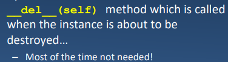

### class attributes静态变量：
由整个类所拥有，定义在类内的任何方法外，所有类的实例共享相同的值
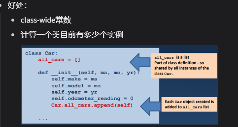

### 类方法：class methods：

操作类而不是实例的方法

@classsmethod 方法对类进行操作，而不是传递self，而是传递cla
@staticmethod 方法操作类，不传递self也不传递class

@classmethod：

@classmethod 装饰器用于定义类方法，即在类级别上调用的方法。类方法的第一个参数通常命名为 cls，用于表示类本身，而不是实例。

类方法可以访问类的属性和方法，但不能访问实例的属性和方法。类方法可以在不创建类的实例的情况下被调用。

使用 @classmethod 装饰器修饰的方法会将类本身作为第一个参数传递给方法，从而可以在方法中通过该参数访问类的属性和方法。

```python
class MyClass:
    @classmethod
    def class_method(cls, x, y):
        return f"Class method called with {x} and {y}"

# 调用类方法，不需要创建实例
MyClass.class_method(5, 10)

```
```python

class Car:
    all_car=[]

    def __init__(self,ma,mo,yr):
        self.make=ma
        self.model=mo
        self.year=yr
        self.odometer_reading=0
        Car.all_car.append(self)  #每一个Car的实例都会被添加到类当中
    @classmethod
    def print_inventory(cls):
        for item in cls.all_car:
            print(item.get_fullname())
```
@staticmethod：
@staticmethod 装饰器用于定义静态方法，即在类中定义的普通函数，不接受 self 或 cls 参数。静态方法的行为类似于普通函数，但它们与类相关联。

静态方法既不需要访问实例的属性和方法，也不需要访问类的属性和方法。因此，它们可以被类或实例调用，而不需要创建类的实例。

静态方法通常用于实现与类相关的功能，但不需要访问实例或类的状态。
```python
class MyClass:
    @staticmethod
    def static_method(x, y):
        return f"Static method called with {x} and {y}"

# 调用静态方法，不需要创建实例
MyClass.static_method(5, 10)

```

@classmethod 装饰器用于定义类方法，类方法接受类本身作为第一个参数，通常命名为 cls。虽然类方法也可以通过类名调用，但它们仍然可以通过类的实例调用，并且会自动传递类本身作为第一个参数。这一点与 C# 中的静态函数稍有不同，因为在 C# 中，静态函数无法通过对象实例调用。

classmethod 和 staticmethod 的主要区别在于方法的参数和对类属性的访问权限。classmethod 可以访问和修改类的属性，而 staticmethod 不能。

### 命名
不同于其他语言有public，protected等等，py类当中的属性和方法都是公开的
.但约定俗称在名称前面加上一个下划线表示不应当被公开的 

### 操作暂未知道的成员
操作暂未知道的成员：有些时候类的属性或是方法只是在运行时给定的
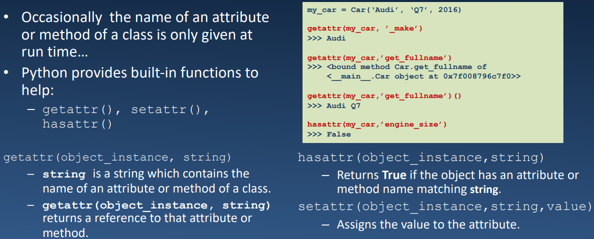

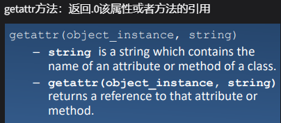

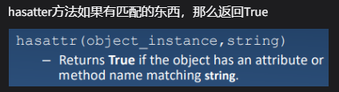
参数self代表类的实例
self.操作符->访问属性
attributes属性：类的变量

```python
class Person:
    def __init__(self,name):
        self.name=name
pp=Person("F")
```
pp是Person类的对象（实例）

构造pp的对象：实例化

method：方法-类内的函数

类的私有属性/方法：不能在类的外部被访问：
在属性/方法前面加上__表示

私有属性如何访问？:
制作getter方法！加上@property就可以不使用"方法调用"的形式
```python
def get_age(self):
    return self.__age
```
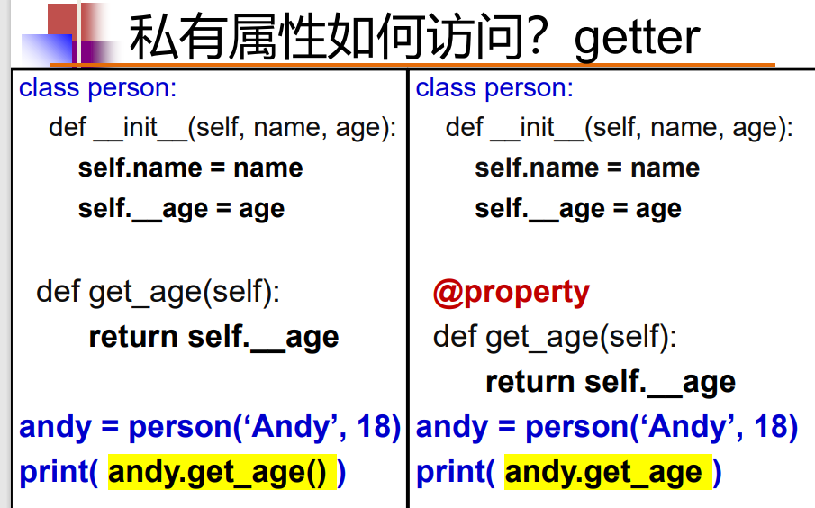

如何更改？:设置set方法，加上.setter就可以不通过方法访问了
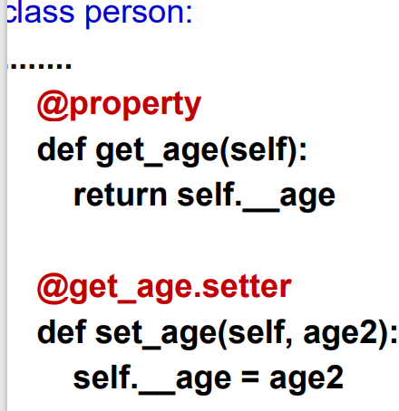

### 内置函数
其他内置函数一般带有下划线
如:__str__()方法，将类的实例转化成‘非正式的’可良好打印的字符串表示形式
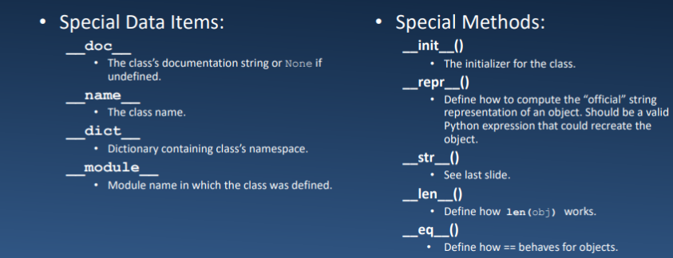


# OPP最重要三大特性讲解：

## OPP的三大特性简介
• Encapsulation: Hiding the private details of a class from other objects. 对其他对象隐藏类的私有细节

• Inheritance: A process of using details from a new class without modifying existing class. 在不修改现有类的情况下使用新类的详细信息的过程

• Polymorphism: A concept of using common operation in different ways for different data input对不同的数据输入以不同的方式使用通用操作的概念

## Inheritance继承

好处：
1，代码复用。2，描述了类之间的关系

坏处：
1，增加了代码之间的耦合性

可以使用父类的一些方法和属性。
实现继承：class 子类类名（父类）:

抽象类：有些时候在父类当中提供默认 的实现是没有意义的。但是我们希望在任何子类当中都需要该方法。所以我们创建一个抽象类，并将适当的方法声明为抽象来完成。

通常用于调用父类的方法。它常用于子类中重写父类方法时，在子类方法中调用被重写的父类方法。


### super方法
super() 函数的常见用法是在子类的方法中调用父类的方法，具体形式为 super().method_name()，其中 method_name() 是父类中的方法名。
```python
class Parent:
    def some_method(self):
        print("This is the parent's method.")

class Child(Parent):
    def some_method(self):
        super().some_method()  # 调用父类的 some_method() 方法
        print("This is the child's method.")

child_instance = Child()
child_instance.some_method()

```

```python
class Citizen:
    def __init__(self,idn,name):
        self.idn=idn
        self.name=name
        pass
class Student(Citizen):
    def __init__(self,idn,name,stdno):
        super(Student,self).__init__(idn,name)
        # super(Student,self) 首先找 Student 的父类（即 Citizen），
        # 然后把类 Student 的对象转换为类 Citizen 的对象
        # 也可以简化成这样写：
        super().__init__(idn,name)
        self.stdno=stdno
```

python支持多重继承Multiple inheritance


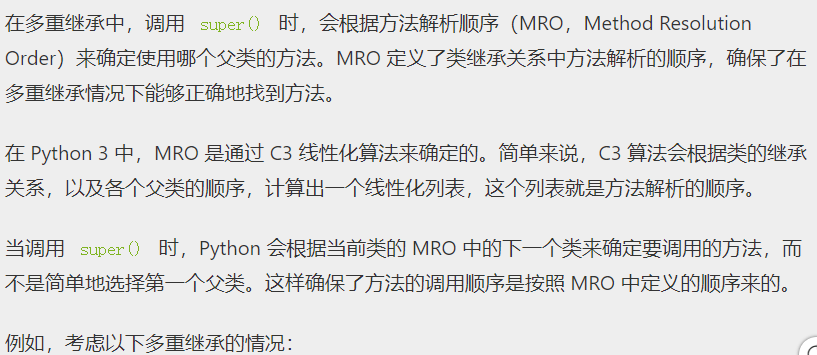

```python
class A:
    def method(self):
        print("A's method")

class B(A):
    def method(self):
        super().method()
        print("B's method")

class C(A):
    def method(self):
        super().method()
        print("C's method")

class D(B, C):
    def method(self):
        super().method()
        print("D's method")

obj = D()
obj.method()

```
在这个例子中，D 类继承自 B 和 C 类，而 B 和 C 类都继承自 A 类。当调用 obj.method() 时，方法解析顺序是 D -> B -> C -> A。因此，调用 super().method() 时，会按照这个顺序依次调用各个父类的方法。

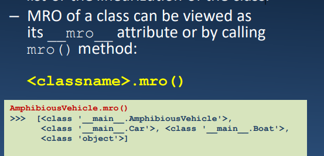


### 继承以外的其他关系
不只是继承：
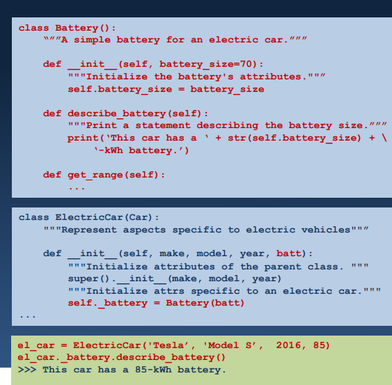
比如上面的示例当中，ecar有一个属性是battery的一个实例化

## encapsulation 封装
作用：利于构造模块化，可维护的程序 modular and maintainable programs

## Polymorphism多态
Polymorphism is applied through method overriding & operator overloading.
类的多态性体现：方法重写、运算符重载

Subtyping（子类型化）允许一个方法被编写为接受某个类B的对象，但如果传递一个属于类S的对象(类S是B的子类)也能正常工作。（里氏转化）

子类型化，一个方法接受一个类B的形式，但可以传入一个类S（S是B的子类）

动态类型：
弱类型声明，变量的类型可以被动态地更改（int科研改成string)

方法重写：子类与父类有同名的方法，但子类方法的定义和父类不同

Duck Typing动态性/鸭子类型

通过一个简单的例子来解释Python中的鸭子类型（Duck Typing）。

假设我们有一个简单的代码，需要处理各种动物的叫声。我们并不关心这些动物是否属于同一个类别，只要它们有一个能发出叫声的方法就可以。这就是鸭子类型的应用场景之一，让我们看看这个例子：
```python

class Duck:
    def sound(self):
        return "Quack!"

class Dog:
    def sound(self):
        return "Woof!"

class Cat:
    def sound(self):
        return "Meow!"

def make_sound(animal):
    print(animal.sound())

# 实例化不同的动物对象
duck = Duck()
dog = Dog()
cat = Cat()

# 调用 make_sound 函数来发出动物的叫声
make_sound(duck)  # 输出: Quack!
make_sound(dog)   # 输出: Woof!
make_sound(cat)   # 输出: Meow!

```
在这个例子中，我们定义了三个不同的类：Duck（鸭子）、Dog（狗）和Cat（猫）。它们各自都有一个名为sound()的方法来表示它们的叫声。然后，我们定义了一个名为make_sound()的函数，它接受任何具有sound()方法的对象，并调用该方法以发出叫声。

尽管这些动物类并没有任何共同的父类，但它们都实现了sound()方法。因此，我们可以将任何这些类的实例传递给make_sound()函数，而不需要考虑它们的具体类型，这就是鸭子类型的核心思想：只要对象“走起来像鸭子，叫起来像鸭子”，那么它就可以被视为鸭子。


运算符重载： Operator overloading
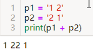
我们可以在类里面调用__add__方法以执其他的加法（本例当中是执行的向量加法）
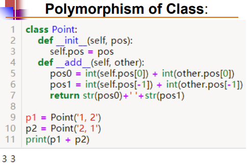
What actually happens is that, when you do 
p1 + p2, Python will call p1.__add__(p2) 
which in turn is Point.__add__(p1,p2).

类似地，你也可以在类当中重载以下的运算符：
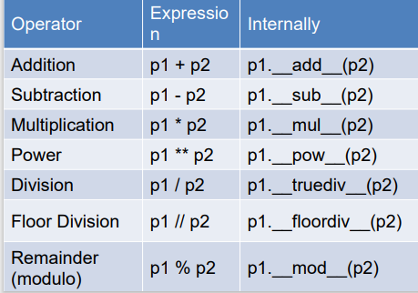
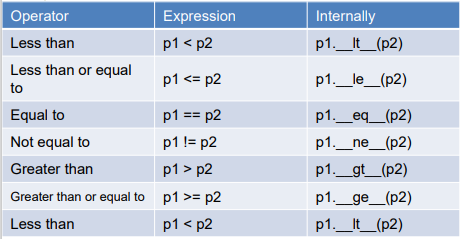

### 可变参数Arbitrary Argument:

```python

def info(*args,**kwargs):
    # *args 表示接受任意数量的位置参数，**kwargs 表示接受任意数量的关键字参数
    for name in args:
        print(args)
        pass
    for i in kwargs:
        print(kwargs)
        pass

info('Andy')
# args 只包含一个元素 'Andy'，而在第二个循环中，kwargs 是空的，因为没有传递关键字参数。因此，输出将是 'Andy'（第一个循环的内容）。
info('Andy', 'Bob', 'Candy')
# args 包含三个元素，而在第二个循环中，kwargs 仍然是空的。因此，输出将是 ('Andy', 'Bob', 'Candy')（第一个循环的内容）。
info(Andy=1, Bob=2, Candy=3)
# 没有位置参数，但有三个关键字参数 'Andy', 'Bob', 'Candy'。因此，在第一个循环中，args 是空的，而在第二个循环中，kwargs 包含了三个键
# 'Andy', 'Bob', 'Candy'。因此，输出将是 {'Andy': 1, 'Bob': 2, 'Candy': 3}（第二个循环的内容）。

```
当定义函数时，有时候我们可能不确定会接收多少个参数，这时就可以使用 *args 和 **kwargs 来处理可变数量的参数。

1,*args：
*args 允许函数接受任意数量的位置参数。当函数调用时，所有传递给函数的位置参数都被收集到一个元组（tuple）中，并赋值给 args。在函数内部，你可以像操作普通的元组一样操作 args 中的元素。

通常，*args 用于在函数定义时表示接受可变数量的位置参数。

**kwargs：
**kwargs 允许函数接受任意数量的关键字参数。当函数调用时，所有传递给函数的关键字参数都被收集到一个字典（dictionary）中，并赋值给 kwargs。在函数内部，你可以像操作普通的字典一样操作 kwargs 中的键值对。

通常，**kwargs 用于在函数定义时表示接受可变数量的关键字参数。

这两个参数通常与普通参数一起使用，但它们必须放在所有其他参数的最后

可变参数在类当中的应用：
```python

# 可变参数在类当中的应用：
class Car:
    def __init__(self,brand,color,*args,**k):
        self.brand=brand
        self.color=color
class ECars(Car):
    def __init__(self,power,*args,**kwargs):
        super().__init__(*args,**kwargs)
        # 可变参数->传递参数 无论 Car 类将来如何修改其构造函数，ECars 类都不需要做出相应修改，因为它可以适应父类的任何变化。
        self.power=power
car_obj1=ECars('HUAWEI',"RED",500)
car_obj2=ECars('HUAWEI','Red',500,year=3)
# 虽然 ECars 类本身没有定义 year 参数，但是由于使用了可变参数 **kwargs，它可以接受任意数量的关键字参数。
# 当调用 ECars 类的实例时，传递的所有额外的关键字参数都会被收集到 **kwargs 中。
# 
# 在 ECars 类的 __init__ 方法中，使用 **kwargs 来接收这些额外的关键字参数。
# 然后，通过 super().__init__(*args, **kwargs) 调用父类 Car 的 __init__ 方法，将这些参数传递给父类。
# 父类的 __init__ 方法不需要明确地定义这些参数，因为它使用了可变参数 **k 来接收任意数量的关键字参数。
# 
# 因此，即使在 ECars 类中没有明确定义 year 参数，但是通过可变参数 **kwargs，
# 依然可以将 year 参数传递给父类的 __init__ 方法，而不会导致错误。

```
# 猴子补丁：
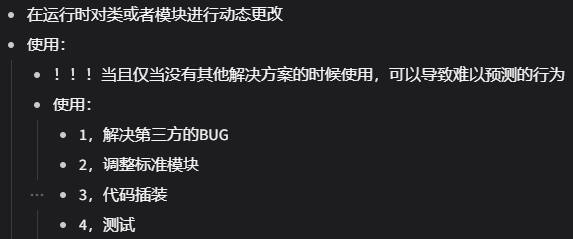
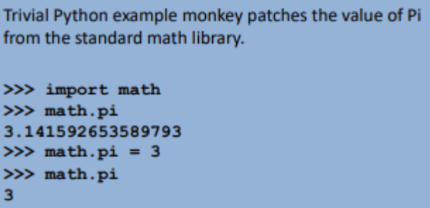

# 其他内置函数：
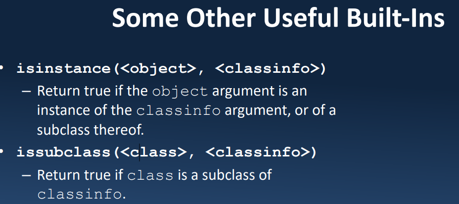