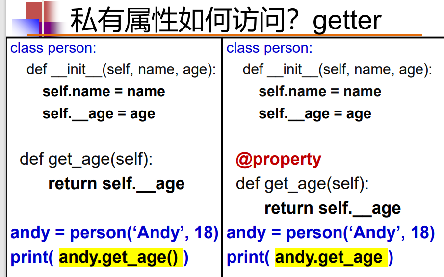
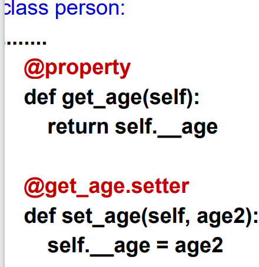
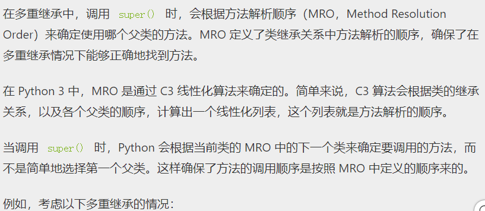

# class:
__initII；初始化方法/构造函数

参数self代表类的实例
self.操作符->访问属性
attributes属性：类的变量

```python
class Person:
    def __init__(self,name):
        self.name=name
pp=Person("F")
```
pp是Person类的对象（实例）

构造pp的对象：实例化

method：方法-类内的函数

类的私有属性/方法：不能在类的外部被访问：
在属性/方法前面加上__表示

私有属性如何访问？:
制作getter方法！加上@property就可以不使用"方法调用"的形式
```python
def get_age(self):
    return self.__age
```


如何更改？:设置set方法，加上.setter就可以不通过方法访问了


# Inheritance继承

可以使用父类的一些方法和属性。
实现继承：class 子类类名（父类）:

通常用于调用父类的方法。它常用于子类中重写父类方法时，在子类方法中调用被重写的父类方法。

super() 函数的常见用法是在子类的方法中调用父类的方法，具体形式为 super().method_name()，其中 method_name() 是父类中的方法名。
```python
class Parent:
    def some_method(self):
        print("This is the parent's method.")

class Child(Parent):
    def some_method(self):
        super().some_method()  # 调用父类的 some_method() 方法
        print("This is the child's method.")

child_instance = Child()
child_instance.some_method()

```

```python
class Citizen:
    def __init__(self,idn,name):
        self.idn=idn
        self.name=name
        pass
class Student(Citizen):
    def __init__(self,idn,name,stdno):
        super(Student,self).__init__(idn,name)
        # super(Student,self) 首先找 Student 的父类（即 Citizen），
        # 然后把类 Student 的对象转换为类 Citizen 的对象
        # 也可以简化成这样写：
        super().__init__(idn,name)
        self.stdno=stdno
```

python支持多重继承Multiple inheritance


```python
class A:
    def method(self):
        print("A's method")

class B(A):
    def method(self):
        super().method()
        print("B's method")

class C(A):
    def method(self):
        super().method()
        print("C's method")

class D(B, C):
    def method(self):
        super().method()
        print("D's method")

obj = D()
obj.method()

```
在这个例子中，D 类继承自 B 和 C 类，而 B 和 C 类都继承自 A 类。当调用 obj.method() 时，方法解析顺序是 D -> B -> C -> A。因此，调用 super().method() 时，会按照这个顺序依次调用各个父类的方法。


# encapsulation 封装
作用：利于构造模块化，可维护的程序 modular and maintainable programs

# Polymorphism多态
Polymorphism is applied through method overriding & operator overloading.
类的多态性体现：方法重写、运算符重载

方法重写：子类与父类有同名的方法，但子类方法的定义和父类不同

