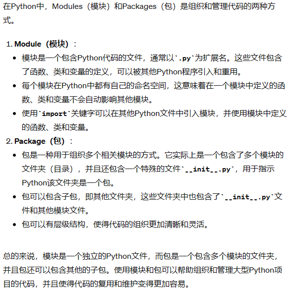
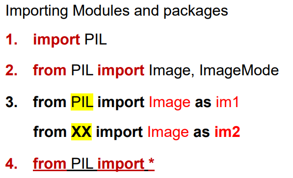
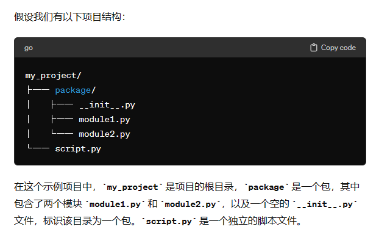
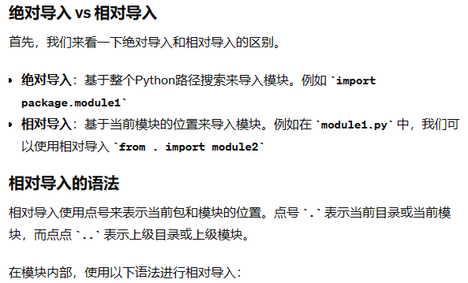
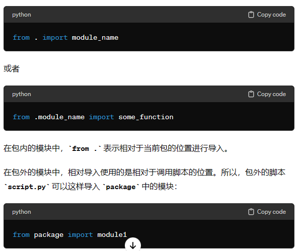
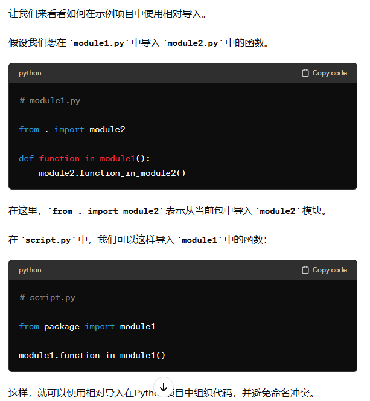

# 包和模块 Modules and packages

对于小程序，我们可以将所有类放入一个文件中。
随着项目的发展，在众多类中找到一个类可能变得很困难.

而包和模块可以让我们组织起程序
包和模块只是python程序！！！

Module和package的区别：

Module->*.py

Package->Directory{*.py}




模块引用：
基本引用：
```python
import module_name
```
这将导入一个名为module_name的模块，并将其整个内容加载到当前程序中。之后可以使用module_name中定义的函数、类和变量。
使用别名：
```python
import module_name as alias

```
这将模块命名为alias，以后可以使用alias代替module_name来引用模块中的内容。
导入特定对象：
```python
from module_name import object_name

```
这将只导入模块中的特定对象（函数、类或变量），而不是整个模块。这种方式可以减少命名冲突并提高代码的可读性。
导入所有对象：
```python
from module_name import *

```
这将导入模块中的所有对象。尽管方便，但这种方式可能会导致命名冲突，不推荐在生产代码中使用。


包引用：
基本引用：
```python
import package_name.module_name

```
这将导入包package_name中的module_name模块。通过点号.来指示模块的层级关系。
使用别名：
```python
import package_name.module_name as alias

```
这将模块命名为alias，以后可以使用alias代替package_name.module_name来引用模块中的内容。
从包中导入模块：
```python
from package_name import module_name

```
这将从包package_name中导入module_name模块。
从包中导入子包：
```python
import package_name.subpackage_name.module_name

```
这将从包package_name的子包subpackage_name中导入module_name模块。
相对导入：
在一个包中的模块中，可以使用相对导入来引用同一包中的其他模块：
```python
from . import module_name
```






