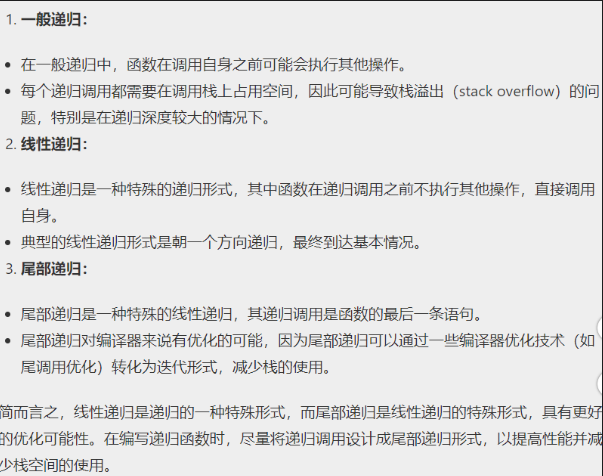
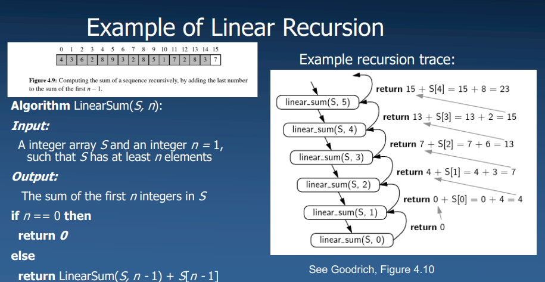

# Recursion
递归算法三条重要的定律：

1、递归算法必须有个基本结束条件；

2、递归算法必须递归地调用自身 。

3、递归算法必须改变自己的状态、并向基本结束条件演进；

## Linear Recursion:线性递归

每个可能的递归调用链最终必须到达一个不使用递归的基本情况

线性递归是指在函数调用过程中，函数直接或间接地调用自身的过程。

## 尾部递归：
尾部递归是一种特殊的线性递归形式，在函数的最后一个操作是对自身的递归调用，并且没有其他操作或表达式需要在递归调用之后执行。在尾部递归中，递归调用是整个函数的最后一步操作。

Tail Recursion can be resource intensive尾部递归是资源密集性的

尾部递归可以转化成循环当中进行