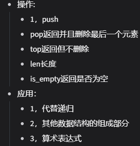
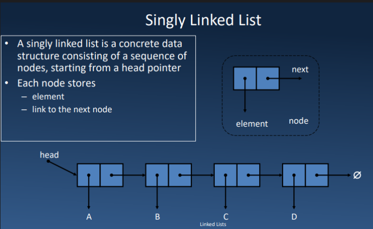
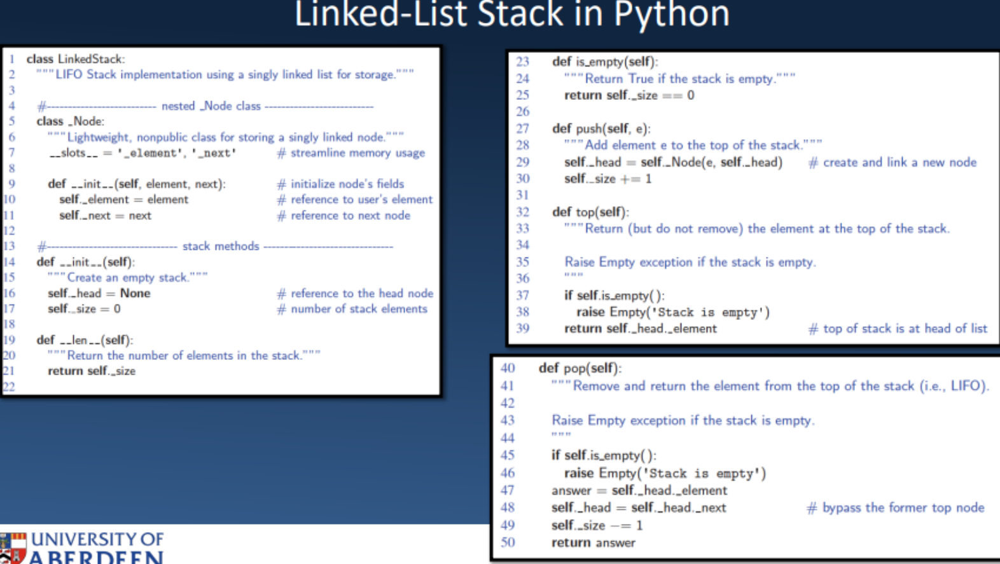
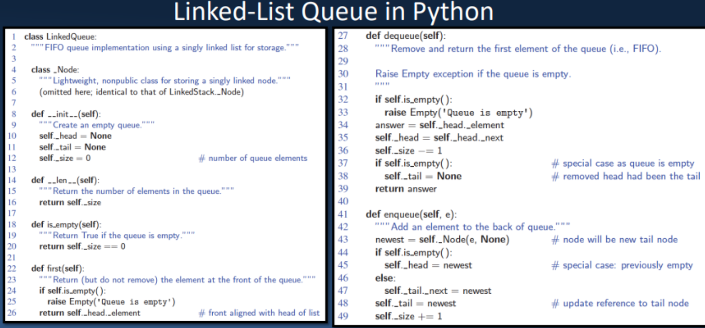
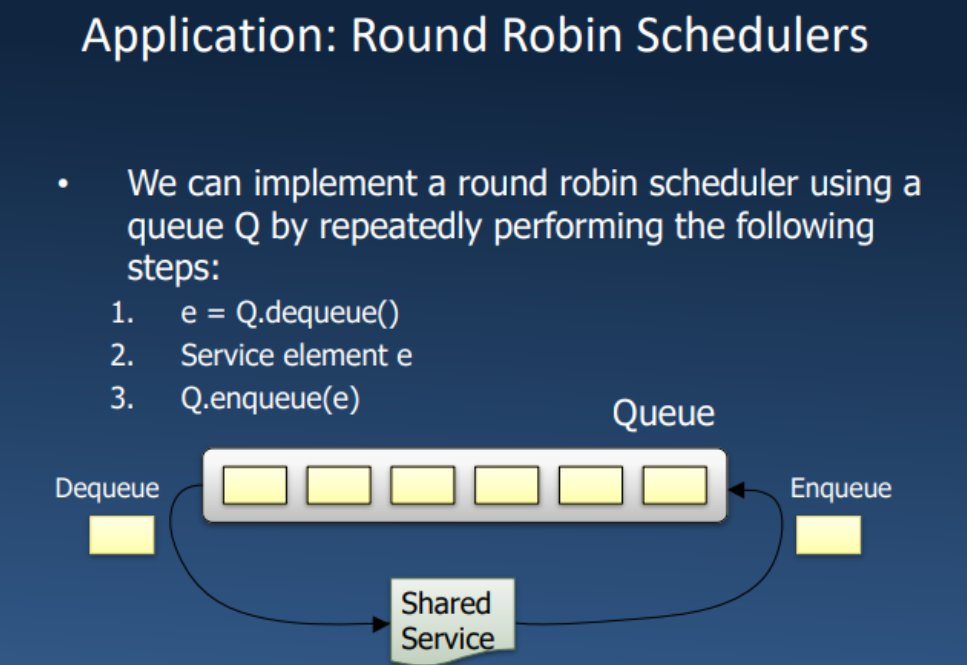
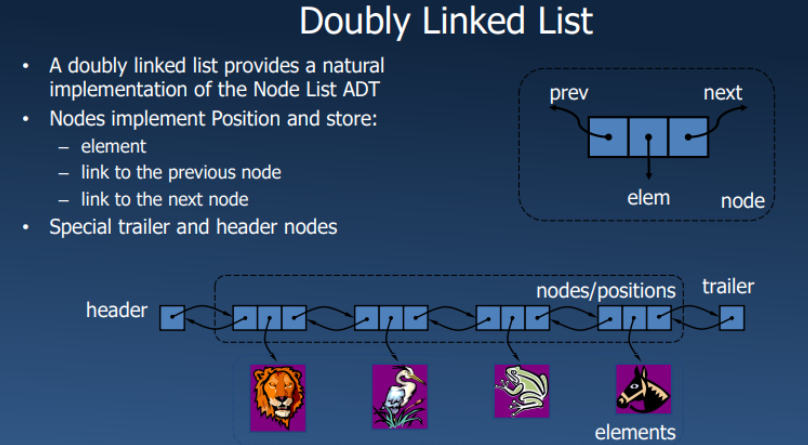

# ADT抽象数据：

ADT包含：
    1，数据的存储
    2，数据的操作
    3，与操作相关的错误条件

# 栈


#队列

# 链表 linked list

数组和队列的缺点：

    除了在前面插入外，任何其他位置的插入都是昂贵的。
    动态数组的长度可能比空间的数量更长。
    操作的平摊边界在实时系统中可能不可接受。

链表提供了一个有用的替代方案：

    插入更容易，因为我们追踪前端和（通常）末尾。
    长度是成比例的。
    最坏情况的时间复杂度为 O(n)。

## 单链表结构：
每一个data由一个元素和指针构成

```python
class Node:
    def __init__(self,data):
        self.data=data
        self.next=None #初始化为null

class LinkList:
    def __init__(self):
        self.head=None

    def add_first(self,data):
        new_node = Node(data)
        new_node.next=self.head
        self.head=new_node
    def remove_first(self):
        if self.head:
            remove_data=self.head.data
            self.head=self.head.next
            return remove_data
        else:
            return None
    def add_list(self,data):
        new_node=Node(data)
        if not self.head: #如果没有东西的话，那就加上咯
            self.head=new_node
        else:
            current=self.head
            while current.next:
                current=current.next
            current.next=new_node

llist=LinkList()
llist.head=Node(1)
second=Node(2)
third=Node(3)

llist.head.next=second

second.next=third
```

在单向链表中从尾部移除是低效的：

    • 没有一种常数时间的方法来更新尾部指向前一个节点。
    • 我们需要知道末尾前面的元素，这并不容易做到。

作为链表的堆栈：

    我们可以使用单向链表来实现堆栈。
    栈顶元素存储在链表的第一个节点。
    使用的空间为 O(n)，每个堆栈 ADT 操作的时间复杂度为 O(1)。


作为链表的队列：

    我们可以使用单向链表来实现队列。
    前端元素存储在第一个节点。
    后端元素存储在最后一个节点。
    使用的空间为 O(n)，每个队列 ADT 操作的时间复杂度为 O(1)。



## 双链表结构 double linked list

双向链表的构成：
前指针，数据，后指针



