# ADT抽象数据：

ADT包含：
    1，数据的存储
    2，数据的操作
    3，与操作相关的错误条件

# 栈


#队列

# 链表 linked list

数组和队列的缺点：

    除了在前面插入外，任何其他位置的插入都是昂贵的。
    动态数组的长度可能比空间的数量更长。
    操作的平摊边界在实时系统中可能不可接受。

链表提供了一个有用的替代方案：

    插入更容易，因为我们追踪前端和（通常）末尾。
    长度是成比例的。
    最坏情况的时间复杂度为 O(n)。

## 单链表结构：
每一个data由一个元素和指针构成

```python
class Node:
    def __init__(self,data):
        self.data=data
        self.next=None #初始化为null

class LinkList:
    def __init__(self):
        self.head=None

    def add_first(self,data):
        new_node = Node(data)
        new_node.next=self.head
        self.head=new_node
    def remove_first(self):
        if self.head:
            remove_data=self.head.data
            self.head=self.head.next
            return remove_data
        else:
            return None
    def add_list(self,data):
        new_node=Node(data)
        if not self.head: #如果没有东西的话，那就加上咯
            self.head=new_node
        else:
            current=self.head
            while current.next:
                current=current.next
            current.next=new_node

llist=LinkList()
llist.head=Node(1)
second=Node(2)
third=Node(3)

llist.head.next=second

second.next=third
```

在单向链表中从尾部移除是低效的：

    • 没有一种常数时间的方法来更新尾部指向前一个节点。
    • 我们需要知道末尾前面的元素，这并不容易做到。

作为链表的堆栈：

    我们可以使用单向链表来实现堆栈。
    栈顶元素存储在链表的第一个节点。
    使用的空间为 O(n)，每个堆栈 ADT 操作的时间复杂度为 O(1)。


作为链表的队列：

    我们可以使用单向链表来实现队列。
    前端元素存储在第一个节点。
    后端元素存储在最后一个节点。
    使用的空间为 O(n)，每个队列 ADT 操作的时间复杂度为 O(1)。


## 双链表结构 double linked list

双向链表的构成：
前指针，数据，后指针

```python
class Node:
    def __init__(self, data):
        self.data = data
        self.prev = None
        self.next = None


class DoublyLinkedList:
    def __init__(self):
        # 通常使用头部指针 head 来表示链表的起始节点，而尾部指针 tail 表示链表的最后一个节点。
        self.head = None
        self.tail = None

    def add_last(self, data):
        new_node = Node(data)
        if not self.head:
            self.head = new_node
            self.tail = new_node
        else:
            self.tail.next = new_node
            new_node.prev = self.tail
            self.tail = new_node

    def remove_at(self, position):
        if position < 0:
            return False
        if position == 0:
            return self.remove_first()

        current = self.head
        count = 0
        while current and count < position:
            current = current.next
            count += 1

        if not current:
            return False

        if current == self.tail:
            return self.remove_last()

        current.prev.next = current.next
        current.next.prev = current.prev

        return True

```
优点：空间占有率：O(n),每一个O(1),运行时间O(1)

位置列表：能够标识元素的位置
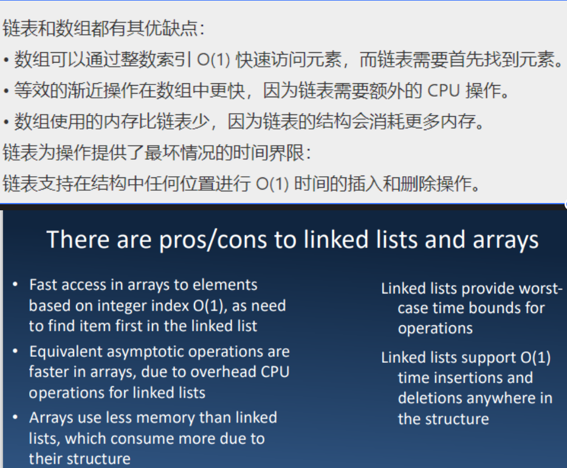

# 树Tree
一些名词：
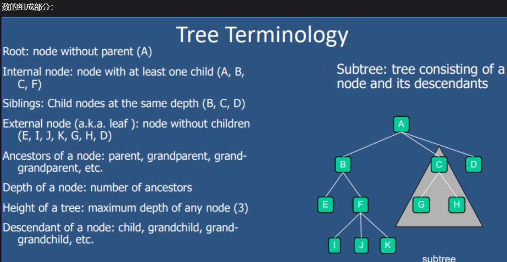
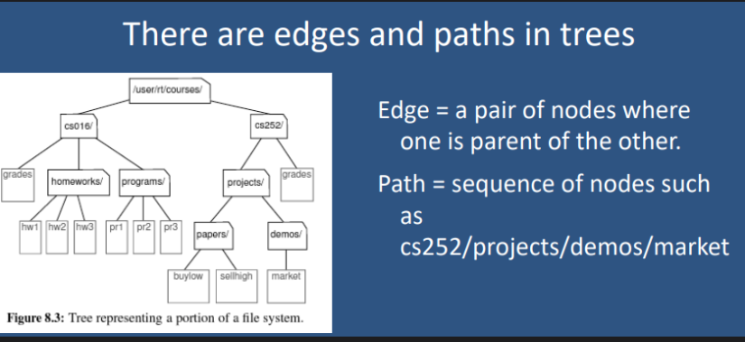

树的遍历方式：
preorder Traversal前序遍历：

先访问其节点的数据，然后再访问后代的节点

postorder traversal后序遍历：

先访问其后代的节点，再访问它的数据

## 二分树 binary trees

属性：
1，每一个内部的节点最有2个孩子

2，每个节点的孩子是有顺序的(ordered pair)

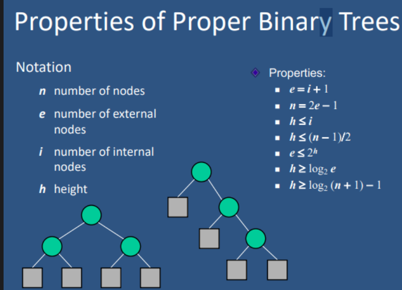

应用：

1,算术表达树：只有叶子代表数字，其他都代表着运算符

2，决策树：

二叉树的无序遍历代码：

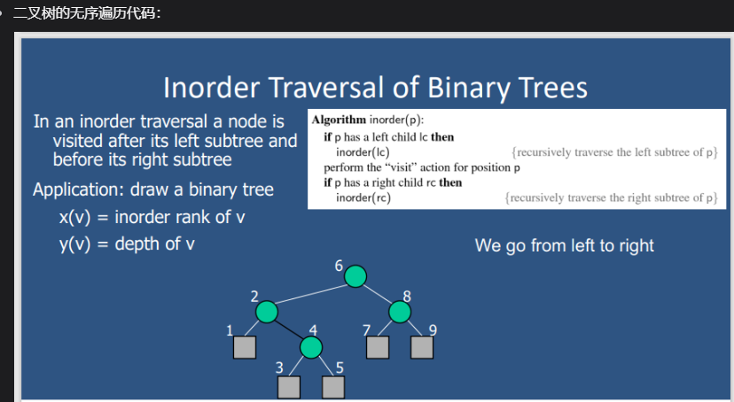

二叉树的实现：

1，ADT的实现

2，数组的实现：
左孩子=2*父节点+1

右孩子=2*父节点+2


# Map
可搜索的项的集合，key-value的形式

多个item不可能拥有相同的key,但是可以为同一个value提供同一个key
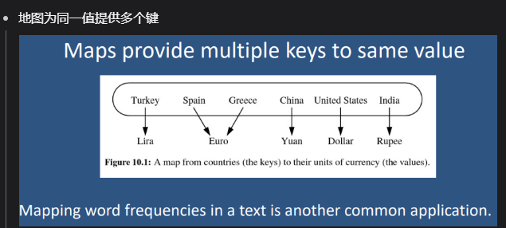

基于列表的MAP：

# 字典dict
在这里，我们在专门讨论 Python 的 dict 类时使用术语“dictionary”，在讨论抽象数据类型的更一般概念时使用术语“map”。

# 哈希表

物品比存储的空间还要多：使用桶
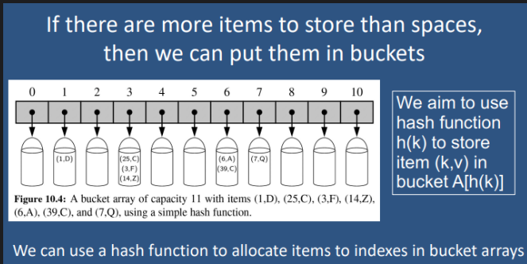
我们可以使用哈希函数将项目分配给存储桶数组中的索引

哈希函数：

1，hash code将一个key映射到一个整数上

2，compression function:将哈希代码映射到存储桶数组的索引 [0， N-1] 范围内的整数
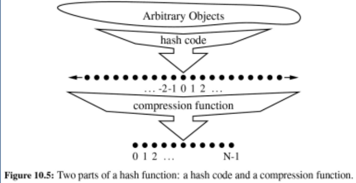
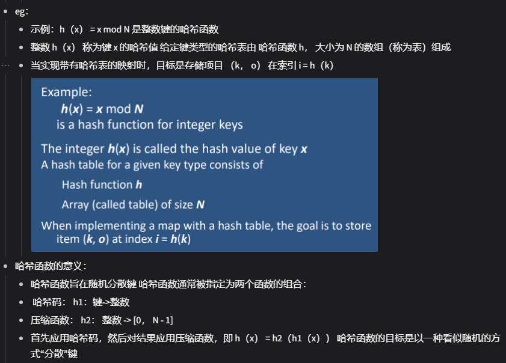

哈希函数的意义：

    哈希函数旨在随机分散键 哈希函数通常被指定为两个函数的组合：
    哈希码： h1：键->整数 
    压缩函数： h2： 整数 -> [0， N - 1] 
    首先应用哈希码，然后对结果应用压缩函数，即 h（x） = h2（h1（x））希函数的目标是以一种看似随机的方式“分散”键

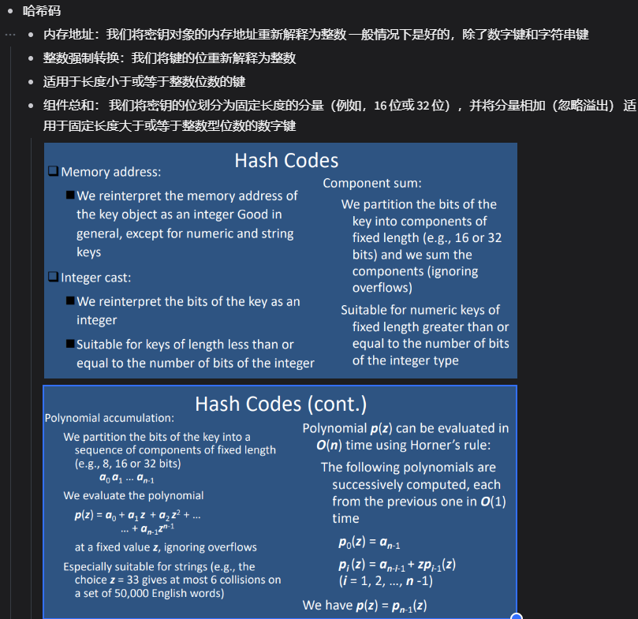

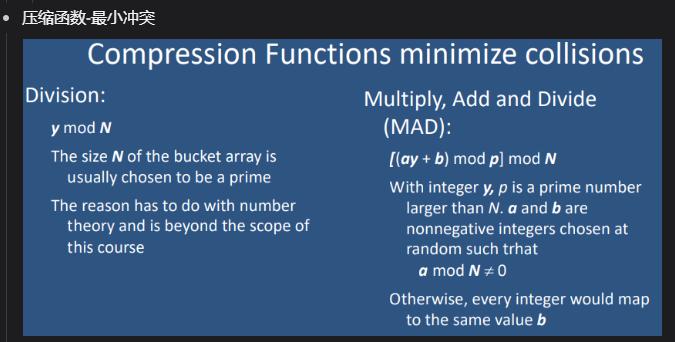

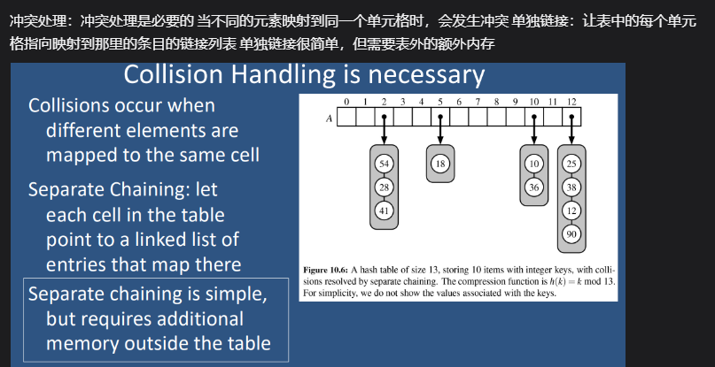


# 二叉搜索树：

搜索：
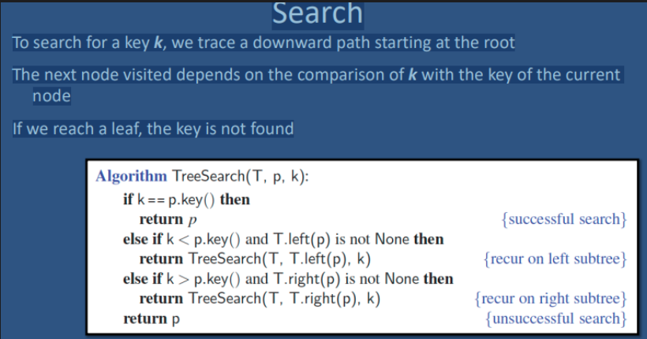

插入：
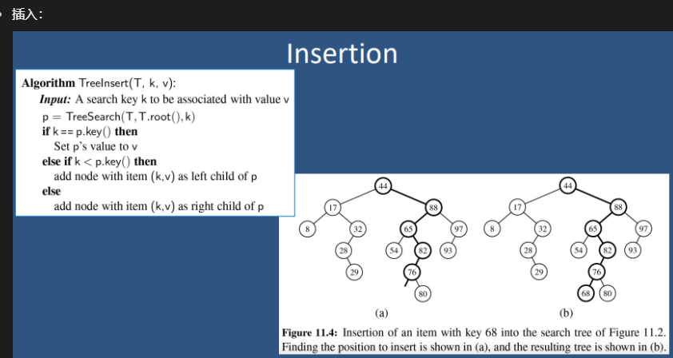

删除：
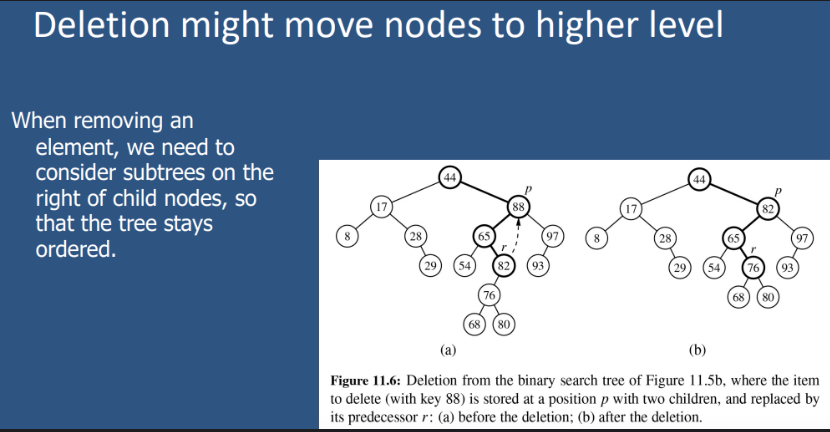