# Patterns:
A pattern is a recurring solution 
to a standard problem.
模式是对标准问题的重复解决方案

模式→重复使用

以下的几种设计模式：
## Creational Patterns:创建型模式：
Deal with initializing and configuring classes and objects处理初始化和配置类和对象

### Factory Method：
在工厂方法中，我们执行一个函数，传递一个参数，该参数提供有关我们想要的信息。我们不需要知道任何关于对象是如何实现的以及它来自哪里的细节

不需要知道对象是如何实现

一般的面向对象的方法：
```python
# 一般的面向对象的方法:
class role:
    def show(self):
        print("Unkown!")
class player(role):
    def show(self):
        print("player!")
class enemy(role):
    def show(self):
        print("enemy!")
class Factory:
    @classmethod
    def build(self,rtype):
        if rtype is 'player':
            product=player()
        elif rtype is 'enemy':
            product=enemy()
        else:
            product=role()
        return product
r1=Factory.build('player')
r1.show()
r2=Factory.build('enemy')
r2.show()

```
优点：如果要换敌人，只需要换参数
缺点：构造角色大量重复factory.build，如果要修改成敌人角色，需要重复修改字符串，容易出错

更好的方法：使用工厂模式
```python
# 工厂模式:
class role:
    def show(self):
        print("Unkown!")
class player(role):
    def show(self):
        print("player!")
class enemy(role):
    def show(self):
        print("enemy!")
class factory:
    def build(self):
        pass
class player_factory(factory):
    def build(self):
        return player()
class enemy_factory(factory):
    def build(self):
        return enemy()
factory1=player_factory()
r1=factory1.build()
r1.show()
r2=factory1.build()
r2.show()
# 工厂类抽象化——派生出player工厂、enemy工厂
```
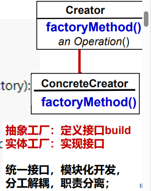

### Builder Pattern建造者模式：
Builder Pattern 的主要目的是将复杂对象的构建过程与其表示分离，使得同样的构建过程可以创建不同的表示。它通过将构建逻辑封装在一个独立的 Builder 类中，使得客户端代码可以更加简洁地创建复杂对象，同时也方便了对构建过程的控制和定制。

Builder Pattern 通常包含以下几个角色：

Builder（建造者）：定义了构建复杂对象的接口，包括各个部件的构建方法，以及最终组装成完整对象的方法。
ConcreteBuilder（具体建造者）：实现了 Builder 接口，负责实际构建对象的各个部件，并提供一个方法用于返回构建好的对象。
Director（指挥者）：负责使用 Builder 接口来构建对象。它不直接创建对象，而是通过调用 Builder 中的方法来构建对象的各个部件，并最终返回完整的对象。
Product（产品）：表示被构建的复杂对象。通常，产品对象包含多个部件，这些部件由具体建造者负责构建，并由指挥者组装成最终的产品。
Builder Pattern 在实际应用中常用于创建具有复杂结构的对象，例如构建器模式常用于创建配置对象、文档对象、图形对象等。它使得对象的构建过程更加灵活，能够根据需求动态地配置对象的各个部分，并且使得客户端代码与具体构建过程解耦，提高了代码的可维护性和可扩展性。

### Prototype Pattern原型模式
Prototype Pattern（原型模式）是设计模式中的创建型模式之一。它的主要思想是通过复制现有对象来创建新的对象，而不是通过实例化一个类来创建对象。这种方式可以在不知道具体对象类型的情况下创建对象，同时避免了子类化对象的创建过程。

Prototype Pattern 通常包含以下几个角色：

Prototype（原型）：定义了一个接口或抽象类，声明了用于复制自身的方法 clone()。具体的原型类实现了这个接口或抽象类，并实现了 clone() 方法来复制自身。
ConcretePrototype（具体原型）：实现了 Prototype 接口或抽象类，提供了具体的复制方法。当需要创建新对象时，客户端可以调用具体原型的 clone() 方法来复制一个新的对象。
Client（客户端）：使用原型对象的客户端。客户端通常通过调用原型对象的 clone() 方法来创建新的对象，而不需要直接实例化具体的对象类。
Prototype Pattern 的优点包括：

减少对象创建的开销：通过复制现有对象来创建新对象，可以避免重新初始化对象的开销，提高了对象创建的效率。
隐藏对象的具体实现：客户端不需要知道对象的具体类，只需要通过原型对象来复制新的对象即可。
动态配置对象：原型模式可以在运行时动态地配置对象的属性，而不需要在编译时确定对象的类型。
Prototype Pattern 的典型应用包括在需要创建大量相似对象的情况下，或者在对象的创建过程比较复杂时。它使得对象的创建过程更加灵活，能够根据需要动态地创建对象，并且提高了代码的可维护性和可扩展性。
### State Pattern（状态模式）
是设计模式中的行为型模式之一。它允许对象在内部状态发生改变时改变它的行为，使得对象看起来好像是在修改其类。

状态模式的核心思想是将对象的行为封装成一系列状态对象，并将对象的状态委托给当前状态对象。当对象的状态发生改变时，它会委托给新的状态对象来处理相应的行为，从而实现对象的行为随状态的改变而改变。

State Pattern 通常包含以下几个角色：

Context（上下文）：上下文是拥有状态的对象，它维护一个当前状态对象，并将请求委托给当前状态对象来处理。上下文可以定义一个接口，用于让状态对象访问它的内部状态和其他信息。
State（状态）：状态是一个接口或抽象类，定义了一个接口用于封装与上下文相关的一个状态的行为。
ConcreteState（具体状态）：具体状态是状态的具体实现类，实现了状态接口中定义的方法，用于处理与状态相关的行为。当上下文的状态发生改变时，具体状态会改变，并且根据新的状态来处理行为。
State Pattern 的优点包括：

封装了状态的转换规则：状态模式将状态的转换规则封装在具体状态对象中，使得状态转换对于客户端来说是透明的，客户端不需要知道状态之间的转换规则。
提高了可维护性和扩展性：由于状态的行为被封装在具体状态对象中，所以可以方便地添加新的状态和修改状态的行为，而不需要修改上下文的代码。
减少了条件语句：状态模式将复杂的条件语句转换成了一系列状态对象，使得代码更加清晰和易于理解。
State Pattern 通常应用于以下场景：

当一个对象的行为取决于它的状态，并且在运行时需要根据状态来改变它的行为时，可以使用状态模式。
当一个对象的行为包含大量的条件语句，并且这些条件语句会随着状态的改变而改变时，也可以使用状态模式来简化代码。
总的来说，状态模式是一种非常有用的设计模式，可以帮助提高代码的可维护性、灵活性和可扩展性，同时也能使代码更加清晰和易于理解。
## Structural Patterns:结构性模式：
Deal primarily with the static composition and structure of classes and objects主要处理类和对象的静态组合和结构

### Facade Pattern 外观模式 or 享元模式
Facade Pattern（外观模式）是设计模式中的结构型模式之一。它提供了一个统一的接口，用于访问子系统中的一组接口。外观模式的主要目的是简化客户端与子系统之间的交互，提供一个高层次的接口，隐藏了子系统的复杂性，从而降低了客户端与子系统之间的耦合度。

外观模式通常包含以下几个角色：

Facade（外观）：外观类是客户端与子系统之间交互的入口点。它封装了子系统的复杂逻辑，并提供一个简单的接口给客户端使用。外观类知道如何调用子系统的各个组件来完成特定的任务。
Subsystem（子系统）：子系统是外观模式中的各个组件，负责完成具体的任务。这些组件可以是单个对象、类库或者是其他子系统的集合。外观类通过调用子系统的方法来完成客户端的请求。
Client（客户端）：客户端是使用外观模式的类或模块。它通过调用外观类提供的接口来完成特定的任务，而不需要了解子系统的内部结构和复杂性。
外观模式的优点包括：

简化接口：外观模式提供了一个简单的接口给客户端使用，隐藏了子系统的复杂性，降低了客户端与子系统之间的耦合度。
提高可维护性：外观模式将子系统的复杂性封装在一个统一的接口下，使得系统更易于理解和维护。
提高灵活性：由于客户端与子系统之间的耦合度降低，所以可以更容易地对子系统进行修改和扩展。
外观模式通常应用于以下场景：

当需要简化一个复杂系统的接口，提供一个更高层次的接口给客户端使用时，可以使用外观模式。
当需要将一个复杂系统拆分成多个子系统，并且需要一个统一的接口来访问这些子系统时，也可以使用外观模式。
总的来说，外观模式是一种非常有用的设计模式，可以帮助提高系统的可维护性、灵活性和可扩展性，同时也能提高代码的可读性。

### Decorator 装饰器模式：
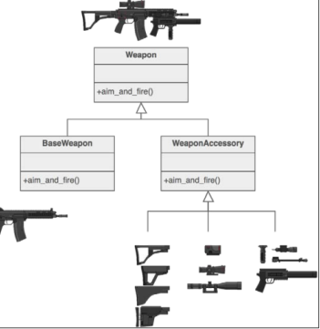
```python
def foo():
    print('foo func')
def new_foo():
    print('test')
    print('foo dunction')
def decorator(func):# 函数名-传参
    print('testing')
    func() # 函数名-调用
decorator(foo) #简单修饰
```
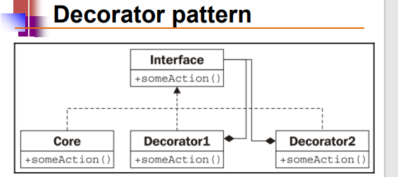
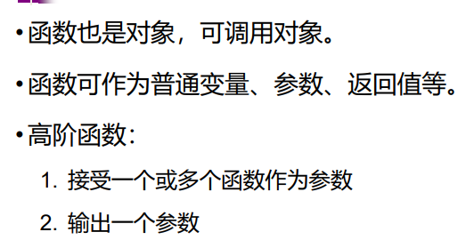
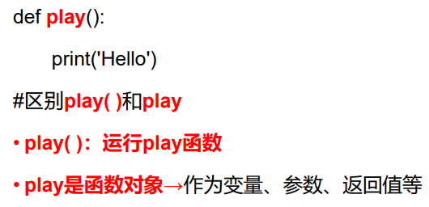
```python
class person:
    def __init__(self,name):
        self.name=name
        self.clothes=None
def Finery(obj):# 函数用于输出一个人的穿着情况。
    if not obj.clothes:
        print(obj.name,"is wearing",obj.clothes)
    else:
        print(obj.name, "is wearing Nothing!!!")
def decorator(func,clothes):
    # 用于给一个人对象添加特定的服装,func 表示要装饰的函数（这里是 Finery 函数），clothes 表示要添加的服装
    def deco(obj):# 参数obj表示要添加服装的人对象。
        obj.clothes=clothes
        func(obj)# 调用原始的 func 函数来输出穿着情况
    return deco
Andy=person('Andy')
Finery(Andy)
Tshirt=decorator(Finery,'Tshirts')
Tshirt(Andy)
Suit=decorator(Finery,'Suit')
Suit(Andy)
# 装饰器模式的应用，它可以动态地给对象添加新的行为或功能，而不需要改变对象的结构。
```

闭包与修饰器
```python
# 闭包的概念：当某个函数被当成对象返回时，夹带了外部变量，就形成了一个闭包

def make(msg):
    def printer():
        print(msg)# 外部变量
    return printer #返回函数
printer=make("hello")
printer()

```
闭包在修饰器当中的应用：
```python
# 闭包的应用：修饰器
def decorator(func): #被修饰函数名func
    def defunc(): #装饰后函数
        print('testing') #添加装饰
        func() #运行被装饰的函数
    return defunc #return装饰后的函数名
def foo():
    return ('foo function')
foo=decorator(foo)
foo()
```

注意：python 也有自己的修饰器，和设计模式当中的修饰器不是一个概念

py的@修饰符可以修改函数/类

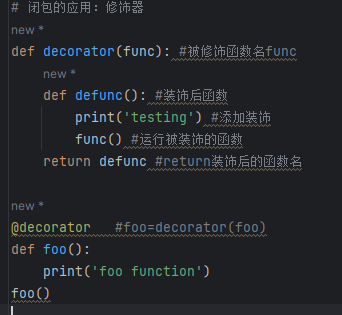


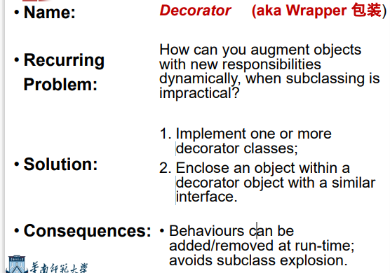
## Behavioural Patterns：行为型模式：
Deal with dynamic interactions among societies of classes and objects. How they distribute responsibility处理阶级和客体社会之间的动态互动。他们如何分配责任

• Iterator Pattern 迭代器模式：

可迭代对象：列表/元组/字典

iter()和next()迭代器方法：

iter()可以使得可迭代的对象转化成迭代器都西昂，可以使用next方法逐个访问列表当中的元素
```python
alist=[1,2,3,4]
al_iter=iter(aliist)
print(next(al_iter))
print(next(al_iter))
print(next(al_iter))
```
如果没有更多的元素，迭代器将会引发StopIteration 异常

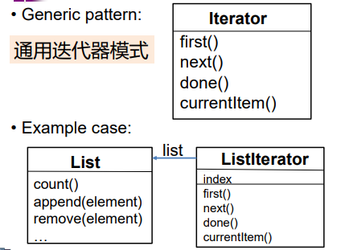

iterable：（可迭代对象）
可迭代对象：任何能够被循环的对象；

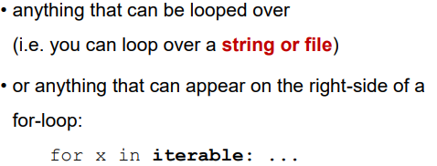

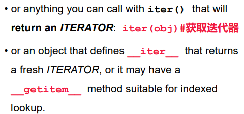

iterator:（迭代器对象）
迭代器对象：在迭代过程中能够记忆自身状态的对象

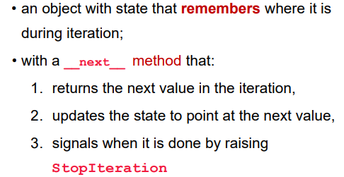
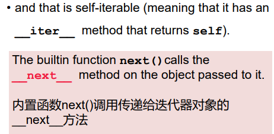
迭代器模式是一种行为设计模式，它用于提供一种顺序访问一个聚合对象中各个元素的方法，而又不暴露该对象的内部表示。该模式使得可以在不了解聚合对象内部结构的情况下，按顺序访问其中的元素。
让我来详细解释迭代器模式的主要组成部分和工作原理：
迭代器（Iterator）： 迭代器是一个接口或抽象类，它定义了访问和遍历聚合对象中各个元素的方法。迭代器通常包括 next() 方法，用于返回下一个元素，并在聚合对象的内部维护当前迭代的位置。
具体迭代器（Concrete Iterator）： 具体迭代器实现了迭代器接口，负责在聚合对象中进行顺序访问。它跟踪当前迭代的位置，并提供实现 next() 方法来获取下一个元素。
聚合对象（Aggregate）： 聚合对象是一个包含一组元素的对象，它可能提供一种方法来创建对应的迭代器。聚合对象将迭代器对象的创建和管理与自身的实现分离，使得迭代算法与具体的聚合对象解耦。
具体聚合对象（Concrete Aggregate）： 具体聚合对象实现了聚合接口，提供了具体的创建迭代器的方法。它将要被迭代的元素集合封装在内部，并负责创建相应的具体迭代器。
迭代器模式的工作原理是，客户端通过迭代器接口与聚合对象进行交互，而不需要了解聚合对象的内部结构。客户端可以通过迭代器顺序访问聚合对象中的各个元素，而不必暴露聚合对象的内部表示方式。这样做的好处是，可以使聚合对象的内部结构随时更改，而不会影响客户端的代码。
总的来说，迭代器模式提供了一种简单而灵活的方法来访问聚合对象中的元素，同时将迭代算法与聚合对象解耦，提高了代码的可维护性和灵活性。
生成器（Generators）是python一种非常强大的语言特性，它允许你在迭代中逐个产生值，而不需要一次性把所有值存储在内存中。

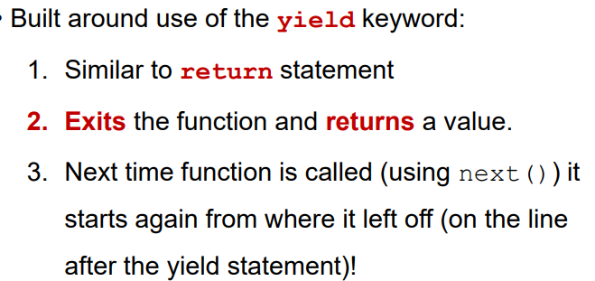
行为类似于迭代器的 Python 函数

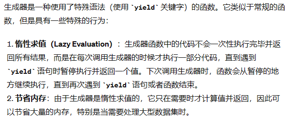

```python
def firstn(n):
    num=0
    while num<n:
        yield num
        # 每次调用生成器函数时，它都会在 yield 语句处暂停执行，然后返回一个值，并在下次调用时从上次暂停的地方继续执行
        num+=1
gen=firstn(3)
# 返回了一个生成器对象 gen。这个生成器对象表示从 0 到 2 的整数序列
print(next(gen))
print(next(gen))
print(next(gen))
print(next(gen))
# 在第四次调用时，由于生成器只生成了 0、1、2 三个值，所以会触发 StopIteration 异常，表示生成器已经没有更多的值可供获取。
```


### Adapter Pattern适配器结构：

介绍：
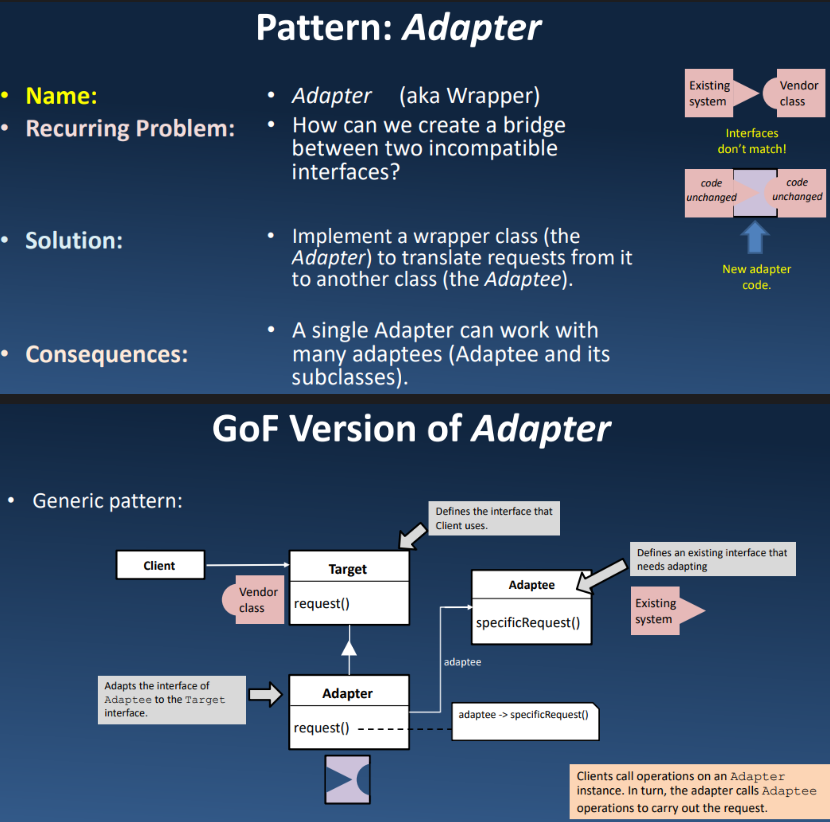

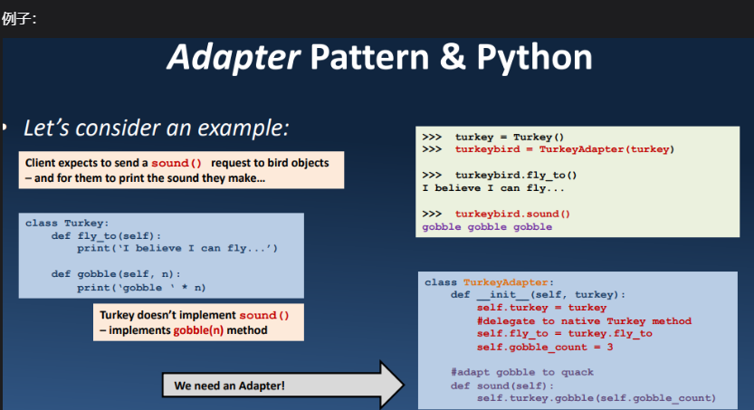
适配器模式是一种结构型设计模式，用于将一个接口转换成另一个客户端所期望的接口，使得原本由于接口不兼容而不能一起工作的类能够协同工作。在Python中，适配器模式通常用于解决两个不兼容接口之间的适配问题。
工作原理：
目标接口（Target Interface）： 定义客户端期望的接口。
适配器（Adapter）： 将被适配的类的接口转换成目标接口。
被适配者（Adaptee）： 需要被适配的类或接口。
适配器的用法：
类适配器模式： 使用多重继承的方式，让适配器类同时继承目标接口和被适配者类。
对象适配器模式： 使用组合的方式，让适配器类持有一个被适配者类的实例，并实现目标接口。
示例：
考虑以下情景：有一个音乐播放器（Player）类，它有一个播放音乐的方法 play_music()，但是现在我们想要播放mp3格式的音乐文件，而 play_music() 方法只接受 play() 方法作为参数。这时候就需要一个适配器来将 play_music() 方法转换成 play() 方法。
解析：
MediaPlayer 是目标接口，定义了客户端期望的接口方法 play()。
MP3Player 是被适配者，拥有与目标接口不同的方法 play(file)。
MP3PlayerAdapter 是适配器，它将 play() 方法适配成了 MediaPlayer 接口的方法 play()。
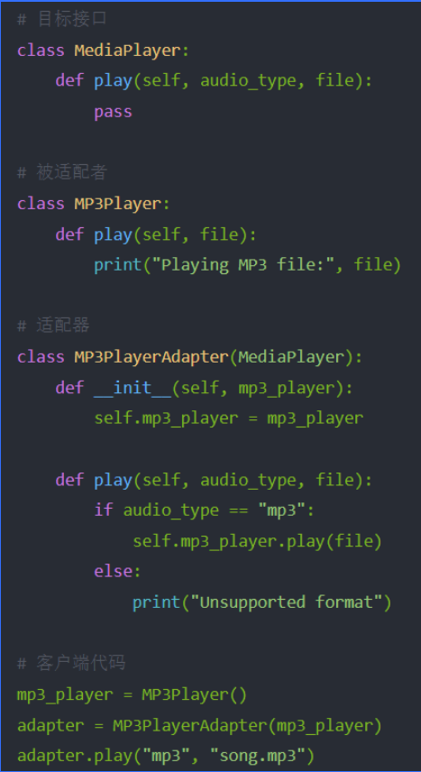
客户端代码中，创建了一个 MP3Player 对象和一个适配器对象，通过适配器调用了目标接口的方法，实现了播放mp3文件的功能。
应用场景：
使用第三方库或组件： 当需要使用一个已有的类或接口，但是它的接口与你的需求不兼容时，可以使用适配器模式。
系统升级或集成： 在系统升级或集成过程中，可能会遇到不兼容的接口，适配器模式可以帮助解决这类问题。
适配器模式是一种非常实用的设计模式，它可以使得不兼容的接口能够协同工作，提高了代码的复用性和灵活性。


# 策略模式和工厂模式请看幕布