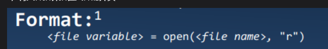
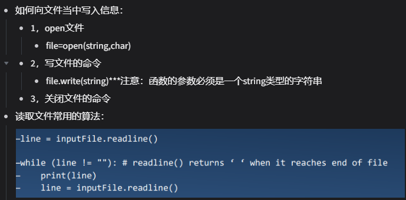
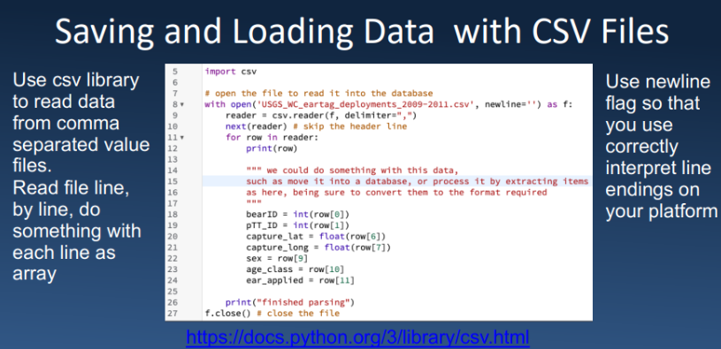

# 文件处理：

打开文件 准备文件以供读取： A. 将文件变量与物理文件链接（对文件变量的引用是对物理文件的引用）。B. 将文件指针定位在文件的开头。

文件指针：'r'与'w'通常指在文件的开头，当以“a”打开时，指针始终在文件顶部打开以追加新行


```python
file=input()
file=open(file,'r')

# 按照行读取文件：
for l in file:
    print(l)
```
关闭文件：inputfile.closed()


写文件，参数用'w'

file.wirte(temp)
# 序列化：
序列化是将对象转换为字节流或其他可存储或传输的格式的过程，而反序列化则是将字节流或其他格式转换回对象的过程。

pickle模块实现序列化：
```python
# pickle模块实现序列化：
import pickle
l=[1,2,3,4,5,6,67]
with open('l.pickle','rb') as f:
    pickle.dump(l,f)#保存
    l=pickle.load(f)#使用
```
json模块实现序列化：
```python
# json模块实现序列化：
import json
l=[1,2,3,4,5,6,67]
with open('l.json','r',encoding='utf-8') as f:
    l=json.load(f)
```
CSV 文件：

