# OOA分析过程：
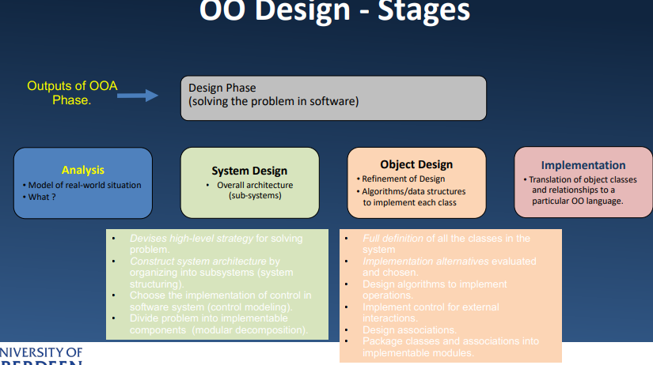

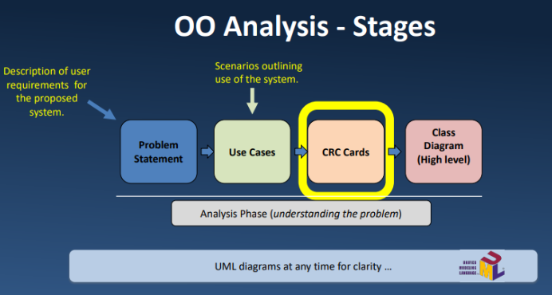

CRC卡：

# UML语言：

– 统一符号：Booch + OMT + 状态图

• 描述软件设计的图形符号。

• UML 不是一种方法或过程。 – 统一开发过程

UML has rules on how to draw models of classes, associations between classes, messages sent between objects

class：
类图 – 表示要实现的类定义;– 列出每个类的名称、属性和方法;– 显示类之间的关系。• UML 允许对一个类的属性和方法进行不同级别的详细描述： – 可以只是矩形中的类名;– 或右图所示的一般形式
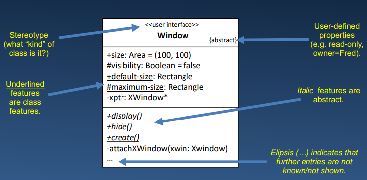

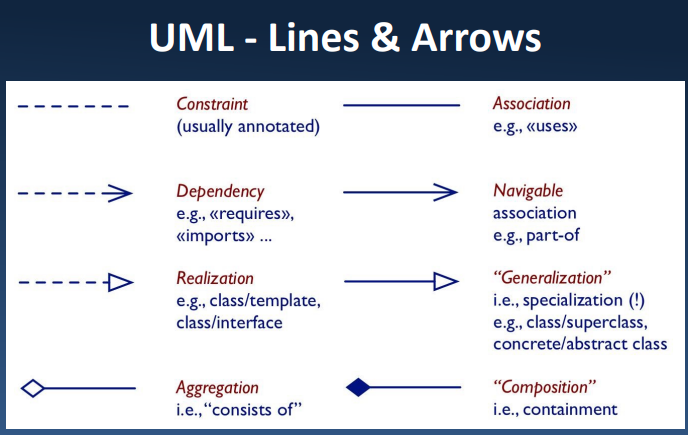

Object Diagrams：

Sequence Diagram;序列图
# 编码习惯：

正确性;

不好的习惯：
1，类的外面访问被保护的成员Accessing a protected member from outside the class ,

2，给内置的函数赋值：Assigning to built-in function

3，for循环内的else 不加break

4，和Java的属性风格混合

5，在不属于某个class特属的方法请用静态方法

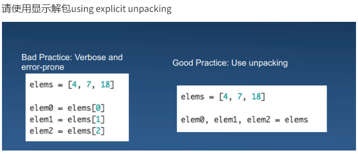
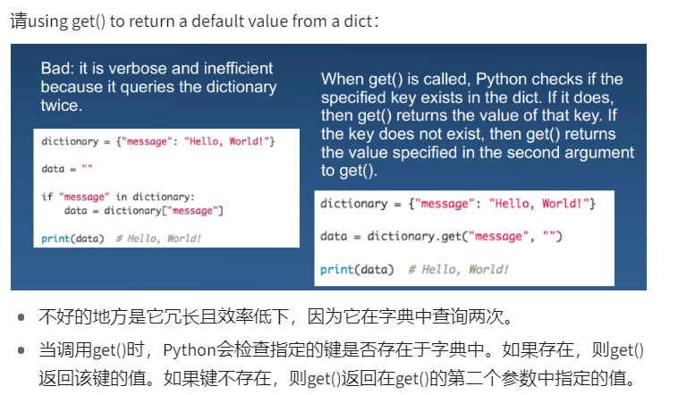


可维护性：

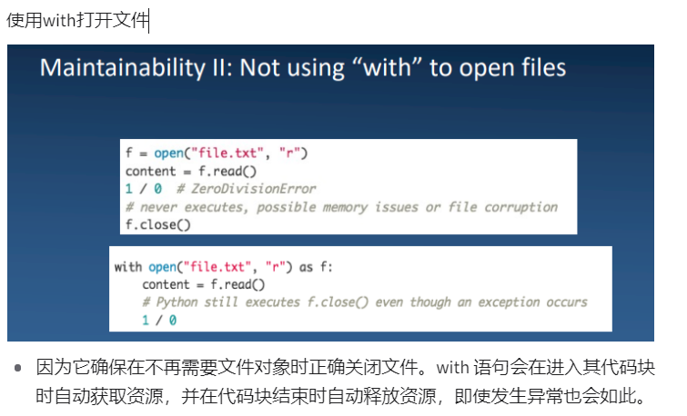
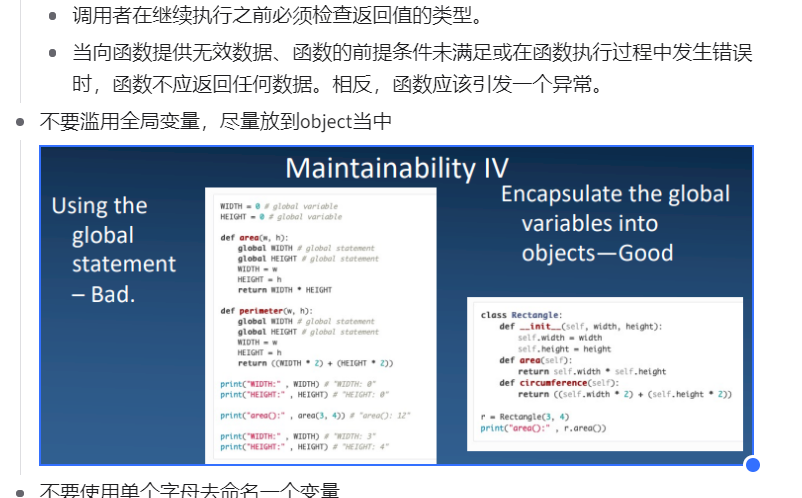


可读性：

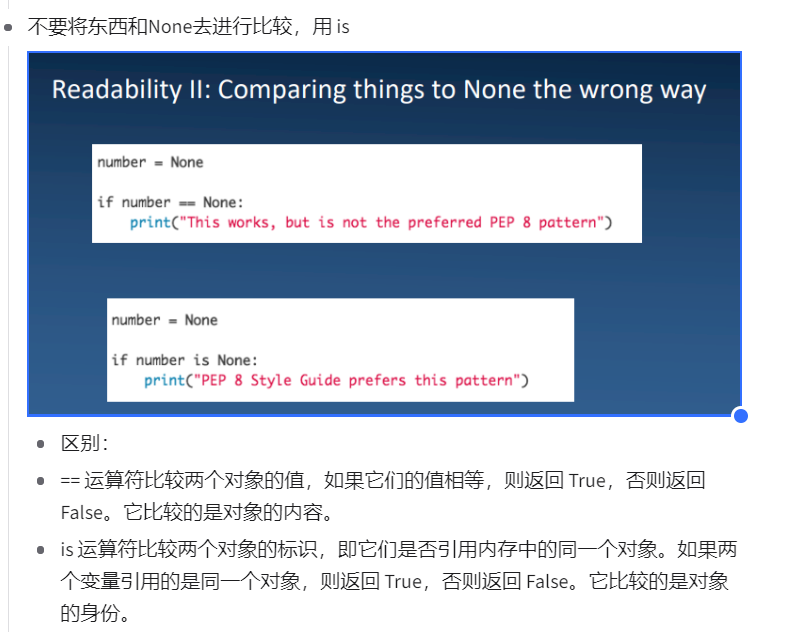

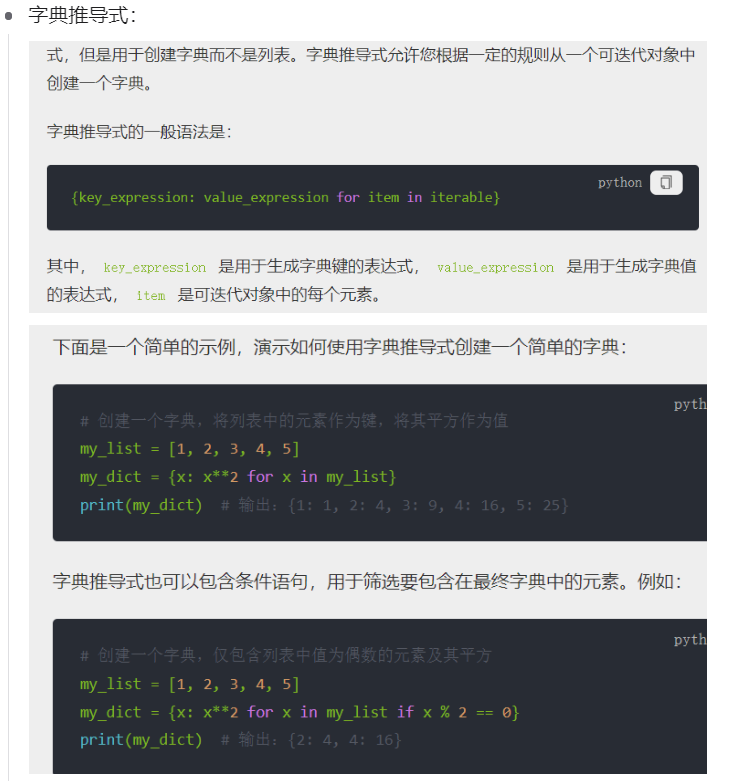
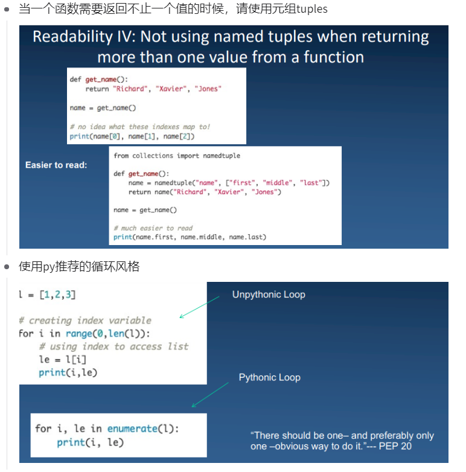
```python
l=[1,2,3]
for i,le in enumerate(l):
    print(i,le)
    pass
####################################
for i in range(0,len(l)):
    le=l[i]
    print(i,le)
```
使用小写+下划线命名函数，而不是驼峰命名法

不要使用exec
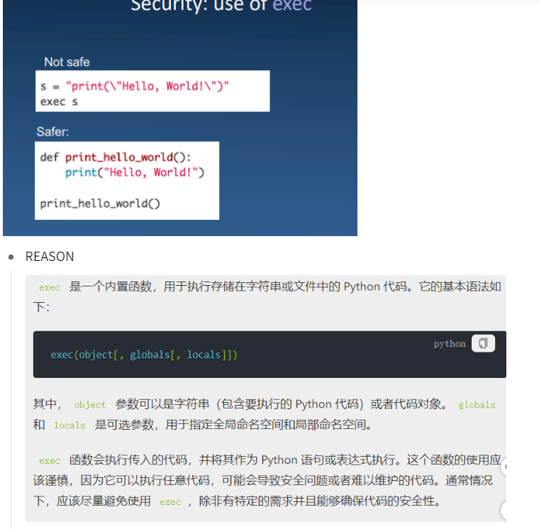

性能：
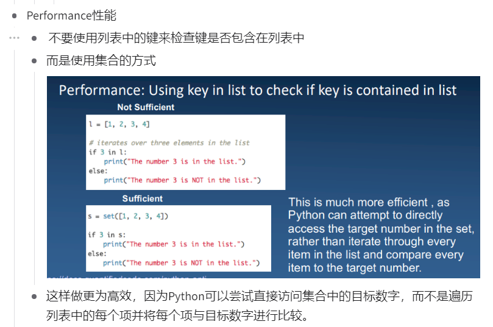


# 测试：

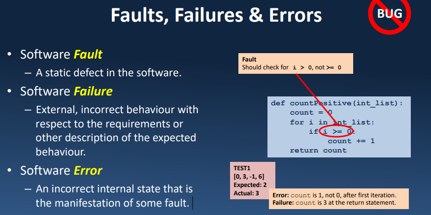

重构 - 在不改变其外部行为的情况下修改代码；注释、格式化、其他内部更改。

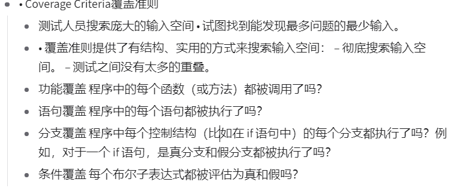
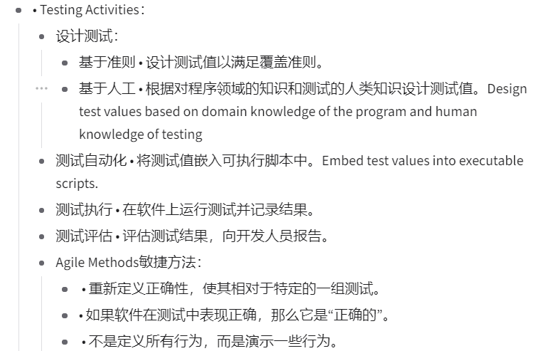

Function Coverage
Has each function (or method) in the program been called?

Statement Coverage
Has each statement in the program been executed?

Branch Coverage
Has each branch of each control structure (such as in if statements) 
been executed? For example, given an if statement, have both the true and false branches been executed? 
Condition Coverage

Has each Boolean sub-expression evaluated both to true and false?

函数覆盖率 程序中的每个函数（或方法）是否被调用？语句覆盖率 程序中的每个语句都已执行吗？分支覆盖率 是否执行了每个控制结构的每个分支（例如在 if 语句中）？例如，给定一个 if 语句，是否同时执行了 true 和 false 分支？条件覆盖率 是否将每个布尔子表达式的计算结果都计算为 true 和 false？
# 单元测试python unittest
• TestCase 类:

方法用于比较值、设置测试以及在测试完成后进行清理。

要为特定任务编写一组单元测试，创建一个 TestCase 的子类，并编写单独的方法来执行实际的测试。

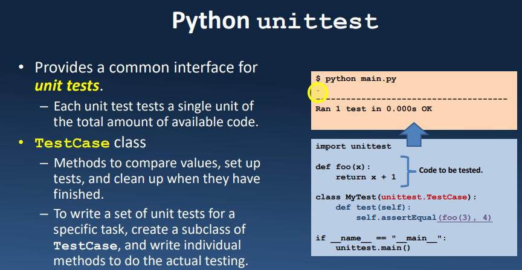
为单元测试提供通用接口。– 每个单元测试测试可用代码总量的单个单元。• TestCase 类 – 比较值、设置测试并在完成后进行清理的方法。– 要为特定任务编写一组单元测试，请创建 TestCase 的子类，并编写单独的方法来执行实际测试

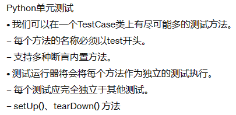
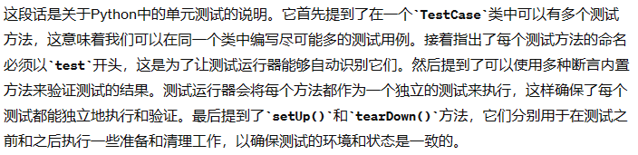

# 单元测试python doctest方法

轻量级测试框架。
• 在 Python Docstring 注释中嵌入简单测试（使用 >>>）。

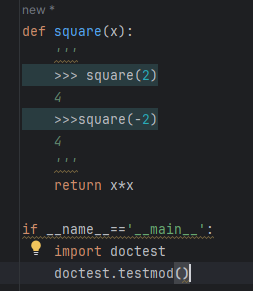

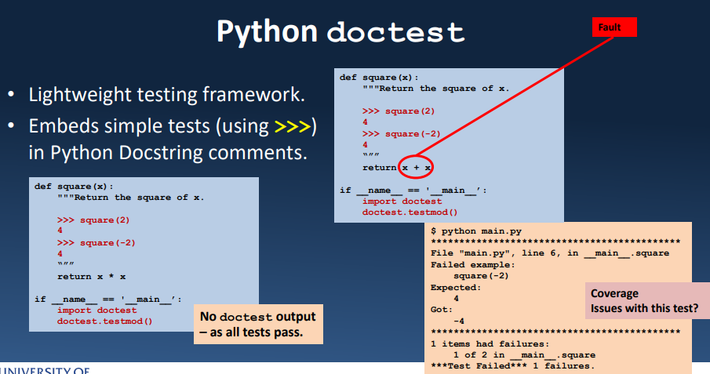

# pytest

更少的代码量

测试用例命名： – 函数以 test 开头 – 类名以 Test 开头 • 类中的方法以 test 开头

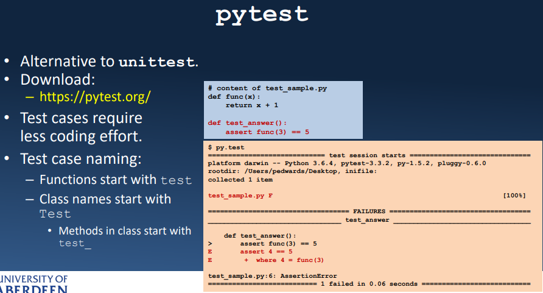