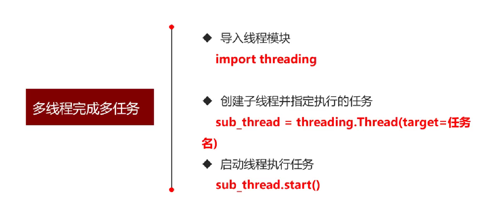
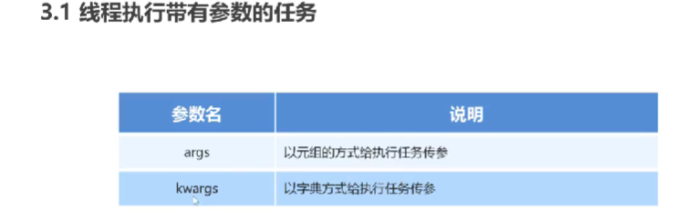
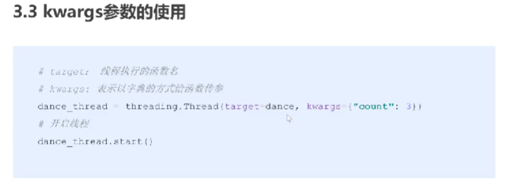
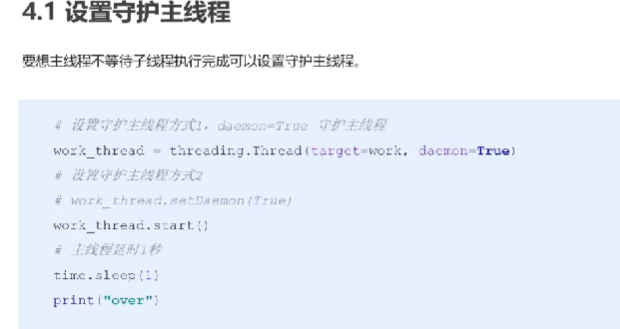
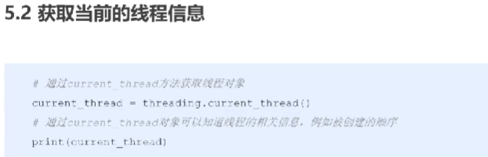

# 多线程：


# 有参数

元组如果只有一个元素，不要漏掉,


# 设置守护主线程
主线程默认会等待子线程结束再结束


# 执行顺序
线程之间的执行顺序是无序


# 线程锁

创建锁：（互斥锁）
不想被其他的线程打扰，可以放到互斥锁之间
```py
# 创建互斥锁
mutex=threading.Lock()
#上锁
mutex.acquire()

# 解锁
mutex.release()
```
如果 这个 互斥锁已经被上锁了，那么在这个锁被 解开之前是不能再次上锁的，也就是说: 如果这个锁被上锁 在解开之前谁要是 再次调用acquire对其上锁，那么谁就被被堵塞 ，直到这个互斥锁 被解锁为止
```py
# 创建互斥锁
mutex=threading.Lock()
#上锁
mutex.acquire()


mutex.acquire()
###上锁到解锁之间，锁上加锁，一直卡住
# 解锁
mutex.release()
```