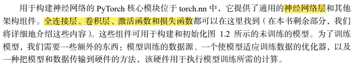
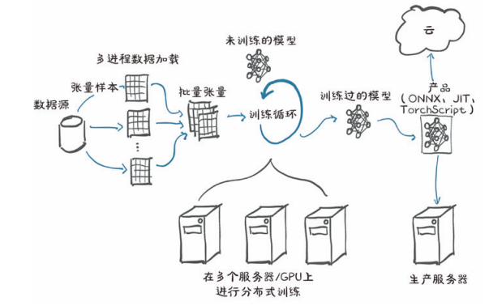
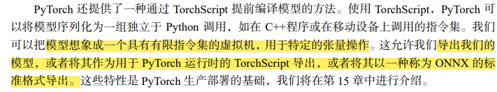

# 深度学习：

深度学习是通过提供具有指导性的例子来训练深度神经网络的数学实体
深度学习任务需要什么：
1，一种方法来提取我们手头上的数据
2，需要定义深度学习机
3，需要一种自动化的训练方法来获得有用的特征，并使得机器产生预定的输出

# pytorch:
核心：
1，通过一个提过那个多维数组（张量）以及由torch模块提供大量操作的库，这些张量和操作可以在CPU和GPU上使用。从CPU调到GPU上不需要额外的操作
2，张量可以追踪对其执行操作的能力，分析和计算任何输入对应输出的导数

# pytorch如何支持深度学习：

1，由于性能原因，PyTorch 大部分是用 C++和 CUDA 编写的
2，大多数情况下我们都是使用 Python 来与 PyTorch 交互的，包括构建模型、训练模型以及使用训练过的模型解决实际问题等
3，PyTorch首先是一个深度学习库，因此它提供了构建和训练神经网络所需的所有构建模块

4，从外部获取数据，通常是从作为数据源的某种存储中获取数据。然后我们需要将数据中的每个样本转换成 PyTorch 可以处理的张量。PyTorch 中 torch.utils.data 包下的 Dataset 类提供的标准张量之间的桥梁
5，数据存储慢，还有访问延迟，因此需要并行化数据加载。但由于py的并行处理能力低，我们需要多个进程来加载数据。以便将它们组装成一个批次，即组装成一个包含多个样本的张量。这是相当复杂的，但由于它也是相对通用的，PyTorch 很容易在 DataLoader 类中实现这些功能。它的实例可以生成子进程在后台从数据集中加载数据，提前将数据准备就绪，一旦训练循环开始就可以立即使用。
6，pytorch有损失函数给我们用。torch.nn 包中也提供这些函数。在我们用损失函数将实际输出与期望的输出进行比较之后，我们需要稍微修改模型以使其输出更接近目标。正如前面提到的，这正是 PyTorch 底层的自动求导引擎的用武之地。
7，需要优化器来进行更新， PyTorch 在 torch.optiom 中为我们提供的

