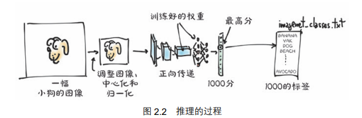
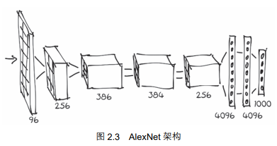
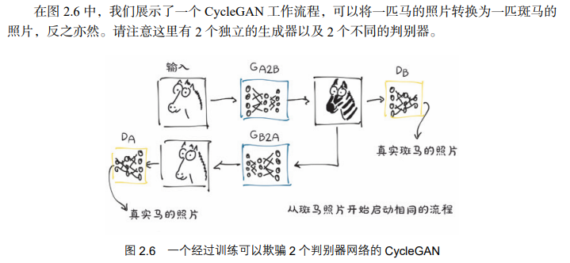

# 预训练网络
3 种常用的预训练模型：
一种可以根据内容对图像进行标记的模型，
一种可以从真实图像中生成新图像的模型，
还有一种可以使用正确的英语句子来描述图像内容的模型

张量：现在，可以把它想象成一个浮点数的向量或矩阵

我们的模型将把处理过的输入图像传入预先训练过的网络中，以获得每个类的分数。根据权重，最高的分数对应最可能的类。然后将每个类一对一地映射到标签上。该输出被包含在一个含1000 个元素的 torch.Tensor 张量中，每个元素表示与该类相关的分数。


## AlexNet

首先每个块包含一系列乘法和加法运算函数，以及一些其他函数。我们可以将每个块看作一个过滤器，一个接收一幅或多幅图像作为输入，并生成其他图像作为输出的函数。

输入图像从左侧进入并依次经过 5 个过滤器，每个过滤器生成一些输出图像。经过每个过滤器后，图像会被缩小。在过滤器堆栈中，最后一个过滤器产生的图像被排列成一个拥有 4096 个元素的一维向量，并被分类以产生 1000 个输出，每个输出对应一个类



## 残差网络（ResNet）

打开resNet，可以看见许多的“模块”，神经网络的构建模块。它们在其他深度学习框架中也被称为层（layers）。

看到许多 Bottleneck 模块一个接一个地重复出现，总共有 101 个，包括卷积和其他模块。这是典型的计算机视觉深度神经网络的结构：过滤器和非线性函数或多或少地顺序级联，以层（fc）结束，为 1000 个输出类（out_features）中的每个类生成分数

TorchVision 模块提供了转换操作，允许我们快速定义基本预处理函数的管道。
```py
from torchvision import transforms 
preprocess = transforms.Compose([ 
 transforms.Resize(256), 
 transforms.CenterCrop(224), 
 transforms.ToTensor(), 
 transforms.Normalize( 
 mean=[0.485, 0.456, 0.406], 
 std=[0.229, 0.224, 0.225] 
 )]) 
```
本例中，我们定义了一个预处理函数，将输入图像缩放到 256×256 个像素，围绕中心将图像裁剪为 224×224 个像素，并将其转换为一个张量，对其 RGB 分量（红色、绿色和蓝色）进行归一化处理，使其具有定义的均值和标准差。张量是一种 PyTorch 多维数组，在本例中，是一个包含颜色、高度和宽度的三维数组。如果我们想让网络产生有意义的答案，那么这些转换就需要与训练期间向网络提供的内容相匹配。

操作模块 Pillow 从本地文件系统加载一幅图像。

```py
from PIL import Image 
img = Image.open("../data/p1ch2/bobby.jpg") 
```
```py
接下来，我们可以通过预处理管道传递图像：
# In[9]: 
img_t = preprocess(img) 
然后我们可以按照网络期望的方式对输入的张量进行重塑、裁剪和归一化处理。
# In[10]: 
import torch 
batch_t = torch.unsqueeze(img_t, 0) 
现在可以运行我们的模型了。
```

运行：
在深度学习中，在新数据上运行训练过的模型的过程被称为推理（inference）。为了进行推理，我们需要将网络置于 eval 模式。

# GAN游戏：生成对抗式网络
生成式（generative）意味着一些东西正在被创造出来，而对抗（adversarial）意味着这 2 个网络在竞争
我们的首要目标是生成不能被识别为赝品的一类图像的合成示例。
这项技术已经被证明能够产生一个生成器，它只从噪声和一个条件信号生成逼真的图像。这里的条件信号指属性或其他图像，例如对于人脸而言的属性：年轻的、女性的、戴着眼镜的。换句话说，一个训练有素的生成器训练了一个用于生成图像的合理模型

## CycleGAN：循环生成式对抗网络
将一个领域的图像转换为另一个领域的图像，而不需要我们在训练集中显式地提供匹配对

并不要求源域和目标域的图像内容是匹配的。从一组不相关的马的图片和斑马的图片开始，生成器就可以学习它们的任务，这足够超越纯粹的监督环境。这个模型的含义远不止于此：生成器学习如何在无监督的情况下选择性地改变场景中物体的外观。
