# 张量：

## 1，实际数据转为浮点数：

深度神经网络通常在不同阶段学习将数据从一种形式转换为另一种形式，这意味着每个阶段转换的数据可以被认为是一个中间表征序列。
这些中间表征是浮点数的集合，它们描述输入的特征，并以一种有助于描述输入映射到神经网络输出的方式捕获数据的结构。
浮点数的集合以及它们的操作是现代 AI 的核心。
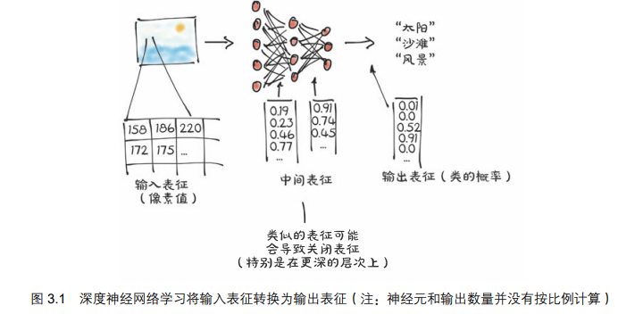
中间表征是将输入与前一层神经元的权重结合的结果，每个中间表征对之前的输入都是唯一的
PyTorch 如何处理和存储数据：张量
在深度学习中，张量可以将向量和矩阵推广到任意维度
多维数组，张量的维度与用来表示张量中标量值的索引数量一致
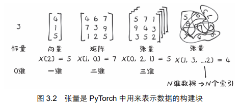

## 2,张量：多维数组

张量是一个数组，也就是一种数据结构，它存储了一组数字，这些数字可以用一个索引单独访问，也可以用多个索引访问。
使用更有效的张量数据结构，从图像到时间序列等许多类型的数据，甚至是句子都可以表示出来。
通过定义张量上的操作，我们可以同时对数据进行高效的切片和操作

```py
import torch
a=torch.ones(3)#创建一个大小为3的一维张量，用1.0来填充
print(a[0])#我们可以使用从 0 开始的索引来访问一个元素，或者给它指定一个新值
print(a)
```

PyTorch 张量或 NumPy 数组通常是连续内存块的视图，这些内存块包含未装箱的 C 数字类型，而不是 Python 对象
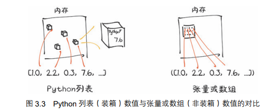

```py
#构造函数的写法：
points=torch.tensor([4.0,1.0,5.0,3.0,2.0,1.0])
#向构造函数传递了一个元素为列表的列表
ppoints = torch.tensor([[4.0, 1.0], [5.0, 3.0], [2.0, 1.0]])
#查看张量的形状：
print(ppoints.shape)
#还可以使用 zeros()或 ones()函数来初始化张量，以元组的形式来指定大小
p=torch.zeros(3,2)
#用 2 个索引来访问张量中的单个元素
print(ppoints[0,1])
#得到第一个点的坐标：输出是另一个张量,引用了张量 points 中第 1 行的值。
#但在此过程中，没有分配了一个新的内存块！！！因为那样效率会很低
print(ppoints[0] )

```
## 3.3索引张量：

操作向量和操作列表有所相似：
```py
l=list(range(6))#列表中元素有0到5
print(l[:])#列表当中的所有元素
print(l[1:4])#包含第 1 个元素到第 3 个元素，不包含第 4 个元素
print(l[1:])#包含第 1 个元素到列表末尾的元素
print(l[:4])#从列表开始到第 3 个元素，不包含第 4 个元素
print(l[:-1])#从列表的开始到最后一个元素之前的所有元素
print(l[1:4:2])#从第 1 个元素（包含）到第 4 个元素（不包含），移动步长为 2

points = torch.tensor([[4.0, 1.0], [5.0, 3.0], [2.0, 1.0]])
print(points[1:])#第 1 行之后的所有行，隐含所有列
print(points[1:,:])#第 1 行之后的所有行，所有列
print(points[1:,0])#第 1 行之后的所有行，第 1 列
print(points[None])#增加大小为 1 的维度，就像 unsqueeze()方法一样
```

## 一些概念的补充和扩展

## 张量的维度：
张量的维度：张量（Tensor）是一种多维数组的数据结构，类似于Numpy数组。张量具有维度（Dimension）（也称为轴或秩），代表了数据在不同方向上的大小。

维度表示了张量数据的排列方式，可以类比于矩阵中的行和列。一维张量类似于一维的向量，二维张量类似于矩阵，而三维或更高维的张量则能表示更复杂的结构。
PyTorch中，可以使用dim()函数来获取张量的维度数量，使用size()函数或shape属性来获取张量每个维度的大小。

## tensor：

在PyTorch中，tensor是一个非常重要的类，用于创建和操作张量（Tensor）。张量是一个多维数组，类似于Numpy数组，它是深度学习模型中最常用的数据结构之一。tensor类提供了许多功能和方法，用于创建、操作和计算张量。下面是一些常见的tensor操作：
1，创建tensor：可以使用torch.tensor()函数来创建张量。例如，可以使用torch.tensor([1, 2, 3])创建一个包含1、2、3的一维张量。
2，创建随机数张量：PyTorch还提供了一些函数用于创建包含随机数的张量。其中最常用的是torch.rand()函数。torch.rand()函数可以创建一个具有给定形状的张量，并将其中的元素初始化为0到1之间的随机数。
例如，可以使用torch.rand(2, 3)创建一个2x3的张量，其中每个元素都是0到1之间的随机数。
3，还有其他一些类似的随机数函数，如torch.randn()用于创建服从标准正态分布的随机数张量，torch.randint()用于创建整数类型的随机数张量等。

tensor()方法：
torch.tensor()函数是PyTorch中用于创建张量（Tensor）的一种常用方法。它可以根据给定的数据创建张量，并返回一个新的张量对象。
```py 

torch.tensor(data, dtype=None, device=None, requires_grad=False)
```
data：用于创建张量的数据。可以是Python列表、元组、NumPy数组、标量等。
dtype：可选参数，用于指定结果张量的数据类型。如果不指定该参数，PyTorch会根据输入数据自动推断数据类型。
device：可选参数，用于指定结果张量的存储设备。默认情况下，张量会在CPU上创建。可以通过torch.device类指定将张量分配到的特定设备，如torch.device('cuda')表示使用CUDA加速的设备。
requires_grad：可选参数，用于指定是否在创建张量时开启自动求导功能，用于计算梯度。默认值为False。
示例：

1,从列表创建：可以通过将Python列表作为data参数传递给torch.tensor()函数来创建张量。
``` py
import torch
data = [1, 2, 3]
tensor = torch.tensor(data)
```
2,从NumPy数组创建：可以通过将NumPy数组作为data参数传递给torch.tensor()函数来创建张量。

```py
python
import numpy as np
import torch
data = np.array([1, 2, 3])
tensor = torch.tensor(data)
```
3,指定数据类型和设备：可以使用dtype和device参数来指定结果张量的数据类型和存储设备。
``` py
import torch

data = [1, 2, 3]
tensor = torch.tensor(data, dtype=torch.float32, device='cuda')
```

## 3.4命名张量：

广播：广播（Broadcasting）是一种自动执行元素级别运算的机制，它使得在形状不同但兼容的张量之间进行运算成为可能。广播的目的是为了避免显式地重复张量的值或者改变其形状以匹配其他张量的形状。
当两个张量在某个维度上的大小不匹配时，PyTorch会自动进行广播操作。广播操作将较小的张量自动扩展（重复）到与较大的张量匹配，并在两个张量上进行元素级别的运算。

假设M为2x3的矩阵，v为1x3的向量，我们可以使用广播机制来将向量v与矩阵M进行运算。根据广播的规则，会自动将向量v重复扩展为2x3的形状，使得它可以与矩阵M进行元素级别的运算。
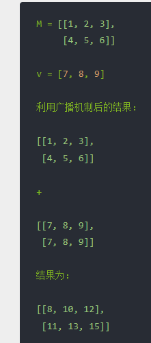

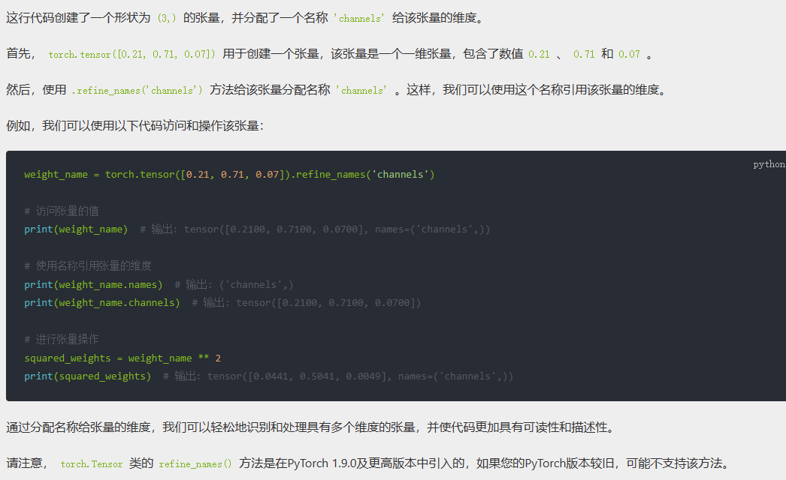

## 3.5张量的元素类型

为什么不用pytorch当中的类型？
1，在Python中，数字被视为对象。这意味着对于每个数字，Python会将其转换为一个完整的Python对象并进行管理，而不仅仅是使用底层的原始数据类型。例如，一个浮点数在计算机中可能只需要32位来表示（对于32位的单精度浮点数），但是Python将其转换为一个具有更多功能和特性的完整对象。
当我们只需要存储少量的数值时，Python的这种对象化的方式并不是一个问题，因为其带来的额外的开销可以被接受。然而，当我们需要存储大量的数据时，采用这种装箱（boxing）的方式会变得非常低效。
装箱操作指的是将原始数据类型（如整数、浮点数）转换为对象，使其具有像方法调用、动态类型等附加功能。这种转换需要额外的内存和计算开销。
当我们需要存储数百万个数据时，如果每个数据都采用装箱的方式，将导致大量的额外内存开销和计算开销。由于每个对象都需要额外的内存来存储对象的状态和元数据，这些对象的创建和管理会变得非常昂贵。
为了提高效率，当需要处理大量数据时，可能会采用一些优化的手段，例如使用NumPy库中的数组来存储和操作大规模的数值数据。NumPy数组采用基于原始数据类型的存储，不需要额外的装箱操作，从而提供了更高的性能和更低的内存消耗。
总结起来，Python中的数字被视为对象，这种对象化的方式对于存储少量数值是可以接受的，但是当处理大量数据时，采用装箱操作会导致额外的内存和计算开销，变得非常低效。在这种情况下，使用一些优化的数据结构和库（如NumPy）能够提供更好的性能和效率。
2，Python 中的列表属于对象的顺序集合，没有为有效地获取两个向量的点积或将向量求和而定义的操作。另外，Python 列表无法优化其内容在内存中的排列，因为它们是指向Python 对象的指针的可索引集合，这些对象可能是任何数据类型而不仅仅是数字。最后，Python 列表是一维的，尽管我们可创建元素为列表的列表，但这同样是非常低效的。
3，Python 解释器与优化后的已编译的代码相比速度很慢。在大型数字类型的数据集合上执行数学运算，使用用编译过的更低级语言（如 C 语言）编写的优化代码可以快得多。

使用dtype指定数字类型：
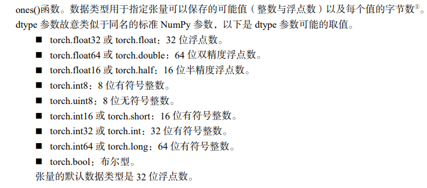
在神经网络中发生的计算通常是用 32 位浮点精度执行的.
64 位，并不会提高模型精度，反而需要更多的内存和计算时间。16 位半精度浮点数的数据类型在标准 CPU 中并不存在，而是由现代 GPU 提供的。如果需要的话，可以切换到半精度来减少神经网络占用的空间，这样做对精度的影响也很小。

张量可以作为其他张量的索引，在这种情况下，PyTorch 期望索引张量为 64 位的整数。
张量上的谓词，如 points >1.0，产生布尔型张量，表明每个元素是否满足条件。

```PY
dp=torch.ones(10,2,dtype=torch.double)
sp=torch.tensor([[1,2],[3,4]],dtype=torch.short)
#或者用相应的方法将张量创建函数的输出转化成正确的类型：
#在底层，to()方法会检查转换是否是必要的，如果必要，则执行转换
dp=torch.ones(10,2).to(torch.double)
sp=torch.tensor([[1,2],[3,4]]).to(torch.short)

points_64 = torch.rand(5, dtype=torch.double)#rand()方法将张量元素初始化为 0～1 的随机数

```

## 3.6张量的API：
### 1，索引、切片、连接、转换操作—用于改变张量的形状、步长或内容的函数，如 transpose()
transpose函数:torch.transpose(input, dim0, dim1) -> Tensor
参数
input：输入张量，即进行转置操作的张量。
dim0：整数，要交换的第一个维度的索引。
dim1：整数，要交换的第二个维度的索引。
函数返回一个新的张量，它是输入张量的转置。

```py
import torch

# 创建一个形状为(3, 2)的张量
x = torch.tensor([[1, 2],
                  [3, 4],
                  [5, 6]])

# 使用转置函数对张量进行转置
x_t = torch.transpose(x, 0, 1)
print(x_t)
# 输出:
# tensor([[1, 3, 5],
#         [2, 4, 6]])
```
### 2，创建操作—用于构造张量的函数，如 ones()和 from_numpy()

torch.from_numpy()函数：
语法：torch.from_numpy(ndarray) -> Tensor
参数：
ndarray：NumPy数组，用于创建相应的张量。
返回值：一个新的张量，其数据和形状与输入的NumPy数组一致。
并且它们之间共享相同的内存，因此对其中一个的修改会影响另一个。
```py
import torch
import numpy as np

# 创建一个NumPy数组
arr = np.array([[1, 2, 3],
                [4, 5, 6]])
# 使用NumPy数组创建相应的张量
x = torch.from_numpy(arr)
print(x)
# 输出:
# tensor([[1, 2, 3],
#         [4, 5, 6]], dtype=torch.int64)
# 修改NumPy数组的值，查看张量是否相应改变
arr[0, 0] = 99
print(x)
# 输出:
# tensor([[99,  2,  3],
#         [ 4,  5,  6]], dtype=torch.int64)
```

### 3,数学：-举例子
abs函数：

```py
import torch

# 创建一个包含负数的张量
x = torch.tensor([-1, -2, 3, -4, 5])

# 计算张量绝对值
abs_x = torch.abs(x)
print(abs_x)
# 输出:
# tensor([1, 2, 3, 4, 5])

```

cos函数：
通过torch.tensor()创建了一个包含一些角度值的张量angles，然后使用torch.cos()函数计算了angles的余弦值。结果是一个新的张量cos_angles，它包含了angles张量各元素的余弦值。
```py
import torch
import math

# 创建一个张量，包含一些角度值
angles = torch.tensor([0, math.pi/4, math.pi/2, math.pi])

# 计算张量的余弦值
cos_angles = torch.cos(angles)
print(cos_angles)
# 输出:
# tensor([ 1.0000,  0.7071,  0.0000, -1.0000])
```
归约操作—通过迭代张量来计算聚合值的函数，如 mean()、std()和 norm()；
1,mean()函数：
语法：torch.mean(input, dim=None, keepdims=False, out=None) -> Tensor
参数：
input：输入张量，要计算平均值的张量。
dim：可选参数，指定沿着哪个维度计算平均值。如果不指定，则计算整个张量的平均值。
keepdims：可选参数，指定是否保持输出张量的维度和输入张量相同。默认值为False。
out：可选参数，指定输出张量。
返回值：一个新的张量，包含输入张量元素的平均值。
```py
import torch

# 创建一个张量
x = torch.tensor([[1, 2, 3],
                  [4, 5, 6]])

# 计算张量的平均值
mean_x = torch.mean(x)
print(mean_x)
# 输出:
# tensor(3.5000)
```
通过torch.tensor()创建了一个二维张量x，然后使用torch.mean()函数计算了x的平均值。结果是一个新的张量mean_x，它包含了x张量元素的平均值。

2,std()函数：
语法：torch.std(input, dim=None, unbiased=True, keepdims=False, out=None) -> Tensor
参数：
input：输入张量，要计算标准差的张量。
dim：可选参数，指定沿着哪个维度计算标准差。如果不指定，则计算整个张量的标准差。
unbiased：可选参数，指定是否使用无偏估计计算标准差。默认值为True。
keepdims：可选参数，指定是否保持输出张量的维度和输入张量相同。默认值为False。
out：可选参数，指定输出张量。
返回值：一个新的张量，包含输入张量元素的标准差。
```py
import torch

# 创建一个张量
x = torch.tensor([[1, 2, 3],
                  [4, 5, 6]])

# 计算张量的标准差
std_x = torch.std(x)
print(std_x)
# 输出:
# tensor(1.7078)
```

3,norm()函数：
语法：torch.norm(input, p='fro', dim=None, keepdim=False, out=None) -> Tensor
参数：
input：输入张量，要计算范数的张量。
p：可选参数，指定要计算的范数类型。默认值为'fro'，表示计算矩阵的Frobenius范数。
dim：可选参数，指定沿着哪个维度计算范数。如果不指定，则计算整个张量的范数。
keepdim：可选参数，指定是否保持输出张量的维度和输入张量相同。默认值为False。
out：可选参数，指定输出张量。
返回值：一个新的张量，包含输入张量元素的范数值。
```py
import torch

# 创建一个张量
x = torch.tensor([[1, 2, 3],
                  [4, 5, 6]])

# 计算张量的范数
norm_x = torch.norm(x)
print(norm_x)
# 输出:
# tensor(9.5394)
```

比较操作—在张量上计算数字谓词的函数，如 equal()和 max()；
1,equal():如果两个张量具有相同的形状和元素值，则返回True，否则返回False。
2,max()函数:
语法：torch.max(input) -> Tensor 
或 torch.max(input, dim, keepdim=False, out=None) -> (Tensor, LongTensor)
参数：
input：输入张量，要寻找最大值的张量。
dim：可选参数，指定沿着哪个维度寻找最大值。如果不指定，则在整个张量上计算最大值。
keepdim：可选参数，指定是否保持输出张量的维度和输入张量相同。默认值为False。
out：可选参数，指定输出张量。
返回值：
如果未指定dim参数，则该函数返回输入张量中的最大值。
如果指定了dim参数，则该函数返回给定维度上的最大值，以及一个包含最大值所在索引的张量。
```py
import torch

# 创建一个二维张量
x = torch.tensor([[1, 2, 3],
                  [4, 5, 6]])

# 创建一个三维张量
x = torch.tensor([[1, 2, 3],
                  [4, 5, 6],
                  [6,2, 11]
                  ])
# 计算整个张量的最大值
max_value = torch.max(x)
print(max_value)
# 输出:
# tensor(6)

# 沿着指定维度计算最大值
max_value, max_indices = torch.max(x, dim=1)#第一维度是指行的数量，也就是张量的高度。在该张量中，第一维度的大小是2，代表有两行数据。
print(max_value)
# 输出:
# tensor([3, 6])
```

频谱操作—在频域中进行变换和操作的函数:
比如：
以下是一些常见的频谱操作函数：

1，傅里叶变换（Fourier Transform）：傅里叶变换将一个信号从时域转换到频域。具体地，通过计算信号的频谱，它将信号表示为不同频率的正弦和余弦函数的叠加。在Python中，可以使用NumPy库的numpy.fft.fft()函数来进行傅里叶变换。

2，快速傅里叶变换（Fast Fourier Transform, FFT）：FFT是一种高效的计算傅里叶变换的算法。它利用信号的对称性以及特定的计算技巧，能够大大提高傅里叶变换的计算速度。在常见的科学计算库中，如NumPy和PyTorch，都提供了FFT的函数，如numpy.fft.fft()和torch.fft.fft()。

3，频谱滤波：频谱滤波是根据频域特性对信号进行滤波操作的过程。通过在频域中操作频谱信息，可以增强或衰减特定频率的成分。常见的频谱滤波操作包括低通滤波、高通滤波和带通滤波等，在图像处理中也有应用。在频域滤波中，可以使用傅里叶变换将信号从时域转换到频域，然后对频谱进行相应的操作，最后再将信号转换回时域。在NumPy和PyTorch中，可以使用相应库的函数来执行频域滤波操作。

4，频谱分析：频谱分析是对信号频谱进行定量或定性分析的过程。它可以用来检测信号中的频率成分、频谱特征、频域关系等。常见的频谱分析方法包括功率谱密度（PSD）估计、谱平均、频谱切片等。在NumPy和PyTorch中，可以使用相应库的函数进行频谱分析操作。

5，频谱合成：频谱合成是根据给定的频谱信息生成相应的信号的过程。通过给定频谱的幅度和相位信息，可以合成特定的信号。频谱合成在音频合成、信号恢复和合成图像等领域有广泛应用。


其他操作—作用于向量的特定函数（如 cross()），或对矩阵进行操作的函数（如 trace()）
1，torch.cross(): torch.cross() 函数与NumPy中的 cross() 函数类似，用于计算两个三维向量的叉积。它接受两个张量作为输入，返回它们的叉积作为输出。

2，torch.mm(): torch.mm() 函数用于执行矩阵乘法操作。它接受两个二维张量作为输入，并返回它们的矩阵乘积。

3，torch.trace(): torch.trace() 函数用于计算一个方阵的迹。它接受一个二维张量作为输入，并返回方阵的迹。

4，tensor.t(): tensor.t() 方法用于计算张量的转置。它返回一个新的张量，表示输入张量的转置。注意，它只能用于二维张量。

5，torch.inverse(): torch.inverse() 函数用于计算方阵的逆矩阵。它接受一个二维张量作为输入，并返回逆矩阵作为输出。如果方阵不可逆，会报错。

6，torch.diag(): torch.diag() 函数用于提取矩阵的对角线元素，或者创建一个以给定对角线元素为主对角线的对角阵。它接受一个一维张量作为输入，并返回一个对角阵或一个包含输入张量的对角线元素的一维张量。

7，转置，上面有讲
```py
print("pytorch当中对矩阵的操作如下：")
#pytorch当中对矩阵的操作：
a=torch.tensor([[1,2,3],[2,3,1],[4,2,3]])
b=torch.tensor([[4,2,3],[5,3,1],[7,2,2]])
print("矩阵A",a)
print("矩阵B",b)
#cross
print("叉乘cross",torch.cross(a,b))
#mm
print("矩阵的乘法",torch.mm(a,b))
#trace
print("矩阵A的迹",torch.trace(a))
print("矩阵B的迹",torch.trace(b))
#t
print("矩阵A的转置",torch.t(a))
print("矩阵B的转置",torch.t(b))
#矩阵的逆
try:
    print("A的逆",torch.inverse(a))
except:
    print("没有逆！！！")
```

BLAS 和LAPACK 操作—符合基本线性代数子程序（Basic Linear Algebra Subprogram，
BLAS）规范的函数，用于标量、向量—向量、矩阵—向量和矩阵—矩阵操作。

BLAS（Basic Linear Algebra Subprograms）和LAPACK（Linear Algebra Package）是两个非常重要的线性代数库。PyTorch 的底层实现依赖于这些库，并提供了符合 BLAS 和 LAPACK 规范的函数和操作，用于执行标量、向量、矩阵等级的计算。

BLAS 提供了一组基本的线性代数子程序，用于执行标量、向量、矩阵之间的操作。这些操作包括向量的点乘、向量之间的加法和减法、矩阵与向量之间的乘法等。BLAS 函数的设计旨在通过高效的低级操作（如向量内积、矩阵乘法等）来实现高性能的线性代数计算。BLAS 中的一些常用函数包括 dot()、gemv()、gemm() 等，它们分别用于向量点乘、矩阵-向量乘法和矩阵-矩阵乘法。

LAPACK 是一个包含了一系列线性代数算法的库，用于解决线性方程组、特征值问题、奇异值分解等。在PyTorch中，LAPACK 提供了一些实用的函数，如求解线性方程组、矩阵的逆、矩阵的特征值和特征向量等。这些函数包括 solve()、inv()、eig()、svd() 等。

通过PyTorch中与BLAS和LAPACK兼容的函数和操作，可以高效地执行各种线性代数运算。这些函数和操作是为了提高计算效率和准确性，尤其在大规模矩阵和向量操作时非常重要。使用符合BLAS和LAPACK规范的函数，可以充分利用底层硬件和优化库，使计算过程更加高效且准确。


随机采样—从概率分布中随机生成值的函数，如 randn()和 normal()
1,torch.randn() 函数用于从标准正态分布中生成随机数。它接受一个或多个参数来指定所生成随机数的形状。例如，torch.randn(3, 4) 将生成一个形状为 (3, 4) 的张量，其中的每个元素都是从标准正态分布（均值为0，标准差为1）中采样得到的。这个函数返回的张量中的值是服从标准正态分布的随机数。

2,torch.normal() 函数用于从给定均值和标准差的正态分布中生成随机数。它接受两个参数来指定均值和标准差，并且可以进一步指定生成随机数的形状。例如，torch.normal(mean=0.0, std=1.0, size=(3, 4)) 将生成一个形状为 (3, 4) 的张量，其中的每个元素都是从均值为0，标准差为1的正态分布中采样得到的随机数。这个函数返回的张量中的值是服从指定均值和标准差的正态分布的随机数。


张量的序列化与反序列化：
torch.save() 函数用于将张量保存到磁盘：
```py
import torch

# 创建一个张量
x = torch.tensor([1, 2, 3])

# 保存张量到文件
torch.save(x, 'tensor.pt')
```

从磁盘加载保存的张量
```py
import torch

# 加载保存的张量
x = torch.load('tensor.pt')
print(x)

```
不仅适用于保存和加载张量，还可用于保存和加载整个模型的状态字典，包括模型的权重和其他参数。

当使用这些函数进行序列化和反序列化时，需要确保文件的扩展名为 .pt 或 .pth，这是一种常见的约定，表示 PyTorch 保存的是张量或模型的文件。


并行化—用于控制并行 CPU 执行的线程数的函数，如 set_num_threads()。
```py
import torch

# 获取当前的线程数
current_threads = torch.get_num_threads()
print("当前线程数：", current_threads)

# 设置线程数为4
torch.set_num_threads(4)

# 获取设置后的线程数
updated_threads = torch.get_num_threads()
print("更新后的线程数：", updated_threads)

```
许多情况下，PyTorch 会根据系统的默认设置自动使用所有可用的 CPU 线程来执行操作。
通过设置线程数，你可以根据需要来进行优化。例如，在资源受限的环境中，限制线程数可以减少系统负载并提高效率。另外，在与其他应用程序共享系统资源时，限制线程数还可以避免冲突和竞争。

需要注意的是，torch.set_num_threads() 函数只能用于控制 CPU 的并行线程数，并不适用于 GPU 上的并行执行

## 3.7张量的存储视图：

张量当中的值被分配到torch.Storge实例所管理的连续内存块。存储区是由数字数据组成的一维数组。
多个张量可以索引同一个存储区，即使他们索引到的数据不同
就地操作：任何带下划线的方法不会改变原来的张量，而是返回一个新的张量。比如：zeros_

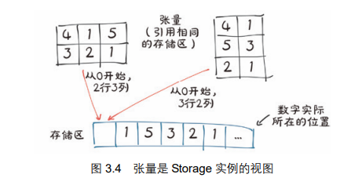

## 3.8张量元数据：大小、偏移量、步长

大小：一个元组，表示张量在每一个维度上有多少个元素
偏移量：存储区当中某个元素相对张量的第一个元素的索引
步长：存储区中为了获得下一个元素所要跳过的元素的数量
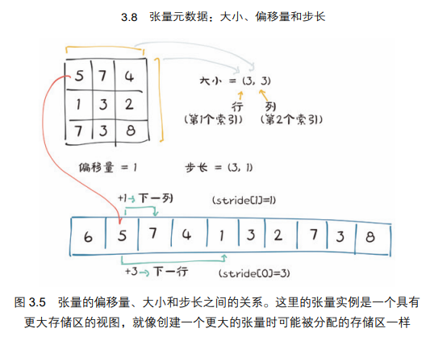

访问一个二维张量中的位置(i,j)的元素会导致访问存储中的第 storage_offset+stride[0]*i+stride[1]*j 个元素。偏移量通常为 0，如果这个张量是为容纳更大的张量而创建的存储视图，那么偏移量可以为正值。
优点：这种张量和存储区之间的间接关系使得一些操作开销并不大，如转置一个张量或者提取一个子张量，因为它们不会导致内存重新分配，而是创建一个新的张量对象，该张量具有不同的大小、偏移量和步长
更改子张量会对原始张量产生影响。

无复制转置，采用.t()方法产生的张量和原来的张量共享一个存储区，只是在形状和步长上有所不同。
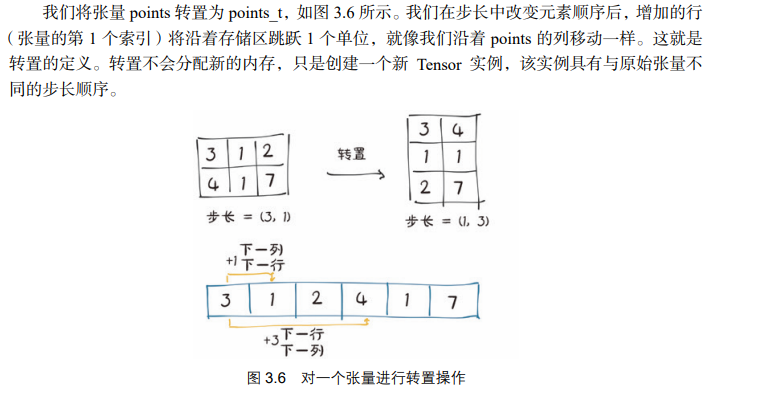

```py
#张量元数据：
points=torch.tensor([[4.0,1.0],[5.0,3.0],[2.0,1.0]])
second_point=points[1]
print(second_point.storage_offset())#张量的存储偏移量
#在一个存储区域中可以存储多个张量，这些张量通过不同的偏移量进行访问。这种共享存储区的方法可以节省内存，并允许更高效地处理和操作张量。
#步长是一个元组，指示当索引在每个维度中增加 1 时在存储区中必须跳过的元素数量
```

高维转置：
PyTorch 中的转置不限于矩阵。我们可以通过指定 2 个维度，即翻转形状和步长，来转置一个多维数组

连续张量：
what:连续张量（Contiguous Tensor）是指存储连续的内存块中的张量。在内存中，连续张量的元素按照一定的顺序依次排列。这种排列方式有助于提高访问和处理张量数据时的效率。

在PyTorch中，张量的内存布局由两个要素决定：存储顺序（stride）和存储偏移量（storage offset）。存储顺序定义了索引增加一个单位时需要跨越的内存块大小，而存储偏移量表示张量在存储中的起始位置与存储的起始位置之间的距离。

通常情况下，通过对张量执行一些操作，例如切片、转置或重新大小等，可能会导致张量的内存不再连续。当一个张量的内存不再连续时，它可能需要额外的计算和内存开销来访问和操作其中的数据。因此，通过调用contiguous()函数可以将一个非连续的张量转化为连续张量，以提高计算效率。

值得注意的是，大多数情况下，PyTorch会自动处理张量的内存连续性，以提高计算效率。但在某些情况下，例如在使用一些特定操作时，可能需要手动调用contiguous()函数来确保张量的连续性。

在 PyTorch 中一些张量操作只对连续张量起作用，如我们在第 4 章中要遇到的 view()方法,PyTorch 将抛出一个提供有用信息的异常，并要求我们显式地调用 contiguous()
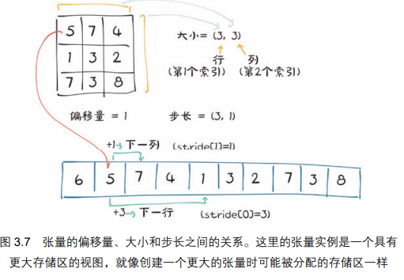

```py

#因为在创建points张量时，元素按照连续的顺序存储在内存中，没有使用任何操作来改变其存储顺序
print(points.is_contiguous())
#当使用.t()方法对points张量进行转置时，它会改变张量中元素的存储顺序，导致存储不再是连续的。
#转置操作通常会导致张量的内存重新布局，因为在转置过程中，原始张量中相邻元素的相对位置发生了改变。
# 这导致了新的张量存储区域的元素不再按照连续的顺序进行排列，从而使转置后的张量不满足连续张量的定义。
print(points.t().is_contiguous())
#使用contiguous()方法会创建一个新的张量，并重新分配一块连续的内存块来存储新的张量数据。
# 这意味着通过contiguous()方法，PyTorch会为新的连续张量分配新的内存块。
#如果原始张量的数据在内存中是连续存储的，contiguous()方法不会产生额外的内存分配，而只是返回原始张量本身。
# 但如果原始张量的数据不是连续存储的，contiguous()方法会为新的连续张量分配一块新的内存空间，并将数据拷贝到新的内存空间中。
#这是因为在非连续张量中，元素在内存中的存储顺序和布局已经发生了改变，无法直接满足连续张量的要求。
# 因此，为了确保新的连续张量可以按顺序存储在内存中，PyTorch会重新分配内存，并将数据复制到新的内存空间中。
print(points.t().contiguous().is_contiguous())#输出：True

#判断是否是同一地址：
#虽然points和points.t()的数据相同，但它们其实是两个不同的对象，它们的内存地址是不同的，因此points is points.t()的结果会是False。
#这是因为转置操作会创建一个新的张量对象，该对象在内存中具有新的存储顺序和存储偏移量。虽然它们共享相同的数据，但它们实际上是不同的张量对象。
#如果你想判断转置后的张量和原始张量是否具有相同的值，并且在内存中具有相同的存储顺序和存储偏移量，可以使用torch.allclose()函数来进行值的比较，而不是使用is运算符进行内存地址的比较。
print("Points 和　Points的转置是否是同一块内存地址",points is points.t())
print("Points.contiguous 和　Points是否是同一块内存地址",points is points.t().contiguous())
```

## 3.9将张量存储到GPU

1，在GPU上创建：points_gpu = torch.tensor([[4.0, 1.0], [5.0, 3.0], [2.0, 1.0]], device='cuda') 
2，使用 to()方法将在 CPU 上创建的张量复制到 GPU 上points_gpu = points.to(device='cuda')这样做将返回一个新的张量，该张量具有相同的数字数据，但存储在 GPU 的 RAM 上，而
不是常规系统的 RAM 上。
3，多个GPU：points_gpu = points.to(device='cuda:0') 
在此基础上，对张量执行的任何操作，例如将所有元素乘一个常数，都将在 GPU 上执行
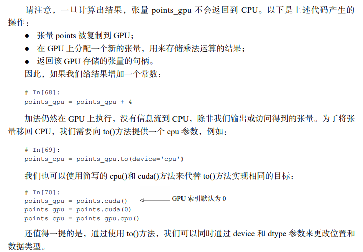

## 3.10numpy互操作性：

PyTorch张量可以非常有效地转换为 NumPy 数组，反之亦然。与 NumPy 数组实现了零拷贝互操作性是因为存储系统使用了 Python 缓冲区协议
从张量当中得到一个numpy数组：

```py
points=torch.ones(3,4)
p_numpy=points.numpy()
print(p_numpy)
```
它将返回一个大小、形状和数字类型都与代码对应的 NumPy 多维数组。有趣的是，返回的数组与张量存储共享相同的底层缓冲区。这意味着，只要数据位于 CPU 上的 RAM 中，就可以有效地执行 numpy()方法，而且基本上不需要任何开销，还意味着修改 NumPy 数组将导致原始张量的变化。如果张量是在 GPU 上存储的，PyTorch 将把张量的内容复制到 CPU 上分配的 NumPy 数组中。反之，我们可以用以下方法从一个 NumPy 数组中获得一个 PyTorch 张量：
points = torch.from_numpy(points_np) 
它将使用我们刚才描述的缓冲区共享策略。

注意 PyTorch 中默认的数字类型是 32 位浮点数，而 NumPy 默认的数据类型是 64 位的。正如在3.5.2 小节中所讨论的，我们通常想要使用 32 位浮点数，因此我们需要确保我们的张量转换后的数据类型是 torch.float。

## 3.11广义张量：

对于大多数应用程序，张量都是多维数组。
PyTorch 将调用正确的运算函数，而不管我们的张量是在 CPU 上还是在 GPU 上。这是通过分派机制（dispatching mechanism）实现的，该机制可以通过将面向用户的 API 连接到恰当的后端函数来满足其他类型张量的需要

## 3.12序列化张量：

通过以下方法可以将张量 points 保存到 ourpoints.t 文件中：
``` py
torch.save(points, '../data/p1ch3/ourpoints.t') 
作为替代方法，我们可以传递一个文件描述符来代替文件名：
# In[58]: 
with open('../data/p1ch3/ourpoints.t','wb') as f: 
 torch.save(points, f) 
加载张量 points 同样可以通过一行代码来实现：
# In[59]: 
points = torch.load('../data/p1ch3/ourpoints.t')
或者通过以下代码：
# In[60]: 
with open('../data/p1ch3/ourpoints.t','rb') as f: 
 points = torch.load(f) 

 如果我们只是想用 PyTorch 加载张量的话，我们可以用这种方法快速地保存张量，但是文件格式本身是不具有互用性的，即我们无法用除 PyTorch 之外的软件读取张量
```