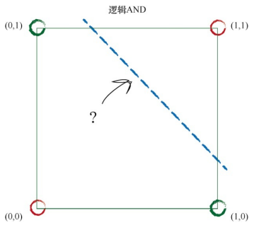

# 预测器&分类器
接受了一个输入，并做出应有的预测，输出结果，所以我们将其称为预测器。根据结果与已知真实示例进行比较所得到的误差，调整内部参数，使预测更加精确。
分类器：调整斜率，使之能正确地分离开来

# 误差值

误差值E为 误差值=（期望目标值-实际输出值）E = (ΔA)x。根据误差值E，我们希望知道需要将A调整多少，才能改进直线的斜 率，得到一台更好的分类器。要做到这一点，我们只要重新调整上一个方 程，将 ΔA算出： ΔA= E / x我们可以使用误 差值E，将所得到的ΔA作为调整分界线斜率A的量。新的A值=ΔA+A旧

# 学习率的引入

why引入：最终改进的直线与最后一次训练样
本非常匹配。实际上，最终改进的直线不会顾及所有先前的训练样本，而是抛弃了所有先前训练样本的学习结果，只是对最近的一个实例进行了学习。
引入目的：有节制地调整
我们采用ΔA 几分之一的一个变化值，而不是采用整个ΔA。添加一个调节系数： ΔA= L（E / x ） 调节系数通常被称为学习率。挑L = 0.5作为一个合理的系数开始学习过程。简单说来，这就意味 着我们只更新原更新值的一半。

# 布尔函数：
线性分类器也可以学习到布尔OR函数

下图所示，我们不能用一条单一的直线将红色区域和蓝色区域划分开来

结论:一个简单的线性分类器无法学习到布尔XOR函数
解决：使用两条直线对不同的区域进行划分。这暗示了一种解决的办法，也就是说，我们可以使用多个分类器一起工作。这是神经网络的核心思想。你可以想象，多条直线可以分离出异常形状的区域，对各个区域进行分类