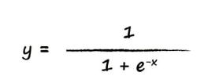
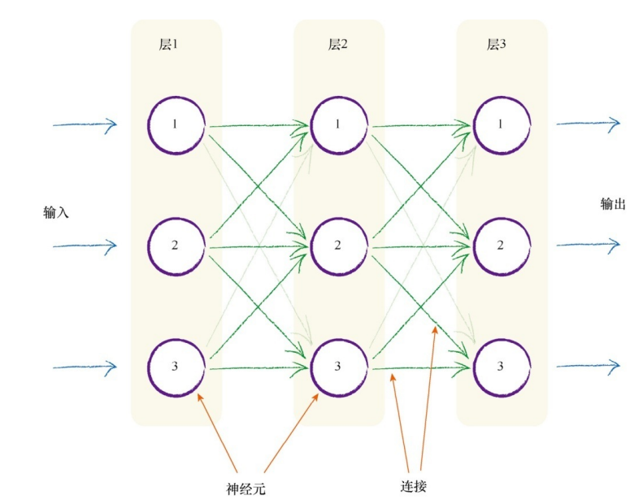
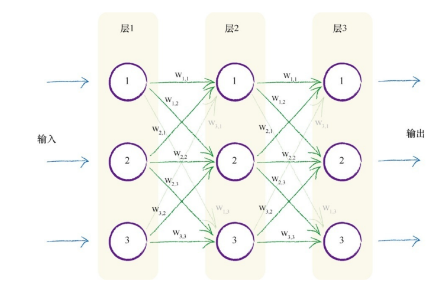
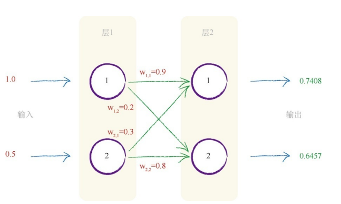
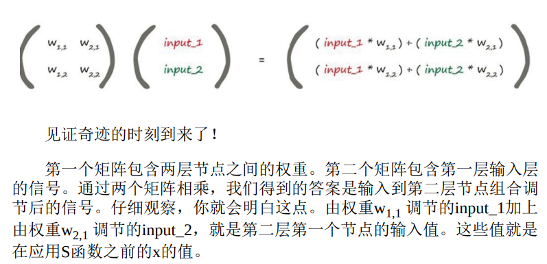
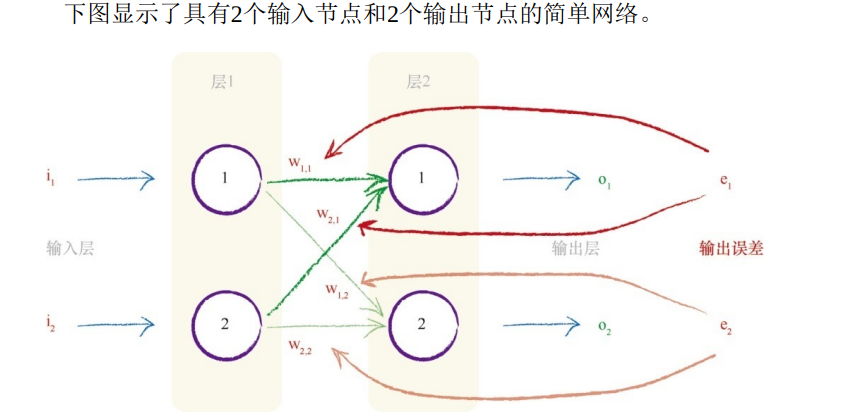

# 激活函数：
引入：神经元不希望传递微小的噪声信号，而只是传递有意识的明显信号。只有输入超过了阈值（threshold），足够接通电路，才会产生输出信号。
## S函数/逻辑函数
S函数：

生物神经元可以接受许多输入，而不仅仅是一个输入。比如布尔逻辑机器有两个输入。
处理输入：我们只需对它们进行相加，得到最终总和，作为S函数的输入，然后输出结果。然后对最终输入总和使用阈值。

如果组合信号不够强大，那么S阈值函数的效果是抑制输出信号。如果总和x 足够大，S函数的效果就是激发神经元

# 神经元

构建多层神经元，每一层中的神经元都与在其前后层的神经元互相连接

问题：针对训练样本，我们应该如何调整做出反应呢？有没有和先前线性分类器中的斜率类似的参数供我们调整呢？
最明显的一点就是调整节点之间的连接强度！
较小的权重将弱化信号，而较大的权重将放大信号。

随着神经网络学习过程的进行，神经网络通过调整优化网络内部的链接权重改进输出，一些权重可能会变为零或接近于零。零或几乎为零的权重意味着这些链接对网络的贡献为零，因为没有传递信号。零权重意味着信号乘以零，结果得到零，因此这个链接实际上是被断开了。

# 神经网络中的信号

权重是神经网络进行学习的内容，这些权重持续进行优化，得到越来越好的结果。
S函数中的x表示一个节点的组合输入。此处组合的是所连接的前一层中的原始输出

# 矩阵

X = W •I  此处，W 是权重矩阵，I 是输入矩阵，X 是组合调节后的信号，即输入到第二层的结果矩阵。对矩阵X 的每个单独元素应用S函数。第二层的最终输出是：O = sigmoid ( X )

下一步，将神经网络的输出值与训练样本中的输出值进行比较，计算出误差。我们需要使用这个误差值来调整神经网络本身，进而改进神经网络的输出值。

# 来自多个节点的误差：
不等分误差，使用权重，将误差从输出向后传播到网络中。我们称这种方法为反向传播
