# 1.12反向传播误差到更多的层当中
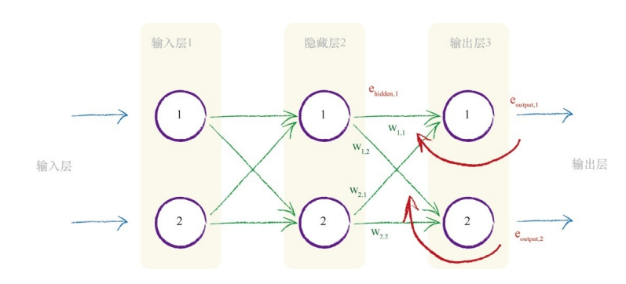
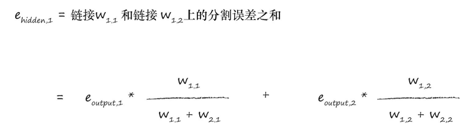
神经网络通过调整链接权重进行学习。这种方法由误差引导，误差就是训练数据所给出正确答案和实际输出之间的差值。
简单地说，在输出节点处的误差等于所需值与实际值之间的差值。
然而，与内部节点相关联的误差并不显而易见。一种方法是按照链路权重的比例来分割输出层的误差，然后在每个内部节点处重组这些误差。

# 1.13使用矩阵乘法进行反向传播误差
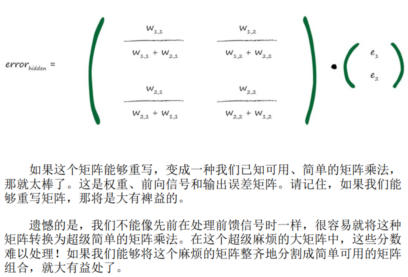
分数的分母是一种归一化因子。如果我们忽略了这个因子，那么我们仅仅失去后馈误差的大小。也就是说，我们使用简单得多的e1* w1,1 来代替e1* w1,1/ ( w1,1 + w2,1)。
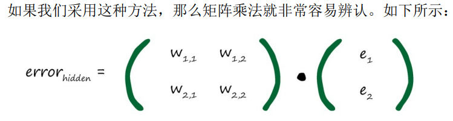

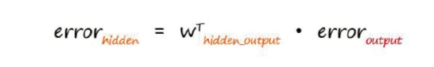
实践证明，将归一化因子切除仍是有效的

# 1.14实际上如何更新权重？
我们使用误差来指导如何调整链接权重，从而改进神经网络输出的总体答案。基本上就是先前所讨论的线性分类器所做的事情。
能够表示所有的权重如何生成神经网络输出的数学表达式过于复杂，难以求解。太多的权重组合，我们难以逐个测试，以找到一种最好的组合。

梯度下降法：
梯度下降法给我们带来一种能力，即我们不必完全理解复杂的函数，从数学上对函数进行求解，就可以找到最小值。如果函数非常困难，我们不能用代数轻松找到最小值，我们就可以使用这个方法来代替代数方法。当然，由于我们采用步进的方式接近答案，一点一点地改进所在的位置，因此这可能无法给出精确解。但是，这比得不到答案要好。总之，我们可以使用更小的步子朝着实际的最小值方向迈进，优化答案，直到我们对于所得到的精度感到满意为止。
如果我们将复杂困难的函数当作网络误差，那么下山找到最小值就意味着最小化误差。
为了避免走到错误的山谷，我们从山上多次训练，选择不同的起始参数（不同的起始连接权重）
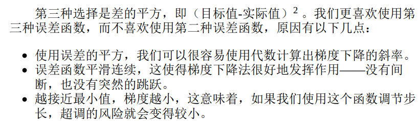
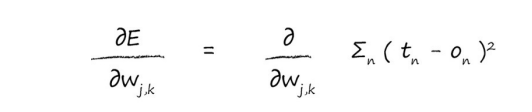
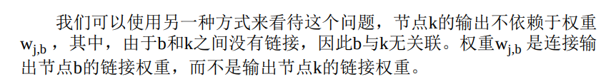
完全删除了令人厌烦的求和运算，这意味着误差函数根本就不需要对所有输出节点求和。原因是节点的输出只取决于所连接的链接，就是取决于链接权重。
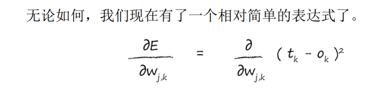
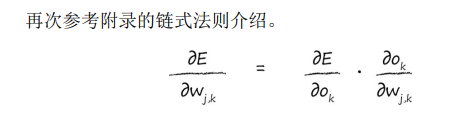
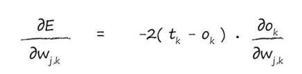
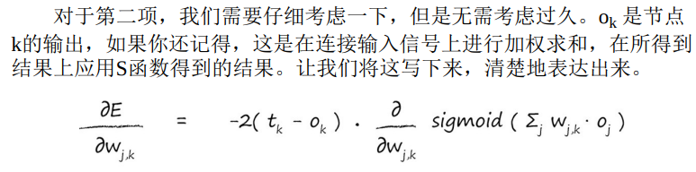
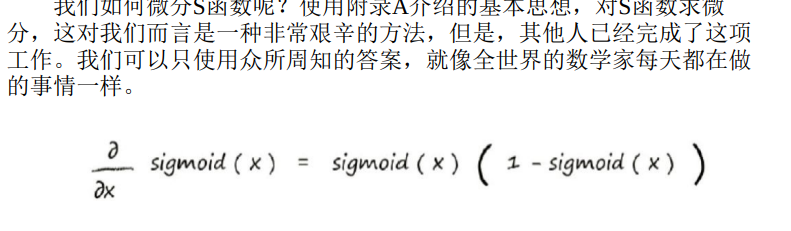
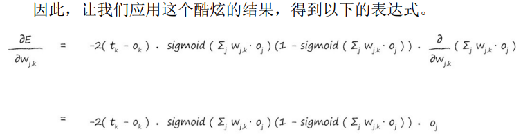
把在前面的2 去掉。我们只对误差函数的斜率方向感兴趣，这样我们就可以使用梯度下降的方法，因此可以去掉2。
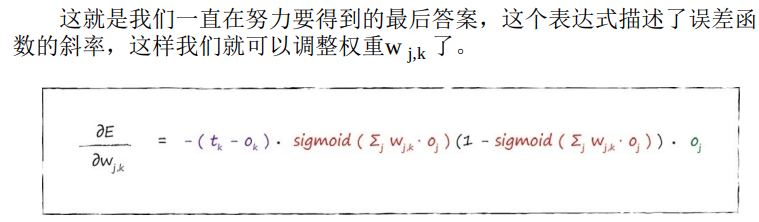
为输入层和隐藏层之间的权重找到类似的误差斜率：
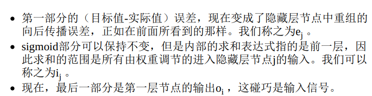
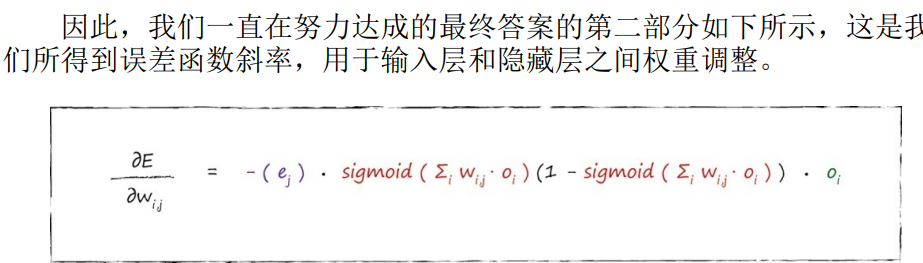
学习因子：
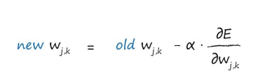
如果斜率为正，我们希望减小权重，如果斜率为负，我们希望增加权重，因此，我们要对斜率取反。符号α是一个因子，这个因子可以调节这些变化的强度，确保不会超调。我们通常称这个因子为学习率。
写成矩阵的样子：
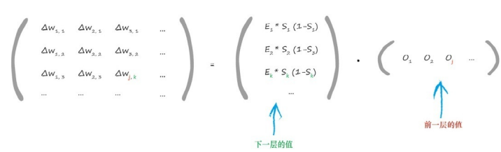
（由于学习率只是一个常数，并没有真正改变如何组织矩阵乘法，因此我们省略了学习率α）
权重改变矩阵中包含的值，这些值可以调整链接权重wj，k ，这个权重链接了当前层节点j与下一层节点k。你可以发现，表达式中的第一项使用下一层（节点k）的值，最后一项使用前一层（节点j）的值。

仔细观察上图，你就会发现，表达式的最后一部分，也就是单行的水平矩阵，是前一层oj 的输出的转置。
权重更新矩阵的形式：
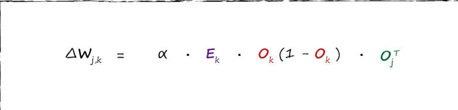

# 1.16准备数据
权重的改变取决于激活函数的梯度。小梯度意味着限制神经网络学习的能力。这就是所谓的饱和神经网络。这意味着，我们应该尽量保持小的输入。
这个表达式也取决于输入信号（oj ），因此，我们也不应该让输入信号太小。当计算机处理非常小或非常大的数字时，可能会丧失精度，因此，使用非常小的值也会出现问题。
## 总结&建议：
输入值保持在0.0~1.0，输入0会导致oj为0，所以我们会加上一点点便宜，如0.01
输出值：常见的使用范围为0.0～1.0，但是由于0.0和1.0这两个数也不可能是目标值，并且有驱动产生过大的权重的风险，因此一些人也使用0.01～0.99的范围。（S函数在0-1，如果输出值很大的话，那么在训练的过程当中，权重值会变得很大）
权重：
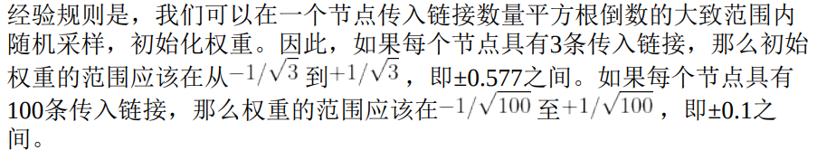
TIP：禁止将初始权重设定为相同的恒定值，特别是禁止将初始权重设定为0。如果这样做，那么在网络中的每个节点都将接收到相同的信号值，每个输出节点的输出值也是相同的，在这种情况下，如果我们在网络中通过反向传播误差更新权重，误差必定得到平分。

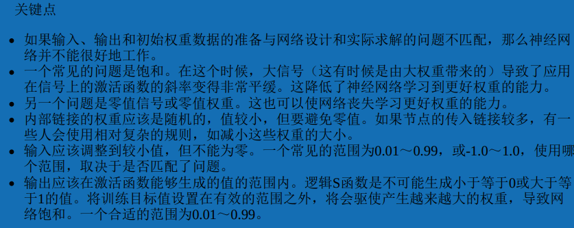

