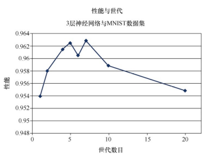
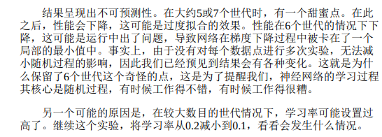
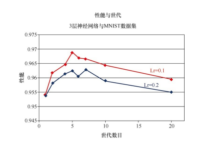

# 改进神经网络

## 学习率

我们发现，学习率改大或者改小都会对性能产生负面的影响
大：大的学习率导致了在梯度下降过程中有一些来回跳动和超调。
小：使用的步长太小了，因此对性能造成了损害，这个结果也是有道理的。
存在一个甜蜜点

## 多次运行

对同一份的学习样本进行多次训练
原因：通过提供更多爬下斜坡的机会，有助于在梯度下降过程中进行权重更新
BUT：太多的训练实际上会过犹不及，这是由于网络过度拟合训练数据，因此网络在先前没有见到过的新数据上表现不佳。不仅是神经网络，在各种类型的机器学习中，这种过度拟合也是需要注意的。

小结论：在更多世代的情况下，减小学习率确实能够得到更好的性能
直观上，如果你打算使用更长的时间（多个世代）探索梯度下降，那么你可以承受采用较短的步长（学习率），并且在总体上可以找到更好的路径，这是有道理的。
可以为每个学习率和世代组合来进行多次实验，以减小在梯度下降过程当中随机性的影响

## 改变网络形状

### 改变中间隐藏层节点的数目

隐藏层节点前后的链接权重具有学习能力
节点太少：不够足够的空间让网络学习知识
节点太多：有太多的路径可以去学习知识，难以训练，需要的世代可能和很多