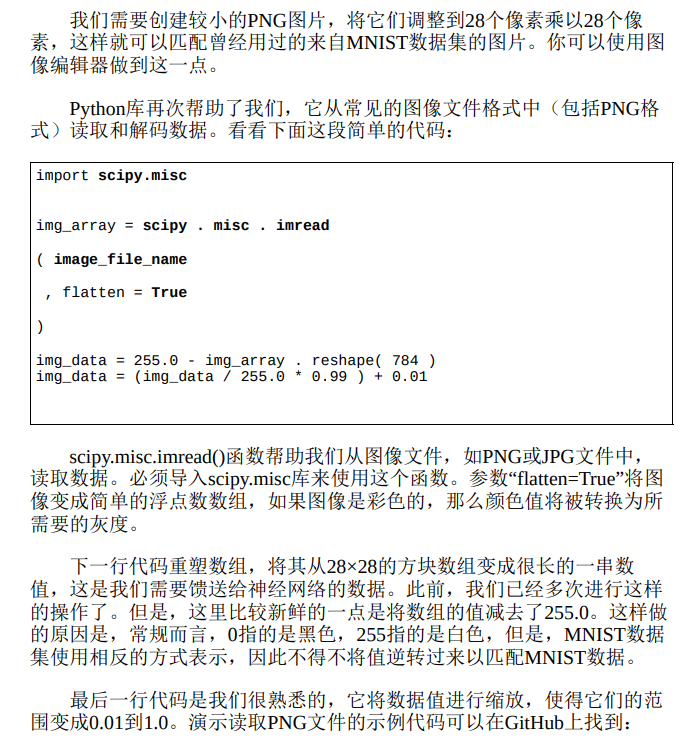
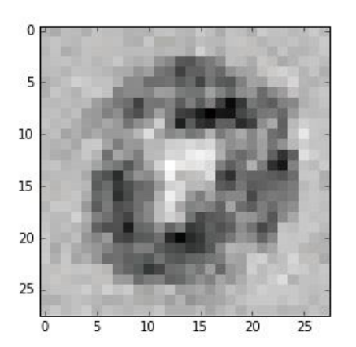
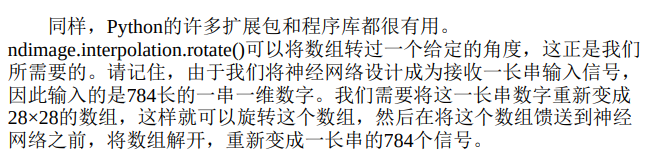

# 1手写数字如何可以被测试



噪声的干扰：神经网络将它们所学到的知识分布在几条链接权重上，也就是说，如果若干链接权重遭受了一定损害，神经网络也可以表现得相当好。这同时意味着，如果输入图像被损坏或不完整，神经网络也可以表现得相当好。

# 向后查询：
在通常情况下，我们馈送给已受训练的神经网络一个问题，神经网络弹出一个答案。在我们的例子中，这个问题是人类的手写数字图像。
如果馈送一个标签到输出节点，通过已受训练的网络反向输入信号，直到输入节点弹出一个图像，那会怎么样？
y=f(x)是激活函数，那么这个函数的逆就是：x=g(y)
我们可以求得：x = ln [ y / (1-y ) ]
Python中的scipy.special库也提供了这个函数，即scipy.special.logit()。

对网络使用标签"0":
向后输出：

深色区域是问题图像中应该使用笔来标记的部分，这部分图像组成了支持证据，证明答案为“0”，可以这样理解，这些部分看起来组成了0的形状轮廓。

浅色区域是问题图像中应该没有任何笔痕的部分，这支持了答案为“0”。同样，可以这样理解，这些部分形成了0形状的中间部分。

大体上，神经网络对灰色区域不是很敏感。

# 旋转图像：
是利用已有的样本，通过顺时针或逆时针旋转它们，比如说旋转10度，创建新的样本。对于每一个训练样本而言，我们能够生成两个额外的样本。
代码实现：

```py
 create rotated variations
# rotated anticlockwise by 10 degrees
inputs_plus10_img =
scipy.ndimage.interpolation.rotate( scaled_input.reshape(28,28), 10,cval=0.01,reshape=False)
# rotated clockwise by 10 degrees
inputs_minus10_img =scipy.ndimage.interpolation.rotate( scaled_input.reshape(28,28), -10,cval=0.01, reshape=False)
```


结果我们发现：准确率提升了！
BUT：如果旋转的角度过大，神经网络的性能会出现下降。由于旋转较大的角度意味着创建了实际上不能代表数字的图像