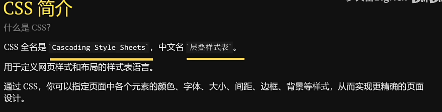
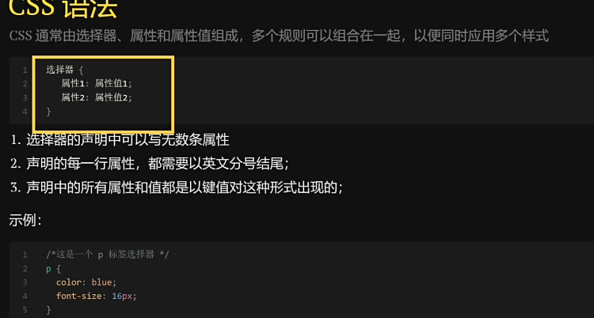
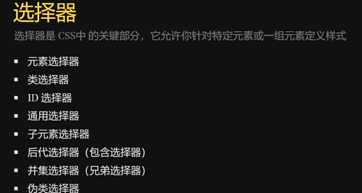
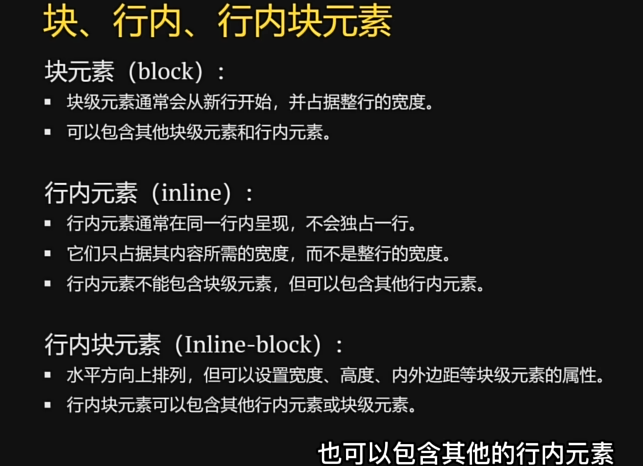
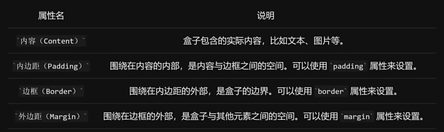
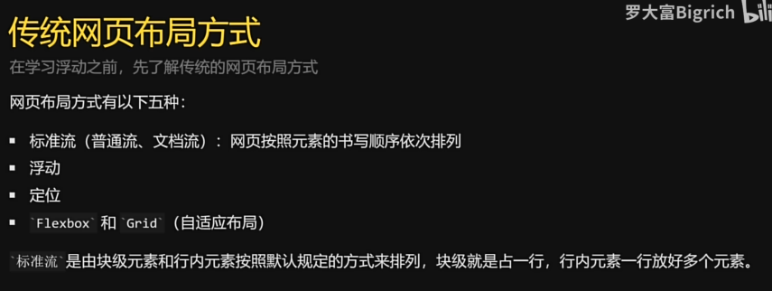
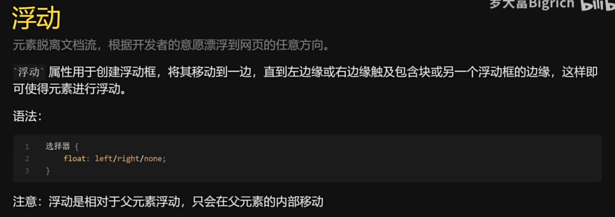
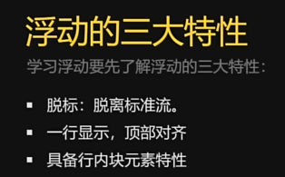
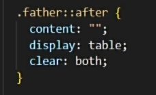
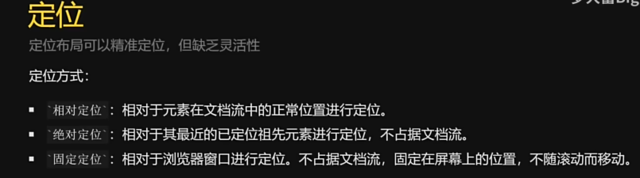

# CSS基础

优先级：内联样式>内部样式表>外部样式表

# 选择器

子元素选择器：选择位于父元素内部的子元素(嵌套)
后代选择器

# 属性
复合属性：一个属性设置多个样式（比如font)

块元素，行内元素转化成行内块元素，用display属性

# 盒子模型：
padding内边距
border文本边框
margin外边距

# 浮动：

浮动和行内块区别：浮动之间没有空隙，多的盒子会被安排在下一行
相对于父元素进行浮动

注意给父元素设置高度，否则容易发生坍塌
清楚浮动：
1，在父元素添加overflow:height
2，伪元素清除法：

# 定位

相对定位（微调
position: relative;//变成相对定位
绝对定位：根据最近的父级元素进行定位
固定定位：和绝对定位用于创建更复杂的布局