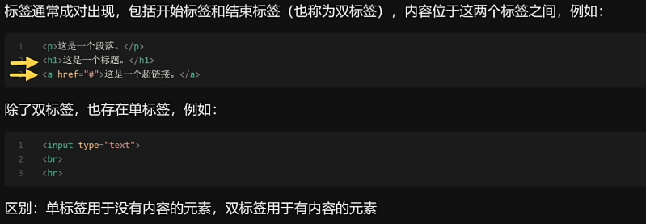
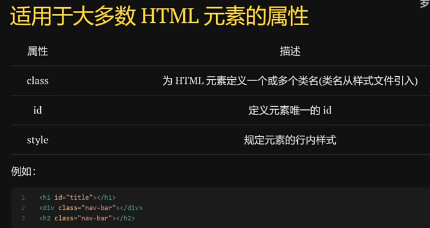
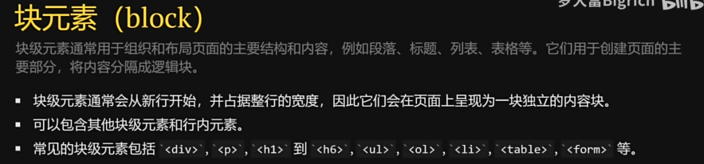
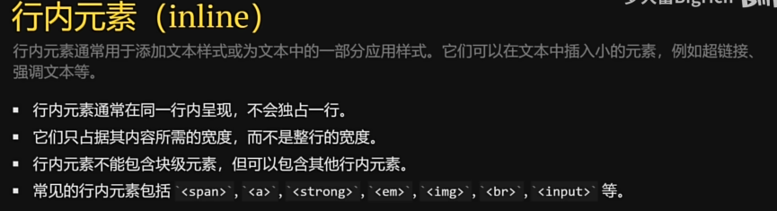

# Part1
单标签：没有内容的元素
双标签：有内容的元素

# part2：常用文本标签
## 文本标签
标题标签：h1到h2
段落标签：
:普通的文本标签
字体加粗：<b>加粗的文本标签
斜体：i
下划线u
删除线s

## 列表
无序列表ul，里面有li标签
有序列表ol
## 表格
表格标签table：加边框：border
行标签：tr
表格标题th
表格数据td

# 标签属性
名称不区分大小写，属性值大小写敏感

## 超链接a 
herf:链接的地址，邮箱，手机号等
target：定义打开方式 blank：新的窗口，self：当前窗口……
br：换行
hr：水平分割线
## 图片img
src路径
alt：无法加载时出现的东西
图片宽高width,height

# 区块元素
## 分块
块元素：

行内元素：

## div标签：
创建块级容器，便于组织页面的结构和布局
分割区块，一个div标签下面可以有无数个div标签和其他元素
## span标签：
用于内联样式化文本
将文本包装起来，以便于使用样式，CSS，JS

# 表单
form：容器
action：提交到什么地方（后端的API）
## input:
### 属性：
type类型，placeholder：默认底下的内容，value：自动填写的内容
lable：和input对应使用
radio：勾选框，单选：name属性一致
password：密码（暗文属性）
checkbox：多选
submit：提交的按钮