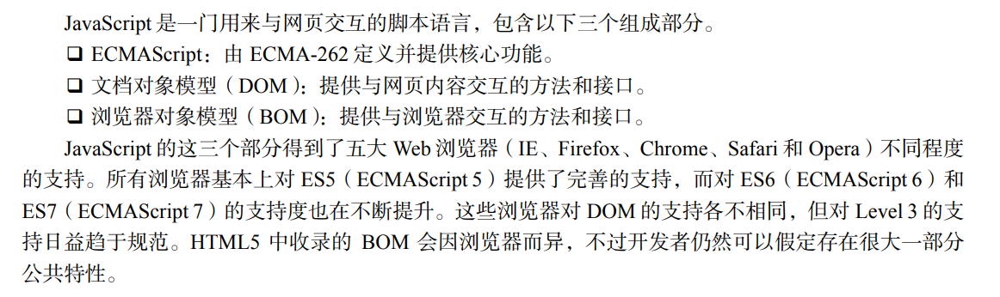
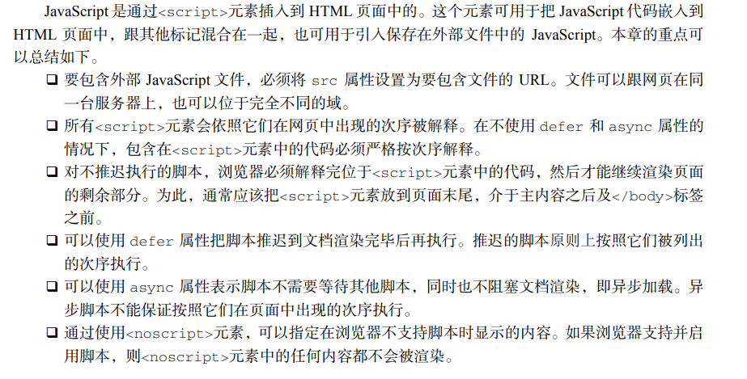

# 1.JavaScript介绍：

# 2.script
包含在<script>内的代码会被从上到下解释。在上面的例子中，被解释的是一个函数定义，并且
该函数会被保存在解释器环境中。在<script>元素中的代码被计算完成之前，页面的其余内容不会被
加载，也不会被显示。
在使用行内 JavaScript 代码时，要注意代码中不能出现字符串</script>
## 脚本推迟执行
在<script>元素上设置 defer 属性，相当于告诉浏览器立即下载，但延迟执行。
```html
<script defer src="example1.js"></script>
```
给脚本添加 async 属性的目的是告诉浏览器，不必等脚本下载和执行完后再加载页面，同样也不必等到该异步脚本下载和执行后再加载其他脚本。正因为如此，异步脚本不应该在加载期间修改 DOM。
```html
<script async src="example1.js"></script> 
 <script async src="example2.js"></script>
 ```第二个脚本可能会比第一个要优先执行
 