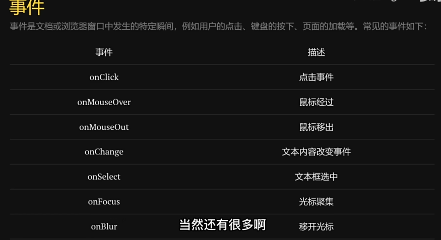
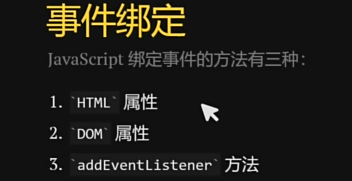
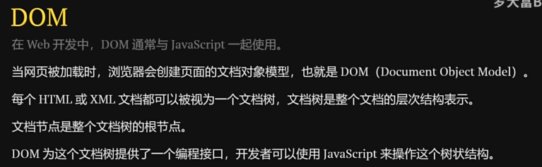
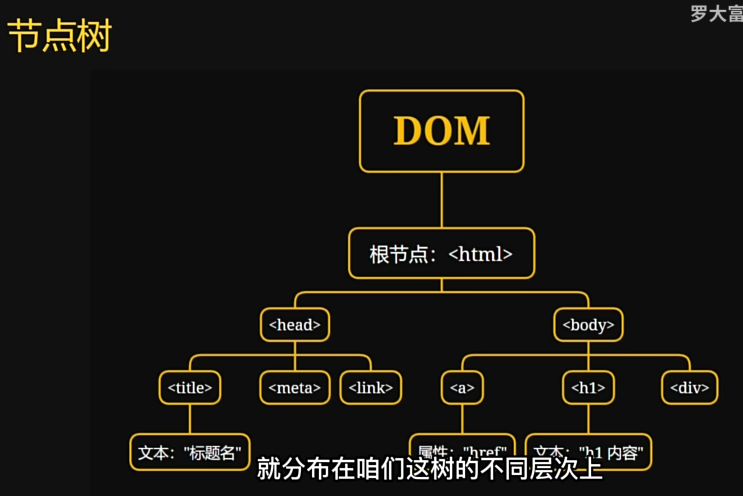
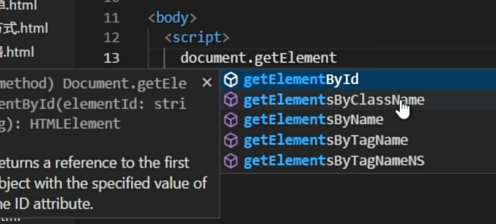
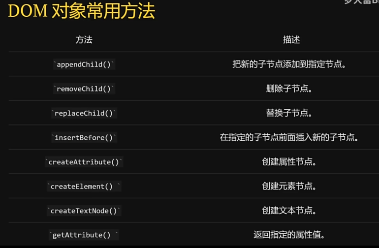

# 1.JavaScript介绍：

# 2.script
包含在<script>内的代码会被从上到下解释。在上面的例子中，被解释的是一个函数定义，并且
该函数会被保存在解释器环境中。在<script>元素中的代码被计算完成之前，页面的其余内容不会被
加载，也不会被显示。
在使用行内 JavaScript 代码时，要注意代码中不能出现字符串</script>
## 脚本推迟执行
在<script>元素上设置 defer 属性，相当于告诉浏览器立即下载，但延迟执行。
```html
<script defer src="example1.js"></script>
```
给脚本添加 async 属性的目的是告诉浏览器，不必等脚本下载和执行完后再加载页面，同样也不必等到该异步脚本下载和执行后再加载其他脚本。正因为如此，异步脚本不应该在加载期间修改 DOM。
```html
<script async src="example1.js"></script> 
 <script async src="example2.js"></script>
 ```
第二个脚本可能会比第一个要优先执行


# 事件



# DOM

js与html进行动态的交互，动态地改变文档的样式和内容

ID 一般都是唯一的，其他容易获得数组


修改内容：
节点.innerHTML="";//这里是可以理解语义的，可以置换城HTML语言
节点.innerText="";//会忽略掉HTML标记
也可以修改属性
```html
    <script>
        var a = document.getElementById("box1");

        /*这两个方法得到的都是数组，要用索引获取指定的值*/
        var b = document.getElementsByClassName("box2");
        var c = document.getElementsByTagName("div");

        console.log(a);
        console.log(b[0]);
        console.log(c[5]);

        a.innerHTML = '<a href="#">可以改成超链接吗？</a>';
        b[0].innerText = '<a href="#">可以改成超链接吗？</a>';

        a.style.color = 'red';
        a.style.fontSize = '20px';

        //DOM触发事件
        var button_ele = document.getElementById('but1');
        button_ele.onclick = function () {
            alert("DOM属性触发啦");
        }
        //addeventlistener触发事件
        button_ele.addEventListener('click', function () {
            alert("通过addeventlistener触发事件");
        })
    </script>
```
DOM 对象其他方法：
