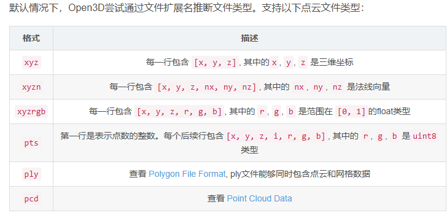
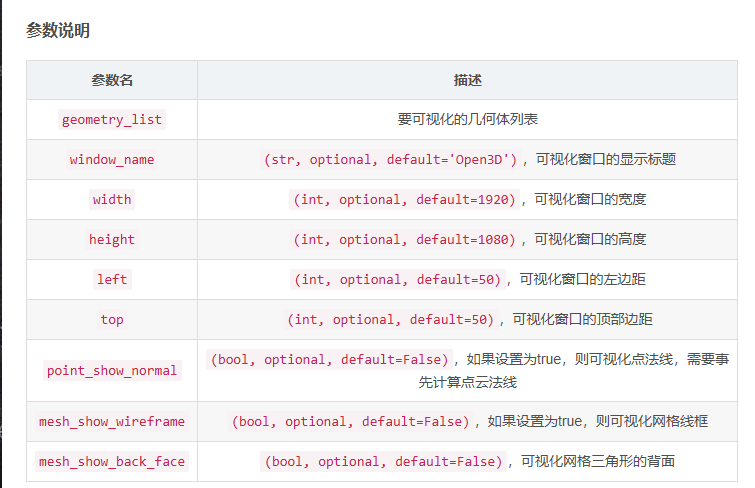
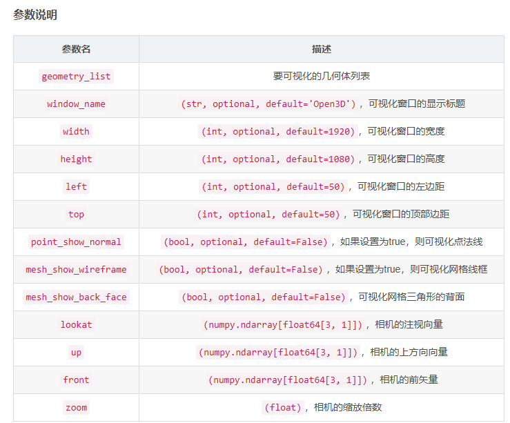
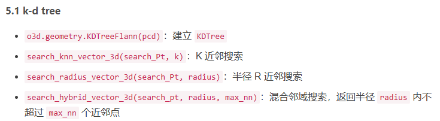
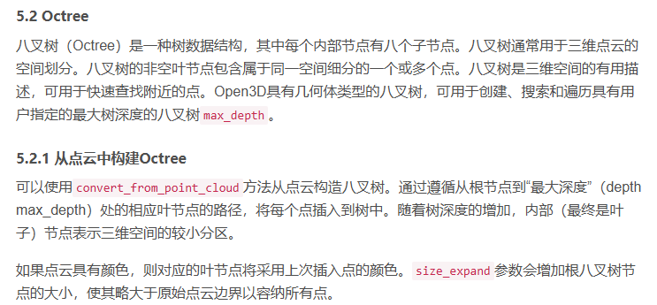
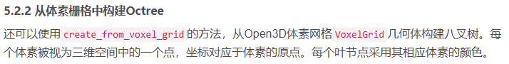
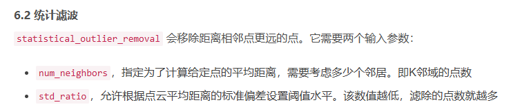
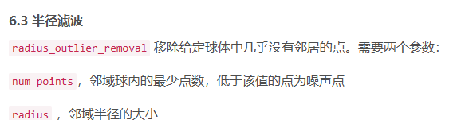
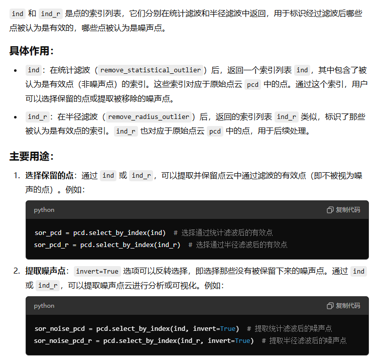

# 文件操作：
```py
import open3d as od
import numpy as np

print("正在加载点云")
pcd=od.io.read_point_cloud("test.pcd")
print(pcd)

print("正在保存点云")
od.io.write_point_cloud("write.pcd",pcd,write_ascii=True)# 默认False，保存为二进制，True保存为ASCLL形式
print(pcd)

```


# 可视化点云：
```py
od.visualization.draw_geometries([pcd])
```
函数原型1
```py
draw_geometries(geometry_list, window_name='Open3D', width=1920, height=1080, left=50, top=50, point_show_normal=False, mesh_show_wireframe=False, mesh_show_back_face=False)
```

函数原型2：
```py
draw_geometries(geometry_list, window_name='Open3D', width=1920, height=1080, left=50, top=50, point_show_normal=False, mesh_show_wireframe=False, mesh_show_back_face=False, lookat, up, front, zoom)
```


# 法线估计
是点云处理中的一个关键步骤，尤其是在表面重建、配准和特征提取中。
```py
radius = 0.01   # 搜索半径 定义了点云中每个点的邻域搜索半径。也就是说，Open3D 将在每个点周围的 0.01 单位范围内寻找最近的点。这个半径值决定了用于估计法线的邻域大小。较小的半径适合细致的局部结构，较大的半径适合全局的平滑结构。
max_nn = 30     # 定义了在搜索邻域内用于估算法线的最大点数。即在半径为 0.01 的范围内，最多使用 30 个最近邻点来估计法线。
# 这个参数有助于避免在非常稠密的点云中搜索到过多的邻居点，限制计算复杂度
pcd.estimate_normals(search_param=o3d.geometry.KDTreeSearchParamHybrid(radius, max_nn))
```
# k-d 树（KD-Tree）
## 定义
k-d 树（k-dimensional tree）是一种用于高维空间中的点查找的数据结构，特别适合处理多维数据（例如 3D 空间中的点云）。k-d 树通过递归地将数据划分为较小的区域来加速最近邻查找。
##　特点
k-d 树是二叉树的一种扩展，每个节点代表一个 k 维空间中的数据点。
通过 k-d 树，可以高效地执行最近邻搜索和范围搜索。
在三维空间中，k-d 树经常用于点云处理，用于快速找到某个点周围的邻近点。
## 关键操作
构建 k-d 树：根据点云数据递归地将空间划分为不同的子空间，生成一棵平衡树。
搜索最近邻：通过树结构加速查找某个点的邻居，而不是暴力计算所有点之间的距离。
## 优点
相比于暴力最近邻搜索（逐一计算距离），k-d 树能显著提高查询速度，特别是在大规模点云数据中。


```py

import open3d as od
import numpy as np

print("正在加载点云")
pcd=od.io.read_point_cloud("test.pcd")
print(pcd)

# 点云设置成灰色：
pcd.paint_uniform_color([0.5,0.5,0.5])

# 建立KDTree
pcd_tree=od.geometry.KDTreeFlann(pcd)
# 讲第1500个点设置成紫色
pcd.colors[1500]=[0.5,0.5,0.5]

# 使用K临近算法，将最近的3000个点设置成蓝色
k=5000
[num_k,idx_k,_]=pcd_tree.search_knn_vector_3d(pcd.points[1500],k)#返回邻域
'''
返回的结果有三个部分：

num_k：找到的最近邻点的个数，实际的邻居点数（一般是 k，如果数据中不足 k 个点，则返回找到的实际点数）。
idx_k：最近邻点的索引数组，表示这些邻居点在点云中的位置索引。
_：这个值是距离数组（距离中心点的距离），但在这段代码中没有被使用，所以用下划线 (_) 忽略。
'''

np.asarray(pcd.colors)[idx_k[1:],:]=[0,0,1]# 跳过最邻近点（查询点本身）进行赋色
'''
np.asarray(pcd.colors)：将点云的颜色数据 pcd.colors 转换为 NumPy 数组。
idx_k[1:]：由于 idx_k 返回的最近邻点索引数组的第一个值是中心点本身的索引，idx_k[1:] 表示除去中心点的邻居点的索引。[1:] 是一个切片操作，跳过数组中的第一个元素。
np.asarray(pcd.colors)[idx_k[1:], :]：选取这些邻居点对应的颜色行，: 表示选择所有的颜色通道（R、G、B）。
= [0, 0, 1]：将选定的邻居点的颜色设置为 [0, 0, 1]，即蓝色。
'''

# 使用R邻近，指定半径点设置红色
r=0.02
[num_r,idx_r,_]=pcd_tree.search_radius_vector_3d(pcd.points[1500],r)
np.asarray(pcd.colors)[idx_r[1:],:]=[1,0,0]# 跳过最邻近点（查询点本身）进行赋色

# 使用混合邻域，R范围内不超过Max_num个点设置成绿色
max_point=200
[num_hybird,idx_hybird,_]=pcd_tree.search_hybrid_vector_3d(pcd.points[1500],r,max_point)
np.asarray(pcd.colors)[idx_hybird[1:],:]=[0,1,0]# 跳过最邻近点（查询点本身）进行赋色

od.visualization.draw_geometries([pcd])
```

# Octree
## 定义
八叉树（Octree）是三维空间中的一种分层数据结构，用于将空间递归地划分为八个子立方体。每个内部节点代表一个立方体，每个立方体可以继续划分，直到满足某种条件为止（例如立方体内的点数足够少）。

## 特点
八叉树特别适合三维空间的点云处理，它将空间分成大小递减的立方体（"八叉" 的来源）。
常用于三维场景的分层表示、碰撞检测和体积渲染。
自适应细化：在数据密集的地方可以有更高的分辨率，而数据稀疏的地方可以有较低的分辨率。
动态分辨率：根据需要进行递归划分，节点可以是空的（叶节点）。
空间效率较高：适合稀疏点云或具有非均匀分布的点云。

## 优点
八叉树比 k-d 树在处理稀疏点云时更为高效，因为它能更好地适应不均匀分布的数据。
通过逐步细化空间，能够有效减少计算复杂度。
## 应用
在 3D 点云处理时，八叉树用于构建多分辨率的点云表示，便于快速查询和渲染大规模数据。
Octree 更适合于处理稀疏的点云数据、需要动态分辨率的应用场景，如空间查询、点云压缩和可视化。Octree 可以在复杂结构上进行高效的存储和查找操作，特别是当数据分布不均匀时。

从点云当中构造：

```py
octree=od.geometry.Octree(max_depth=4)#具有最大深度的八叉树max_depth,最大深度决定了树的细分程度。深度越大，树的分辨率越高。
octree.convert_from_point_cloud(pcd,size_expand=0.01)# size_expand=0.01：这是一个扩展参数，用于在点云数据的边界外扩展额外的空间。
# 这样做可以确保点云数据在转换为八叉树时不会因边界问题而遗漏一些重要信息。
```
从体素栅格当中构造Octree

```py
voxel_grid=od.geometry.VoxelGrid.create_from_point_cloud(pcd,voxel_size=0.2)
print("体素",voxel_grid)
print("可视化")
od.visualization.draw_geometries([voxel_grid])

#OCtree分割
octree=od.geometry.Octree(max_depth=4)
octree.create_from_voxel_grid(voxel_grid)
od.visualization.draw_geometries([octree])
```
## 体素栅格：
体素栅格（Voxel Grid）是一种三维空间的离散化表示方法。它将空间划分为一系列具有固定大小的小立方体单元（称为体素，voxel），每个体素可以存储一些数据，比如颜色、密度、或在点云处理中的点的数量。体素栅格用于对复杂的三维空间进行简化或下采样，从而加速计算和减少内存使用


# 点云滤波：
点云滤波（Point Cloud Filtering）是处理三维点云数据时的重要步骤，目的是去除噪声、减少冗余数据或增强特定特征，从而提高数据的质量和计算效率。点云滤波主要通过对点的几何位置或属性进行处理，来减少数据的复杂度或排除不需要的点。

## 1. 为什么需要点云滤波？
点云数据通常来源于激光雷达（LiDAR）、结构光扫描、立体视觉或其他传感器，这些传感器在获取三维信息时不可避免地会引入噪声、重复点、遮挡效应等问题。因此，滤波的主要目的包括：

去噪：去除不准确的点或传感器噪声。
下采样：减少点云数据的密度，降低计算复杂度。
突出特征：保留重要的几何或结构特征。
平滑：对点云数据进行平滑处理，使其更符合真实的几何结构。
## 2. 常见的点云滤波方法
### 2.1 体素栅格滤波（Voxel Grid Filter）
原理：体素栅格滤波是将点云空间划分为均匀的立方体单元（称为体素，Voxel），并用每个体素的代表点（通常是体素内点的质心）来替代该体素内的所有点。
优点：显著减少点云中的点数，从而降低数据复杂度和处理时间。
缺点：可能丢失一些细节信息，尤其是在高分辨率的点云中。
应用：适用于需要快速处理的大规模点云数据，如环境扫描、SLAM（同步定位与建图）等。

```py
# 体素栅格下采样:
voxel_size=0.005 # voxel_size 是设置的体素大小。这个参数定义了每个体素单元（voxel）的边长，也就是空间中每个立方体体素的尺寸。
downpcd = pcd.voxel_down_sample(voxel_size)
o.visualization.draw_geometries([downpcd])
```
### .2 统计滤波（Statistical Outlier Removal）
原理：统计滤波基于点云中每个点的邻居点数量来识别并移除离群点。它计算每个点与其最近邻居的平均距离，并将平均距离远大于其他点的点视为噪声。
优点：有效去除孤立的噪声点。
缺点：可能导致局部稀疏区域的有效点被误删。
应用：适用于去除点云中的随机噪声，如由传感器引入的离群点或错误点。

```py
# 统计滤波
num_neighbors=20#邻域点的个数
std_ratio=2.0#标准差乘数 表示滤波时的标准差乘数。统计滤波会计算每个点到其邻域的平均距离，并计算这些距离的标准差。
# 如果某个点的距离超过平均距离加上 std_ratio 倍的标准差，那么该点会被认为是噪声点。


#执行统计滤波，返回滤波后的点云sor_ocd和对应的索引ind_
sor_pcd,ind=pcd.remove_statistical_outlier(num_neighbors, std_ratio)
sor_pcd.paint_uniform_color([0, 0, 1])

#提取噪声点云：
sor_noise_pcd=pcd.select_by_index(ind,invert=True)# 通过 select_by_index 方法提取噪声点云。invert=True 表示选择没有被保留下来的噪声点。
sor_noise_pcd.paint_uniform_color([1, 0, 0])

o.visualization.draw_geometries([sor_pcd,sor_noise_pcd],window_name="统计滤波")
```

### 2.3 半径滤波（Radius Outlier Removal）
原理：对于每个点，半径滤波计算在给定的半径范围内有多少个邻居点。如果邻居点的数量少于某个阈值，则该点被认为是离群点并移除。
优点：通过控制邻居的距离，可以移除稀疏的噪声点。
缺点：需要手动调整半径大小，且计算量较大。
应用：适用于点云较稀疏或分布不均匀的情况。

```py
# 半径滤波：
num_points=20# 邻域球内的最少点数，低于这个值的为噪声点 半径滤波时，球内至少要有 20 个邻域点。如果少于这个数量，则认为该点是噪声点。
radius=0.05# 邻域半径大小 邻域球的半径为 0.05。如果在这个球内的点数小于 num_points，该点被视为噪声。

#执行半径滤波
sor_pcd_r,ind_r=pcd.remove_radius_outlier(num_points, radius)
sor_pcd_r.paint_uniform_color([0, 0, 1])

#　提取噪声点云：
sor_noise_pcd_r=pcd.select_by_index(ind_r,invert=True)
sor_noise_pcd_r.paint_uniform_color([1, 0, 0])

o.visualization.draw_geometries([sor_pcd_r,sor_noise_pcd_r],window_name="半径滤波")
```




### 2.4 均值平滑滤波（Moving Least Squares, MLS）
原理：均值平滑滤波通过在局部区域内进行拟合，来平滑点云的表面。通常是通过拟合局部平面或曲面来估计每个点的新位置，从而使点云更加连续和平滑。
优点：可以消除噪声并保持表面几何特征。
缺点：计算量较大，容易过度平滑丢失细节。
应用：适用于对点云进行细致处理，特别是在逆向工程或精确建模时。
### 2.5 高斯滤波（Gaussian Filter）
原理：高斯滤波是一种加权平均滤波方法，依据点云中每个点的邻居点位置，使用高斯分布权重来调整点的位置。邻居越近，权重越高，最终更新每个点的位置。
优点：能够平滑点云中的噪声，同时保留局部几何特征。
缺点：如果参数设置不当，可能导致平滑过度。
应用：主要用于去除噪声和点云平滑处理。
### 2.6 滤波的结合使用
在实际应用中，往往会结合多种滤波方法来处理点云。例如，先使用统计滤波去除离群点，再使用体素栅格滤波对点云进行下采样，最后使用平滑滤波进一步提高表面质量。

## 3. 点云滤波的应用场景
SLAM 和自动驾驶：在SLAM或自动驾驶系统中，需要对实时获取的环境点云数据进行处理，以确保导航和障碍物检测的可靠性。滤波可以去除噪声和冗余点，并增强环境模型的准确性。
逆向工程：点云滤波有助于从复杂的点云数据中提取产品或建筑物的几何形状，从而生成CAD模型。平滑和去噪可以改善模型的质量。
3D 重建和建模：对于从点云生成三维模型的过程，滤波可以去除噪声点、减少冗余点和平滑曲面，从而生成更加逼真的模型。
虚拟现实和游戏：在虚拟环境或游戏中，滤波可以帮助快速处理大规模的点云数据，以提高实时渲染性能。
## 4. 滤波的挑战
参数选择：滤波的效果强烈依赖于滤波器的参数，如邻居数、半径或体素大小。选择不当的参数可能导致有效信息的丢失或噪声残留。
计算复杂度：一些复杂的滤波方法，如 MLS 或高斯滤波，计算量较大，可能不适合实时应用。
特征保留：在滤波过程中，过度平滑或下采样可能导致几何特征的丢失，如何在去噪与保留细节之间找到平衡是个挑战。
## 总结
点云滤波是点云数据处理中的一个关键步骤，它能够去除噪声、减少冗余并增强几何特征。根据应用的不同场景，有多种滤波方法可供选择，包括体素栅格滤波、统计滤波、平滑滤波等。选择合适的滤波方法和参数对最终结果的质量至关重要。