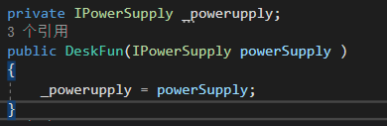

# 一些以前学C#（可能是关于面对对象的）疑问：

## 1，为什么要有“事件”这一概念，当某个条件触发的时候，直接调用某个函数不就能实现了吗？

## 2，关于接口的用法？

1，这个构造函数是表示一个能接受一个实现了IPowerSupply接口的对象？是里氏转化（LSP）的原理吗？


2，这断代码的意思是接受一个实现了接口的对象吗？


3，为什么要这么写？
```cs
using System;
s
namespace _8._21接口_依赖反转
{
    class Program
    {
        static void Main(string[] args)
        {
            PowerSupply powerSupply = new PowerSupply();
            DeskFun deskFun = new DeskFun(powerSupply);
            Console.WriteLine(deskFun.Work());
            Console.ReadKey();
        }
    }
   public interface IPowerSupply
    {
        int GetPower();
    }
   public class PowerSupply:IPowerSupply
    {
        public int GetPower()
        {
            return 110;
        }
    }
   public class DeskFun
    {
        private IPowerSupply _powerupply;
        public DeskFun(IPowerSupply powerSupply )
        {
            _powerupply = powerSupply;
        }
        public string Work()
        {
            int power = _powerupply.GetPower();
            if (power <= 0)
            {
                return "Can not work";
            }
            else if (power < 100)
            {
                return "Slow";
            }
            else if (power < 200)
            {
                return "Work fine";
            }
            else
            {
                return "BaoZha";
            }   
        } 
    }

}

```

## 3，接口的用法2：

这个例子当中为什么要这么写？，两个phone实现相对应的接口是为了确保每个类当中都有必须的函数，但是为什么直接实例化某台具体的phone?

```Cs
using System;


namespace _8._21接口2
{
    interface IPhone
    {
        void Dail();
        void PickUp();
        void Send();
        void Receive();
    }
    class Program
    {
        static void Main(string[] args)
        {
            NokiaPhone nokiaPhone = new NokiaPhone();
            var user = new PhoneUse(nokiaPhone);//要传进一个实现了接口类型的参数
            user.UesPhone();

            //为什么不这么写？
            nokiaPhone.Dail();
            nokiaPhone.PickUp();
            //………………
        }
    }
    class NokiaPhone : IPhone
    {
        public void Dail()
        {
            Console.WriteLine("Nokia calling");
        }

        public void PickUp()
        {
            Console.WriteLine("Nokia is picking");
        }

        public void Receive()
        {
            Console.WriteLine("Nokia receive a message");
        }

        public void Send()
        {
            Console.WriteLine("Nokia have a message");
        }
    }
    class EricssonPhone : IPhone
    {
        public void Dail()
        {
            Console.WriteLine("EricssonPhone calling");
        }

        public void PickUp()
        {
            Console.WriteLine("EricssonPhone is picking");
        }

        public void Receive()
        {
            Console.WriteLine("EricssonPhone receive a message");
        }

        public void Send()
        {
            Console.WriteLine("EricssonPhone have a message");
        }
    }
    class PhoneUse
    {
        private IPhone _phone;//接口类型字段
        public PhoneUse(IPhone phone)
        {
            _phone = phone;
        }
        public void UesPhone()
        {
            _phone.Dail();
            _phone.PickUp();
            _phone.Send();
            _phone.Receive();
        }
    }
}
```

## 4，C#当中的委托是否可以直接理解成更加安全的C++函数指针？

## 5，C#当中为什么要引入反射机制？反射机制可以获得某个类型，但又有什么用呢？解耦合？