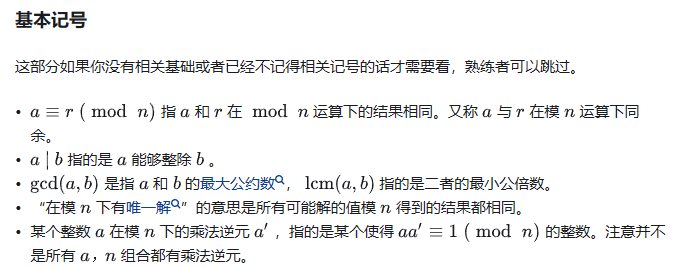

# 基础数学
```py
import math as m

# 求最大公约数
c = m.gcd(10, 100)
print(c)
# 求最小公倍数
lcm = (10 * 100) // c  # 最小公倍数可以通过两个数的乘积除以它们的最大公约数来获得。

#埃氏筛
MAX = int(1e7)  # 定义空间大小，1e7约为10MB
prime = [0] * (MAX + 1)
visited = [False] * (MAX + 1)


def E_sieve_v2(n):
    k = 0  # 统计素数的个数
    for i in range(2, int(n**0.5) + 1):
        if not visited[i]:
            for j in range(i**2, n + 1, i):
                visited[j] = True  # 标记为非素数，筛掉
    for i in range(2, n + 1):
        if not visited[i]:
            prime[k] = i  # 存储素数
            k += 1
    return k  # 返回素数的个数

print(E_sieve_v2(100))
for i in prime:
    if i != 0 :
        print(i)
``` 
# 中国剩余定理：


