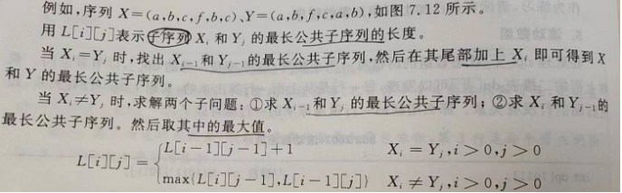
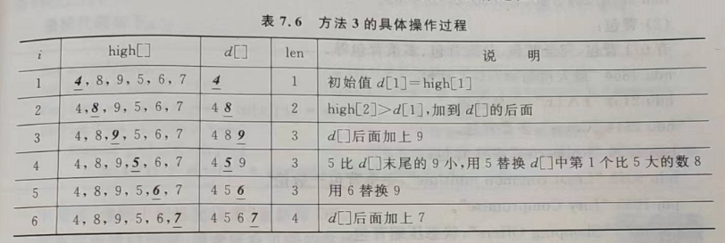

# python的算法模板：

# 深度搜索基本模板DFS：
```python
def search(t):
    if 满足条件:
        输出解
    else:
        for i in range(尝试方法数):
            if 满足搜索条件:
                为进一步搜索需要的状态打上标记
                search(t+1)
                回复到打标记前的状态# 回溯一步
```
```cpp
深度优先搜索算法框架1
int Search(int k)
　{
　for (i=1;i<=算符种数;i++)
　　if (满足条件)
　　   {
　　　　保存结果
　　　　if (到目的地) 输出解;
　　　           else Search(k+1);
　　　　恢复：保存结果之前的状态{回溯一步}
　 　  }
　}
```
# 单调栈：
1，使用列表模拟栈的功能：
```python
# 创建一个空栈
stack = []
# 压栈操作（push）
stack.append(1)
stack.append(2)
stack.append(3)
# 获取栈顶元素（top）
top_element = stack[-1]
print("栈顶元素：", top_element)
# 出栈操作（pop）
popped_element = stack.pop()
print("出栈元素：", popped_element)
# 再次获取栈顶元素
top_element = stack[-1]
print("栈顶元素：", top_element)
```
2,单调栈：
```python
stack=[]#模拟栈的运行
nums=[]#某个数组
for i in nums:#遍历这个数组
    if(栈空||栈顶的元素大于等于当前比较的元素):
        入栈
    else:
        while(栈不为空&&栈顶的元素小于当前的元素):
            栈顶元素出栈
            更新结果
        当前数据入栈
```
```python
# 模拟栈的运行
stack = []  # 栈，存储元素索引
nums = [3, 1, 4, 2, 5]  # 某个数组

result = [-1] * len(nums)  # 存储结果，默认为-1

# 遍历这个数组
for i in range(len(nums)):
    # 如果栈为空或栈顶的元素大于等于当前比较的元素，则入栈当前元素索引
    if not stack or nums[stack[-1]] >= nums[i]:
        stack.append(i)
    else:
        # 如果栈不为空且栈顶的元素小于当前的元素，则栈顶元素出栈，更新结果
        while stack and nums[stack[-1]] < nums[i]:
            top = stack.pop()
            result[top] = nums[i]  # 更新结果为当前元素
        # 当前数据入栈
        stack.append(i)

# 输出结果
print("每个元素右边第一个比它大的元素为：", result)
```
# 二分答案：
单调性判别的问题：
另外的一种二分代码写法，不必考虑+1和-1的问题！：
只需要想清楚程序当中的答案是否需要更新（是否要记下ans)
并且要想清楚可能的答案在哪一册（改L还是R即可

使用二分条件技巧的条件：
1，命题可以归纳成为找到使得命题P(x)成立/不成立的最大/最小的x
2，将P(x)看做一个真或者假的函数，那么它一定在某个分界线的一侧全为真，另一侧全为假
3，可以找到一个复杂度优秀的算法检验P(x)的真假
```python
def Find(l,r):
    ans,mid=0,0
    while l<=r: # 闭区间上的二分条件
        mid=(l+r)//2 #py当中不能时使用>>优化
        if P(mid):# 条件成立
            ans=mid
            r=mid-1
            # 只需要记录满足条件的mid，最后循环一定会结束，也一定会在ans当中保留正确的答案
        else:
            l=mid+1 #L和R不用考虑+1和-1，全部写上去
    return ans
```

# 前缀和：
## What:
    一种预处理，可简单理解成[数列的前n项之和]，可大大降低查询的时间复杂度
    个人理解：用于求某个特定区间的和
    前缀和：sum[i]=a[1]+a[2]+...+a[i];
    递推公式：sum[i]=sum[i-1]+a[i]
## 注意：
    数组的下标从1开始，因为递推公式的原图，需将前缀和数组初始化为0或仅将sum[0]初始化为0
## eg:
    求a[3]+a[4]+...+a[57]:
    等于S[57]-(a[1]+a[2])S为求和函数
    即：sum[57]-sum[3-1]
    原本O(r-l)的复杂度被压缩成O(1)
```python
def prefix_sum(nums):
    prefix = [0] * (len(nums) + 1)
    for i in range(1, len(nums) + 1):
        prefix[i] = prefix[i - 1] + nums[i - 1]
    return prefix

nums = [1, 2, 3, 4, 5]
prefix = prefix_sum(nums)
print(prefix)  # 输出 [0, 1, 3, 6, 10, 15]
```
# 差分：
相对于前缀和而言的概念：
从下标为1的数组开始，b(i)=a(i)-a(i-1)
用于需要多从进行区间加操作，即对数组中的某个区域[l,r]内的所有数加上一个相同的值，然后查询数组上某个数或者所有数值的题目，在a区间[l,r]内均加上X，在差分数组当中将b(l)加上x而将b(r)减去X（开数组范围大点防止越界）
```python
def difference(nums):
    n = len(nums)
    diff = [0] * n
    diff[0] = nums[0]
    for i in range(1, n):
        diff[i] = nums[i] - nums[i - 1]
    return diff
```

# BFS：请用python做一道题
应用场合：
能用DFS，尽量使用。
BFS：求解最优解（如迷宫这样的求最短路径）
DFS：多用于求可行解

# 贪心法：
```python
def greedy_algorithm(input_data):
    # 对输入数据进行预处理（如果需要）
    
    # 初始化解
    solution = []
    
    # 逐步构建解
    while condition:
        # 根据贪心策略选择当前最优的部分解
        # 更新解
        
    return solution

# 示例用法
input_data = ...
result = greedy_algorithm(input_data)
print("贪心算法的解:", result)

```
# 递推与递归：
## 递推：
递推要求出递推顺序（多维递推，如【数的计算】），初始条件，这个时候采用递归更好捏
斐波那契数列模板：
```python
n=int(input())
f=[0] * 5010
f[1]=1
f[2]=2
for i in range(3,n+1):
  f[i]=f[i-2]+f[i-1]
print(f[n])
```
# DP动态规划：
## DP一般思路：
1，穷举法、暴力搜索穷举答案，画出递归树，尝试采用递归来进行求解
2，如果发现存在大量的重复计算，记忆化搜索（哈希表缓存），遍历到相同的节点就直接查表
3, 将计算的过程表示出来，观察计算的公式求解的顺序 ，尝试将递归形成改写成迭代形式（例如：两个for循环）
DP入门，背包入门详见“DP算法刘”
```python
# 状态转移方程：
DP[i][j]=max(DP[i-1][j],DP[i-1][j-v[i]]+w[i])
```
01背包伪代码：
```python
for i in range(1,n+1):#所有物品
    for j in range(V,v[i]+1):
        dp[j]=max(dp[j],dp[j-v[i]]+w[i])
```
例子-骨头问题：
```python
class bone:
    def __init__(self,val,vol):
        self.vol=vol
        self.val=val
def max_value(bones,N,V):
    dp=[[0]*(V+1)for i in range(N+1)] # 内部列表的初始化为长度为V+1的全零列表。
    for i in range(1,N+1):
        for k in range(V+1):
            if bones[i].vol>k:
                dp[i][k]=dp[i-1][k]
            else:
                dp[i][k]=max(dp[i-1][k],dp[i-1][k-bones[i].vol]+bones[i].val)
    return dp[N][V]
# 示例用法
bones = [Bone(0, 0)] * 1011  # 初始化骨头列表
N = 3  # 骨头的数量
V = 5  # 背包的体积

bones[1] = Bone(60, 4)
bones[2] = Bone(100, 6)
bones[3] = Bone(120, 5)

max_val = max_value(bones, N, V)
print("最大价值:", max_val)
```
# 最大公共子序列

```python
def LCS(text1, text2):
    m = len(text1)
    n = len(text2)
    
    # 创建一个二维数组来存储中间结果，dp[i][j]表示text1的前i个字符与text2的前j个字符的LCS的长度
    dp = [[0] * (n + 1) for _ in range(m + 1)]
    
    # 填充dp数组
    for i in range(1, m + 1):
        for j in range(1, n + 1):
            if text1[i - 1] == text2[j - 1]:
                dp[i][j] = dp[i - 1][j - 1] + 1
            else:
                dp[i][j] = max(dp[i - 1][j], dp[i][j - 1])
    
    # 返回LCS的长度
    return dp[m][n]

# 示例用法
text1 = "abcde"
text2 = "ace"
lcs_length = LCS(text1, text2)
print("最长公共子序列的长度:", lcs_length)

```
# 求最长递增子序列
LIS:给定一个数组，找到一个最长的单调递增子序列

给定例题：求一个单调递减的子序列的最少个数
错误解法：将序列反过来，求反序列的递增子序列。
正确：等价于求原序列的LIS
## 法1，通过LCS：
对序列A进行由小到大的排序，得到序列B，求序列A和序列B的LCS，复杂度：n^2
## 法2：DP略，复杂度与上面相同
```python
def length_of_lis(nums):
    n = len(nums)
    if n == 0:
        return 0
    
    dp = [1] * n  # 初始化dp数组，初始值为1
    
    for i in range(1, n):
        for j in range(i):
            if nums[i] > nums[j]:
                dp[i] = max(dp[i], dp[j] + 1)
    
    return max(dp)  # 返回dp数组中的最大值

# 示例用法
nums = [10, 9, 2, 5, 3, 7, 101, 18]
lis_length = length_of_lis(nums)
print("最长递增子序列的长度:", lis_length)

```
# 法3：序列特点的算法：
复杂度：nlog2n
通过辅助数组d[]统计最长递增子序列的长度
初始化d[1]=high[1];len=1;
逐个处理high[k]当中的数字，
1，如果high[k]比d[]末尾的数字更大，就加到d[]的后面
2，如果high[k]比d[]末尾的数字更小，就替换d[]中第1个大于它的数字//使用STL中的lower_bound()函数来找到这个数，lower_bound的复杂度是nlog2n


```python
def lis_without_dp(high):
    n = len(high)
    if n == 0:
        return 0
    
    d = [0] * (n + 1)
    len = 1
    d[1] = high[0]
    
    for i in range(1, n):
        if high[i] > d[len]:
            len += 1
            d[len] = high[i]
        else:
            j = binary_search(d, 1, len, high[i])
            d[j] = high[i]
    
    return len

def binary_search(d, left, right, target):
    while left <= right:
        mid = (left + right) // 2
        if d[mid] == target:
            return mid
        elif d[mid] < target:
            left = mid + 1
        else:
            right = mid - 1
    return left

# 示例用法
high = [10, 9, 2, 5, 3, 7, 101, 18]
lis_length = lis_without_dp(high)
print("最长递增子序列的长度:", lis_length)

```
## 保留x位小数：
```python
result=round(3.14159265,2) #保留2位小数
```
## 数学：
```python
#判断一个数是否是质数：
def iszhi(n):
    if n<=1:
        return 0
    elif n<=3:
        return 1
    elif n%2==0 or n%3==0:
        return 0
    i=5
    while i*i<=n:
        if n%i==0 or n%(i+2)==0:
            return 0
        i+=6
    return 1
# 求逆元：
def mod_inverse(a, m):
    return pow(a, -1, m)

# 示例用法
a = 5
m = 11
inverse = mod_inverse(a, m)
print(f"The multiplicative inverse of {a} modulo {m} is: {inverse}")

# 全排列：
from itertools import permutations

# 定义列表
my_list = [1, 2, 3]
# 获取全排列
permutations_list = list(permutations(my_list))
# 打印结果
print("全排列列表：", permutations_list)

```