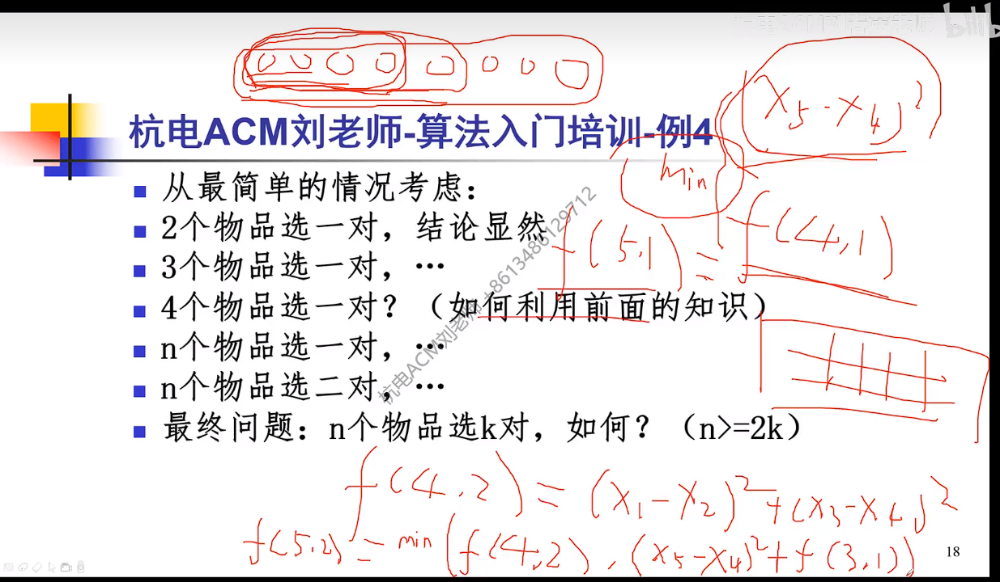
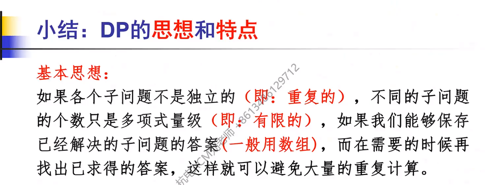
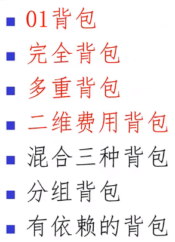
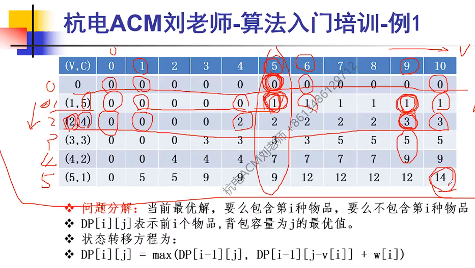
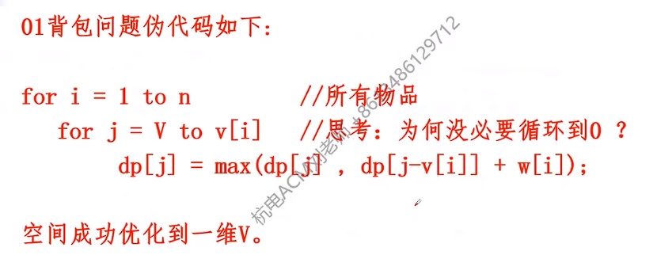
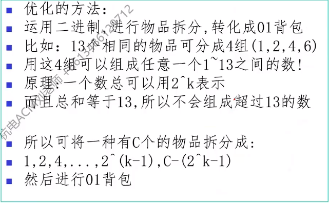
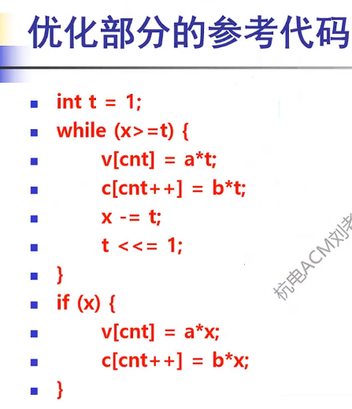

# DP入门
引入例题：
1，数塔问题：重叠的子问题。
自顶向下的分析（要5层那么要搞定4层，4层就要3层...），
自底向上的计算（小规模搞定，大规模拿来用）
2，免费馅饼：本质：三叉的数塔问题（但要主要界限）

3，最长有序子序列：
每个数的结束情况求出来，按照以哪个数结束分类
硕鼠：1，按照体重递增排序，再按照速度找最长的降序子序列
最少拦截系统：
思考：一套拦截系统最多可以拦截几个导弹？
问题的本质：求的是：最少分几个下降的序列？
Dilworth定理：对于一个偏序集，最少链的分数=最长反链长度
结论：最长上升子序列的长度
搬宿舍：每次般的都是相邻的，可以证明a,b,c,d递增，(a-b)^2+(c-d)^2一定是最小的（可以用数轴长度来证明）
dp的时候很多都是考虑前2个，前3个，前4个...很多dp都是这样分析的。why？这样做考虑前3个，可能要用前2个的结果。算大问题的时候子问题一定是考虑过的，直接用就可以了
5个一趟：包含第5个或者不包含第5个，包含：(x5-x4)^2，不包含：f(5)=f(4)
搬2趟
dp的特点


1，最优子结构：大问题的最优解一定包含小问题的最优解
2，重叠子问题
3，无后效性：先做2层数塔，再做3层数塔...做完大数塔后，不会反过来影响小数塔的结果

# 背包入门
背包的基本模型：给你一个容量为V的背包和若干种物品，在一定的限制条件下(每种物品都占用一定容量)，问最多能放进多少价值的物品?


01背包
01背包(最基础的背包问题)
有N件物品和一个容量为V的背包。第i件物品的费用是c[i]，价值是w[i]。求解将哪些物品装入背包可使价值总和最大。
问题特点: 每种物品仅有一件，可以选择放或不放;
思考:在每个物品都有可能被选中的前提下，如何构造“子问题”?
无序变有序的方法:依次考虑前1、前2、前3...前i个物品;
状态定义: f[i][v]表示前i件物品放入一个容量为v的背包可以获得的最大价值。
从小往大做，最优解要么包含这个物品，要么不包含，不包含就是前一个结果，包含的话，得到当前的价值，再加上剩余的空间所能装下的物品的最大价值
为什么不需要排序？因为最终全部物品都需要考虑
先写二维数组
骨头问题：
时间复杂度&空间复杂度:N*V
时间复杂度不好优化，空间复杂度可以优化，只用一维数组实现
一维数组可能会出现一个物品被选择两遍的情况
循环的顺序反一下就可以优化了，因为从后往前遍历的话，前面的情况还没有更新，所有不会出现影响
伪代码：

完全背包：
一种物品可以取无数个
可否转化成01背包？回忆01背包的优化。从前往后遍历即可，之前是怕选多次，现在是要考虑多次
[难]:这类能不能达到的问题应该要怎么实现？（背包不能剩余，一定要装满）=>
1，最开始我们的初始化都是0（前0件物品装入体积的背包当中），但现在最优解是不存在的（不妨用-1代表），但背包体积是0的时候最优解是0还是可以的
2，判断的时候，有剩余的空间，那就是无解，用-1

多重背包：
东西不是固定的，不止1个，但又不是无数个
优化的方法：二进制优化
把几包绑起来，体积和价值都绑起来

代码：


```c++
//在本例中,x就是方便面的个数，a是价值,b是体积，cnt代表一坨物品
int t = 1;//多少包捆绑起来
while (x >= t)//在最后，比如t是64，而x只剩下了37不成立了，那么跳出，进入if
{
	v[cnt] = a * t;
	c[cnt++] = b * t;//cnt++在对数组赋值完后执行
	x -= t;//t个物品在这个过程当中用掉了减去
	t <<= 1;//t翻倍 
}
if (x)//如果x不是0（还有剩下的），那么就将剩下的全部捆绑在一起
{
	v[cnt] = a * x;
	c[cnt++] = b * x;
}
```

二维费用背包：拿着一个背包去买东西，不仅有空间的限制，还要重量的限制

还可以优化，第一维是可以被优化掉的