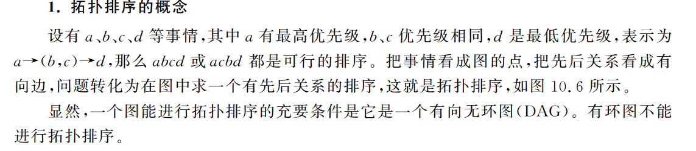
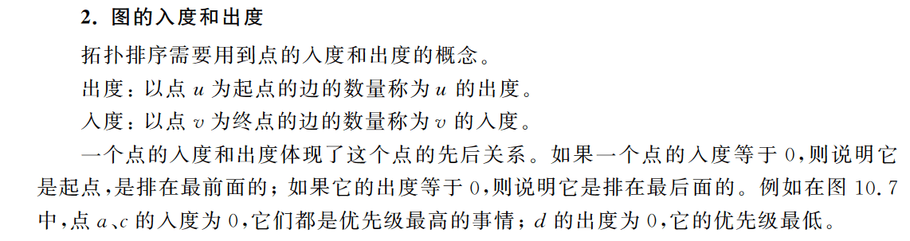

# 拓扑排序
1，概念：

2，出度与入度：

3，基于BFS的拓扑排序：
两种思路：
A：无前驱（输出入度为0，优先级最高）的顶点优先
B：无后继（从出度为0，优先级最低）的顶点优先

A：1，找到入度为0的点，放入队列，谁先谁后没有关系（找不到入度为0，则不是DAG，无拓扑）
2，弹出队首A，A的所有邻居点的入度减1，入度减为0的邻居点放入队列，没有减为0的点不放入

拓扑排序无解的判断：
1，队列空了但还是有点没有进入队列，则他们的入度都不是0，这个图不是DAG

B:反过来执行，就是从出度为0的点开始逐步倒推

复杂度：1，初始化查找入度为0：O（E），进出队列，检查所有的邻居，O（V+E）
```py
from collections import defaultdict, deque

def topological_sort(graph):
    # 计算每个节点的入度
    in_degree = {node: 0 for node in graph}
    for node in graph:
        for neighbor in graph[node]:
            in_degree[neighbor] += 1

    # 初始化一个队列，用于存储入度为 0 的节点
    queue = deque([node for node in graph if in_degree[node] == 0])

    # 初始化拓扑排序结果
    result = []

    # 开始 BFS
    while queue:
        # 从队列中取出一个节点
        node = queue.popleft()
        result.append(node)

        # 将该节点能够到达的节点的入度减 1，并将入度为 0 的节点加入队列
        for neighbor in graph[node]:
            in_degree[neighbor] -= 1
            if in_degree[neighbor] == 0:
                queue.append(neighbor)

    # 如果最终拓扑排序结果的长度与图的节点数不相等，说明图中存在环
    if len(result) != len(graph):
        return None  # 返回 None 表示图中存在环
    else:
        return result  # 返回拓扑排序结果

# 示例图的邻接表表示
graph = {
    'A': ['B', 'C'],
    'B': ['D'],
    'C': ['D'],
    'D': ['E'],
    'E': []
}

# 执行拓扑排序算法
result = topological_sort(graph)

if result is None:
    print("图中存在环，无法进行拓扑排序。")
else:
    print("拓扑排序结果:", result)

```
代码解析：
1，in_degree = {node: 0 for node in graph}
这段代码是一个字典推导式（dictionary comprehension），用于初始化一个字典 in_degree。字典的键是图中的节点，初始值均为 0。具体来说：
for node in graph：遍历图中的每个节点。
{node: 0 for node in graph}：创建一个字典，字典的键是图中的每个节点，初始值为 0。
in_degree = ...：将创建的字典赋值给变量 in_degree。
因此，这句代码的意思是为图中的每个节点初始化一个入度，初始值都为 0。


2,DFS:DFS直接搜索到最底层，然后一层层回退，体现了点和点的关系，实际上在DFS上加一点
DFS返回的是一个逆序，可以用这个栈来存储返回的结果
实际上编程的时候将所有点轮流执行一遍DFS即可，显示地递归了这个虚拟点

不存在拓扑排序：递归的时候发现回退边（如果DFS递归到某个点时发现它仍在前面的递归中没有处理完毕，则说明存在回退边）

```py
def topological_sort(graph):
    # 记录节点的访问状态
    visited = {}
    for node in graph:
        visited[node] = False

    # 用于存储拓扑排序结果的栈
    stack = []

    def dfs(node):
        visited[node] = True
        for neighbor in graph[node]:
            if not visited[neighbor]:
                dfs(neighbor)
        stack.append(node)

    # 对图中的每个节点执行 DFS
    for node in graph:
        if not visited[node]:
            dfs(node)

    # 栈中的顺序即为拓扑排序的结果
    return stack[::-1]

# 示例图的邻接表表示
graph = {
    'A': ['B', 'C'],
    'B': ['D'],
    'C': ['D'],
    'D': ['E'],
    'E': []
}

# 执行拓扑排序算法
result = topological_sort(graph)
print("拓扑排序结果:", result)

```

代码分析：
1，visited[node] = False
初始化一个字典 visited，用于记录每个节点的访问状态。具体来说：
visited[node]：表示字典 visited 中的键，即图中的一个节点。
False：表示该节点的初始访问状态，这里将所有节点的访问状态初始化为 False，表示它们都未被访问过。
这样做的目的是在进行深度优先搜索（DFS）时，可以通过检查节点的访问状态来确定哪些节点已经被访问过，哪些尚未被访问。

2，return stack[::-1]，[::-1] 是 Python 中的切片语法，表示从后向前取元素，即逆序取元素。
因此，stack[::-1] 表示将栈 stack 中的元素逆序取出，得到的结果就是拓扑排序的顺序。

3，为什么有两个DFS？
第一个 dfs 调用是在 for node in graph: 循环中执行的。这个循环遍历了图中的每个节点，确保不会漏掉任何一个节点。在每次循环迭代中，如果当前节点未被访问过（即 if not visited[node]:），就会调用 dfs(node)，从当前节点开始进行深度优先搜索。（相当于对每一个节点执行了DFS《虚拟节点》）

然后，在 dfs 函数内部，通过递归调用 dfs(neighbor)，对当前节点的邻居节点进行深度优先搜索。这确保了在每个连通分量内部，都会进行完整的深度优先搜索，从而正确地遍历整个图，并确保每个节点都被访问到。

3，输出字典序最小的拓扑排序：
一个图的拓扑排序有很多，一般不要求输出All，而是要输出字典序最小的！
这种情况，不能采用DFS，只能使用BFS！
思路：在当前步骤当中，在所以入度为0的点中输出编号最小的：
将BFS当中,将普通的队列改成优先队列，每次输出编号最小的那个节点，然后将它的后续节点减一，入度为0的再放入队列


