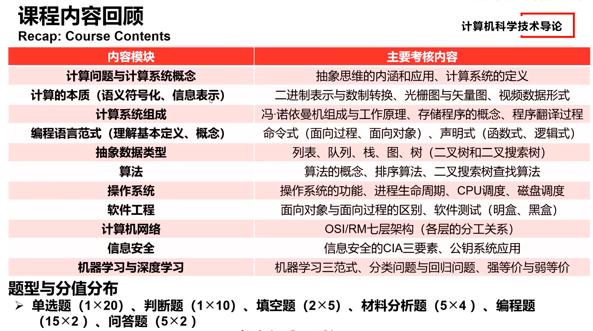

# 计算机导论名词解释：
Create by 枫（软工一班） 2024.1.1

## M2Computing Systems & Abstraction
### 知识点：
A computing system:
1) A dynamic entity composed of hardware, software and the data they manage;
由硬件、软件及其管理的数据组成的动态实体;
2) Must solve some problems for its users;

The computational thinking of abstraction
1) Examples: OSI/RM, TCP/IP, Object-Oriented Design, etc.

### 名词：
organizational characteristics (e.g., hardware + software + data)组织特征(例如，硬件+软件+数据)
The objective of building or purchasing a computing system is to utilize it and solve certain computational problems. Hence, a computing system must offer utility to its users.
构建或购买计算系统的目的是利用它并解决某些计算问题。因此，计算系统必须为其用户提供实用性。
a sequence of instructions指令序列
proper data to generate physical impacts through the computer
适当的数据，通过计算机产生物理影响
hardware implementation details硬件实现细节
optimization优化
system resource schedulers.系统资源调度
An OS defines and implements a set of hardware resource management interfaces, so application developers do not need to reinvent the wheel.   Most application developers work mainly on application-level development and design through leveraging the interfaces offered by the OS.
操作系统定义并实现了一组硬件资源管理接口，因此应用程序开发人员无需重新发明轮子。大多数应用程序开发人员主要通过利用操作系统提供的接口进行应用程序级开发和设计。
model-driven design
模型驱动设计
data mining
数据挖掘
big-data analytics
大数据分析
The Open System Interconnection Reference Model (OSI/RM) partitions the overall task of provisioning networking services into 7 layers of subtasks, namely the application layer, the presentation layer, the session layer, the transport layer, the network layer, the data-link layer and the physical layer.   A developer working at one layer leverages the services implemented by lower layers but does not need to understand their implementation details.   This is a typical example of the computational thinking of(abstraction）.
开放系统互连参考模型(OSI/RM)将提供网络服务的整体任务划分为7层子任务，即应用层、表示层、会话层、传输层、网络层、数据链路层和物理层。在一层工作的开发人员利用由较低层实现的服务，但不需要了解其实现细节。这是一个典型的计算思维(抽象)的例子。
Abstraction is a computational thinking that helps manage complexity by hiding unnecessary details.  Proper system partitioning will allow different engineering teams to focus on a smaller set of constraints and requirements, and multiple engineering teams will be able to seamlessly collaborate as long as the "interfaces" among these teams (i.e., the services each team realizes for the other teams) are well-defined.
抽象是一种计算思维，通过隐藏不必要的细节来帮助管理复杂性。适当的系统划分将允许不同的工程团队专注于较小的约束和需求集，并且只要这些团队之间的“接口”(例如，每个团队为其他团队实现的服务)定义良好，多个工程团队将能够无缝协作。
In object-oriented design, each class encapsulates a set of properties and functionalities that are unified under a specific concept or centered around a particular demand.    Object of one class can request the services from objects of the other classes and access their data in order to fulfill their own tasks.    Object of one class does not need to care about the internal implementations of the other classes.    This is a typical example of the computational thinking of (abstraction ).
在面向对象的设计中，每个类封装了一组属性和功能，这些属性和功能统一在一个特定的概念下，或者以特定的需求为中心。一个类的对象可以向其他类的对象请求服务，并访问它们的数据以完成自己的任务。对象不需要关心其他类的内部实现。这是一个典型的计算思维(抽象)的例子。
systematic analysis
系统分析
model-based design
基于模型的设计
A class is a template for objects of the same type.    An object encapsulates a collection of data and methods, which can be accessed by other objects.    An object's internal details are seldom revealed to others, but others can correctly leverage the services from the object through its interfaces.
类是同一类型对象的模板。对象封装了一组数据和方法，其他对象可以访问这些数据和方法。对象的内部细节很少向其他人透露，但其他人可以通过对象的接口正确地利用来自对象的服务。
leverage the services
利用服务
The TCP/IP protocol stack has four layers, namely the transport layer, the network layer, the medium-access control layer, and the physical layer.   The transport layer is responsible for reliable end-to-end communication between end hosts, but it does not consider the actual paths taken by the data segments over a network.   This is because network routing (i.e., assigning a path over the network to each data packet) is implemented by the network layer.   This partitioning of networking functionality into different layers is a typical application of the computational thinking of (abstraction ).
TCP/IP协议栈有四层，即传输层、网络层、介质访问控制层和物理层。传输层负责终端主机之间可靠的端到端通信，但它不考虑数据段在网络中所采用的实际路径。这是因为网络路由(即，在网络上为每个数据包分配路径)是由网络层实现的。将网络功能划分为不同的层是计算思维(抽象)的典型应用。
layered hierarchy
分层的层次结构
decomposition
分解

## M3 
### information representation
information representation
Digitization and number systems.
数字化和数字系统。
binary values.
二进制信息
binarization 二值化
digitization 数字化
modulation 调制
amplification 放大
Analog signal needs to be converted into digital signals to make it easier for computers to process. This process is known as digitization.
模拟信号需要转换成数字信号，以便于计算机处理。这个过程被称为数字化。
To convert a decimal number into binary, we can process its integer and fractional parts separately. For the integer part, we can repeatedly divide the integer part by 2, put the remainder to an unoccupied digit position that is the closest to the binary point, and repeat this process with the quotient until the quotient becomes 0. For the fractional part, we can repeatedly multiply this part by 2, take out whatever digit that is on the least significant integer position, put this digit to the unoccupied digit position that is the closest to the binary point, and repeat this process until the fractional part becomes 0.
为了将十进制数转换成二进制数，我们可以分别处理它的整数部分和小数部分。对于整数部分，我们可以将整数部分反复除以2，将余数放在离二进制点最近的一个未被占用的数字位置，并对商重复此过程，直到商变为0。对于小数部分，我们可以把这部分反复乘以2，取出最低有效整数位上的任何数字，把这个数字放到离二进制点最近的空位上，重复这个过程，直到小数部分变成0。
eg:对于小数部分，可以使用乘2取整法。
乘2取整法：
将要转换的十进制小数部分乘以2。
记录整数部分作为二进制的一位。
将小数部分继续乘以2，重复上述步骤，直到小数部分为0或者达到所需的精度。
例如，将十进制小数 0.625 转换为二进制：
0.625 *2 = 1.25  --> 记录 1
0.25* 2 = 0.5   --> 记录 0
0.5 * 2 = 1      --> 记录 1
所以，0.625的二进制表示为 0.101。
将整数部分和小数部分的二进制表示组合在一起，即可得到完整的二进制表示。
digital to analog conversion 数模转换
data augmentation 数据增加
signal amplification 信号放大
The process of taking a digital photo or scanning a document into a computer is essentially a digitization process.
拍摄数码照片或将文件扫描到电脑的过程本质上是一个数字化过程。

### multimedia representation 多媒体代表

Raster graphics, vector graphics, and videos.
光栅图形、矢量图形和视频。
A raster-graphic image is made up of a grid of pixels.
光栅图形图像是由像素网格组成的。
A vector graphic is composed of mathematical formulas for lines and shapes.  A vector-graphic image can be resized without losing any image quality.
矢量图形由线条和形状的数学公式组成。矢量图形图像可以在不损失任何图像质量的情况下调整大小。
Video is essentially a sequence of images that are presented to the viewer at high frequency.  Video compression techniques will not be tested in our final exam.
视频本质上是以高频呈现给观众的一系列图像。视频压缩技术不会在期末考试中测试。
A raster-graphic image is composed of pixels that are organized into a matrix.  The quality of the image will degrade if we resize the image to a larger one.
光栅图形图像由组织成矩阵的像素组成。如果我们把图像的大小调整大一些，图像的质量就会下降。
pixels.
像素

### ASCII and compression
题目：The ASCII code for character '2' is 50 (in decimal). What is the value of the expression '2'+3? ('5')
解析：'2' is a ASCII character. '2' + 3 moves the code ('2' or 50 in decimal) by 3 position to '5' (or 53 in decimal).'2'是一个ASCII字符。'2' + 3将代码(十进制为50)移动3个位置到'5'(十进制为53)
题目：Suppose that you need to compress the character string "AACCCCCGGG" using run-length encoding. Which one of the following is a possible compression result? ( AA*C5GGG)
ASCII and compression
ASCII和压缩
Huffman encoding
binary code
二进制代码
Run-length encoding rules:
游程编码规则:
1) Use "*XY" to mean "repeat character X for Y times";
使用“*XY”表示“重复字符XY次”;
1) Repetitive character string with size smaller than or equal to 3 does not need to be compressed.
长度小于等于3的重复字符串不需要压缩。

## M4 Computer Hardware and Organization

### basic logic gates
NOT, AND, OR, NAND, NOR, XOR, XNOR.
An OR gate performs logical OR operation on its inputs.
或门对其输入执行逻辑或操作。
An (OR) gate outputs a '1' as long as one of its inputs is '1'.
只要一个(或)门的输入为“1”，它就输出“1”。
An ( XOR) gate outputs a '1' if and only if both inputs are different.
当且仅当两个输入不同时，(异或)门输出“1”。
The XOR operation can oftentimes be thought as "addition without carry out".
异或运算通常被认为是“加而不执行”。
An (AND) gate will generate a '1' if and only if both inputs are 1.
当且仅当两个输入都为1时，与门将产生“1”。
An AND gate's output is the logical AND of its inputs.
与门的输出是其输入的逻辑与。
A ( NOT) gate's output is always the opposite of its input.
(非)门的输出总是与其输入相反。
The NOT gate performs logical NOT operation on its input. It is sometimes known as an inverter.
非门对其输入执行逻辑非操作。它有时被称为逆变器。

By GPT：
NOT门（非门）:
功能： NOT门执行一种基本的逻辑操作，即对输入信号进行取反。
符号： 常用符号是一个三角形，输入在三角形的指向的一侧，输出在另一侧。
AND门（与门）:

功能： AND门接受两个或更多输入，并仅在所有输入都为真时输出为真。
符号： 常用符号是一个圆圈，其中有两个输入线，输出线从底部出来。
OR门（或门）:

功能： OR门接受两个或更多输入，并在至少一个输入为真时输出为真。
符号： 常用符号是一个圆圈，其中有两个输入线，输出线从顶部出来。
NAND门（与非门）:

功能： NAND门是AND门的反向版本，仅在所有输入都为真时输出为假。
符号： 与AND门相似，但通常在输出符号上放一个小圆圈。
NOR门（或非门）:

功能： NOR门是OR门的反向版本，仅在所有输入都为假时输出为真。
符号： 与OR门相似，但通常在输出符号上放一个小圆圈。
XOR门（异或门）:

功能： XOR门（异或门）接受两个输入，并在输入不同的情况下输出为真。
符号： 常用符号是一个加号在一个圆圈内，表示“不同”。
XNOR门（同或门）:

功能： XNOR门（同或门）接受两个输入，并在输入相同的情况下输出为真。
符号： 与XOR门相似，但通常在输出符号上放一个小圆圈。

### on the concepts of digital circuits
the concepts of digital circuits

1) Three ways to represent digital circuits;
数字电路的三种表示方式;
2) Combinational vs. sequential circuits.
组合电路与顺序电路。
A digital circuit can be represented with its truth table, its （Boolean expression ), or its symbolic diagram/schematic.
一个数字电路可以用它的真值表、它的(布尔表达式)或它的符号图/示意图来表示
In general, there are three ways to represent digital circuits: Boolean expressions, truth tables, and symbolic diagrams/schematics.
一般来说，有三种表示数字电路的方法:布尔表达式、真值表和符号图/原理图。
symbolic composition
符号组成
input-output combinations
输入-输出组合
A computer's memory returns previously stored values when a memory read signal and an address are provided as inputs.    Since the memory's output depends not only on its instantaneous inputs but also its past inputs/states, it is essentially a (sequential) circuit.
当提供存储器读信号和地址作为输入时，计算机的存储器返回先前存储的值。由于存储器的输出不仅取决于其瞬时输入，还取决于其过去的输入/状态，因此它本质上是一个(顺序)电路。
A sequential circuit's input is denpendent of both is instantaneous inputs and previous inputs/states.    In other words, a sequential circuit has the capability the memorize previous inputs/states.
顺序电路的输入依赖于它的瞬时输入和先前的输入/状态。换句话说，顺序电路具有记忆先前输入/状态的能力。
combinational
组合
sequential
顺序
operational
操作
A half-adder computes the sum of two input operands, i.e., the augend and the addend, and its output is only dependent on the instantaneous values of its two inputs.Therefore, a half-adder is a (combinational) circuit.
半加法器计算两个输入操作数的和，即被加数和加数，其输出仅依赖于两个输入的瞬时值。因此，半加法器是一种(组合)电路。
A combinational circuit's output is only dependend on the value(s) of its instantaneous input(s).
组合电路的输出仅取决于其瞬时输入的值。

### von Neumann architecture 冯·诺伊曼结构

The program instructions and data in a von Neumann machine are both represented as (binary ) numbers. Instructions and data are stored in the main memory, and intructions are fetch one by one into the CPU for execution.
冯·诺依曼机器中的程序指令和数据都用(二进制)数字表示。指令和数据存储在主存中，指令被逐条提取到CPU中执行。
secondary二次
primary主要的。

hexadecimal
十六进制
Two important characteristics of the von Neumann machine:
冯·诺伊曼机器的两个重要特性:
1) Both instructions and data are stored as binary numbers;
指令和数据均以二进制数存储;
2) General-purpose computing is realized via the stored-program model, where instructions in the main memory are executed by the CPU one by one following the fetch-decode-execute cycle.
通用计算是通过存储程序模型实现的，主存中的指令由CPU按照读取-解码-执行周期逐一执行。
A von Neuman machine has 5 components:
冯·诺伊曼机器有5个组成部分:
1) The arithmetic logic unit (ALU) performs basic arithmetic computations and logical operations;
算术逻辑单元(ALU)执行基本的算术计算和逻辑运算;
2) The control unit (CU) coordinates the operations of all the other components (including the ALU);
控制单元(CU)协调所有其他部件(包括ALU)的操作;
3) The input devices capture user inputs and signals in the physical world;
输入设备捕获物理世界中的用户输入和信号;
4) The output devices present processing results to user and induce tangible impacts on the physical world;
输出设备将处理结果呈现给用户，并对物理世界产生切实的影响;
5) The memory stores data and instructions to facilitate program execution and system control.
存储器存储数据和指令，便于程序执行和系统控制。
In a computer, the main memory are organized into (bytes), each with a unqiue address for read/write accesses.
在计算机中，主存储器被组织成(字节)，每个字节都有一个唯一的读/写访问地址。
Computer memory is byte-addressable, i.e., every 8 bits are grouped together to form a byte, and the minumum unit of data that can be read from or written into the memory as a whole is a byte.
计算机存储器是字节可寻址的，也就是说，每8个比特被组合在一起形成一个字节，而可以从存储器中读取或写入存储器的最小数据单位是一个字节。
升序：ascending order

降序：descending order
CPU registers > cache > memory > hard disk drives (HDDs)
CPU寄存器>缓存（快取）>内存>硬盘驱动器

### memory system hierarchy 存储系统层次结构
计算题与问答题！！！
A memory system deploys caches between the CPU and the main memory to speed up data accesses. Suppose that every CPU read request is simultaneously issued to both the cache and the memory.Assume that it takes 200 CPU clock cycles for the memory to complete a CPU read request and that it takes 20 CPU cycles for the cache to complete the same request as long as the requested contents can be found in the cache.Therefore, a CPU read request may be completed in one of the following ways:
内存系统在CPU和主存之间部署缓存，以加快数据访问速度。假设每个CPU读请求同时发送到缓存和内存。假设内存需要200个CPU时钟周期来完成一个CPU读请求，而缓存需要20个CPU周期来完成相同的请求，只要所请求的内容可以在缓存中找到。因此，CPU读请求可能有以下几种方式之一:

1) Cache hit: The CPU attempts to fetch certain data contents from both the memory and the cache at the same time, and the contents are found in the cache.In this case, the CPU will not wait for the memory read operation to complete (instead, memory read will be aborted).It will directly proceed with the data retrieved from the cache.
Cache hit: CPU同时尝试从内存和Cache中取出某些数据内容，这些内容在Cache中被找到。在这种情况下，CPU不会等待内存读取操作完成(相反，内存读取将被中止)。它将直接处理从缓存中检索到的数据。
2) Cache miss: The CPU attempts to fetch certain data contents from both the memory and the cache simultaneously, but the contents cannot be found in the cache.              In this case, the CPU will have to wait until the completion of the memory read request.
Cache miss: CPU试图同时从内存和Cache中读取某些数据内容，但是在Cache中找不到这些内容。在这种情况下，CPU将不得不等待，直到内存读取请求完成。
For a given program, if the ratio of cache hit is 75% and there are 10000 read operations during the program's execution, then how many CPU clock cycles are spent on data read requests?    (7500*20 + 2500*200 = 650000)
对于给定的程序，如果缓存命中率为75%，并且在程序执行期间有10000次读取操作，那么在数据读取请求上花费了多少CPU时钟周期?(7500*20 + 2500*200 = 650000)
此题虽然在题库中以选择题形式出现，但考试时往往会以计算或分析题的形式进行考查。
The memory system in computers is typically organized into a pyramid-like structure as shown in the figure below:
计算机的内存系统通常被组织成一个金字塔状的结构，如下图所示:
A.The cache operates faster than the main memory and stores frequently-visited memory contents or data that are highly likely to be accessed very soon.Memory requests from the CPU will be issued to both the cache and the memory.If the contents can be found in the cache, the request can be responded before the memory access is completed.Similarly, the disk cache is deployed between the memory and the disk to mitigate performance bottleneck when the disk is frequently accessed.
高速缓存的运行速度比主存快，存储经常访问的内存内容或很可能很快被访问的数据。来自CPU的内存请求将同时发送到缓存和内存。如果可以在缓存中找到内容，则可以在内存访问完成之前响应请求。类似地，在内存和磁盘之间部署磁盘缓存，以缓解频繁访问磁盘时的性能瓶颈。
The cache operates faster than the main memory and stores frequently-visited memory contents or data that are highly likely to be accessed very soon.  Memory requests from the CPU will be issued to both the cache and the memory.  If the contents can be found in the cache, the request can be responded before the memory access is completed.  Similarly, the disk cache is deployed between the memory and the disk to mitigate performance bottleneck when the disk is frequently accessed.
高速缓存的运行速度比主存快，存储经常访问的内存内容或很可能很快被访问的数据。来自CPU的内存请求将同时发送到缓存和内存。如果可以在缓存中找到内容，则可以在内存访问完成之前响应请求。类似地，在内存和磁盘之间部署磁盘缓存，以缓解频繁访问磁盘时的性能瓶颈。
A content distribution network deploys multiple "cache" servers to improve the overall system performance when multiple users across the globe try to access the same content in the original/main server.As shown in the figure below, the idea behind "cache" servers is very similar to the deployment of caches between CPU and memory in a computer:
内容分发网络部署多个“缓存”服务器，以便在全球多个用户试图访问原始/主服务器中的相同内容时提高整体系统性能。如下图所示，“缓存”服务器背后的思想与计算机中CPU和内存之间的缓存部署非常相似:
what kinds of contents should be buffered in the cache servers?(D)
什么类型的内容应该在缓存服务器中进行缓冲?
A.Multimedia contents that are large in size and costly to be transmitted repeatedly over the Internet.
在因特网上重复传输的多媒体内容体积大，费用高。
B.Any contents in the main server (i.e., setting up a complete "mirror" of the main server).
主服务器中的任何内容(即，设置主服务器的完整“镜像”)。
C.Any contents that matches the cultural and social-geographic characteristics of the users in a specific region.
任何与特定地区用户的文化和社会地理特征相匹配的内容。
D.Contents that are frequently accessed by many users in a specific region and contents that are predicted to be popular.
特定地区的许多用户经常访问的内容和预测将流行的内容。

## M5 Operating Systems Concepts 操作系统概念

### Operating Systems Concepts

Two roles of OS: resource management and virtual machine illusion/abstraction.
操作系统的两个角色:资源管理和虚拟机幻象/抽象。
One of an operating system's key roles is (        ): When multiple user programs generate requests for the same hardware device, the operating system will arbitrate the conflicts among these requests and determine the order in which the requests will be satisfied by the hardware device.
操作系统的关键角色之一是():当多个用户程序生成对同一硬件设备的请求时，操作系统将仲裁这些请求之间的冲突，并确定硬件设备满足这些请求的顺序。
One of an operating system's key roles is resource management, which involves both neat uses of hardware resources and resolution of resource request conflicts.
操作系统的关键角色之一是资源管理，它涉及硬件资源的整洁使用和资源请求冲突的解决。
utilization 利用
An (operating system) offers the virtual machine illusion to user programs: A user program developer can safely assume that his/her program has exclusive access to all the necessary hardware resources and software services (e.g., an unlimited amount of memory, all the CPU time).The program can execute as if it is the only program that is currently running on the computer.
操作系统为用户程序提供了虚拟机的假象:用户程序开发人员可以放心地假设他/她的程序对所有必要的硬件资源和软件服务(例如，无限量的内存，所有的CPU时间)具有排他性访问。程序可以执行，就好像它是当前计算机上运行的唯一程序一样。
Implementing the virtual machine illusion is one of the key roles of operating systems.
实现虚拟机错觉是操作系统的关键角色之一。
development toolchain
文档处理工具套件
office utility suite
办公工具套件
database management system
数据库管理系统
operating system
An (operating system) makes it easier for a user application to utlize computer system resources and compete fairly with other programs for system services.
操作系统使用户应用程序更容易利用计算机系统资源，并与其他程序公平地竞争系统服务。
When certain hardware resources or software services (e.g., compilers, linkers, loaders, etc.) are needed by a user application, it will directly interact with the operating system, which will serve as a proxy to help properly manage the requested resources and coordinate among multiple requests (potentially from different user applications).
当用户应用程序需要某些硬件资源或软件服务(例如，编译器，链接器，加载器等)时，它将直接与操作系统交互，操作系统将作为代理来帮助正确管理请求的资源并在多个请求(可能来自不同的用户应用程序)之间进行协调。
document processing utility suite
过程生命周期管理
development toolchain
开发工具链
database management system
数据库管理系统
In a computer that runs a certain operating system, if there are multiple processes that are in the "ready" state, the operating system will perform (        ) to determine the process that gets to run on the CPU.
在运行某种操作系统的计算机中，如果有多个进程处于“就绪”状态，操作系统将执行()来确定哪个进程可以在CPU上运行。
process lifecycle management
过程生命周期管理
CPU scheduling is one of the resource management tasks of the operating system.
CPU调度是操作系统的资源管理任务之一。
CPU scheduling
CPU调度

### process management concepts

process management concepts
A process's lifecycle includes 5 states, i.e., the creation, ready, running, waiting, and termination states.
进程的生命周期包括5种状态，即创建、就绪、运行、等待和终止状态。
When an I/O request is generated by the currently running process, the operating system will move this process to the waiting state and start a new round of CPU scheduling so that another process can have the opportunity to engage the CPU.
当当前运行的进程生成I/O请求时，操作系统会将该进程移至等待状态，并开始新一轮的CPU调度，以便另一个进程有机会占用CPU。
A process typically needs to complete necessary computations and interact with the users (or its surroundings).ut systems.When a process issues an I/O request, it will have to wait until the I/O request is completed in order to proceed with further processing steps.At this point, the CPU should be released by the process so that other processes in the ready state can compete for it
进程通常需要完成必要的计算并与用户(或其周围环境)交互。计算消耗CPU时间，而用户交互通常通过输入/输出系统实现。当进程发出I/O请求时，它必须等待I/O请求完成，以便继续进行进一步的处理步骤。此时，该进程应该释放CPU，以便处于就绪状态的其他进程可以争夺CPU。
Suppose that multiple processes are in the ready state and that the CPU is now idle.          The operating system will perform (D) to allow one of the processes in the ready state to utilize the CPU.
假设多个进程处于就绪状态，并且CPU现在处于空闲状态。操作系统将执行()来允许一个处于就绪状态的进程使用CPU。
A.CPU monitoring
CPU监视
B.process management
流程管理
C.process admission
录取过程
D.CPU scheduling
CPU调度
A process's transition from the ready state to the running state is managed by the CPU scheduling function of the operating system.
进程从就绪状态过渡到运行状态是由操作系统的CPU调度功能来管理的
判断题：A process in the waiting state will be moved into the ready state if its pending I/O requests are all properly fulfilled by the relevant I/O devices.(TRUE)
如果一个处于等待状态的进程的挂起的I/O请求都被相关的I/O设备正确地完成了，那么它就会进入就绪状态。(TRUE)
When I/O requests generated by a process are completed by the relevant I/O devices, the process can be moved into the ready state and can participate in the next round of CPU scheduling.
当进程生成的I/O请求被相关的I/O设备完成后，该进程就可以进入就绪状态，参与下一轮CPU调度。
Multiple Choice: A process is a program in execution.If the operating system finds that there are sufficient system resources to support a newly-created process, it will admit this process into the process management subsystem.Besides the "creation" and "termination" states, what are the fhree possible states in which the process may stay? (ACE)

A.The waiting state.
等待状态。
B.The inactive state.
非活动状态。
C.The running state.
运行状态。
D.The active state.
激活状态。
E.The ready state.
就绪状态。
A process's lifecycle inlcudes 5 states, i.e., the creation, ready, running, waiting, and termination states.
进程的生命周期包括5种状态，即创建、就绪、运行、等待和终止状态。

### CPU Scheduling

Suppose that an operating system manages 5 processes, i.e, P1, P2, P3, P4, P5, and that these processes enters the ready state at the same time.Suppose that the CPU time consumed by each process before its generation of the next I/O request is as follows:
假设一个操作系统管理5个进程，即P1、P2、P3、P4、P5，并且这些进程同时进入就绪状态。假设每个进程在生成下一个I/O请求之前消耗的CPU时间如下:
P1: 75 CPU clock cycles

P2: 50 CPU clock cycles

P3: 20 CPU clock cycles

P4: 96 CPU clock cycles

P5: 29 CPU clock cycles

If SJF (shortest-job-first) scheduling is used, it is evident that the order in which the processes get to run on the CPU is P3, P5, P2, P1, P4.
如果使用SJF(最短作业优先)调度，很明显，进程在CPU上运行的顺序是P3、P5、P2、P1、P4。
For each process, turnaround time is defined as the time duration between the moment a process enters the ready state and the moment it completes execution.       Which one of the following correctly computes the average turnaround time of the five processes during each CPU scheduling cycle? ()
对于每个流程，周转时间定义为流程进入就绪状态到完成执行之间的持续时间。下列哪一项正确地计算了每个CPU调度周期中五个进程的平均周转时间?()
Note that we implicitly assume that we focus on a specific CPU scheduling cycle, i.e., the period over which each process gets a chance to run on the CPU and exits the running state due to the generation of I/O requests.
请注意，我们隐式地假设我们关注特定的CPU调度周期，即每个进程有机会在CPU上运行并由于生成I/O请求而退出运行状态的时间段。
[20 + (20+29) + (20+29+50) + (20+29+50+75) + (20+29+50+75+96)] / 5 = 122.4 CPU clock cycle.

Which one of the following correctly gives the order in which the processes acquire the CPU for execution if FCFS scheduling is realized? ( )
如果实现FCFS调度，下面哪个选项正确地给出了进程获得CPU执行的顺序?()
FCFS :先来先服务
In FCFS order, the process will acquire the CPU in exactly the same order in which they transition into the ready state.
在FCFS顺序中，进程获取CPU的顺序与它们进入就绪状态的顺序完全相同。
Which one of the following statements on CPU scheduling is correct?     (      )
下面哪个关于CPU调度的说法是正确的?
D.CPU scheduling makes it possible for multiple processes to share the same set of hardware resources: The computer hardware devices are not aware of the fact that requests are generated by multiple user programs, while each user program has the illusion that it has exclusive access to the computer hardware.
CPU调度使得多个进程共享同一组硬件资源成为可能:计算机硬件设备不知道请求是由多个用户程序生成的，而每个用户程序都有一种错觉，认为它对计算机硬件具有独占访问权。
GPT：
CPU调度是操作系统中的一个关键概念，用于确定在多个可运行进程之间分配CPU时间的顺序。不同的调度算法和模式可以影响系统的性能和响应时间。以下是一些常见的CPU调度模式：

先来先服务（First Come First Serve, FCFS）:
进程按照它们进入就绪队列的顺序依次执行。是最简单的调度算法，但可能导致"先来"的进程等待时间过长。

最短作业优先（Shortest Job Next, SJN）:
选择下一个执行的进程时，选择剩余执行时间最短的进程。有时也称为最短作业优先（Shortest Job First, SJF）。

优先级调度（Priority Scheduling）:
每个进程都分配一个优先级，优先级高的进程先执行。这样，系统可以根据进程的紧急性或其他因素来确定执行顺序。

轮转调度（Round Robin, RR）:
将CPU分成时间片（时间量），每个进程在一个时间片内执行，然后移到就绪队列的末尾，等待下一个时间片。

多级反馈队列调度（Multilevel Queue Scheduling）:
将就绪队列分为多个级别，每个级别使用不同的调度算法。进程在队列之间移动，根据它们的优先级或其他标准。
多级反馈轮转调度（Multilevel Feedback Queue Scheduling）:
是多级队列调度的变体，允许进程在队列之间移动，但还引入了动态的优先级调整，根据进程的行为调整其优先级。

最高响应比优先（Highest Response Ratio Next, HRRN）:
通过计算响应比（等待时间 + 执行时间 / 执行时间）来选择下一个执行的进程，以提高对短进程的响应。

最短剩余时间优先（Shortest Remaining Time First, SRTF）:
是SJN的抢占式版本，当一个新的进程到达或一个已有进程变得更短时，可以抢占CPU。

### disk scheduling 磁盘调度

Suppose that a hard disk drive has 500 tracks (numbered from 1 through 499).    The current position of the read/write head is at the 150th track and it is moving toward the 499th track.    Assume that a series of read/write requests at different tracks arrive in the following order: 148, 96, 160, 255, 310.    If the hard disk scheduling subsystem implements FCFS policy, which one of the following correctly orders the requests?    (A)
A.148, 96, 160, 255, 310.
假设一个硬盘驱动器有500个磁道(编号从1到499)。读/写磁头的当前位置是在第150条磁道，它正在向第499条磁道移动。假设不同轨道上的一系列读/写请求按照以下顺序到达:148、96、160、255、310。如果硬盘调度子系统实现了FCFS策略，下面哪一项是正确排序请求的?(        )

Among the disk scheduling policies of FCFS, SSTF (shortest-seek-time-first), and SCAN, which one has the shortest average seek time?   (FCFS)
在FCFS、SSTF (short -seek-time-first)和SCAN三种磁盘调度策略中，哪一种的平均寻道时间最短?()
For every request, the total time required is composed of the seek time, wait time, and read/write operation time.  If the requests are random enough, we can assume that read/write head wait time and read/write operation time for different requests are roughly the same.  The average seek time for a disk scheduling policy is, to some extent, a metric for disk scheduling performance (in terms of latency).
对于每个请求，所需的总时间由寻道时间、等待时间和读/写操作时间组成。如果请求足够随机，我们可以假设不同请求的读/写头等待时间和读/写操作时间大致相同。在某种程度上，磁盘调度策略的平均寻道时间是磁盘调度性能的度量(就延迟而言)。
磁盘调度是计算机系统中用于有效管理磁盘I/O请求的一种技术。它的目标是最小化磁头的移动，提高磁盘I/O的性能。以下是一些常见的磁盘调度算法：

先来先服务（First Come First Serve, FCFS）:
磁盘按照它们发起I/O请求的顺序依次服务。这是最简单的调度算法，但可能导致某些请求等待时间过长。

最短寻道时间优先（Shortest Seek Time First, SSTF）:
选择距离当前磁头位置最近的磁道上的请求进行服务。这可以减少平均寻道时间，但可能导致某些请求长时间等待。

电梯调度算法（Elevator, SCAN）:
磁头沿着一个方向移动，直到碰到磁盘的边缘，然后改变方向。这样可以减少寻道时间，但可能导致一些请求长时间等待。

循环扫描算法（Circular Scan, C-SCAN）:
类似于电梯算法，但当磁头到达磁盘的一端时，立即返回到另一端，形成一个循环。这可以避免一些请求长时间等待。

最不经常使用（Least Recently Used, LRU）:
选择最长时间没有被访问的磁道上的请求进行服务。这需要维护请求的访问历史，通常使用计数器或其他机制。

最佳磁道优先（SCAN, Look）:
与电梯算法类似，但在到达磁盘的边缘时，不立即改变方向，而是回到另一端。这可以减少一些请求的等待时间。

优先权调度算法（Priority-Based Scheduling）:
为每个磁盘I/O请求分配一个优先级，并按照优先级顺序进行服务。这允许管理员根据任务的重要性或其他因素进行调度。
### file systems

relative vs. absolute paths, text vs. binary files.
相对路径vs绝对路径，文本文件vs二进制文件。
A file system implements (text) files as a quick and convenient way to encode human-readable information such as characters, words, sentences, numbers, etc. In contrast, a binary file typically adopts some application-specific encodings to efficiently represent information.
文件系统实现(文本)文件作为一种快速方便的方式来编码人类可读的信息，如字符、单词、句子、数字等。相反，二进制文件通常采用一些特定于应用程序的编码来有效地表示信息。
In contrast to relative paths, (absolute) paths describe the unique locations of files in the file system tree starting from the root node/directory.
与相对路径相比，(绝对)路径描述了从根节点/目录开始的文件系统树中文件的唯一位置。
Absolute paths start from the root of the file system tree.
绝对路径从文件系统树的根目录开始。
Although the operating system's file system offers absolute path that uniquely specifies the location of a file, it is usually more convenient to use (relative) paths. When a program is initiated, it can leverage such paths to easily access files that are in the same directory as the program itself.
尽管操作系统的文件系统提供了唯一指定文件位置的绝对路径，但使用(相对)路径通常更方便。当程序启动时，它可以利用这些路径轻松访问与程序本身位于同一目录中的文件。
The notion of a relative path is defined with respect to the current working directory.
相对路径的概念是根据当前工作目录定义的。
File system typically realizes (binary) files as a way to represent application-specific information for quick access and/or efficient storage utilization.
文件系统通常将(二进制)文件实现为一种表示特定于应用程序的信息的方式，以便快速访问和/或有效地利用存储。

## M6 Algorithms and Programming Languages

要学：insertion sort, selection sort, and bubble sort.
Students should think about how to realize recursive depth-first search (DFS) and recursive binary-tree search using pseudocode.
插入排序、选择排序和冒泡排序。
学生应该思考如何使用伪代码实现递归深度优先搜索(DFS)和递归二叉树搜索。

### the concept of algorithms
An algorithm is a finite set of well-defined, clearly specified instructions, typically used to solve a class of problems or perform a computation.
算法是一组定义良好的、明确规定的指令，通常用于解决一类问题或执行计算。
Characteristics of an algorithm:
算法的特点:
1) A collection of steps or instructions;
步骤或指令的集合;
2) Each step/instruction is clearly described and can be accurately carried out;
每个步骤/指令描述清楚，并能准确执行;
3) The collection of steps or instructions will solve a certain problem.
步骤或指令的集合将解决某个问题。
An (algorithm) is a process or set of rules to be followed in problem-solving operations. It is typically a step-wise representation of a solution to a given problem.
算法是在解决问题的操作中要遵循的一个过程或一组规则。它通常是对给定问题的解决方案的逐步表示。
In order for a certain combination of instructions to be an algorithm, these instructions must have the following characteristics:
为了使某种指令组合成为算法，这些指令必须具有以下特征:
1) Clear and unambiguous;
清晰、明确;
2) Well-defined inputs;
明确的输入;
3) Well-defined outputs;
明确的输出;
4) The number of instructions should be finite.
指令的数量应该是有限的。
problem specification
规范问题
problem solving plan
问题解决计划
computational problem
计算问题
(Pseudocode) is a plain language description of the steps in an algorithm.Although structural conventions on the use of natural languages are recommended, the most important rules on the use of such algorithm description method are to make things readable and to keep a consistent style.
(伪代码)是对算法中各步骤的简单语言描述。虽然建议使用自然语言的结构约定，但使用这种算法描述方法的最重要规则是使内容具有可读性并保持一致的风格。
Pseudocode consists of short, natural language phrases used to explain specific tasks within a program. Ideally, pseudocode should not include keywords in any specific programming language. Pseudocode should be written as a list of consecutive phrases, we can even draw arrows to represent assignment statements. Indentation can be used to show the logical program flow in pseudocode.
伪代码由简短的自然语言短语组成，用于解释程序中的特定任务。理想情况下，伪代码不应该包含任何特定编程语言中的关键字。伪代码应该写成一个连续短语的列表，我们甚至可以画箭头来表示赋值语句。缩进可以用来在伪代码中显示逻辑程序流。
Unified modeling language (UML)
统一建模语言(UML)
Pseudocode
伪代码
Flowchart
流程图
Symbolic description
象征性的描述
### programming lanauge

programming lanauge paradigms
编程语言范型
Imperative: procedural, object-oriented;
命令式:过程的，面向对象的;
Declarative: functional, logic.
声明性:功能性、逻辑性。
Which one of the following statements on procedural programming is wrong? (C)
下列关于过程式编程的陈述哪一个是错误的?(        )
A.The C programming language implements the procedural programming paradigm.
C语言实现了过程式编程范式。
B.A procedure is simply a set of computation steps to be carried out, and the procedural programming paradigm refers to the method of constructing complex, large-scale software through smaller subroutines (i.e., procedures) and procedure calls.
程序只是一组要执行的计算步骤，过程编程范式是指通过较小的子程序(即过程)和过程调用来构建复杂的大规模软件的方法。
C.Procedural programming is the only imperative programming paradigm.
过程式编程是唯一的命令式编程范式。
D.In procedural programming, system complexity can be managed by properly defining procedures (also known as subroutines) and the hierarchy of procedure calls.
在过程编程中，系统复杂性可以通过适当定义过程(也称为子程序)和过程调用的层次结构来管理。
Procedural programming is one of the major imperative programming paradigms.
过程编程是主要的命令式编程范式之一。
Which one of the following statements on object-oriented programming is wrong?(B )
下面哪个关于面向对象编程的陈述是错误的?()
A.As one of the main features of object-oriented programming (OOP), encapsulation means that data and functionality are internally maintained by different objects, and only necessary information and interfaces are exposed.
作为面向对象编程(OOP)的主要特征之一，封装意味着数据和功能由不同的对象在内部维护，只公开必要的信息和接口。
B.Object-oriented programming is the only imperative programming paradigm.
面向对象编程是唯一的命令式编程范式。
C.As one of the main features of object-oriented programming (OOP), polymorphism means that methods (or functions) with the same name can implement different behaviors for different classes.
作为面向对象编程(OOP)的主要特征之一，多态性意味着具有相同名称的方法(或函数)可以为不同的类实现不同的行为。
D.As one of the main features of object-oriented programming (OOP), inheritance enables child classes to inherit properties and behaviors of parent classes, making compact, modular software design possible.
作为面向对象编程(OOP)的主要特征之一，继承使子类能够继承父类的属性和行为，从而使紧凑、模块化的软件设计成为可能。
Object-oriented programming is one of the major imperative programming paradigms.  It defines classes of objects and realizes system functionality through interactions between objects.
面向对象编程是主要的命令式编程范式之一。它定义对象的类，并通过对象之间的交互实现系统功能。
Structured Query Language (SQL) is widely used in database management systems to help compose database queries.An SQL query only specifies what type of data is needed by the user and never imposes restrictions on how the query should be implemented by a specific database management system.In this sense, SQL is a (        ) programming language.
结构化查询语言(SQL)广泛用于数据库管理系统中，以帮助编写数据库查询。SQL查询只指定用户需要什么类型的数据，而不会对特定数据库管理系统应该如何实现查询施加限制。从这个意义上说，SQL是一种编程语言。
A.procedural程序上的
B.object-oriented面向对象的
C.imperative必要的
D.declarative声明
Declarative programming is a class of programming paradigms, i.e., a style of building the structure and elements of computer programs, which expresses the logic of a computation without describing its control flow. Many languages that apply this style attempt to minimize or eliminate side effects by describing what the program must accomplish in terms of the problem domain, instead of describing how to accomplish it as a sequence of the programming language primitives (the how being left up to the language's implementation). This is in contrast with imperative programming, which implements algorithms in explicit steps.
声明式编程是一类编程范例，即一种构建计算机程序的结构和元素的风格，它表达计算的逻辑，而不描述其控制流。许多应用这种风格的语言试图通过描述程序必须根据问题域完成什么来最小化或消除副作用，而不是描述如何作为编程语言原语的序列来完成它(如何完成留给语言的实现)。这与命令式编程形成对比，命令式编程通过显式步骤实现算法。
Two of the major declarative programming paradigms covered in our course is functional programming and logic programming.
我们课程中涉及的两个主要声明性编程范例是函数式编程和逻辑编程。
Which one of the following statements on low-level programming languages is correct?(B )
A.Machine language
Machine语言
B.Machine languages (for different computer architectures) are the only class of low-level languages.
机器语言(适用于不同的计算机体系结构)是唯一一类低级语言
C.Assembly language is low-level programming languages that utilize special mnemonics to help human users understand the functionality of machine instructions.
汇编语言是一种低级的编程语言，它利用特殊的助记符来帮助人类用户理解机器指令的功能。
D.Machine language is low-level language consisting of machine instructions that are encoded as character strings.
机器语言是由编码为字符串的机器指令组成的低级语言。
E.Assembly languages (for different computer architectures) are the only class of low-level languages.
汇编语言(适用于不同的计算机体系结构)是唯一一类低级语言。
Both machine language and assembly language are low-level programming languages.
机器语言和汇编语言都是低级程序设计语言。
Machine language (or machine code) is a type of low-level programming language consisting of machine instructions, which are typically encoded as binary sequences (bit strings).
机器语言(或机器代码)是一种由机器指令组成的低级编程语言，通常被编码为二进制序列(位串)。

### program translation process编程语言转化过程

program translation process
An (assembler) converts a program written in assembly language to a machine code program.
(汇编器)把用汇编语言编写的程序转换成机器码程序。
In some development process, a program written in a certain compile programming language may not be directly compiled into machine code.   Instead, it is first compiled into an assembly language program, which is further translated into machine code by an assembler.
在某些开发过程中，用某种编译语言编写的程序可能不能直接编译成机器码。相反，它首先被编译成汇编语言程序，然后由汇编器进一步翻译成机器码。
assembler
汇编程序
interpreter
翻译
To generate an executable file, the (linker) is often invoked with the user program's (compiled/assembled) object files and binary files of necessary libraries.
为了生成可执行文件，通常使用用户程序的(编译/组装的)目标文件和必要库的二进制文件来调用(链接器)。
A linker combines user program's objce files with binary files of libraries called in the user program.  It will generate an executable file, which, when loaded into the main memory by a loader, is ready for execution.
链接器将用户程序的objce文件与在用户程序中调用的库的二进制文件相结合。它将生成一个可执行文件，当加载器将其加载到主内存时，就可以执行了。
A compiler converts a program written in a certain high-level programming language (in fact, its compiled impelemntation) into a prgram written in native machine code. Note that a compiler typically converts a complete high-level lanaguage program (e.g., a C program source file) into a complete low-level language program to faciliate execution.
编译器将用某种高级编程语言(实际上是它的编译实现)编写的程序转换为用本机机器码编写的程序。请注意，编译器通常会将一个完整的高级语言程序(例如，C程序源文件)转换为一个完整的低级语言程序，以便于执行。
A (compiler) translates a piece of high-level programming language source code into native machine code as an entirety, making it easy for the target machine to execute the program directly.
(编译器)将一段高级编程语言源代码作为一个整体翻译成本机代码，使目标机器可以轻松地直接执行该程序。
In an interpreted implementation of a language, the source code is not directly run by the target machine (i.e., the source code is not translated into native machine code). What happens instead is that another program reads and then executes the original source code. This other program is also known as the interpreter.
在语言的解释实现中，源代码不是直接由目标机器运行的(即，源代码没有翻译成本机机器码)。取而代之的是，另一个程序读取并执行原始源代码。这个程序也被称为解释器。
(注意：实际上Python作为一门语言，既有基于解释执行的实现，也有基于编译执行的实现，我们常用的是基于解释执行的实现。)

### abstract data types

Linear ADT: stack, queue, list
线性ADT:堆栈、队列、列表
Tree ADT: tree, binary tree, binary search tree
树ADT:树，二叉树，二叉搜索树
Graph ADT: undirected graph, directed graph, directed acyclic graph
图ADT:无向图，有向图，有向无环图

### software testing 软件测试

Clear-box testing maximizes code coverage, while black-box testing maximizes data coverage.
清盒测试最大化代码覆盖率，而黑盒测试最大化数据覆盖率。
Suppose that a software testing team will perform a set of tests for a certain program and that its internal implementations are not known to the team.   In this case, the team can choose to perform black-box testing to maximize (data coverage).
假设一个软件测试团队将为某个程序执行一组测试，并且团队不知道其内部实现。在这种情况下，团队可以选择执行黑盒测试来最大化(数据覆盖率)。
Black-box testing aims to maximize data coverage.
黑盒测试旨在最大化数据覆盖率。
branch coverage
分支覆盖
code coverage
代码覆盖率
Suppose that a software testing team will perform a set of tests for a certain program and that its internal implementation details are known to the team.  To maximize code coverage, the team should perform (Clear-box testing).
Clear-box testing (also known as white-box testing) should be performed to maximize code coverage.
假设软件测试团队将为某个程序执行一组测试，并且团队知道其内部实现细节。为了最大化代码覆盖率，团队应该执行()。
应该执行清盒测试(也称为白盒测试)以最大化代码覆盖率。

## M7：

### layered network architecture 分层网络架构

layered network architecture
OSI/RM: application, presentation, session, transport, network, data-link, physical;
OSI/RM:应用、表示、会话、传输、网络、数据链、物理;
TCP/IP: application, transport, internet, network/medium-access.
TCP/IP:应用程序、传输、因特网、网络/媒介访问。
The responsibilities of the (transport) layer in the OSI/RM model includes segmentation of data streams, monitoring and controlling network congestion.    In essence, this layer ensures end-to-end reliable data transmission.
在OSI/RM模型中，传输层的职责包括数据流的分割、网络拥塞的监控和控制。从本质上讲，这一层确保了端到端的可靠数据传输。
Note that end-to-end transmission involves two end nodes: A source node that generates network data, and a sink node that consumes the data.
注意，端到端传输涉及两个终端节点:一个是生成网络数据的源节点，另一个是消耗网络数据的汇聚节点。
A wide-area network typically employs a wide variety of network transmission technologies, such as wired and wireless Ethernet, to transmit a packet between immediately adjacent nodes.  The (data-link) layer in OSI/RM focuses on the implementation of technology-specific error detection/correction for hop-by-hop data transmission.
广域网通常采用多种网络传输技术，如有线和无线以太网，在紧邻的节点之间传输数据包。OSI/RM中的(数据链路)层侧重于逐跳数据传输中特定技术的错误检测/纠正的实现。
The objective of the data-link layer is to ensure a reliable, that is largely error-free, transmission and to control access to the transmission medium.
数据链路层的目标是确保可靠的，即基本上没有错误的传输，并控制对传输介质的访问。

The (network) layer in OSI/RM is responsible for network routing, i.e., deciding on the specific path(s) that packet(s) can travel through and reach the destination.
数据链路层的目标是确保可靠的，即基本上没有错误的传输，并控制对传输介质的访问。
To implement network routing, the network layer in OSI/RM defines network-wide addresses (e.g., IP addresses) and deploys network routers to relay packets from source to destination.
为了实现网络路由，OSI/RM中的网络层定义了全网范围的地址(如IP地址)，并部署网络路由器将数据包从源转发到目的。
The Open System Interconnection Reference Model (OSI/RM) has a (presentation) layer that is responsible for the encoding, decoding, encryption and decryption of user application messages for network transmission.
开放系统互连参考模型(OSI/RM)有一个(表示)层，负责对网络传输的用户应用程序消息进行编码、解码、加密和解密。
The presentation layer (data presentation layer, data provision level) sets the system-dependent representation of the data (for example, ASCII, EBCDIC) into an independent form, enabling the syntactically correct data exchange between different systems.  Also, functions such as data compression and encryption are guaranteed that data to be sent by the application layer of a system that can be read by the application layer of another system to the layer 6.
表示层(数据表示层、数据提供层)将数据的系统相关表示(例如，ASCII、EBCDIC)设置为独立的形式，从而允许在不同系统之间进行语法正确的数据交换。另外，数据压缩和加密等功能保证了一个系统的应用层发送的数据可以被另一个系统的应用层读取到第6层。

### switching modes 切换模式

Circuit switching vs. packet switching
电路交换与分组交换
判断：In packet switching, multiple packets from the same data stream may travel through different routes and arrive at the destination in an order different from the order in which they are sent.（TRUE）
在分组交换中，来自同一数据流的多个数据包可能经过不同的路由，并且以不同于发送顺序的顺序到达目的地。
When part of the network is congested, it is possible the some of the packets that are sent earlier arrive at the destination late.
当部分网络拥塞时，可能会有一些较早发送的数据包较晚到达目的地。
To maximize network resource utilization among multiple users, (packet switching) is typically implemented to allow each packet to determine their own path through the network.No resource reservation is performed.
为了在多个用户之间最大限度地利用网络资源，通常实现(分组交换)，允许每个分组确定自己通过网络的路径。不预留资源。
In a packet-switched network, there is no resource reservation and resources are allocated on demand. The allocation is done on a first-come, first-served basis. Packet switching is a method of transmitting data in which long messages are sub-divided into packets.
在分组交换网络中，没有资源预留，资源按需分配。名额分配以先到先得的方式进行。分组交换是一种将长消息细分为分组的数据传输方法。
data encryption
数据加密
In order to ensure communication quality, (circuit switching) can be leveraged to reserve network resources along the path that will be taken by data frames to be transmitted.
为了保证通信质量，可以利用(电路交换)在将要传输的数据帧所经过的路径上预留网络资源。
A circuit-switched network is made of a set of switches connected by physical links, in which each link is divided into multiple channels. Communication via circuit switching involves three phases: setup phase, data transfer phase, and teardown phase. In circuit switching, the resources need to be reserved during the setup phase, and the resources remain dedicated, without interruption, for the entire duration of data transfer until the teardown phase.
电路交换网络是由一组由物理链路连接的交换机组成的，其中每个链路分为多个通道。通过电路交换的通信包括三个阶段:设置阶段、数据传输阶段和拆卸阶段。在电路交换中，在设置阶段需要保留资源，并且资源在整个数据传输期间保持专用，不中断，直到拆卸阶段。
判断：Circuit switching reserves network resources for data streams to be processed by the network, which will improve network resource utilization.（FALSE）
电路交换为网络处理的数据流保留了网络资源，提高了网络资源利用率。(FALSE)
Circuit switching reserves network resources for data streams to be processed by the network, which will improve end-to-end communication quality at the expense of network resource utilization.
电路交换为网络处理的数据流保留了网络资源，提高了网络资源利用率。(FALSE)

### information security concepts 资讯保安概念

CIA triad of information security: confidentiality, integrity, and availability.
CIA信息安全三位一体:机密性、完整性和可用性。
Data (confidentiality) refers to the information security requirement that unauthorized access to the contents of data should be prevented throughout the data lifecycle (i.e., generation, storage, transmission, consumption, etc.).
数据(保密性)是指在数据的整个生命周期(即生成、存储、传输、消费等)中，防止对数据内容进行未经授权的访问的信息安全要求。
Data confidentiality is the practice of making sure that private information is kept secret.
数据保密是确保私人信息保密的做法。
interoperability
互操作性
The CIA triad of information security refers to confidentiality, integrity, and availability.
CIA信息安全三位一体指的是机密性、完整性和可用性。
Data/service （availability) refers to the information security requirement that data or service must be available whenever and wherever in need.
数据/服务(可用性)是指数据或服务必须在需要时随时随地可用的信息安全要求。
Data availability means that information is accessible to authorized users. It provides an assurance that your system and data can be accessed by authenticated users whenever they're needed.
数据可用性意味着授权用户可以访问信息。它保证经过身份验证的用户在需要时可以访问您的系统和数据。
Data (integrity) refers to the information security requirement that data should remain intact throughout its lifecycle.  Any modification and/or deletion will result in violations of this requirement.
数据(完整性)是指数据在其整个生命周期中保持完整的信息安全需求。任何修改和/或删除都将导致违反此要求。
Data integrity is the maintenance of, and the assurance of, data accuracy and consistency over its entire life-cycle and is a critical aspect to the design, implementation, and usage of any system that stores, processes, or retrieves data.
数据完整性是在整个生命周期中维护和保证数据的准确性和一致性，是任何存储、处理或检索数据的系统的设计、实现和使用的关键方面。

### cryptography system concepts 密码系统概念

In (public-key cryptography), each user obtains a pair of keys, i.e., a public key and a private key.The public key is openly accessible to others, while the private key is kept secret.
在公钥密码学中，每个用户获得一对密钥，即公钥和私钥。其他人可以公开访问公钥，而私钥则是保密的。
In public-key cryptography, secure communication can be achieved as follows: Message sent to Tom can be encrypted with Tom's (public) key.Since Tom's private key is kept secret by himself, he will be the only person that can decrypt the message.
在公钥加密中，可以实现以下安全通信:发送给Tom的消息可以使用Tom的(公共)密钥进行加密。由于Tom的私钥由他自己保密，他将是唯一可以解密消息的人。
In public-key cryptography, user identity can be proved as follows: Tom can encrypt a message (or the hash of the message) with his (private) key, which is kept secret by himself.     Any user receiving the message can decrypt the message with Tom's public key and ensure that the message is indeed sent by Tom.
在公钥密码学中，用户身份可以证明如下:Tom可以用他的(私)密钥加密消息(或消息的哈希值)，该密钥由他自己保密。接收消息的任何用户都可以使用Tom的公钥解密消息，并确保消息确实是Tom发送的。
In (secret-key cryptography), each user generates his/her own secret key and finds a way to hand the key over to his/her peer(s).  When someone wants to communicate with the user securely, data should be encrypted with the user's secret key.  Once the user receives the encrypted data, he/she will perform data decryption using the secret key.
在密钥密码学中，每个用户生成他/她自己的密钥，并找到一种将密钥交给他/她的对等体的方法。当有人想要安全地与用户通信时，数据应该用用户的密钥加密。一旦用户收到加密的数据，他/她将使用密钥执行数据解密。
Secret-key cryptography is also called symmetric cryptography because the same key is used to both encrypt and decrypt the data. With secret-key cryptography, both communicating parties, Alice and Bob, use the same key to encrypt and decrypt the messages. Before any encrypted data can be sent over the network, both Alice and Bob must have the key and must agree on the cryptographic algorithm that they will use for encryption and decryption.
密钥密码学也称为对称密码学，因为加密和解密数据使用的是同一个密钥。使用秘密密钥加密，通信双方Alice和Bob使用相同的密钥对消息进行加密和解密。在任何加密数据可以通过网络发送之前，Alice和Bob都必须拥有密钥，并且必须同意他们将用于加密和解密的加密算法。

## M8： Machine Learning & Artificial Intelligence

### artificial intelligence concepts

Turing tests, strong vs. weak AI.
图灵测试，强人工智能vs弱人工智能。
判断：Weak AI, sometimes termed as weak equivalence, refers to the approach to achieving artificial intelligence through exactly replicating how the human mind works/thinks.（F）
弱人工智能，有时也被称为弱等效，是指通过精确复制人类思维方式来实现人工智能的方法。
Weak AI, sometimes termed as weak equivalence, refers to the approach to achieving artificial intelligence through designing algorithms that can generate results that are as good as those generated by human users.
弱人工智能，有时被称为弱等价，是指通过设计算法来实现人工智能的方法，这些算法可以产生与人类用户产生的结果一样好的结果。
判断：Strong AI, sometimes termed as strong equivalence, refers to the approach to achieving artificial intelligence through designing algorithms that can generate results that are as good as those generated by human users.（F）
强人工智能，有时被称为强等效，是指通过设计算法来实现人工智能的方法，这些算法可以产生与人类用户产生的结果一样好的结果。
The Turing test, originally called the imitation game by Alan Turing in 1950, is a test of a machine's ability to exhibit intelligent behaviour equivalent to, or indistinguishable from, that of a human. Turing proposed that a human evaluator would judge natural language conversations between a human and a machine designed to generate human-like responses. The evaluator would be aware that one of the two partners in conversation is a machine, and all participants would be separated from one another. The conversation would be limited to a text-only channel such as a computer keyboard and screen so the result would not depend on the machine's ability to render words as speech. If the evaluator cannot reliably tell the machine from the human, the machine is said to have passed the test. The test results do not depend on the machine's ability to give correct answers to questions, only how closely its answers resemble those a human would give.

图灵测试最初被阿兰·图灵(Alan Turing)于1950年称为模仿游戏，是一种测试机器表现出与人类相当或无法区分的智能行为的能力的测试。图灵提出，由人类评估员来判断人类与机器之间的自然语言对话，从而产生类似人类的反应。评估者将意识到对话中的两个伙伴之一是一台机器，并且所有参与者将彼此分开。对话将被限制在纯文本通道，如计算机键盘和屏幕，因此结果将不依赖于机器将单词呈现为语音的能力。如果评估者不能可靠地把机器和人区分开来，就说机器通过了测试。测试结果并不取决于机器对问题给出正确答案的能力，只取决于它的答案与人类给出的答案有多接近。
强人工智能，有时被称为强等效，指的是通过精确复制人类思维方式来实现人工智能的方法。
(本题在本次期末考试中不作考察。)
关于图灵测试，哪个是对的：
A.A Turing test evaluates the level of intelligence of a human respondent with the help of computers.
图灵测试是在计算机的帮助下评估人类应答者的智力水平
B.It is always easy for the computer respondent to generate answers that are as good as those generated by the human respondent.
对于计算机应答者来说，生成和人类应答者一样好的答案总是很容易的。
C.If answers provided by the computer respondent and the human respondent to the same questions cannot be effectively differentiated by the human questioner, we say that the computer respondent has passed the Turing test.
如果计算机应答者和人类应答者对相同问题的回答不能被人类应答者有效区分，我们就说计算机应答者通过了图灵测试。
D.It is impossible for a computer respondent to pass a Turing test.
对于计算机应答者来说，通过图灵测试是不可能的

### the concepts of training and testing for machine learning algorithms

机器学习算法的训练和测试概念
判断：Since machine learning algorithms rely on the availability of domain-specific data for training and testing, we need to first acquire/collect data from the field and preprocess the data into forms suitable for model training and testing.    Then, we need to first test the model and then train it before it can be deployed.（F）
由于机器学习算法依赖于训练和测试领域特定数据的可用性，我们需要首先从现场获取/收集数据，并将数据预处理成适合模型训练和测试的形式。然后，我们需要首先测试模型，然后在它可以部署之前训练它。
We need to first train the machine learning model/algorithm, and then conduct testing to validate its performance in realistic scenarios.
我们需要首先训练机器学习模型/算法，然后进行测试以验证其在现实场景中的性能。
(本题仅作为知识点介绍，考试不会进行此形式的考察。)

In contrast to conventional algorithms such as selection sort (which does not require much data and mainly relies on our understanding/analyses of the nature of the computation problem to be solved), machine learning algorithm typically requires a relatively larger amount of (data), from which knowledge about the given problem will be extracted and generalized.
与传统算法如选择排序(不需要太多数据，主要依赖于我们对要解决的计算问题本质的理解/分析)相比，机器学习算法通常需要相对大量的(数据)，从中提取和概括有关给定问题的知识。
A machine learning algorithm can be regarded as an algorithm template without any explicit domain knowledge filled. The domain knowledge will be extracted from a data set collected from the target application by the machine learning algorithm through a process called "training". This process can be thought of as a way to fill in the algorithm template with concrete domain knowledge, and the data set used during this process is known as the training data set.
机器学习算法可以看作是一个没有明确领域知识填充的算法模板。领域知识将由机器学习算法通过一个称为“训练”的过程从目标应用程序收集的数据集中提取。这个过程可以看作是用具体的领域知识填充算法模板的一种方式，在这个过程中使用的数据集称为训练数据集
Once a machine learning model (or algorithm) is properly trained on a training data set, we say that the model has learned as much about the given problem as it can.   Therefore, the model is now specifically modified to solve the given problem.   If we provide new data samples generated by the given problem to the trained model, it will generate outputs that resemble those produced by a human expert.   The process in which a trained model is leveraged to generate predicted outputs for new (possibly previously unseen) input samples is call (testing).
一旦机器学习模型(或算法)在训练数据集上得到了适当的训练，我们就说该模型已经尽可能多地了解了给定的问题。因此，该模型现在被专门修改以解决给定的问题。如果我们将给定问题生成的新数据样本提供给训练过的模型，它将生成类似于人类专家生成的输出。利用经过训练的模型为新的(可能以前未见过的)输入样本生成预测输出的过程称为(测试)。
After the model is trained, we need to test and validate it. By using the testing dataset (which is different from the training data set), we can check the accuracy of the model. If the results are not satisfactory, the model should be further improved. The model is trained and improved over and over again until the results are satisfactory.
模型训练完成后，我们需要对其进行测试和验证。通过使用测试数据集(不同于训练数据集)，我们可以检查模型的准确性。如果结果不令人满意，则应进一步改进模型。这个模型被反复训练和改进，直到结果令人满意。
Which one of the following process is necessary in order to adapt a generic machine learning model/algorithm to a specific problem/application?  (Training.)
为了使通用机器学习模型/算法适应特定问题/应用程序，以下哪个过程是必要的?(培训)。
A generic machine learning model/algorithm can be thought of as a template. It is the training process that extracts necessary knowledge from the training data set and fill in the template with domain-specific parameter settings.
一个通用的机器学习模型/算法可以看作是一个模板。它是从训练数据集中提取必要的知识，并用特定领域的参数设置填充模板的训练过程。

### machine learning paradigms 机器学习范例

3 major ML paradigms: supervised, unsupervised, and reinforcement learning
3个主要的机器学习范例:监督学习、无监督学习和强化学习
The (reinforcement) learning paradigm focuses on problems invovling a series of decisions (e.g., the playing of a chess game against a human opponent). Algorithms of this paradigm aim to maximize the cumulative reward (i.e., the advantages gained through taking a series of steps/decision while competing with the opponent).
(强化)学习范式侧重于涉及一系列决策的问题(例如，与人类对手下国际象棋)。这种范式的算法旨在最大化累积奖励(即通过采取一系列步骤/决策而与对手竞争而获得的优势)。

Reinforcement learning (RL) is an area of machine learning concerned with how intelligent agents ought to take actions in an environment in order to maximize the notion of cumulative reward.  Reinforcement learning is one of three basic machine learning paradigms, alongside supervised learning and unsupervised learning.
强化学习(RL)是机器学习的一个领域，关注智能代理应该如何在环境中采取行动，以最大化累积奖励的概念。强化学习是三种基本的机器学习范式之一，另外两种是监督学习和无监督学习。
supervised
监督
reinforcement
强化
判断：The exploration of the planet Mars by a rover involves making a series of decisions on how to navigate from one position to another safely, so unsupervised learning should be used.（F）
探测车对火星的探索涉及到如何安全地从一个位置导航到另一个位置的一系列决定，因此应该使用无监督学习。

Reinforcement learning is the study of decision making over time with consequences.  The field has developed systems to make decisions in complex environments based on external, and possibly delayed, feedback.
强化学习是研究随着时间推移的决策和结果。该领域已经开发出了在复杂环境中根据外部(可能延迟的)反馈做出决策的系统。
In (supervised) machine learning, ground-truth labels for training data samples are provided to the machine learning model/algorithm during the training process.      The algorithm will learn to generate outputs that resemble the decision process reflected by the ground-truth labels.
在(监督式)机器学习中，训练数据样本的真值标签在训练过程中提供给机器学习模型/算法。该算法将学习生成与基础真值标签所反映的决策过程相似的输出。
Supervised learning is where you have input variables (x) and an output variable (Y) and you use an algorithm to learn the mapping function from the input to the output.
监督学习是指你有一个输入变量(x)和一个输出变量(Y)，你使用一个算法来学习从输入到输出的映射函数。
In (unsupervised) machine learning, ground-truth labels for the training data samples are not provided or not available.    The machine learning algorithm/model needs to derive proper rules from the unlabeled training data set and apply the extracted knowledge to the testing data set.
在(无监督)机器学习中，训练数据样本的真值标签没有提供或不可用。机器学习算法/模型需要从未标记的训练数据集中导出适当的规则，并将提取的知识应用于测试数据集。
Unsupervised machine learning is the process of inferring underlying hidden patterns from historical data. Within such an approach, a machine learning model tries to find any similarities, differences, patterns, and structure in data by itself. No prior human intervention (i.e., labeling) is needed.
无监督机器学习是从历史数据中推断潜在隐藏模式的过程。在这种方法中，机器学习模型试图自己找到数据中的相似性、差异性、模式和结构。不需要事先人为干预(即标签)。

### classification vs. regression problems 分类与回归问题

判断：Suppose that a machine learning algorithm predicts the final grades obtained by different students at the end of a semester based on their academic performance data (e.g., grades obtained for all the homework submissions).     Such a problem essentially solves a classification problem.（F）
假设机器学习算法根据不同学生的学习成绩数据(例如，所有提交的家庭作业的成绩)预测他们在学期结束时的最终成绩。这样的问题本质上解决了一个分类问题。
A regression algorithm predicts a real-valued output based on discrete- or real-valued inputs.
回归算法基于离散或实值输入预测实值输出。
判断：Suppose that a machine learning algorithm classifies students into 4 performance levels (e.g., A, B, C, and D) based on their academic performance throughout the semester (e.g., grades obtained for all homework submissions).    This algorithm essentially solves a regression problem.（F）
假设一个机器学习算法根据学生整个学期的学习成绩(例如，所有家庭作业的成绩)将学生分为4个表现等级(例如，a、B、C和D)。该算法本质上解决了一个回归问题。
A classification algorithm categorizes discrete- or real-valued inputs into a finite set of classes.
分类算法将离散或实值输入分类到有限的类集合中。
In machine learning and statistical analysis, a (regression) problem focuses on how discrete- or real-valued inputs can be mapped to real-valued outputs.
在机器学习和统计分析中，(回归)问题关注的是如何将离散或实值输入映射到实值输出。
Alongside classification, regression is one of the main applications of the supervised  type of machine learning. Classification is the categorisation of objects based on learned features, whereas regression is the forecasting of continuous outcomes.
除了分类之外，回归也是监督式机器学习的主要应用之一。分类是基于学习到的特征对对象进行分类，而回归是对连续结果的预测。
In machine learning, a (classification) problem studies how discrete- or real-valued inputs should be classified into different categories (i.e., the input is mapped to a discrete-valued output).
在机器学习中，(分类)问题研究如何将离散值或实值输入分类到不同的类别中(即，将输入映射到离散值输出)。
Machine learning classification problems are those which require the given data set to be classified in two or more categories. Inputs to a classification algorithm is mapped to discrete output, whose value indicates the class or type of the input data samples.
机器学习分类问题是那些需要将给定的数据集分为两个或多个类别的问题。分类算法的输入被映射到离散输出，其值表示输入数据样本的类别或类型
