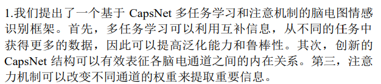
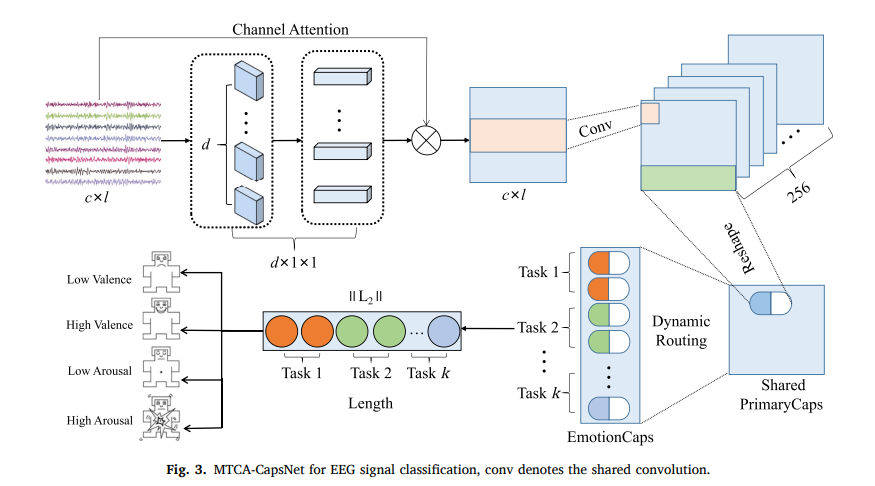
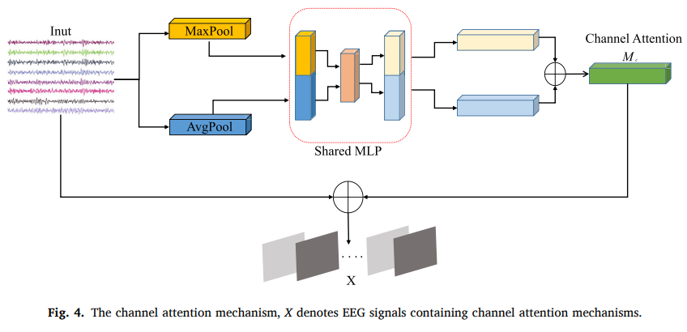
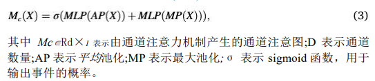
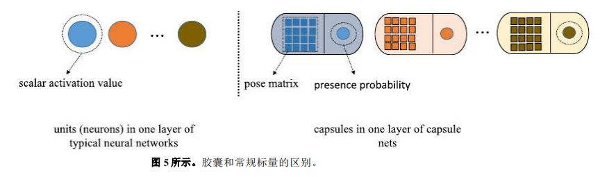
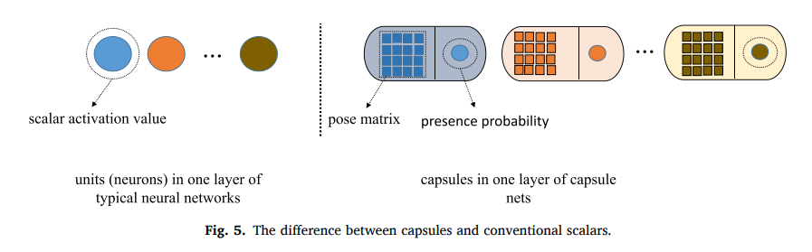

# Emotion recognition from EEG based on multi-task learning with capsule network and attention mechanism

基于多任务学习、胶囊网络和注意机制的脑电情绪识别

专有名词：
1，Electroencephalogram 脑电图EEG
2，Multi-task learning 多任务学习
3，Capsule network 胶囊网络
4，generalization and robustness泛化和鲁棒性
5，attention mechanism注意机制
英文：
1，a novel method新方法
摘要：
1，传统DL在EEG上是单任务模式，会忽略不同任务形成的互补性
2，好处：利用任务之间的共性和差异，同不同的任务当中获得更多的数据，提高泛化和鲁棒性
3，胶囊网络可以很好表现各个脑电信号之间的内在关系
4，注意机制改变不同通道的权重来提取重要信息
总结：方法在脑电情绪识别有效

总结：使用胶囊网络和注意机制的多任务的EEG情绪识别。这个MTCA-CapsNet比几个模型要相对地高

方法：
1，从不同的通道提取特征概率图，并与原始输入结合起来
2，通过进入共享卷积层和共享PrimaryCaps来生成共享参数
3，在EmotionCaps层进行参数分类

模型：
1，维度模型将情绪定义为维度空间中的点。它涉及到效价(情绪是积极的还是消极的)、觉醒(情绪的强度)和支配(代表对个体情绪状态的主观控制程度)。研究者提出了一种 2D 或 3D 模型:效价-觉醒和效价-觉醒-支配。本研究采用维度模型
2，2个阶段：
    一：从信号当中提取出有效特征，准确表征情绪状态
    二：设计一个分类器，从信号当中提取的情感特征来预测情感标签。但传统的分类器泛化能力和准确率较低，所以采用了CAPSNet和注意机制的多任务学习
        具体优势：
            1，多任务：共享互补信息以提高性能，从其他任务当中取得更多数据以提高性能。
            2，引入CapsNet，表征脑电通道关系，减少内存占用
            3，注意机制：改变不同通道的权重以探索信息

创新点：
    

MTCA：
    
    如图，MTCA用于脑电信号分类，conv表示共享卷积

注意机制流程图：
    
    step1：使用平均和最大池化操作聚合特征图的空间信息
    step2：空间信息被馈送到共享网络中
    step3：使用元素求和并合并输出特征向量来生成我们的通道注意力图.共享网络由一个带有隐藏层的，使用共享权重减少网络的训练参数 MLP 组成
    
多任务CapsNet:
    
胶囊网络：
    
    旧的ST-Capsule 由三层组成:卷积层，主胶囊层(PrimaryCaps)和情感胶囊层(EmotionCaps)。
    step1:首先，一个输入进入卷积层，通过卷积层提取低层特征。
    step2：PrimaryCaps 层将经过卷积层的实例编码为包含 EEG 信号属性的向量。
    step3：通过动态路由将 PrimaryCaps 层生成的表示馈送到EmotionCaps 中。每个任务在 EmotionCaps 中被分配一个胶囊（CapsNet 中的一组神经元，用于识别任务并将任务的属性编码为向量）

    传统ST-Capsule缺点： 每一种情绪状态只能分配一个胶
囊，并且任务是相互独立训练的，无法同时训练多个任务并学习相关
任务之间的相关性。
    我们提出的 MTCA-CapsNet 通过在其他相关任务中使用相关训练信号的信息，而不是单独训练每个任务，更好。

    MTCA-CapsNet 包含三个层:共享卷积层，共享 PrimaryCaps 层和 EmotionCaps 层。
    step1：卷积层从多个相关任务中学习共享特征表示
    step2：将共享的特征表示馈送到共享的 PrimaryCaps 中以生成向量。

    step3：在共享 Primary-Caps 和 EmotionCaps 之间实
现动态路由机制（EmotionCaps 层(顶层)由C 个 EmotionCaps 组成，其中每个 EmotionCaps 对应一个任务。每个胶囊的长度代表了输入样本属于这个任务的概率。每组参数的方向保留了特征的特性。），将当前 EmotionCaps 层连接到之前的 PrimaryCaps层。

优点：这个过程不仅捕获了部分整个空间关系通过转换矩阵，还通过加强这些胶囊之间的联系来传递信息，这些胶囊被分配在不同的层，并获得高水平的一致性。
