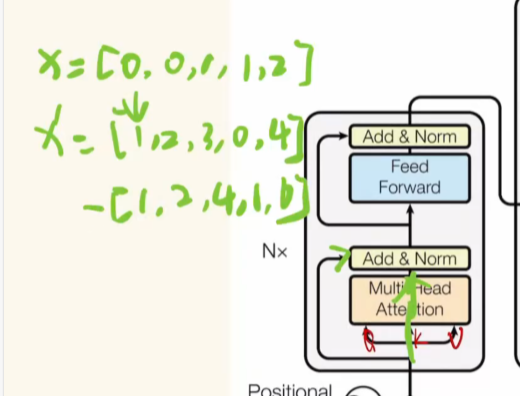

# 摘要：
近年来，基础模型在视觉表示学习领域引起了广泛关注，但现有的模型多用于处理RGB图像，对包含丰富场景信息的光谱数据关注不足，特别是在遥感应用中。为填补这一空白，作者首次提出了名为SpectralGPT的通用遥感基础模型，采用一种新颖的三维生成预训练变换器（3D-GPT），专门用于处理光谱遥感图像。

SpectralGPT具有以下优势：
1）逐步训练，能够处理不同大小、分辨率、时间序列和区域的图像数据，充分利用遥感大数据；
2）利用3D令牌生成实现空间-光谱耦合；
3）通过多目标重建捕捉光谱的时序特征；
4）在一百万张光谱遥感图像上进行训练，模型参数超过6亿。实验结果显示，预训练的SpectralGPT在场景分类、语义分割和变化检测等四种下游任务中表现出显著的性能提升，展现出光谱遥感大数据在地球科学领域的广阔应用前景
# 关键词：IndexTerms—
人工智能、深度学习、下游、基础模型、渐进式、遥感、光谱数据、张量掩码建模、变压器。

# 其他的积累：
## Marking（标记）和Augmentation（数据增强）是用于提升模型在处理光谱遥感数据时表现的关键方法。以下是这两种方法的具体处理方式：

### Marking（标记）：

论文中提到的Marking主要是指3D遮掩策略（3D Masking）。SpectralGPT对输入的光谱数据施加90%的遮掩，这意味着90%的空间-光谱块会被随机隐藏，仅保留10%的可见部分。
遮掩的3D块（称为“tokens”）是从空间和光谱两个维度划分出来的，尺寸通常为p × p × k，其中p为空间尺寸，k为光谱维度。
这种遮掩方法有助于模型在训练过程中学习到更深层次的空间和光谱之间的内在关系，同时降低了计算成本。
### Augmentation（数据增强）：

SpectralGPT使用了多种数据增强技术，以丰富输入图像的多样性，增强模型的泛化能力。具体方法包括：
随机裁剪：图像在原始尺寸的20%至100%范围内进行随机裁剪，然后调整为标准尺寸（如96×96像素或128×128像素）。
水平翻转：对图像进行随机水平翻转，以增加训练数据的变化性。
标准化和归一化：将光谱数据按通道分别归一化到[0, 1]范围或标准化为零均值和单位方差，以减少不同波段数据范围的差异性。
在模型微调过程中，还会使用其他数据增强技巧，如MixUp和CutMix，这些技术通过将不同样本融合在一起训练，进一步增加数据的多样性。

## 编码器（Encoder）
功能：编码器的主要任务是从输入的光谱图像中提取特征。它使用了基于Transformer的自注意力机制，可以处理光谱数据的空间和光谱维度。
工作原理：输入图像被划分为多个固定大小的patches（图像块），这些patches通过线性投影变换为特征向量。编码器通过多个自注意力层来学习这些patch之间的关系，从而生成对输入图像的深层特征表示。
## 解码器（Decoder）
功能：解码器的任务是根据编码器提取的特征来重建被遮掩的图像部分。它可以同时重建多个目标，从而有效保留光谱信息。
工作原理：解码器接收编码器输出的特征和遮掩的信息，使用类似的自注意力机制来生成恢复的图像块。解码器的设计使得模型能够捕捉到图像的空间和光谱特征，提升重建的准确性。
## MAE（Masked Autoencoder）框架
是一种自监督学习模型，主要用于图像和其他视觉数据的预训练。MAE的核心思想是通过遮掩输入数据的部分信息来学习有效的特征表示。以下是MAE框架的几个关键特点和工作原理：

1. 框架结构
编码器-解码器结构：MAE通常采用编码器-解码器架构。编码器负责将输入数据转换为潜在表示，而解码器则负责从潜在表示重建原始数据。
自注意力机制：在编码器中，MAE通常使用自注意力机制（如Transformer架构）来捕捉数据中的长程依赖关系和上下文信息。
2. 遮掩策略
数据遮掩：在训练过程中，MAE会随机遮掩输入数据的部分（例如图像中的一些patches），通常遮掩率较高（如75%或90%）。这样，模型在训练时只能看到一部分输入信息，迫使其学习如何利用已知信息推测缺失的信息。
重建任务：模型的任务是重建被遮掩的部分。通过这种方式，模型能够学习到输入数据的全局和局部特征。
3. 自监督学习
无标签训练：MAE框架可以在没有标签数据的情况下进行训练。由于模型通过重建任务学习表示，它不需要依赖标注信息，适合于大规模未标记数据的处理。
特征表示：通过对遮掩部分的有效重建，MAE能够学习到输入数据的有用特征，这些特征可以被用于下游任务（如分类、分割等）。
4. 应用
MAE框架广泛应用于计算机视觉领域，特别是在图像分类、目标检测和语义分割等任务中。由于其自监督的特性，MAE能够利用大量未标记的数据进行有效预训练，从而提升模型在下游任务中的性能。
5. 与其他框架的比较
相较于传统的自编码器，MAE通过遮掩策略更强地强调了输入数据的上下文关系，有助于捕捉数据中的重要特征。
MAE的设计灵感也受到了语言模型（如BERT）的影响，通过双向学习增强了对输入数据的理解能力。
总结
MAE框架通过自监督学习和数据遮掩策略，为模型提供了强大的特征学习能力，能够有效处理各种视觉任务。它在现代深度学习中的应用越来越广泛，为许多视觉应用提供了新的解决方案。

# 渐进式训练方式（Progressive Training）
是一种逐步增加训练强度和复杂度的训练策略，通常用于机器学习和深度学习模型的训练。该方法的基本思想是：

分阶段训练：将训练过程分成多个阶段或阶段性任务。在每个阶段，模型首先在相对简单或基础的数据集上进行训练，以便快速学习初始特征。

逐步增加难度：在模型掌握了基础知识后，逐步引入更复杂或更具挑战性的数据。这可以是增加数据集的规模、数据的多样性，或者引入更复杂的任务。

提高模型的泛化能力：通过这种方式，模型能够逐步适应更复杂的模式，从而提高其在新数据上的泛化能力。

减少过拟合风险：渐进式训练可以帮助模型在初期避免过拟合简单数据集，同时逐步引导其学习更复杂的特征。

# 基于Transformer的自注意力机制（Self-Attention Mechanism）
是自然语言处理和计算机视觉等领域中一种重要的机制，主要用于捕捉输入序列中不同位置之间的依赖关系。它是Transformer架构的核心组成部分，以下是其基本概念和工作原理：

基本概念
自注意力：自注意力机制允许模型在处理序列时，关注序列中不同位置的元素。通过计算输入序列中每个元素与其他元素的相关性，模型可以动态地调整对每个元素的重视程度。

输入表示：输入序列通常被表示为一组向量（例如，词嵌入）。每个向量对应序列中的一个元素（如单词）。

查询、键和值：

查询（Query）：表示当前元素的特征。
键（Key）：表示其他元素的特征。
值（Value）：表示要从其他元素中提取的信息。
工作原理
计算注意力得分：对于输入序列中的每个元素，通过将查询向量与所有键向量进行点积，计算其与其他元素的相似度得分。

归一化：使用Softmax函数对得分进行归一化，得到每个元素的重要性权重。

加权求和：根据计算出的权重，对值向量进行加权求和，得到该元素的新表示。这一表示综合了其他所有元素的信息，反映了当前元素在上下文中的重要性。

并行计算：自注意力机制允许并行计算，因为每个元素的处理是独立的，这在序列长度较长时可以显著提高计算效率。

优势
捕捉长程依赖：自注意力机制能够有效捕捉长距离依赖关系，相比于传统的RNN结构，它在处理长序列时更具优势。
灵活性：自注意力机制可以灵活调整各元素间的注意力关系，能够适应不同上下文的需求。
并行化：由于输入序列中的元素可以独立处理，自注意力机制支持并行计算，提升了训练效率。
基于Transformer的自注意力机制在许多任务中表现优异，包括机器翻译、文本生成和图像处理等。

# 语义分割（Semantic Segmentation）
是一种计算机视觉任务，旨在将图像中的每个像素分类到一个特定的类别中。与传统的图像分类任务不同，语义分割不仅要识别图像中物体的类别，还需要精确地定位这些物体的边界。以下是语义分割的一些关键概念和应用：

关键概念
像素级分类：语义分割将图像分割成多个区域，并对每个像素进行分类。每个像素被赋予一个类别标签，例如“人”、“车”、“树”等。

类别标签：通常，语义分割的目标是为图像中的每个像素分配一个类别标签，类别可以是事先定义好的，例如“天空”、“建筑”、“道路”等。

全局上下文：语义分割不仅关注局部特征，还考虑图像的全局上下文，从而提高分类的准确性。

工作原理
语义分割通常使用深度学习模型来实现，常见的方法包括：

卷积神经网络（CNN）：通过使用卷积层提取图像特征，常见的结构如U-Net、SegNet、DeepLab等。

上采样（Upsampling）：将低分辨率的特征图恢复到与原始图像相同的分辨率，以便为每个像素生成类别标签。

条件随机场（CRF）：有时会在语义分割后应用CRF等后处理步骤，以改善边界的精确度和一致性。

应用场景
语义分割在许多领域都有广泛应用，包括：

自动驾驶：帮助车辆识别道路、行人、交通标志等，确保安全驾驶。

医学影像分析：用于分割医学影像中的器官、病变等结构，辅助医生进行诊断。

农业监测：分析卫星或无人机拍摄的图像，以监测农作物的生长状况和土地利用。

场景理解：在计算机视觉中，语义分割可用于对场景进行深度理解，如机器人导航、增强现实等。

总结
语义分割是计算机视觉中的一项重要任务，通过像素级别的分类，帮助机器理解和分析图像中的内容。随着深度学习技术的发展，语义分割的准确性和应用范围不断扩大，对各行业的智能化发展起到了重要的推动作用。

# 注意力
意义：可以分配注意力，希望模型给数据注意力，注意到的东西，就给他数据上分析。模型对一个有限的资源分配的一个过程。权重的问题。

三个中间值：
Q(query)：条件：关注的东西回根据当前领到的任务，给它们一些不同的关注的分数
K：自然情况下，我们给它的一些关注的情况
V：编码的结果
α：由K，Q共同决定，分配怎样注意力的情况（注意力分数）

计算：
step1：由Q和K决定注意力的分数α
step2：将物体抽象成V(value),将分数作用在v上

自注意力：QKV三个箭头来源于同一个地方
交叉注意力：不是来源于同一个地方

不同的参数对一样的数据处理，生成了Q，K，V

掩码Masked注意力：token（输入的长度是固定的），如果某一组数据长度不达到token的固定，将后面不足的数据“盖住”
Multi—Head多头注意力：计算的两步多做几组，它们互不干扰，各自计算，最后融合到一起
# Tronsformer：
最开始仅是用在翻译上的
左边一块是编码器，右边是解码器
feed forward：全连接
Positional encoding：位置编码

Add:单纯的加（连接之前没有计算的某一步的东西），可以效果好一些

Norm：规范化，不至于让模型变深的过程中越来越多大

训练：

损失函数：
实际上是分类问题，用交叉熵损失函数

# 生成式学习（Generative Learning）和Transformers关系紧密
尤其是在深度学习领域，二者结合可以更好地用于复杂数据的生成和特征学习。以下是生成式学习和Transformers之间的关键关系及其工作原理：

1. 什么是生成式学习？
生成式学习是一种学习数据分布的方法，通过观察已有数据生成新的数据。模型通过学习数据的概率分布去理解其结构和特征，之后可以基于此分布生成相似的数据。生成式学习广泛应用于文本生成、图像生成、填补数据空缺（如遮掩重建）等任务。

2. Transformer在生成式学习中的应用
Transformers以其强大的自注意力机制，特别适合生成式学习中的序列建模和上下文信息捕捉。以下是Transformers在生成式学习中的常见应用：

自回归生成：通过自回归方式生成序列数据，即模型基于先前的输出一步步生成新的数据。这在文本生成和语音生成等任务中常见，例如GPT（Generative Pretrained Transformer）就是一种基于自回归的Transformer生成模型。
遮掩生成（Masked Generation）：Transformer的自注意力机制可以让模型通过观察部分数据来预测缺失部分，比如BERT使用的Masked Language Modeling（MLM）策略。SpectralGPT中3D遮掩策略的设计类似，它利用Transformer在遮掩数据条件下进行生成学习，通过填补遮掩的块来理解图像的整体结构。
3. 生成式Transformers的工作流程
在生成式学习中，Transformer通常会通过以下方式实现数据生成：

编码输入数据：编码器将输入数据转换为一系列高维特征向量，捕捉数据中关键的上下文信息和内部结构。
注意力机制学习上下文：Transformer中的自注意力机制可以“关注”输入数据的各个部分，从而使模型生成的数据能够符合原数据的上下文。这一特性在生成时尤为重要，因为生成数据时需要考虑全局和局部的关联性。
生成或重建缺失数据：在生成式学习中，模型可以利用解码器来还原被遮掩或缺失的信息。例如，MAE和SpectralGPT中的解码器基于输入的特征生成遮掩区域，从而实现重建，提升了模型的生成能力。
4. 生成式学习中的Transformer优势
Transformer在生成式学习中相比其他网络结构有独特优势：

并行处理：自注意力机制使Transformer能够同时处理输入的多个数据块（而不是逐一顺序处理），加快了生成速度。
强大的上下文学习能力：生成式学习要求模型能够理解数据的全局结构，Transformer的注意力机制可以很好地建模远距离的依赖关系，使生成内容更加连贯和合理。
适应多模态数据：Transformer可以处理不同模态的数据（如文本、图像、点云等），在生成式学习中更灵活，适合融合多模态信息。
5. 生成式学习和Transformer结合的实际应用
文本生成：GPT-3和ChatGPT通过自回归的生成方式，基于Transformer生成自然语言文本。
图像生成：如DALL-E使用Transformer生成图像，通过生成式学习对图像的像素空间进行建模。
多模态生成：在遥感领域，如SpectralGPT，生成式学习结合Transformer用于图像或光谱数据的生成和重建，可以通过遮掩块生成完整图像，从而用于数据的特征提取和分析。
总结
生成式学习和Transformer的结合是为了充分利用Transformer的自注意力机制，让模型在生成新数据时能够保持与原数据一致的上下文结构，从而实现更好的生成效果。这种结合方式不