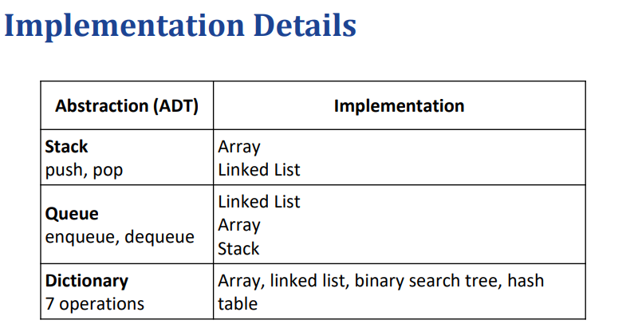
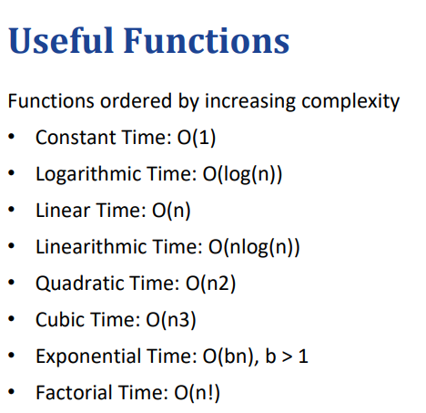
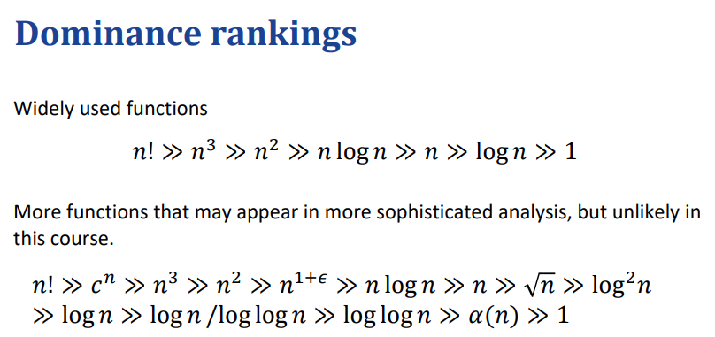
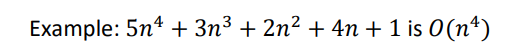

# Data structure

A data structure is a systematic way of organizing and accessing data. (Goodrich 
et al.)
• Systematic（系统）: a general approach that can be used to many objects.
• Organizing data: storing data
• Accessing data: retrieving data
# ADT

# Components of an algorithm:
Input – process – output
## Time complexity:
define the time complexity of an algorithm as the number of primitive operations it takes to complete the task.

计算：忽略常数因子和较低影响的多项式，eg：

## Space Complexity
词汇：auxiliary space辅助内存
