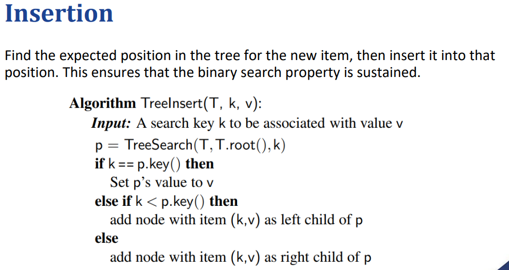
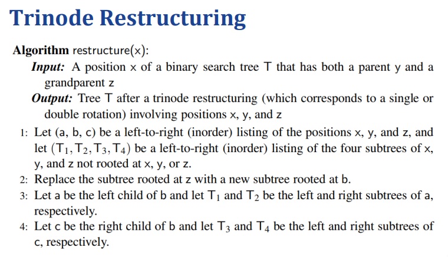
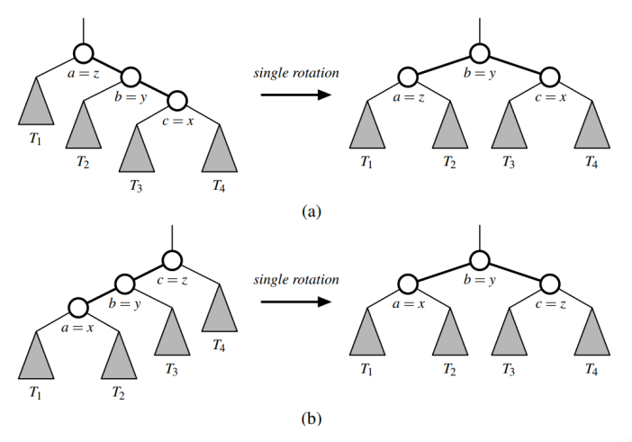
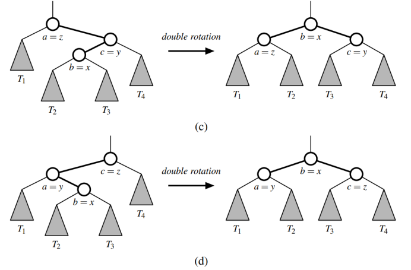
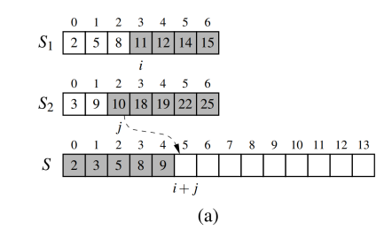
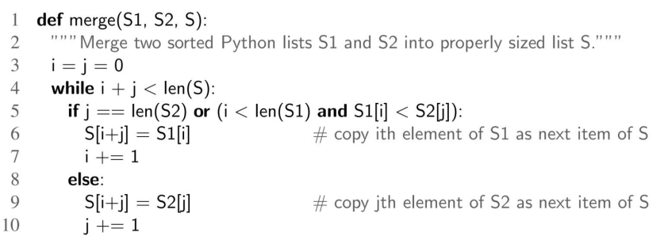
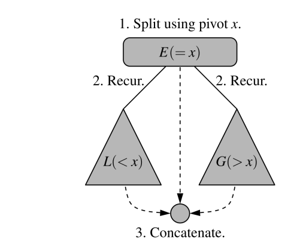
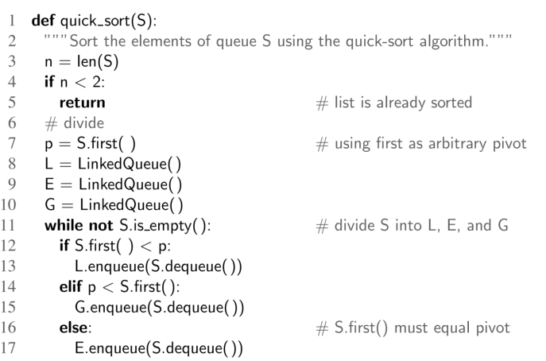
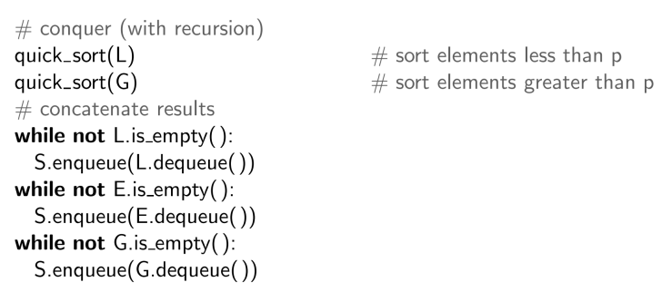

# 二叉搜索树：
## insertion

找到对应的位置，然后再将值放入
## 删除：
情况 1：删除没有子节点的节点
操作：如果一个节点没有子节点（即叶子节点），我们只需要将它从树中删除即可。
效果：删除该节点后，树的结构不再有它。
情况 2：删除有一个子节点的节点
操作：如果要删除的节点有一个子节点，我们将这个节点删除，并用它的唯一子节点代替它的位置。
效果：树中的该节点被其子节点取代，子节点保持原来的位置，父节点则指向这个新的子节点。
### 情况 3：删除有两个子节点的节点
操作：删除一个有两个子节点的节点，处理比较复杂。我们需要：

找到该节点的前驱节点（即在它的左子树中最大的节点，记为r）。
将该节点（p）替换为其前驱节点r的位置。
然后将r从其原本的位置删除。
其中，前驱节点r是p的左子树中最大的节点，因为在二叉搜索树中，左子树中的最大节点一定小于p，而右子树中的最小节点一定大于p。因此，r是一个可以替代p的位置的合法节点。

具体步骤：

将r放到p的位置，这样r就成为了新的根节点。
删除r原来的位置（因为r已经移动到p的位置），而r的原位置可以直接是一个叶节点或只有一个子节点的节点（这就变成了情况1或情况2的删除问题）。

#### 注意，这个地方的r节点一定是没有右子树的，原因：
r没有右子节点：r是左子树中最大节点，如果它有右子节点，那么右子节点会比r大，违反了r是左子树中最大的节点这一前提。因此，r的右子树是空的，r不会有右子节点。

二叉树的退化：如果我们按递增或递减顺序插入带有键的项目，则会出现这种最坏情况的配置。

## 旋转
如果在旋转之前，位置x是位置y的左子节点，那么在旋转之后，位置y将变成位置x的右子节点，反之亦然。
此外，我们还需要重新链接那些键值位于正在旋转的两个位置之间的子树
因为一次旋转只修改一个常数数量的父子关系，所以可以在O(1)的时间内实现，前提是使用链式二叉树表示法。

复杂度：做一次就是O(1)

问题：遇到什么样的条件才去执行“旋转”这个操作呢？
就是在实际维护一个BST的时候，遇到怎么样的条件才去执行旋转？

# Sort
## Merge-Sort
归并排序
分治法：Divide-and-Conquer

分解：如果输入数据的大小小于某个阈值（例如，只有一个或两个元素），则直接使用简单的方法解决问题并返回得到的结果。否则，将输入数据分成两个或更多不相交的子集。
解决：递归地解决与这些子集相关的子问题。
合并：将子问题的解决方案合并成原问题的解决方案。

归并排序的分治法：

分解：如果S的元素个数为零或一个，立即返回S，因为它已经是排序好的。否则（S至少有两个元素），从S中移除所有元素，并将它们分成两个序列S1和S2，每个序列包含大约一半的S元素；即，S1包含S的前⌊n/2⌋个元素，S2包含剩下的⌈n/2⌉个元素。

解决：递归地对序列S1和S2进行排序。

合并：通过将已排序的序列S1和S2合并成一个有序序列，重新将元素放回S中。

归并排序的时间复杂度始终是 O(n log n)，即使在最坏情况下也不受影响，比较稳定。

eg:如何合并？

看成2个队列，2比3小，2放入；3比5小，3放入；5比9小，5放入……

## Quick Sort快速排序
分解：如果序列 S 至少有两个元素，选择一个特定元素 x 作为枢轴（pivot）。然后将序列中的元素重新组织成三个部分：

L，存储序列 S 中小于 x 的元素；
E，存储序列 S 中等于 x 的元素；
G，存储序列 S 中大于 x 的元素。

Conquer：递归地对序列 L 和 G 进行排序。

合并：将 L、E 和 G 合并成一个单一的排序序列。

