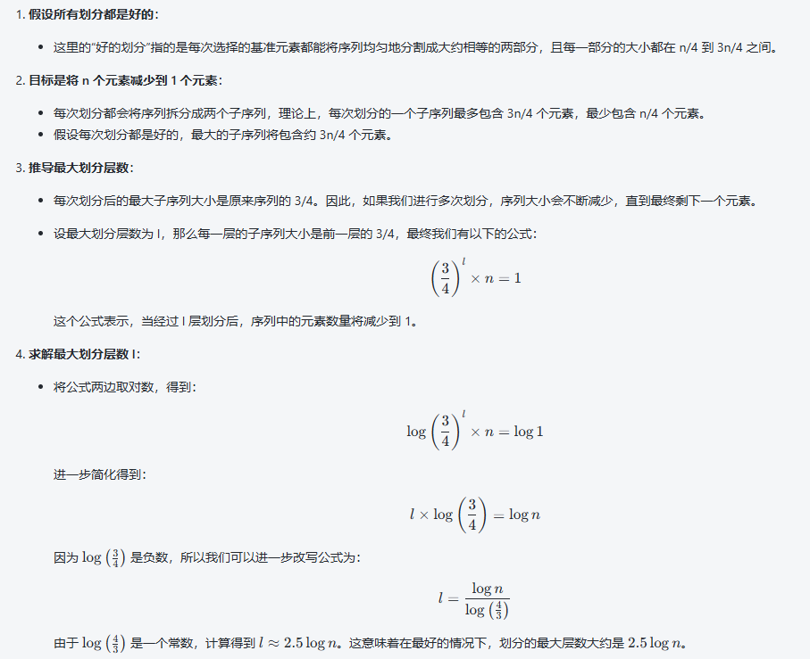
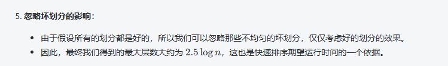
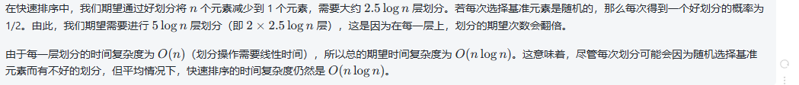
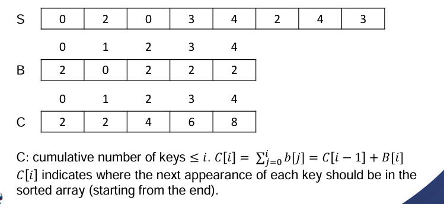
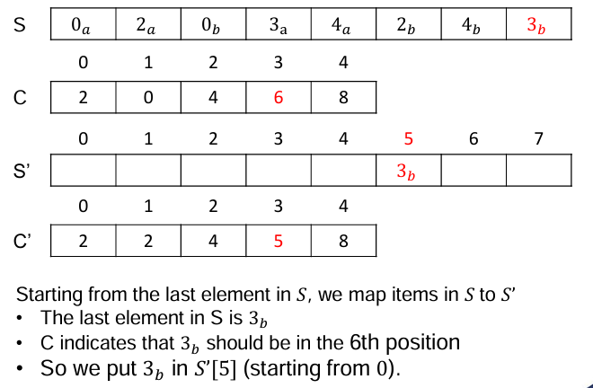
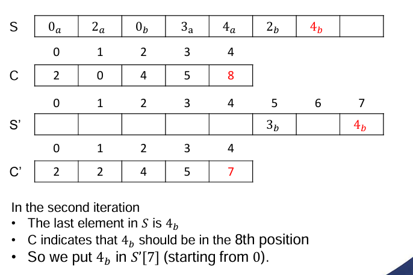
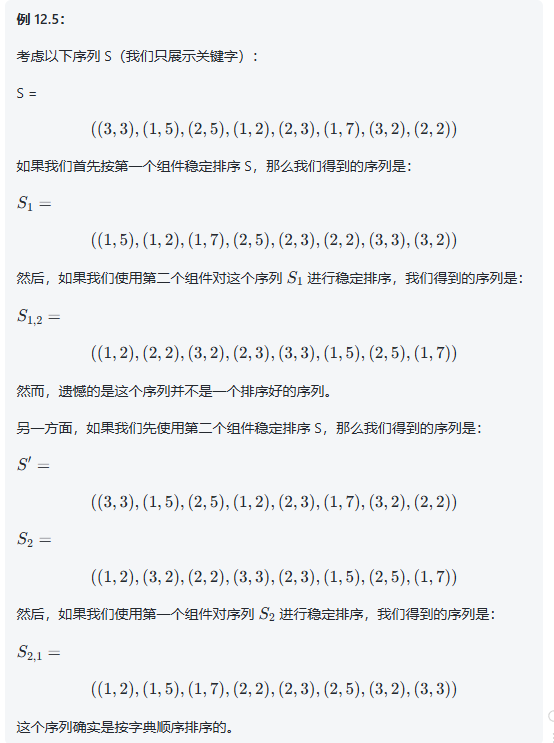

# 随机化的快速排序:
上节课的快排是选取最末尾的元素作为基础元素
快速排序的性能取决于pivots的质量，好的元素会拆分成平衡的部分
最佳情况下，复杂度为：nlogn
如果每次都是选取了最大/小的元素，算法会退化成n^2

# 桶排序
寻找特定的序列的情况下速度更快的方法：

**桶排序**

对一个包含 \( n \) 个键（整数）的序列 \( S \) 进行排序。

- **假设**：这些整数位于范围 \([0, N-1]\) 内。
- **桶数组 \( B \)**：一个大小为 \( N \) 的数组，其中每个槽位是一个桶。

**排序过程**：
1. **计数**：将 \( S \) 中的每个键 \( k \) 移动到数组 \( B[k] \) 中对应的桶，就像哈希函数映射，其中 \( h(k) = k \)。
2. **排列**：按顺序将桶数组 \( B \) 中的项移回序列 \( S \)，从而构建一个已排序的序列。

桶算法是不稳定的算法，要将他们稳定，则要以下做法：

按照它们出现的顺序将原始数组中的相等键映射到排序数组。为此，我们需要一个辅助的 cumulative counting 数组来指示每个键的下一次出现应该在哪里。

所需时间：O(n+N)
# 基数排序

可能需要多个关键字来确定元素之间的顺序。如果两个元素的主关键字相同，我们会比较它们的次关键字，以确定它们的相对顺序。

在这种情况下，如何依赖两次稳定排序来对元素进行排序呢？是先对主关键字排序，还是先对次关键字排序？

先对第二个组件排序，然后再排第一个：

**基数排序的时间复杂度**

**命题 12.6**：设 \( S \) 是一个包含 \( n \) 个键值对的序列，其中每个键为 \( (k_1, k_2, \dots, k_d) \)，其中 \( k_i \) 是一个整数，范围为 \( [0, N-1] \)，其中 \( N \geq 2 \) 是一个整数。我们可以使用基数排序在 \( O(d(n + N)) \) 的时间内按字典顺序排序序列 \( S \)。

基数排序可以应用于任何可以视为多个较小部分的复合键，这些部分需要按字典顺序排序。例如，我们可以将其应用于排序中等长度的字符字符串，因为每个字符可以表示为一个整数值。