# Graphs-图的基础概念
基本概念：
node/Vertices:节点
edge:路径

In data structure, a graph is a collection of vertices and edges.
## 类型
有向图vs无向图
有权重图vs无权重图

End vertices端点：由一条边连接的两个顶点称为该边的端点（或端点）。

Origin and destination起点和终点：如果一条边是有向的，它的第一个端点是起点，另一个是终点。

Adjacency邻接：如果存在一条边，其端点为顶点 u 和顶点 v，则称顶点 u 和顶点 v 为邻接顶点。

Incident相交：如果一个顶点是某条边的端点之一，则称该边与该顶点相交。

End points端点：A 和 B 是边 AB 的端点。

Origin and Destination 起点和终点：对于边 AB，A 是起点，B 是终点。

Adjacency 邻接：B 与 A 邻接，但 A 不与 B 邻接。

Incident 相交：边 AB 与顶点 A 和 B 相交。

顶点的出边是起点为该顶点的有向边。

顶点的入边是终点为该顶点的有向边。

顶点 v 的度，记作 deg(v)，是与 v 相交的边的数量。

顶点 v 的入度和出度分别是 v 的入边和出边的数量，分别记作 indeg(v) 和 outdeg(v)。

## 图的定义：

Parallel edges or Multiple edges
平行边或多重边：

• 两条无向边具有相同的端点。

• 两条有向边具有相同的起点和终点。

Self-loop: 自环：如果一条边（无向或有向）的两个端点重合，则称该边为自环。

Simple graph 简单图：简单图是指没有平行边或自环的图。

path 路径：路径是一个交替的顶点和边的序列，起始于一个顶点，结束于另一个顶点，并且每条边都与其前驱和后继顶点相交。简单来说，路径就是一系列连接的边。

cycle ：环是一个路径，它的起点和终点是同一个顶点，并且包含至少一条边。

Simple path 简单路径：如果路径中的每个顶点都不同，则称该路径为简单路径。

Simple cycle 简单环：如果环中的每个顶点都不同，除了起点和终点相同，则称该环为简单环。

有向路径：有向路径是指路径中的所有边都是有向的，并且按其方向遍历。

Acyclic 无向图：如果一个有向图没有有向环，则称该图为无环图。

Reachability 可达性：给定一个（有向）图 G 中的顶点 u 和 v，我们说 u 可达 v，并且 v 从 u 可达，如果 G 中存在一条从 u 到 v 的（有向）路径。

在无向图中，可达性的概念是对称的，即当且仅当 v 可达 u 时，u 也可达 v。

Connected graph 连通图：如果图中的任意两个顶点之间都有路径相连，则称该图为连通图。

Strongly connected graph: 强连通图：一个有向图 G 是强连通的，当且仅当对于 G 中的任意两个顶点 u 和 v，u 可达 v 且 v 也可达 u。

subgraph 子图：一个图 G 的子图是一个图 H，其中 H 的顶点和边分别是 G 的顶点和边的子集。

spanning subgraph 生成子图：G 的生成子图是一个子图，其中包含 G 中的所有顶点。

connected components 连通分量：如果一个图 G 不是连通的，则其最大连通子图称为 G 的连通分量。

森林：森林是一个没有环的图。

树：树是一个连通森林，即一个连通的没有环的图。

spanning tree 生成树：一个生成树是一个生成子图，并且它是一个树。

## 图的性质

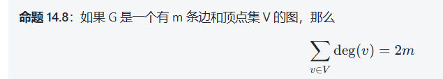
在命题 14.8 中，\(\text{deg}(v)\) 表示顶点 v 的度数，即与 v 相连的边的数量；因此，所有顶点的度数之和等于图中所有边的数量的两倍，因为每条边都与两个顶点相连。

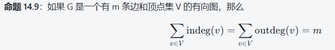
在命题 14.9 中，\(\text{indeg}(v)\) 表示顶点 v 的入度，即指向 v 的边的数量，\(\text{outdeg}(v)\) 表示顶点 v 的出度，即从 v 出发的边的数量。对于一个有向图，所有顶点的入度和出度之和都等于图中的边数 m。

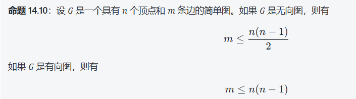
在命题 14.10 中，无向图的边数上限是 \(\frac{n(n - 1)}{2}\)，因为每对不同的顶点最多可以由一条边连接；而有向图的边数上限是 \(n(n - 1)\)，因为每对不同的顶点最多可以由一条有向边连接（指向和被指向）。

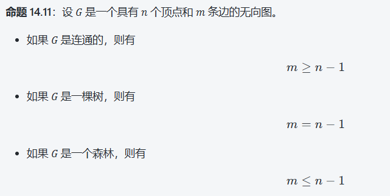
如果图是连通的，则最少需要 \(n - 1\) 条边来连接所有顶点。 

- 如果图是树，且为连通无环图，则有恰好 \(n - 1\) 条边。  

- 如果图是森林（即由若干棵树组成的无环图），则边数最多为 \(n - 1\) 条，因为每棵树都是连通的且没有环。

# 图的代码实现

我们将该抽象建模为三种数据类型的组合：顶点(Vertex)、边(Edge)和图(Graph)。

顶点(Vertex) 是一个轻量级对象，存储用户提供的任意元素（例如，机场代码）。
边(Edge) 也存储一个相关联的对象（例如，航班号、旅行距离、费用），可以通过 element() 方法获取。此外，我们假设边支持以下方法：
endpoints()：返回一个元组 (u, v)，其中顶点 u 是边的起点，顶点 v 是边的终点；对于无向图，方向是任意的。
opposite(v)：假设顶点 v 是边的一个端点（无论是起点还是终点），返回另一个端点。

图的存储形式：

邻接矩阵或邻接表adjacency matrix or adjacency list

## 邻接矩阵的方式：
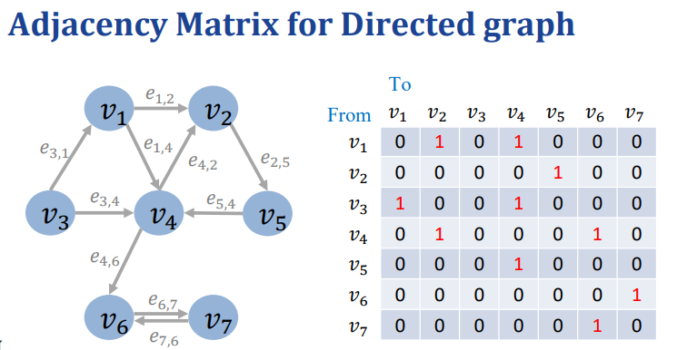

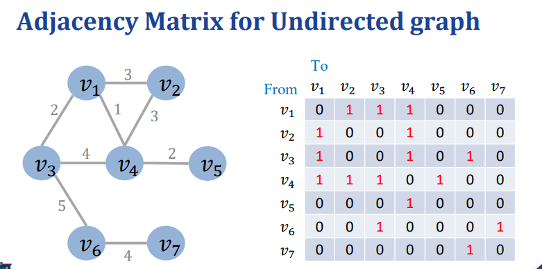

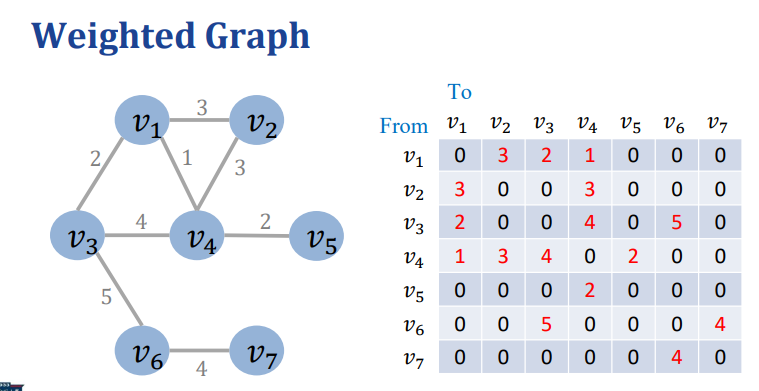

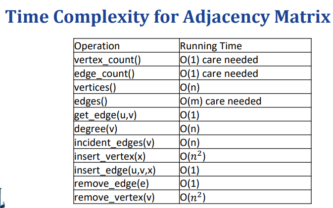


用二维数组存储
int g[NUM][NUM]
无向图：g[i][j]==g[j][i]
有向图：g[i][j]!=g[j][i]
权值：这个数组存储着的就是权值g[1][2]=3等
用g[i][j]=INF表示两个点之间无边

优点：适合稠密图，编码简单，速度快

缺点：1，占用空间极大（一般容易超出限制）2，一般不能存储重边，比如v和u之间存在多个边（他们的费用和容量不同），不能重合的，但如果这个参数值只是来表示边的数量，也算是存储了重边

```py
class Graph:
    def __init__(self, num_vertices):
        self.num_vertices = num_vertices
        self.adj_matrix = [[0] * num_vertices for _ in range(num_vertices)]

    def add_edge(self, v1, v2, weight=1):
        # Assuming the graph is undirected
        self.adj_matrix[v1][v2] = weight
        self.adj_matrix[v2][v1] = weight

    def remove_edge(self, v1, v2):
        self.adj_matrix[v1][v2] = 0
        self.adj_matrix[v2][v1] = 0

    def print_adj_matrix(self):
        for row in self.adj_matrix:
            print(row)


# Example usage:
if __name__ == "__main__":
    num_vertices = 5
    graph = Graph(num_vertices)

    graph.add_edge(0, 1)
    graph.add_edge(0, 4)
    graph.add_edge(1, 2)
    graph.add_edge(1, 3)
    graph.add_edge(1, 4)
    graph.add_edge(2, 3)
    graph.add_edge(3, 4)

    print("Adjacency Matrix:")
    graph.print_adj_matrix()

```

## 邻接表的形式：
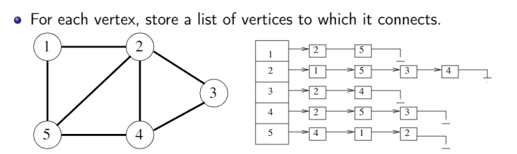

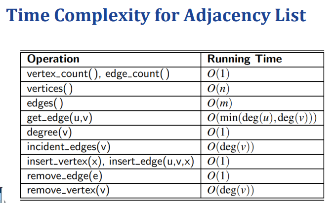

在邻接表中，图的每个顶点都对应一个列表，列表中包含了该顶点直接连接的其他顶点。这些列表可以用链表、数组或其他数据结构来实现。

对于有向图或无向图，邻接表的构建方式有所不同：

对于有向图，每个顶点的邻接表存储其指向的顶点；
对于无向图，每个顶点的邻接表存储与其相邻的顶点。
邻接表相比邻接矩阵在空间上更为节省，特别是在稀疏图（边数相对顶点数较少）的情况下。它的插入和删除操作效率较高，但是在查找两个顶点之间是否有边时效率稍低。

优点：存储的效率非常高，只需要和边数成正比的空间，存储复杂度(V+E)，可以存储重边，
缺点：编程较为麻烦，访问，修改也较为慢一些

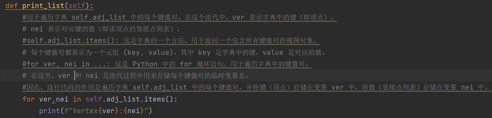

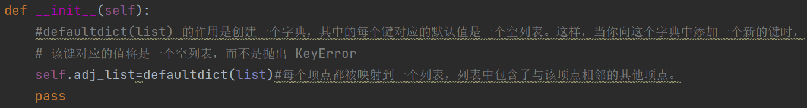

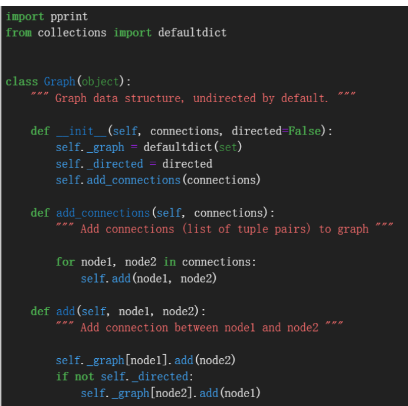

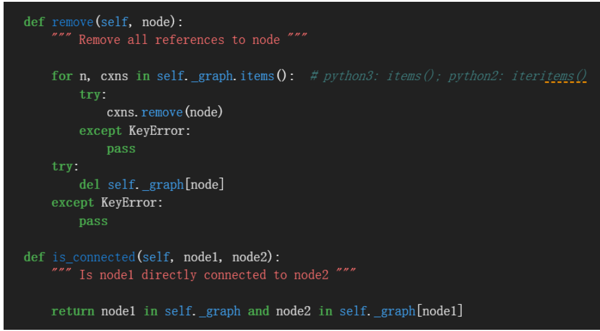