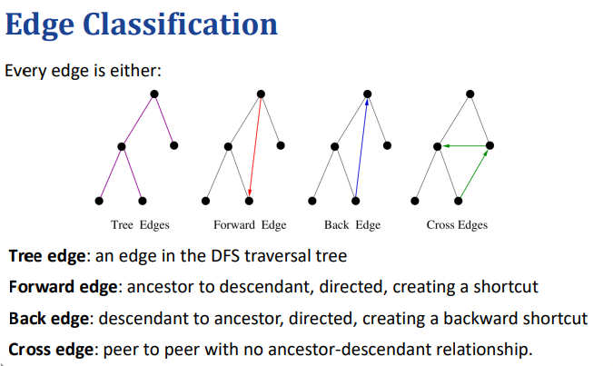

# Graphs Traversals

## 介绍：
图遍历算法是解决许多与图相关的基本问题的关键，特别是涉及可达性的概念，例如判断如何从一个顶点到另一个顶点，或者图是否是连通的等问题。
主要的可达性相关问题：
计算从顶点 𝑢 到顶点 𝑣 的路径，或者报告没有这样的路径。 
给定图 𝐺 的起始顶点 𝑠，计算图中每个顶点 𝑣 与 𝑠 的最短路径，或者报告没有这样的路径。 
测试图 𝐺 是否连通。 
计算图 𝐺 的生成树（如果图 𝐺 连通）。 
计算图 𝐺 的连通分量。 
计算图 𝐺 中的环，或者报告图 𝐺 无环。 

## DFS
DFS的过程：
从一个给定的节点开始，递归地访问其所有未访问的邻居。 
如果当前节点没有更多未访问的邻居，则回溯到父节点继续查找未访问的邻居。 
重复这一过程，直到所有节点都被访问过，或者没有新的节点可访问。 
深度优先搜索树：
DFS 在图中形成一棵树，根节点是起始节点，遍历过程中的节点关系形成树的父子关系。



Edge 边的分类：
树边：DFS 树中的边，从一个节点到它的子节点。 
前向边：从一个节点到其后代的边。 
回边：从子节点到祖先节点的边，表示图中有环。 
横向边：两个不在祖先-后代关系中的节点之间的边。 

DFS的性质：
无向图：
连通分量Connected Component：DFS能够遍历并标记出与起始顶点 \( s \) 在同一连通分量中的所有顶点。

生成生成树Spanning Tree：DFS的发现边（即从已访问的顶点到新访问的顶点的边）会形成一个生成树，并且这棵树是该连通分量的生成树。这个树没有环，因此是一个树结构。
强连通性：对于有向图，DFS 会访问所有从起始节点可达的顶点。

有向图：
**可达顶点**：在有向图中，DFS从某个顶点 \( s \) 开始时，能够遍历到所有从 \( s \) 可达的顶点。具体来说，DFS会访问所有可以通过有向边从 \( s \) 到达的顶点。
**DFS树**：DFS的遍历会形成一棵树，其中从起始顶点 \( s \) 到达每一个可达的顶点都有一条有向路径。

DFS的运行时间：
DFS 在图中每个顶点最多访问一次，每条边最多检查两次（无向图）或者一次（有向图）。因此，DFS 的时间复杂度为：
对于一个含有 𝑛 个顶点和 𝑚 条边的图，DFS 的时间复杂度是 O(𝑛 + 𝑚)。 

1，DFS的实现：
DFS 可以通过递归或使用栈来实现。每次访问一个顶点时，将其标记为已访问，并通过递归访问其邻居。为了构建DFS树，我们可以使用一个字典来记录每个顶点的发现边。


discovered结构：节点是存储某个点，值是存储某个边,eg:d[B]=(A,B),这个词典：对内，可以保存那些点访问过，对外，可以呈现搜索树

2，u到v路径的重建：


这里u必须是dfs的节点！！！
```python
def construct_path(u, v, discovered):
    """
    给定从顶点 u 到 v 的深度优先搜索（DFS）发现序列和父节点信息，
    返回从 u 到 v 的路径（按顺序排列）。

    参数:
    u: 起始顶点
    v: 目标顶点
    discovered: 包含每个顶点的父节点的字典（如发现时间等）
    
    返回:
    path: 从 u 到 v 的路径列表
    """
    path = []  # 用于存储从 v 到 u 的路径
    if v in discovered:  # 如果 v 是被发现的节点（v是可达的）
        path.append(v)  # 首先加入目标顶点 v
        walk = v
        
        # 逐步回溯，直到回到起点 u
        while walk != u:
            walk = discovered[walk]  # 通过父节点回溯
            path.append(walk)  # 将当前顶点加入路径
        
        path.reverse()  # 因为是从 v 回溯到 u，最终需要反转路径顺序
    
    return path
```

检测图的连通性：


无向图：通过一次 DFS，如果所有顶点都能访问到，则图是连通的。 
有向图：需要进行两次 DFS，第一次从任意一个顶点开始，检查是否能访问所有顶点，第二次反转所有边，再次进行 DFS，检查是否能从所有顶点回到起始顶点。 


1. **计算所有连通分量**

在一个图中，如果存在多个连通分量，可能需要找出所有的连通分量。对无向图而言，连通分量是图中顶点集合的最大子集，子集内的任意两个顶点都有路径相连。对于有向图，则是**强连通分量**，即每个分量中的每一对顶点都能相互到达。

#### **计算所有连通分量的过程**：

- 如果在一次 DFS 中，未能访问到所有的顶点，说明图是非连通的。此时，我们可以在未访问的顶点中选择一个新的顶点，重新执行 DFS，直到所有的顶点都被访问。


```python
def DFS_complete(g):
    """Perform DFS for entire graph and return forest as a dictionary.
    Result maps each vertex v to the edge that was used to discover it. 
    (Vertices that are roots of a DFS tree are mapped to None.)"""
    
    forest = {}  # 初始化一个字典，forest 用来存储结果

    # 遍历图中所有的顶点
    for u in g.vertices():
        if u not in forest:  # 如果顶点 u 尚未被访问过（即不在 forest 中）
            forest[u] = None  # 将 u 标记为 DFS 树的根节点（没有父边，所以是 None）
            DFS(g, u, forest)  # 从顶点 u 开始执行 DFS
            
    return forest  # 返回整个森林（包含每个顶点及其发现边）
'''
详细解释：
DFS_complete(g):
这个函数的目的是对图 g 执行一次完整的 DFS 搜索，并返回一个字典 forest，其中每个顶点 v 被映射到用来发现它的边。如果某个顶点是 DFS 树的根节点，它会被映射到 None。

forest = {}:
初始化一个空字典 forest，该字典用于记录每个顶点的发现信息。最终，它将存储每个顶点及其对应的父边。对图中所有的顶点，字典 forest 的键是顶点，值是从哪个边发现的该顶点（对于根顶点，值为 None）。

for u in g.vertices()::
遍历图 g 中的每一个顶点 u。假设 g.vertices() 返回一个包含所有顶点的可迭代对象。

if u not in forest::
这行代码的目的是检查顶点 u 是否已经被访问过。如果 u 不在 forest 中，说明它还没有被探索过（可能是图的一部分还没有被遍历）。

forest[u] = None:
对于每一个未访问的顶点 u，将它添加到 forest 中，且将 u 的值设置为 None，表示这是一个新的 DFS 树的根。根节点没有父边，所以它的值为 None。

DFS(g, u, forest):
从顶点 u 开始执行深度优先搜索（DFS）。假设 DFS 函数会执行实际的 DFS 搜索，并在遍历过程中更新 forest 字典，记录每个顶点的父边。DFS 函数的实现细节通常会在其他地方定义，它应该会访问 u 的邻接顶点并更新 forest。

return forest:
最终，DFS_complete 函数返回 forest 字典，这个字典包含了整个图中所有顶点的访问信息。对于每个顶点，它要么是某个 DFS 树的根（值为 None），要么被映射到用于发现它的边。
'''
```

对于每一个连通分量，执行一次 DFS，直到所有顶点都被访问到。对所有连通分量执行一次 DFS 的总时间复杂度是 \( O(n + m) \)，其中 \( n \) 是顶点数，\( m \) 是边数。

#### 对于无向图：
- 对于每个连通分量，DFS的时间复杂度为 \( O(n_s + m_s) \)，其中 \( n_s \) 和 \( m_s \) 分别是连通分量中顶点和边的数量。由于不同的连通分量之间不重叠，所有连通分量的总时间复杂度是 \( O(n + m) \)。

#### 对于有向图：
- 因为每个顶点和边最多被访问一次，所以所有的DFS操作的总时间复杂度依然是 \( O(n + m) \)。

### 4. **检测图中的环**

在图中检测环是一个常见的问题。在 DFS 遍历过程中，我们可以通过“回边”来检测是否存在环。在 DFS 的过程中，如果发现回边，说明图中存在环具体来说：

- **回边**：如果在 DFS 遍历过程中，从当前顶点 \( u \) 通过一条边回到一个已经在当前递归栈中的祖先顶点 \( v \)，那么就存在一个环。通过这条回边，从 \( v \) 回到 \( u \) 构成了一个环。

- **环的存在性**：如果图中存在一个环，那么在 DFS 遍历中一定会遇到回边。反之，如果在 DFS 中遇到了回边，那么图中必然存在环。

对于无向图和有向图，检测环的方法都是基于回边的出现，只要DFS遍历过程中遇到回边，就说明图中有环。
## BFS:
BFS的性质：
对于每个顶点 𝑣，BFS 树中的路径是从起始节点到 𝑣 的最短路径（即边数最少的路径）。 
如果在 BFS 遍历中发现某条边不是树边，则该边的终点的层次至多比起始点的层次大 1。 
BFS的运行时间：
BFS 的时间复杂度也是 O(𝑛 + 𝑚)，其中 𝑛 是顶点数，𝑚 是边数。BFS 需要遍历每个顶点和边一次。