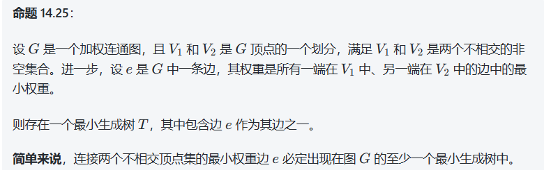
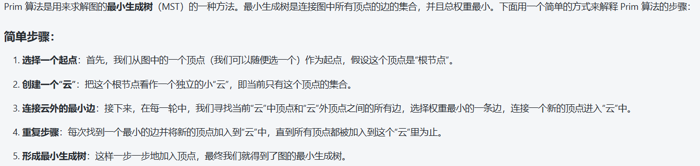
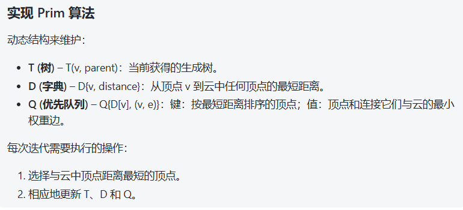
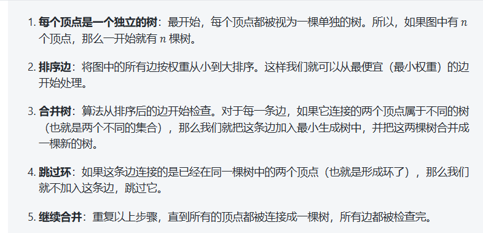
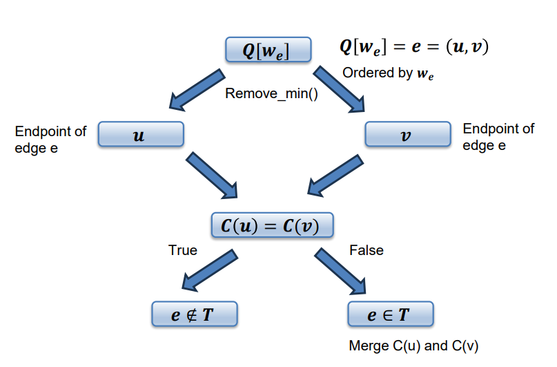
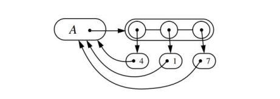

# Week 14 Minimum Spanning Trees

**生成树**：一个无向图 \( G \) 的生成树 \( T \) 是其子图，且 \( T \) 是一棵包含图 \( G \) 中所有顶点的树。

**最小生成树**：一棵生成树，其总边权重最小。




## Prim’s Algorithm





代码实现：
```python
import heapq

def prim(graph, start):
    # 图的表示为邻接表
    # graph = {v: [(neighbor1, weight1), (neighbor2, weight2), ...]}
    
    # 初始化数据结构
    T = {}  # T(v, parent): 最小生成树，存储树中的边
    D = {start: 0}  # D[v]: 从树到顶点 v 的最短距离，起始顶点的距离为 0
    Q = []  # 优先队列（最小堆），存储 (距离, 顶点) 对
    for vertex in graph:
        if vertex != start:
            D[vertex] = float('inf')  # 其他顶点的初始距离设为无穷大
        heapq.heappush(Q, (D[vertex], vertex))  # 将所有顶点及其初始距离放入优先队列
    
    while Q:
        # 从队列中取出距离最小的顶点
        dist, u = heapq.heappop(Q)
        
        # 如果距离为无穷大，表示没有更多顶点可以加入树中了
        if dist == float('inf'):
            break

        # 将顶点 u 添加到最小生成树中
        if u not in T:
            T[u] = None  # 初始时没有父节点，表示将顶点 u 添加到树中
        
        # 更新与顶点 u 相邻的顶点的最短距离
        for v, weight in graph[u]:
            if v in D and v in Q and weight < D[v]:
                # 如果找到更短的距离，更新 D[v]
                D[v] = weight
                heapq.heappush(Q, (weight, v))  # 将更新后的顶点重新加入队列
                T[v] = (u, weight)  # 更新顶点 v 的父节点和连接它的边的权重

    return T

# 示例图：
graph = {
    'A': [('B', 1), ('C', 3), ('D', 4)],  # A 顶点的邻接顶点和边的权重
    'B': [('A', 1), ('C', 2), ('D', 5)],  # B 顶点的邻接顶点和边的权重
    'C': [('A', 3), ('B', 2), ('D', 1)],  # C 顶点的邻接顶点和边的权重
    'D': [('A', 4), ('B', 5), ('C', 1)]   # D 顶点的邻接顶点和边的权重
}

start = 'A'  # 起始顶点
mst = prim(graph, start)

# 输出最小生成树
print("最小生成树 (MST):")
for vertex, (parent, weight) in mst.items():
    if parent:
        print(f"{parent} - {vertex} (权重: {weight})")

'''
代码解释：
图的表示：

图使用邻接表表示，其中每个顶点对应一个列表，列表中的每个元素是一个元组，表示一个邻接顶点及其边的权重。
数据结构：

T: 用于存储最小生成树（MST），字典中每个键表示一个顶点，值是一个元组，表示该顶点的父节点和边的权重。
D: 存储从树中已包含的顶点到其他顶点的最短距离，字典中的每个键是一个顶点，值是该顶点到最小生成树的最短距离。
Q: 优先队列（最小堆），用于每次选择距离最短的顶点。存储的是一个元组 (距离, 顶点)。
算法步骤：

初始化时，将所有顶点的距离设置为无穷大，起始顶点的距离为 0，并将所有顶点及其初始距离放入优先队列。
每次从优先队列中取出距离最小的顶点 u，如果 u 没有被加入到最小生成树中，则将其加入。
然后检查 u 的邻接顶点 v，如果通过 u 到 v 的边可以更新 v 的最短距离，就更新距离并将 v 重新加入优先队列。
最终返回的 T 包含了最小生成树的所有顶点及其对应的父节点和连接边的权重。
返回结果：

T 返回的是最小生成树的边和权重，表示图中各个顶点与树中的父节点之间的连接和边的权重。
示例输出：
对于上述示例，输出的最小生成树可能是：

最小生成树 (MST):
A - B (权重: 1)
B - C (权重: 2)
C - D (权重: 1)
这表示从顶点 A 出发，最小生成树包含边 A-B、B-C 和 C-D，它们的权重分别为 1、2 和 1。
'''
```
时间复杂度：
使用基于堆的优先队列时，每个操作的时间复杂度是 𝑂(log 𝑛)，因此算法的总时间复杂度为 𝑂(𝑛 + 𝑚 log 𝑛)，对于一个连通图来说，这个复杂度简化为 𝑂(𝑚 log 𝑛)。

另外，如果使用未排序的列表作为优先队列，算法的时间复杂度可以达到 𝑂(𝑛²)。

## Kruskal’s Algorithm
使用这个算法最好的





```python

class UnionFind:
    def __init__(self, n):
        # 初始化父节点数组，每个节点的父节点初始化为自己
        self.parent = list(range(n))
        # 初始化每个节点的秩（树的高度）
        self.rank = [0] * n

    def find(self, x):
        # 路径压缩，优化查找过程
        if self.parent[x] != x:
            self.parent[x] = self.find(self.parent[x])
        return self.parent[x]

    def union(self, x, y):
        # 找到 x 和 y 的根节点
        rootX = self.find(x)
        rootY = self.find(y)
        
        # 如果根节点不同，说明它们属于不同的集合，可以合并
        if rootX != rootY:
            # 使用秩来优化合并过程，秩小的树合并到秩大的树上
            if self.rank[rootX] > self.rank[rootY]:
                self.parent[rootY] = rootX
            elif self.rank[rootX] < self.rank[rootY]:
                self.parent[rootX] = rootY
            else:
                self.parent[rootY] = rootX
                self.rank[rootX] += 1
            return True
        return False

def kruskal(n, edges):
    # n: 图的顶点数，edges: 边的列表，格式为 (权重, 起点, 终点)
    
    # 1. 按照边的权重排序
    edges.sort()
    
    uf = UnionFind(n)
    mst = []  # 最小生成树
    total_weight = 0  # 最小生成树的总权重

    # 2. 遍历所有边
    for weight, u, v in edges:
        # 3. 如果当前边连接的是不同的子集（即不会形成环），则将该边加入最小生成树
        if uf.union(u, v):
            mst.append((u, v, weight))
            total_weight += weight
    
    return mst, total_weight

# 测试例子
if __name__ == "__main__":
    # 图的顶点数
    n = 4
    # 图的边，格式为 (权重, 起点, 终点)
    edges = [
        (1, 0, 1),  # 边 (0, 1) 权重 1
        (3, 0, 2),  # 边 (0, 2) 权重 3
        (2, 1, 2),  # 边 (1, 2) 权重 2
        (4, 1, 3),  # 边 (1, 3) 权重 4
        (5, 2, 3),  # 边 (2, 3) 权重 5
    ]

    mst, total_weight = kruskal(n, edges)
    
    print("最小生成树的边:", mst)
    print("最小生成树的总权重:", total_weight)


'''
代码解释
UnionFind 类：

这个类实现了并查集（Union-Find）数据结构，它有两个主要操作：
find(x)：查找节点 x 的根节点，并进行路径压缩，优化查找效率。
union(x, y)：将两个不同的子集合并，如果 x 和 y 属于不同的集合，则合并它们。
kruskal(n, edges)：

这个函数实现了 Kruskal 算法，接受两个参数：
n：图的顶点数。
edges：边的列表，每条边是一个三元组 (权重, 起点, 终点)。
该函数首先对所有的边按权重进行排序，然后使用 UnionFind 数据结构来避免形成环，逐步构建最小生成树（MST）。
主程序：

创建一个图，定义了顶点数 n 和边的列表 edges。
调用 kruskal 函数计算最小生成树，并打印结果。
'''
```

时间复杂度：
Kruskal 算法的总体时间复杂度是 O(mlogn)

### Union-find Structures并查集结构

分割成许多个集合（最多n个），每个点只在一个集合当中

在实现 Kruskal 算法时，我们需要动态地记录每个顶点所属的树，以便判断添加一条新边是否会形成环。

我们将这个问题形式化为 **分区模型**：

- 将一组顶点划分为多个组。
- 每个顶点只属于一个组。
- 每个组都有一个领导者（或根节点）。

实现方式：
1，Sequence实现

比如：4的组名是A；1的组名也是A，所以4和1不能加