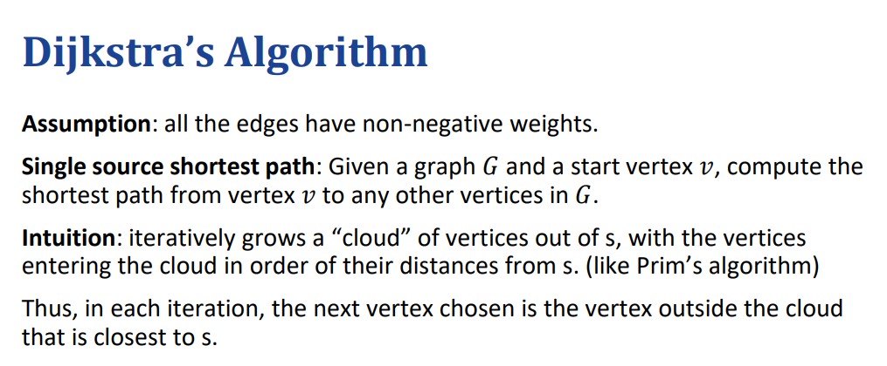
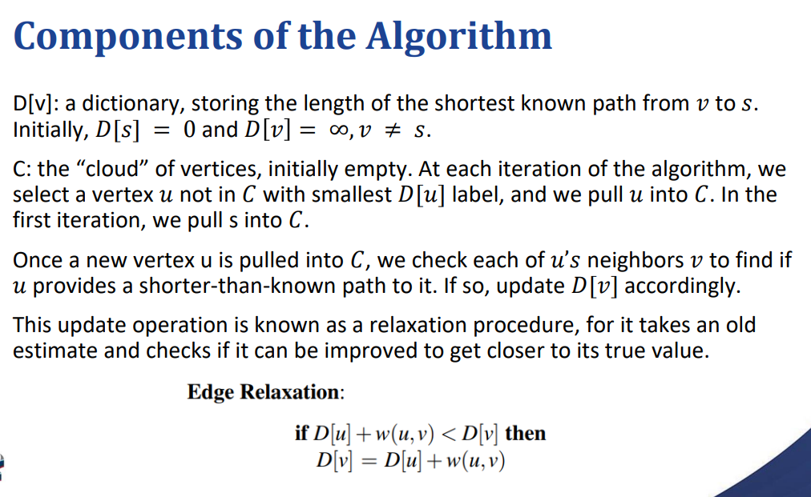

# Shortest Paths 最短路径

最短无加权路径：指的是从顶点 u 到 v 的路径，其包含的边数最少。这样的路径可以通过广度优先搜索（BFS）找到。

## 最短加权路径：

指的是从顶点 u 到 v 的路径，其总权重最小。
• DFS 在这里不适用，因为一些高权重的边可能比多个低权重的边的总权重更大。
注意出现负权重的边的出现，假设每一条边的权重都是正的
### Dijkstra算法

假设：所有边的权重都为非负值。

单源最短路径：给定一个图 G 和一个起始顶点 v，计算从顶点 v 到 G 中任何其他顶点的最短路径。

直觉：从顶点 s 开始，迭代地扩展一个“云”区域，其中每次选择距离 s 最近的顶点进入云区域（类似于 Prim 算法）。

因此，在每次迭代中，选择的下一个顶点是最接近 s 且不在云区域中的顶点。

