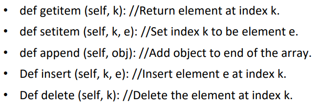
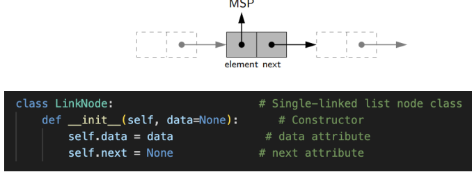
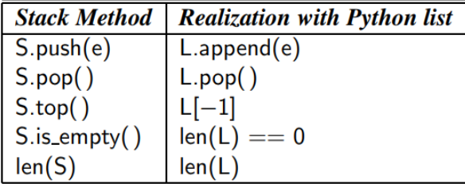
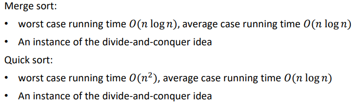
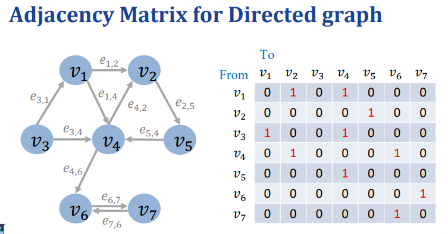
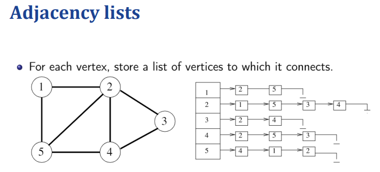

复习课

提纲覆盖了所有的知识点

# 基本概念

## 时间复杂度
O：upper Ω：lower
Worst/Averge case running time与上面的上下界没有关系（是没有！）

## Recursion

用递归函数描述递归的过程
call stack

# Linear Structures

## Array

1，连续的内存空间占用
2，item的大小是相同的
3，允许random index-based accessing(给地址可以直接跳过去)

## LinkList

insert操作：修改next指针
特殊：
链表头插入X，X的next设置为a，链表的head修改，size+=1
链表尾插入X，END节点的next指针设置为X，tail修改成X，size+=1

delete:
a的next设置成c

## Stack

与list有很强的的对应关系

## queue

# Trees

基本概念：
翻译如下：

- **深度**：设 \( p \) 是树 \( T \) 中一个节点的位置，\( p \) 的深度是指 \( p \) 的祖先节点的数量，不包括 \( p \) 本身。

- **高度**：非空树 \( T \) 的高度等于其所有叶子节点深度的最大值。

## binary Trees
每个节点至多2个孩子，可以少不能多
左节点在右节点之前（单纯的二叉树不要求孩子大小排序）

Proper binary Trees
要不2个孩子，要不没有孩子，不存在一个孩子的情况

### heap堆

具有完全二叉树complete binary tree的性质：
1，除了最后一层，上面的层都是满的
2，最后一层必须从左往右排孩子

最小堆：最小的在最上面；

# hash table

哈希冲突：一种开放寻址法，一种链表法

# 二叉搜索树
左子树小于根节点，右子树大于根节点
注意：查找，增加，删除操作

# sorting排序

Merge Sort和Quick Sort这门课重点是这两个
注意时间复杂度

# 图
基本定义，VE
表示方法，g adjacency list or adjacency matrix

邻接表：某个点的邻居

遍历方法
最小生成树2方法
最短路径， Dijkstra’s algorithm
