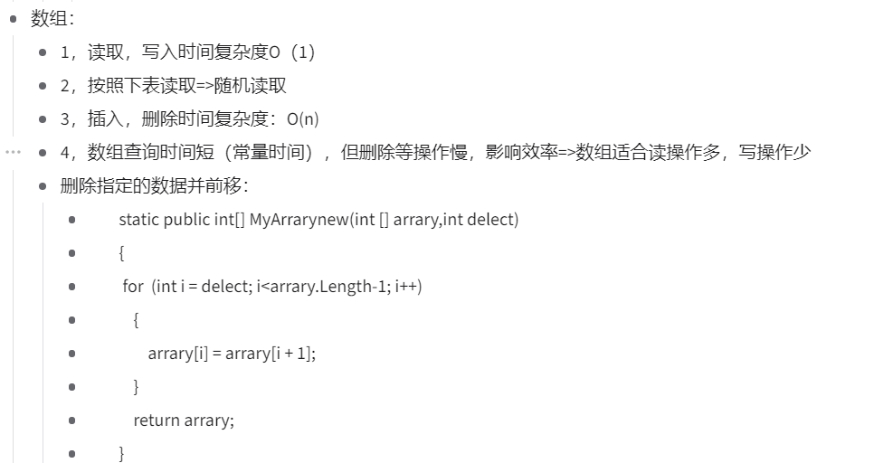
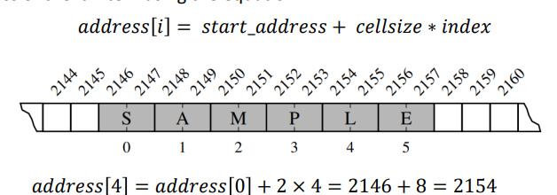
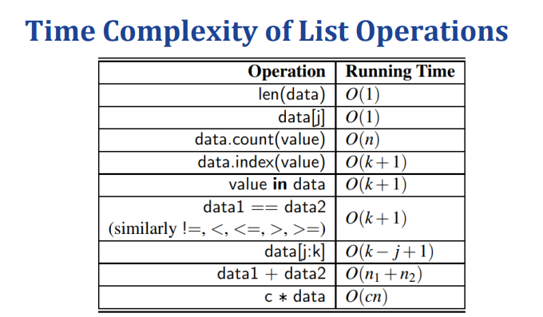

# Week 3: Array-Based Sequences
线型结构：
 • 结构是一个非空的有限集 • 只有一个起始节点和一个终端节点 • 每个节点最多只有一个直接前继节点和一个直接后继节点。简单来说，它是一组有序的对象
低级数组：
Python 内置类 list、tuple 和 str 都基于低级数组，并允许基于索引的快速访问。
# 随机存取存储器 （RAM）：
访问任何内存位置都需要相同的时间。例如，访问 #255 和 #65535 需要相同的时间
数组在硬盘当中的存储是连续的

计算机在读取当中，会一页一页page地读
# 低级数组 
• 采用单个连续的内存条 • 一个接一个地存储项目，没有指针 • 项目必须具有相同的大小 • 允许随机访问
低级数组必须有相同的大小
因为，只有当它们的大小都相同时，我们才能用以下公式轻松计算出第 i 项的地址：
## 问题：在面对对象当中，如果要对象的大小不是一样的，那么要怎么搞？
## 引用数组 
在数组中存储对对象（地址）的引用，因为地址具有相同的大小
## Compact Arrays紧凑数组
 直接将目标对象（而不是对它们的引用）存储在数组中。• 紧凑数组比引用数组更有效地使用内存。• 但是，紧凑数组中的所有项必须具有相同的大小。
# 动态数组
调整数组大小涉及： 
• 创建新数组（比当前数组更大或更小） • 将所有数据从旧数组复制到新数组 • 更改相关引用并从内存中释放旧数组（释放空间）。
## 时间空间复杂度
调整具有 n 个元素的数组的大小涉及：1） 创建一个更大的数组 O（1）;2） 将数据从旧数组复制到新数组 O（n）。因此，总成本为 O（n）。

扩容数组的消耗分析
方法1：每次增加1个大小，则1，2，3，……n个，时间复杂度：O(n^2)
方法2：从n扩容到n^2:空间效率低下
方法3：从n扩容到n^2，很好

摊销分析摊销：
在会计中，摊销是指无形资产在其使用寿命内将价值支出的过程。当将数组的大小从 n 增加到 2n 时，我们执行了大量操作来移动元素。此过程的值一直持续到 elements 数达到 2n。从这个意义上说，插入后期元素的成本是预先支付的，并且价值会因后期插入而逐渐支出。从这个角度来看，管理动态数组需要 O（n） 时间。

