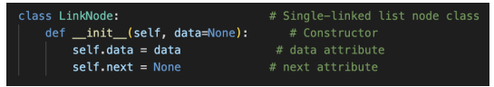
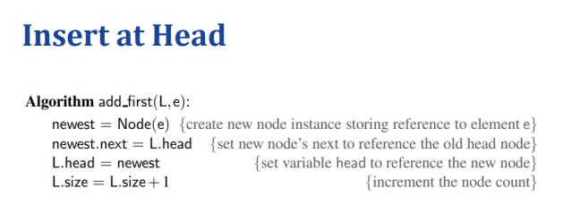
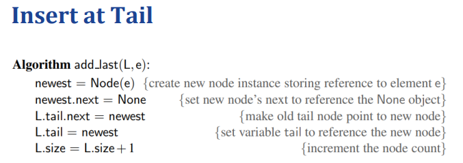
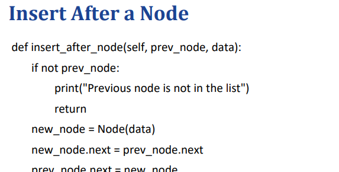
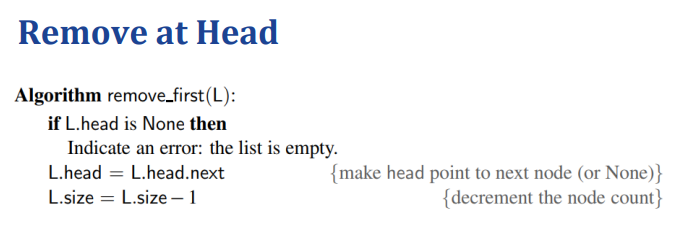
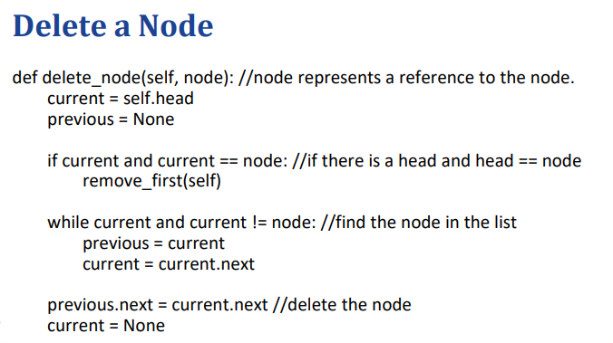
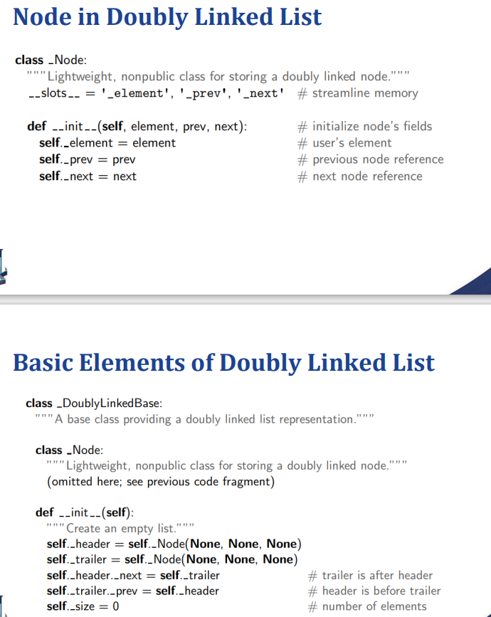
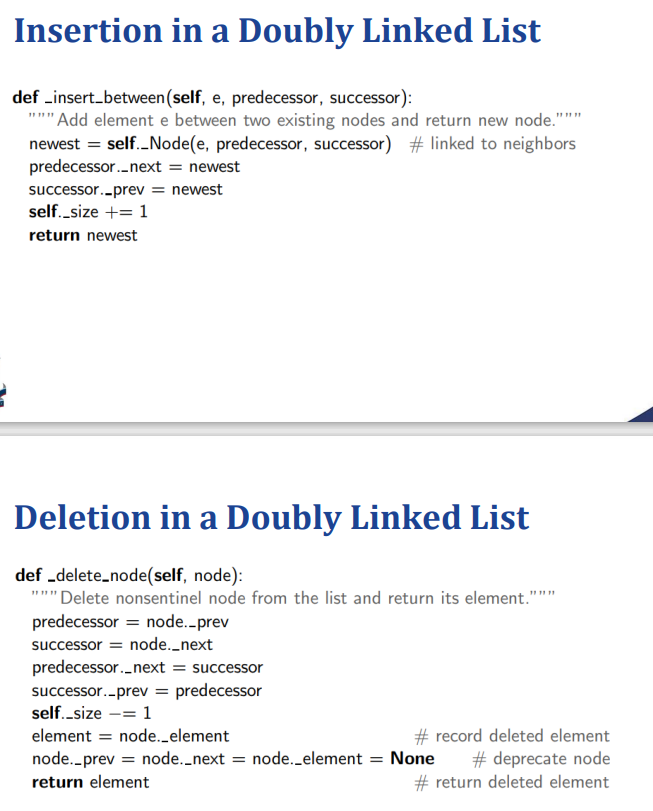
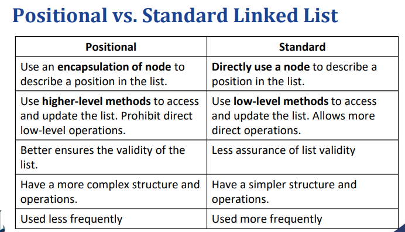
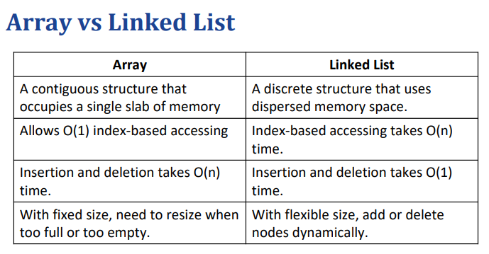

# Week 4: Linked List
动态数组的缺点：• 不充分利用存储空间。• 当频繁调整大小时，实际运行时间可能会长于摊销边界。• 在数组的内部位置进行插入和删除的成本很高。
## Singly Linked List 单项链表
每个节点都包含一个数据项和一个指针。数据项可以是对数据对象或对象本身的引用。

### 头部插入

Doubly Linked List 
### 尾部插入

### 中间插入：

### 头部移除

### 节点删除

## 循环连接列表：
循环链接列表 将尾部的下一个引用放在列表的头部，有效地形成一个圆圈。循环链表可用于表示循环结构或关系。循环链表没有头和尾，但需要对特定节点的引用才能使用该列表
## Doubly Linked Lists

## Positional Linked List（其实也没什么用）
我们通常不使用 index 来描述链表中的位置，至少有两个原因： • 到达索引指定的位置花销大，因为我们需要从列表的头部遍历列表。• 插入和删除应该发生在任何位置，因此固定索引中的元素经常更改，从而使基于索引的访问不太有用。
因此，程序员通常使用对节点的引用来描述位置，该位置不受其他节点上的操作的影响。
### 定位为独立类 
遵循 OOP 的抽象和封装原则，我们希望将节点封装为引用，而不是直接使用节点。
• 封装隐藏了细节并简化了使用。
• 规范操作以确保链表的有效性，例如禁用元素值的更改、更改下一个指针。
• 支持进一步重新设计和优化数据结构。
（上面的理由都很牵强的）
因此，我们定义了一个position 类来描述链表中的位置。该位置类似于文本编辑器中的光标，指示插入或删除的位置。

