# Week 5Stacks and Queues
# Stacks
last-in, first-out (LIFO)
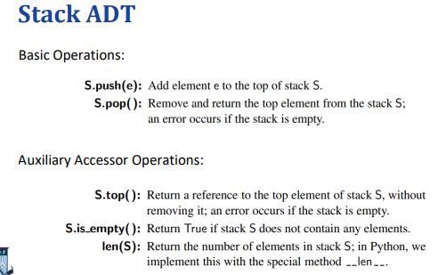
## 设计1——数组：
基于数组的栈实现： 栈可以通过直接使用数组来存储其元素来实现。
• Push：将元素附加到数组的末尾。
• Pop：弹出 （检索和删除） 数组中的最后一个元素。
但是，栈不支持所有数组 （列表） 操作，例如在任意位置添加或删除元素。因此，实现堆栈的更好方法是设计一个使用数组进行低级数据存储的新类。
### 空异常：
列表调用pop没有元素，返回indexError，但是栈不涉及这个，所以采用Empty异常合适
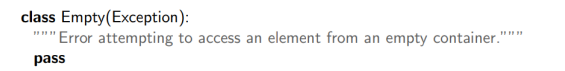
### 使用适配器模式：
• 定义一个包含旧类实例的新类。• 使用旧类的方法实现新类的方法。
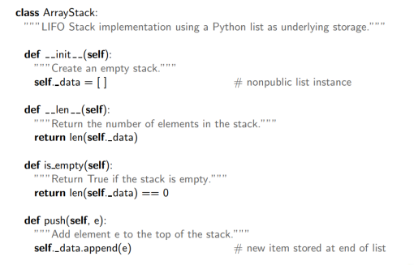
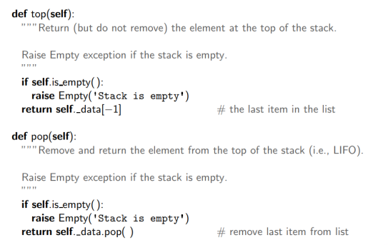
## 设计2——单向链表：
链表的头部应该是栈顶部（因为我们只能在头部以恒定的时间有效地插入和删除元素。（在尾部删除需要 O（n） 时间））
Node前下划线：建立一个专属于的类
__slot__告诉只有element和next两个变量
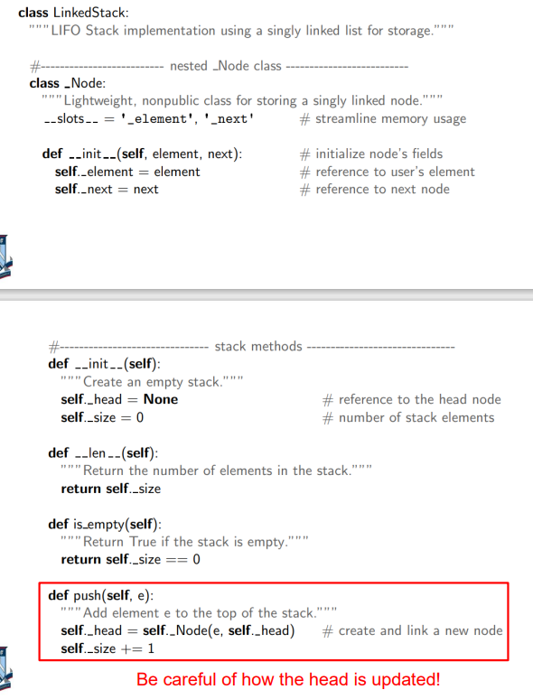
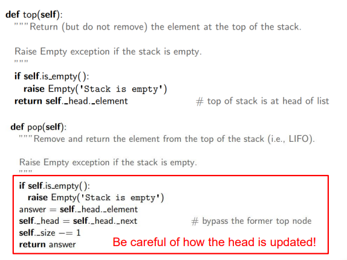

## 栈的使用：
1，反转数组，所有元素推入stack，再弹出就可以了
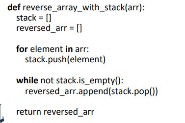
2，匹配括号
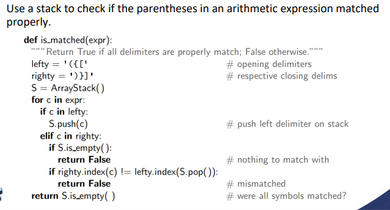
# Queues
first-in，first-out (FIFO) order
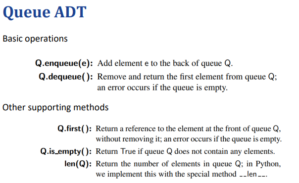
## 设计1——数组
Enqueue at tail and dequeue at head：效率非常低。因为每次出队都需要将所有元素向前移动一个位置以填充整体。但是入队很容易完成。
### 改进：
允许队列的前端偏离索引 0，并保持一个指向队列前端的变量
缺点：随着 enqueue 和 dequeue 操作的累积，数组的大小会越来越大。
允许队列的前面向右移动。允许队列的内容 “环绕” 底层数组的末尾。只要数组的大小大于元素的数量，我们就可以向其中插入新元素。
（超出数组的索引，要倒回来，回到环形数组前面被“释放的空间”）
加入元素，放在：(front+size)%N
删除元素，front标记成front=(front+1)%N
注意:size是元素的个数而不是存储空间的大小

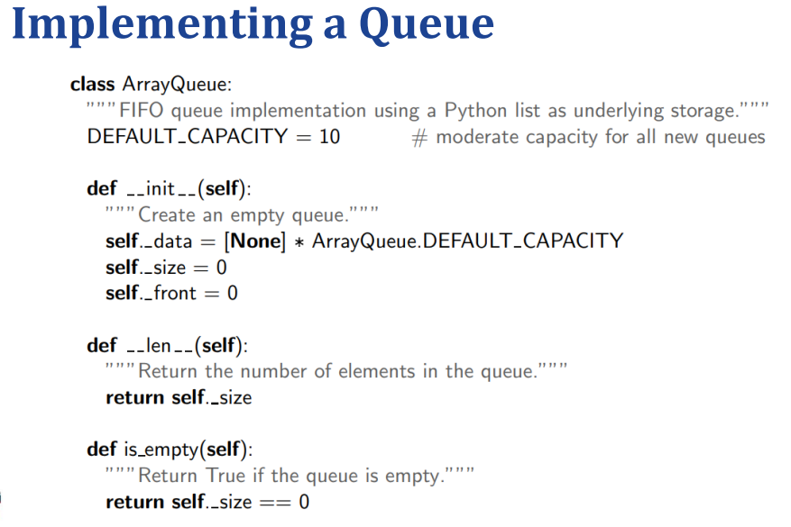
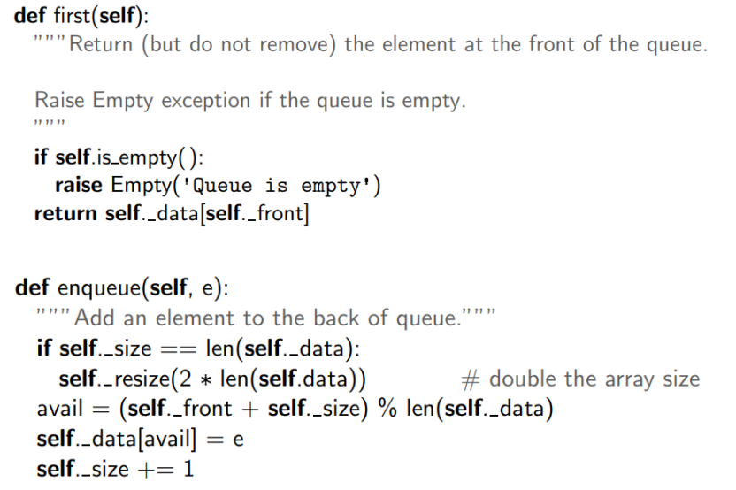
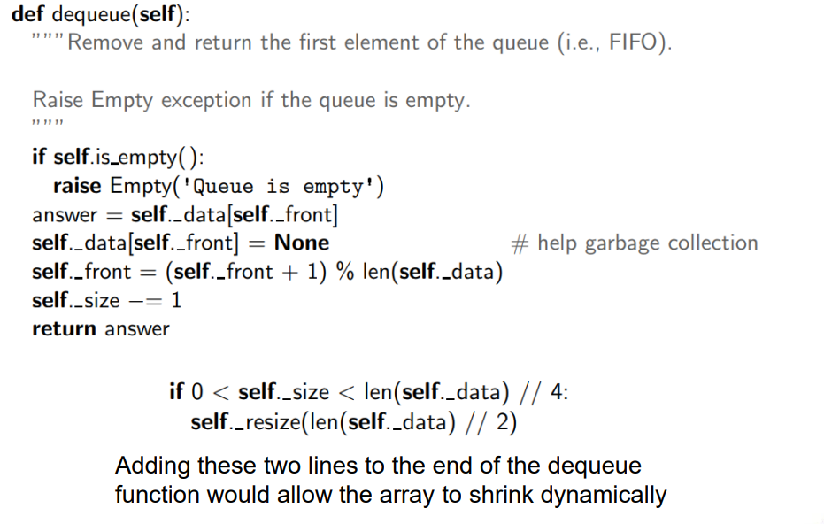
难点：resize
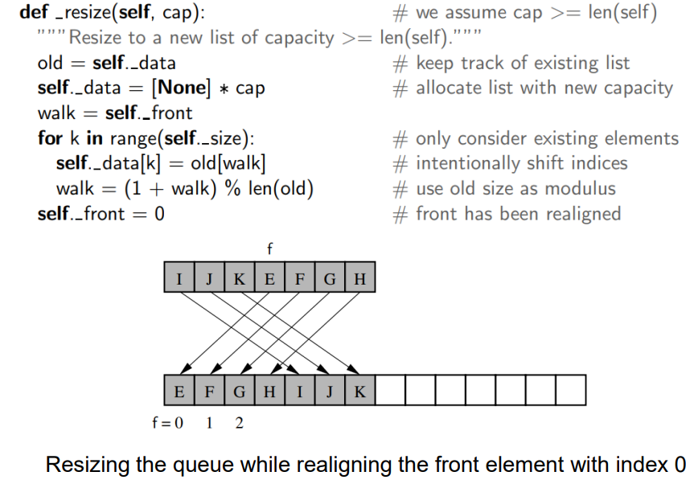

## 设计2——单向链表：
The head of the list should be the front of the queue, and the tail should be the back.
### 扩展：双端队列：
双端队列 （Deque） Deque 支持在队列的前面和后面插入和删除。Deque 比堆栈和队列 ADT 更通用。额外的通用性在某些应用程序中可能很有用