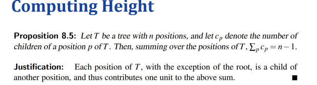
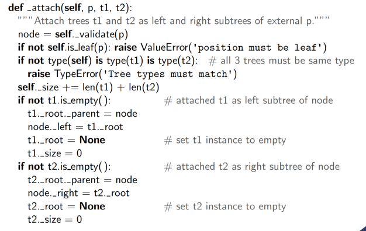

# Week 6: Trees
## General Trees
树是非线性数据结构，在许多情况下，它允许比线性结构更快地进行数据操作。树中的关系是分层的
### 树定义:
树是一种抽象数据类型，它按层次hierarchically结构存储元素。
树中的每个元素（根除外）都有一个父元素和零个或多个子元素。父级和子级通常使用线连接，祖先在后代之上。
我们通常将 top 元素称为树的根，但它被绘制为最高的元素
正式定义：树 T 是一组存储元素的节点，这些节点具有满足以下属性的父子关系： • 如果 T 为非空，则它具有一个特殊节点，称为 T 的根 ，该节点没有父项。• T 的每个节点 v 与根不同，都有一个唯一的父节点 w;具有父节点 W 的每个节点都是 W 的子节点。根据这个定义，一棵树可以是空的，这意味着它没有任何节点
#### 其他节点关系
同级节点Siblings：作为同一父节点的子节点的两个节点是同级节点。
外部节点External node：如果 v 没有子节点，则节点 v 为外部节点。外部节点也称为叶子。
内部节点Internal node：如果节点 v 具有一个或多个子节点，则该节点 v 为 internal 节点

### 文件树：
文件系统的树表示 树的内部节点与目录相关联，叶子与常规文件相关联。在 UNIX 和 Linux 操作系统中，树的根被恰当地称为 “根目录”，并由符号 “/” 表示。

### Ancestors and Descendants：
Ancestor：如果 u = v 或 u 是 v 父级的上级，则节点 u 是节点 v 的上级Ancestor。
Descendants后代：如果您是 v 的上级，则节点 v 是节点 u 的后代。
Subtree子树：以节点 v 为根的 T 子树是由 T 中 v 的所有后代（包括 v 本身）组成的树。
edge边：树 T 的边是一对节点 （u，v），使得 u 是 v 的父节点，反之亦然。
path路径：T 的路径是一个节点序列，使得序列中的任意两个连续节点形成一条边

### Ordered Trees有序树 
如果每个节点的子节点之间存在有意义的线性顺序，则树是有序的;也就是说，我们有意将节点的子节点标识为 first、second、third 等

### 树的抽象类型：
我们使用位置的概念作为树节点的抽象来定义树 ADT。每个位置都存储了一个元素，位置满足定义树结构的父子关系。

位置position是对树的一次包装
### 树的抽象基类：
指定同一抽象的不同实现之间关系的正式机制是通过继承定义一个类，该类充当一个或多个具体类的抽象基类。
我们选择定义一个 Tree 类，它用作对应于树 ADT 的抽象基类。
但是，我们的 Tree 类没有定义用于存储树的任何内部表示，并且该代码片段中给出的 5 个方法仍然是抽象的。
尽管 Tree 类是一个抽象基类，但它包含多个具体方法，这些方法的实现依赖于对类的抽象方法的调用

### 深度计算：
Computing Depth计算深度深度：
设 p 为树 T 的节点位置。p 的深度是 p 的祖先数，不包括 p 本身。
请注意，此定义意味着 T 的根的深度为 0。
p 的深度也可以递归定义如下： 
• 如果 p 是根，则 p 的深度为 0。• 否则，p 的深度为 1 加上 p 的父项的深度。

树当中的的高度p也是递归定义的
如果 p 是一片叶子，则 p 的高度为 0。• 否则，p 的身高比 p 的子项的最大值高大 1。
非空树的高度 T 是 T 的根的高度。

定理：非空树 T 的高度等于其叶子位置深度的最大值

自底向上的方法

一种更高效的计算高度算法：一种自上而下的方法

为什么自上而下的方法更有效？
• 请注意，父子关系是 1 对 N 的映射。
• 以自下而上 （子-父） 方式计算节点的深度不会重复使用上级的深度，因此，内部节点的深度可能会多次计算。
• 相比之下，使用自上而下的方式，节点的高度会多次使用 （对于其所有子项），从而节省大量计算。

## Binary Trees二叉树 
二叉树是具有以下属性的有序树： 
• 每个节点最多有两个子节点。
• 每个子节点都标记为左子节点或右子节点。
• 按节点的子项顺序，左子项位于右子项之前。左/右子树：以内部节点 v 的左子树或右子节点为根的子树分别称为 v 的左子树或右子树。
正确的二叉树：如果每个节点都有零个或两个子节点，则二叉树是正确的。
eg：决策树、算术表达式树
### 递归二叉树定义 
我们还可以用递归方式定义二叉树，使二叉树要么是空的，要么由以下部分组成：
 • 一个节点 r，称为 T 的根，存储一个元素 • 一棵二叉树（可能为空），称为 T 的左子树 • 一棵二叉树（可能为空），称为 T 的右子树
三种额外的方法：

### 二叉树的性质：
1，级别 d 最多有 2d 节点。

2，设 T 为非空二叉树，设 n、nE、nI 和 h 分别表示节点数、外部节点数、内部节点数和 T 的高度。则 T 具有以下属性

3，有a和外部节点，n个内部节点，则a=n+1(外部节点=内部节点+1)
## Implementing Binary Trees
### 链表结构：
每个节点都保留对存储在位置 p 的元素及其父位置和子位置的引用。树本身维护对根节点（如果有）和树的大小（树中的节点总数）的引用

### 基于数组的方法：

按从左到右的升序对 T 的每个级别上的位置进行编号。级别编号基于树中的潜在位置，而不是给定树的实际位置，因此它们不一定是连续的。

基于数组的表示的优缺点：
优点：
位置 p 可以用单个整数 f（p） 表示。根据我们的级别编号公式，p 的左子级的索引为 2f（p） + 1，p 的右子级的索引为 2f（p） + 2，p 的父级的索引为 ⌊（f（p） − 1）/2⌋。
基于数组的表示的空间使用在很大程度上取决于树的形状。设 n 为 T 的节点数，设 fM 为 T 的所有节点的 f（p） 的最大值。数组 A 需要长度 N = 1 + fM。请注意，A 可能有许多空单元格，这些单元格不引用 T 的现有节点