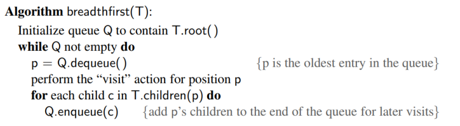
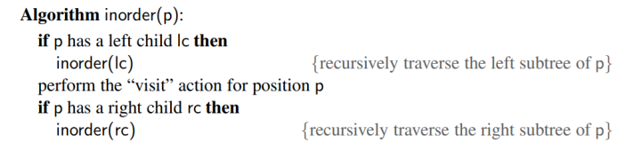
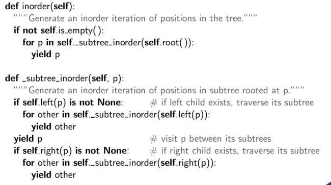
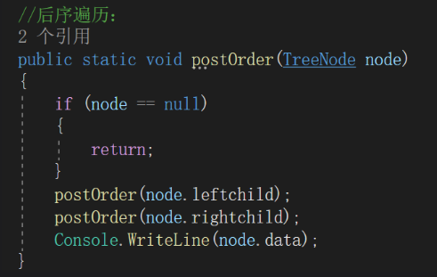

# Priority Queues

# 树的遍历
## Preorder Traversal前序遍历
Preorder 遍历：首先访问根，然后遍历以其子项为根的子树。如果树是有序的，则根据子树的顺序遍历子树。

## Breadth-First Tree Traversal广度优先树的遍历
在访问深度 D + 1 的位置之前，先访问深度 D 的所有位置。

使用队列的结构
## Inorder traversal 中序遍历
1） 遍历左树;2） 访问根;3） 遍历右树。
二叉树 T 的中序遍历可以非正式地视为“从左到右”访问 T 的节点。
一般在只对二叉树进行

## Postorder Traversal 后序遍历
后序遍历：首先遍历以根的子项为根的子树，然后访问根

我们可以使用 postorder 遍历来计算目录使用的总空间，因为在我们访问它的所有子目录之前，我们不知道总空间。

## 二叉搜索树
左子树的值小于父节点，右子树的值大于父节点
二叉搜索树 T 的中序遍历以非递减顺序访问元素。
查询：
小于父节点，进入左子树；大于根节点进入右子树，直到找到

## 其他的树的类型：
.png)

# 优先队列

具有最小键的元素将是下一个要从队列中删除的元素（因此，键为 1 的元素将优先于键为 2 的元素）

# heap堆
堆的定义：堆是一个二叉树 T，它在其位置存储一组项目，并满足两个附加属性（关系属性和结构属性）。
堆顺序属性：在堆 T 中，对于除根以外的每个位置 p，存储在 p 处的键大于或等于存储在 p 的父级处的键。• 最小键始终存储在 T 的根处。• 在从根到 T 叶的路径上遇到的键按非递减顺序排列。

（课件的示例是最小堆）

高度：n个节点的heap的高度是：logn

向堆中插入item

堆中移除最小的item

