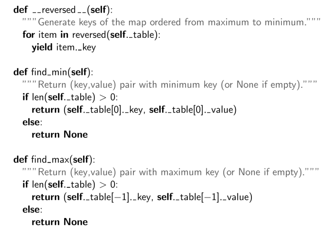

# 堆的实现呢
## 基于数组与优先队列的方法;


时间复杂度：


### 堆排序：


#### 复杂度
构建二叉堆：n
循环下沉：logn
综上：nlogn
# Maps and Dictionaries 映射和字典
字典：从键到值的映射。
字典通常被称为关联数组或映射。
当我们特指讨论 Python 的 dict 类时使用“字典dict”这一术语，而在讨论更一般的抽象数据类型时使用“映射maps”这一术语。

## Maps：
Keys是唯一的，但是value不是唯一是的

映射使用类似数组的语法进行索引，例如 currency['Greece'] 来访问与给定键关联的值，或 currency['Greece'] = Drachma 来重新映射到一个新值。
与标准数组不同，映射的索引不需要是连续的，也不一定是数字型的。

### Python 的可变映射抽象基类

Python 的 collections 模块提供了两个与我们当前讨论相关的抽象基类：Mapping 和 MutableMapping 类。

Mapping 类包含 Python 的 dict 类支持的所有非可变方法，而 MutableMapping 类在此基础上扩展了可变方法。

MutableMapping 类为除以下五个方法之外的所有行为提供了具体实现：__getitem__、__setitem__、__delitem__、__len__ 和 __iter__。某些方法是基于抽象方法实现的。
人话：


## 无序Maps和有序Maps
### 简单无序映射实现：
定义：这种实现方式在 Python 列表中存储键值对，没有特定的顺序。
优点：实现简单，因为只需使用基本的列表操作即可。
缺点：时间复杂度高。在最坏情况下，查找特定键需要 O(n) 的时间复杂度，因为需要遍历整个列表来找到相应的键值对。这在处理大量数据时效率较低。


### 有序映射：

定义：在这种实现中，映射中的项会按照键的顺序进行排列。
优点：快速查找。由于数据是有序的，可以更快地找到所需的键。
搜索类型：
精确搜索：查找特定的键（例如，查找值为 9 的项）。
不精确搜索：查找与阈值进行比较的项，例如查找所有小于某个值的键。


### 有序搜索表：

定义：这是一种特殊的有序映射实现，其中映射项存储在按键递增顺序排列的数组中。
优点：主要优势是可以使用二分查找算法来提高搜索效率。由于数组是有序的，可以在 O(log n) 的时间复杂度内找到所需的键。这对于大数据集尤其有效，因为与线性搜索相比，二分查找显著减少了查找时间。
```py
class UnsortedTbleMap(MapBase):
    def _findindex(self,k,low,high):
        #使用二分搜索找到对应的下标
    def __getitem__(self, key):
    #这个方法应该根据给定的键返回对应的值。

    def __setitem__(self, key, value):
        #这个方法应该接受一个键和值，并将其存储在映射中。

    def __delitem__(self, key):
        # 这个方法应根据给定的键删除映射中的对应项。

    def __iter__(self):
        # 该方法应该返回一个迭代器，以便遍历映射中的所有键。

    def __len__(self):
        # 该方法应该返回映射中键的数量

    def find_max():
        # 找到最小的key对应的键值对然后返回
    def find_max():
        # 找到最大的key对应的键值对然后返回
    
    def find_ge(key):
    #功能: 查找第一个大于或等于给定键 key 的元素。
    #返回值: 如果找到，返回大于等于 key 的第一个元素；如果未找到，返回 None。
    #实现思路: 可以使用二分查找快速定位该元素。
    def find_gt(key):
    #功能: 查找第一个大于给定键 key 的元素。
    #返回值: 如果找到，返回大于 key 的第一个元素；如果未找到，返回 None。
    #实现思路: 同样可以使用二分查找来实现。
    def find_it(key):
    #功能: 查找与给定键 key 完全相等的元素。
    #返回值: 如果找到，返回该元素；如果未找到，返回 None。
    #实现思路: 可以使用二分查找来找到 key 的位置，并返回该位置的元素（如果存在）。
    def find_range(start, end):
    #功能: 查找在给定范围 [start, end) 内的所有元素。
    #返回值: 返回一个列表，包含所有在 start（包含）和 end（不包含）之间的元素。
    #实现思路: 使用 find_ge(start) 找到第一个大于等于 start 的元素，然后使用 find_gt(end) 找到第一个大于 end 的元素，依次返回范围内的所有元素。
    
```

课件的实现：




