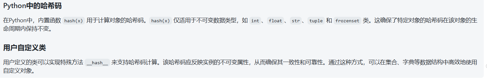
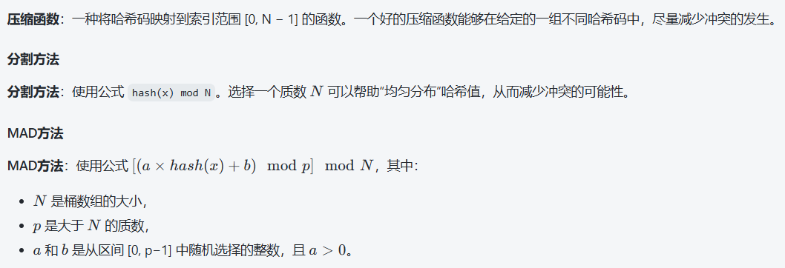

bucket array：存储相同的Hash Value

# 散列表：（哈希表）
提供了键key和值value的关系，给出一个key，可以快速的查询到value，时间复杂度->O(1)

1，即字典key1-key2

2，时间复杂度O(n)

## 哈希码（Hash Code）:

目的: 哈希码是一个函数，它将一个键k（例如字符串或数字）映射为一个整数。

均匀分布: 这个哈希码的目标是确保生成的整数在可能的范围内均匀分布，这样可以最小化“冲突”的发生。冲突是指不同的键生成相同的哈希码。

## 哈希函数/压缩函数：
哈希函数作为中转站将key和数组下标进行转换

每个对象都有属于自己的hashcode，无论自身的变量类型是什么，他都有一个整形的hashcode。目的: 一旦你得到了哈希码（它可能是一个很大的整数），压缩函数将这个哈希值映射到一个特定的范围，通常是[0,N−1]，其中 N 是哈希表的大小。

转换成数组的下标：index=HashCode(Key)%Array.Length;（JAVA，实际上采用了位运算优化性能）

## 哈希冲突：
解决：
A：开放寻址法：向后移一位

B ：链表法

### load factor：
装载因子

读操作：
1，Key转下标，2，找到数组下标对应的元素3，不是的话顺着链表往下找，找到与key匹配的点

扩容：
1，when：一定饱和度，Key映射冲突大概率发生，大量元素在相同位置，形成了很长的链表，性能影响大

2，（JDK：）
因素：Capability：HashMap当前的长度；Load Factor：负载因子，默认0.75f

扩容条件：HashMap.Size>=CapacityxLoadFactor

步骤：1，扩容，创建两倍新数组2，重新遍历，Hash

# 二叉搜索树：
根节点大于左节点小于右节点