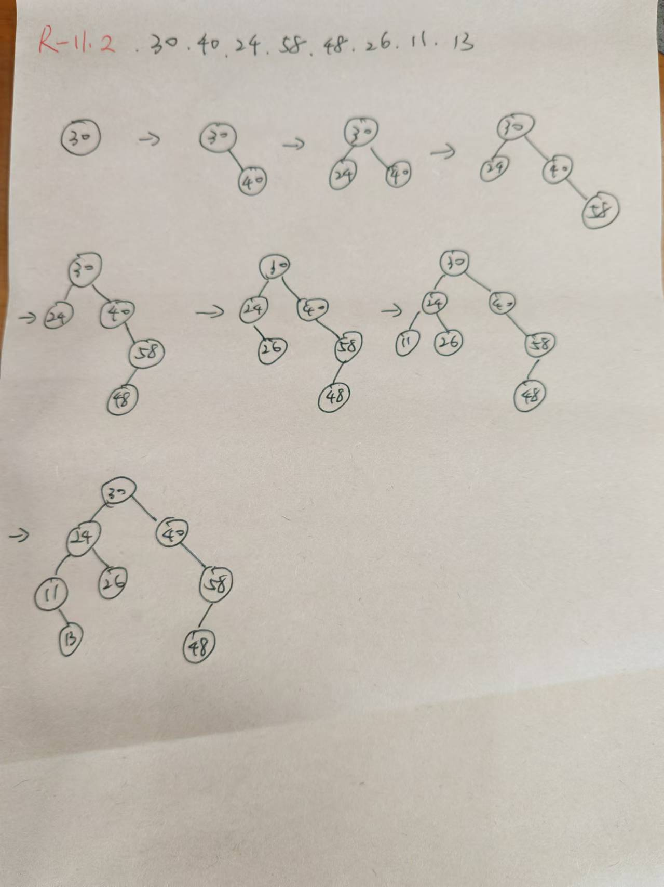

```python
# R-10.4 What is the worst-case running time for inserting n key-value pairs into an initially empty map M that is implemented with the UnsortedTableMap class?


# Answer：O(n)

# R-10.6 Which of the hash table collision-handling schemes could tolerate a load factor above 1 and which could not?

# 链表法 Separate chaining

# R-10.9 Draw the 11-entry hash table that results from using the hash function, h(i) = (3i+5) mod 11, to hash the keys 12, 44, 13, 88, 23, 94, 11, 39, 20, 16, and 5, assuming collisions are handled by chaining.


'''
index    key
0        -13
1        -94-39
2
3
4
5        -44-88-11
6
7
8        -12-23
9        -16-5
10       -20


'''

# R-10.13 What is the worst-case time for putting n entries in an initially empty hash table, with collisions resolved by chaining? What is the best case?


'''
最坏：全部都在同一个索引，时间复杂度为o(n^2)
最好：都在不同的索引，时间复杂度为o(n)
'''
```

```python
# R-11.2 Insert, into an empty binary search tree, entries with keys 30, 40, 24, 58, 48, 26, 11, 13 (in this order). Draw the tree after each insertion.

```


```python

# R-12.7 Suppose we are given two n-element sorted sequences A and B each with distinct elements, but potentially some elements that are in both sequences. Describe an O(n)-time method for computing a sequence representing the union A ∪ B (with no duplicates) as a sorted sequence.

'''
用两个指针i、j。指针i指向序列A的第一个元素，指针j指向B的第一个元素。
创建一个数组S，存储排序后的结果。
比较i和j指向的元素：
若i的元素大于j的元素，将i的元素放入S中，i指针右移一位，j指针不变；
若i的元素小于j的元素，将j的元素放入S中，j指针右移一位，i指针不变；
若i的元素等于j的元素，将i的元素放入S中，i指针和j指针都向右移一个

重复，直到i或j指针已经遍历完自己的数组后，将剩下的那个指针所在的数组的剩余数据加入到S即可

'''

# R-12.8 Suppose we modify the deterministic version of the quick-sort algorithm so that, instead of selecting the last element in an n-element sequence as the pivot, we choose the element at index ⌊n/2⌋. What is the running time of this version of quick-sort on a sequence that is already sorted?

'''
O(n^2)
'''

```