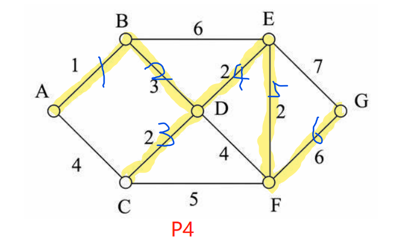

P-1 Consider a simple undirected graph with 5 nodes labeled A, B, C, D, and E, where the edges are AB, BC, CD, DE, and EA. What is the degree of node C?

ANSWER:2

P-2 A tree is a special type of graph that is connected and contains no cycles. If a graph has 10 nodes and is a tree, how many edges does it have?

ANSWER:9

R-14.12 Explain why the DFS traversal runs in 𝑂(𝑛²) time on an n-vertex simple graph that is represented with the adjacency matrix structure.

ANSWER:1,DFS遍历了所有的点；2，在遍历每一个点的时候，再访问与它相邻的点

R-14.14 A simple undirected graph is complete if it contains an edge between every pair of distinct vertices. What does a depth-first search tree of a complete graph look like?

ANSWER：一条线，连接着所有的顶点，比如K4:A——B——C——D

R-14.16 Let G be an undirected graph whose vertices are the integers 1 through 8, and let the adjacent vertices of each vertex be given by the table below:

顶点	相邻顶点
1	2, 3, 4
2	1, 3, 4
3	1, 2, 4
4	1, 2, 3, 6
5	6, 7, 8
6	4, 5, 7
7	5, 6, 8
8	5, 7
Assume that, in a traversal of G, the adjacent vertices of a given vertex are returned in the same order as they are listed in the table above.

a. Give the sequence of vertices of G visited using a DFS traversal starting at vertex 1.

ANSWER：1——2——3——4——6——5——7——8

b. Give the sequence of vertices visited using a BFS traversal starting at vertex 1.

ANSWER：1,2,3,4,6,5,7,8

P4. Perform the Prim’s algorithm on the following graph, starting with vertex A.

## 黄色为生成的树，蓝色的数字是绘制树的步骤

P5. Perform the Kruskal’s algorithm on the following graph.

## 黄色为生成的树，蓝色的数字是绘制树的步骤

